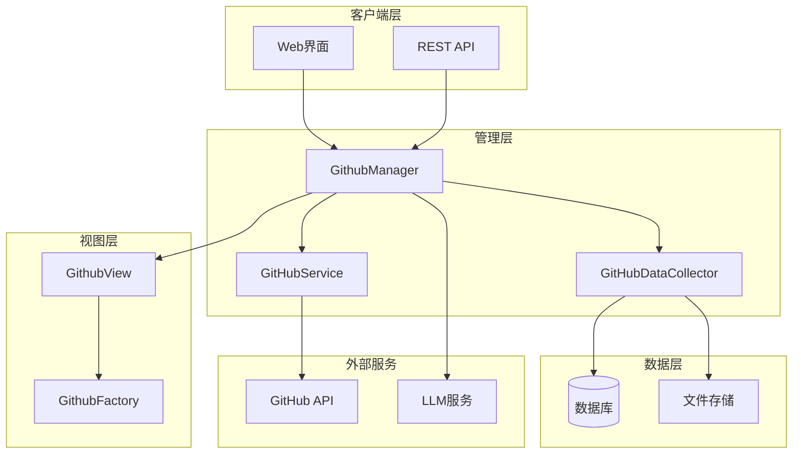
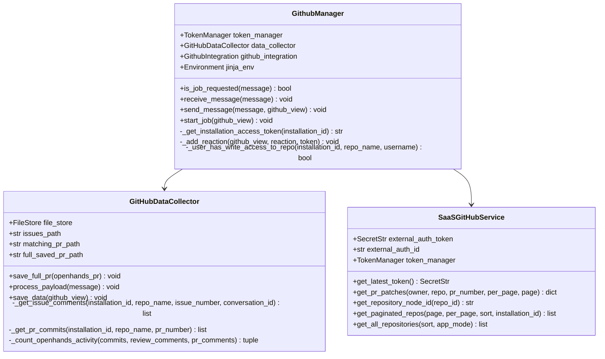
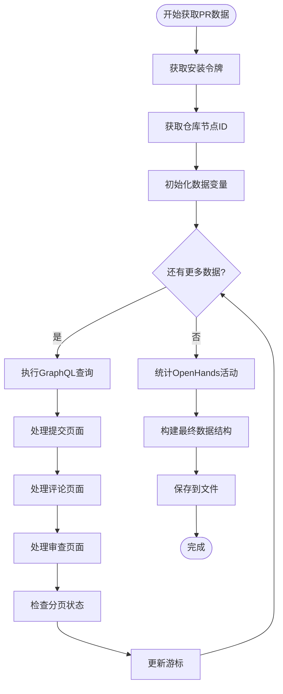
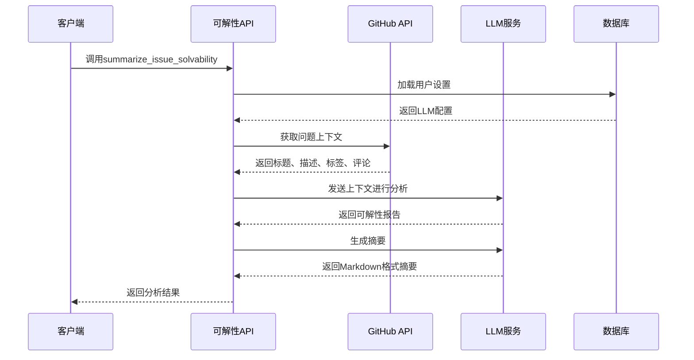
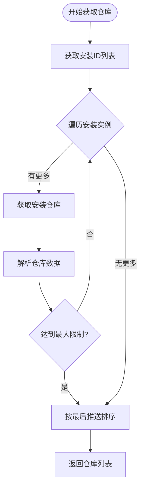
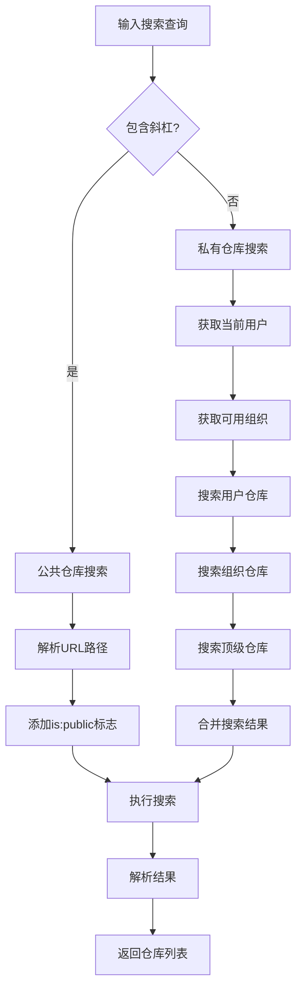
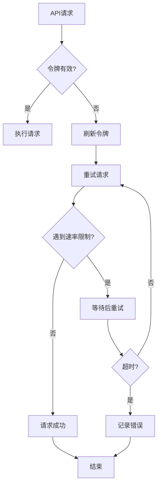

# GitHub API接口文档

<cite>
**本文档中引用的文件**
- [data_collector.py](file://enterprise/integrations/github/data_collector.py)
- [github_solvability.py](file://enterprise/integrations/github/github_solvability.py)
- [branches_prs.py](file://openhands/integrations/github/service/branches_prs.py)
- [repos.py](file://openhands/integrations/github/service/repos.py)
- [github_types.py](file://enterprise/integrations/github/github_types.py)
- [queries.py](file://enterprise/integrations/github/queries.py)
- [github_view.py](file://enterprise/integrations/github/github_view.py)
- [github_service.py](file://enterprise/integrations/github/github_service.py)
- [github_manager.py](file://enterprise/integrations/github/github_manager.py)
</cite>

## 目录
1. [简介](#简介)
2. [项目架构概览](#项目架构概览)
3. [核心组件分析](#核心组件分析)
4. [数据采集接口](#数据采集接口)
5. [可解性分析API](#可解性分析api)
6. [仓库管理API](#仓库管理api)
7. [分支和PR管理API](#分支和pr管理api)
8. [错误处理和性能优化](#错误处理和性能优化)
9. [实际调用示例](#实际调用示例)
10. [最佳实践和建议](#最佳实践和建议)

## 简介

OpenHands GitHub集成提供了完整的API接口体系，支持数据采集、可解性分析、仓库管理和分支PR操作。该系统采用模块化设计，通过GraphQL和REST API相结合的方式，实现了高效的GitHub数据交互和处理能力。

## 项目架构概览



**图表来源**
- [github_manager.py](file://enterprise/integrations/github/github_manager.py#L38-L47)
- [data_collector.py](file://enterprise/integrations/github/data_collector.py#L45-L90)
- [github_service.py](file://enterprise/integrations/github/github_service.py#L13-L38)

## 核心组件分析

### GitHubManager - 主要管理器

GitHubManager是整个GitHub集成的核心协调器，负责消息路由、权限验证和任务启动。



**图表来源**
- [github_manager.py](file://enterprise/integrations/github/github_manager.py#L38-L47)
- [data_collector.py](file://enterprise/integrations/github/data_collector.py#L45-L90)
- [github_service.py](file://enterprise/integrations/github/github_service.py#L13-L38)

**章节来源**
- [github_manager.py](file://enterprise/integrations/github/github_manager.py#L38-L345)
- [data_collector.py](file://enterprise/integrations/github/data_collector.py#L45-L693)
- [github_service.py](file://enterprise/integrations/github/github_service.py#L13-L144)

## 数据采集接口

### save_full_pr - 完整PR数据保存

该接口使用GraphQL查询完整PR信息，包括提交历史、评论和合并状态。

#### 请求格式
```python
async def save_full_pr(self, openhands_pr: OpenhandsPR) -> None
```

#### 参数说明
- `openhands_pr`: OpenHands PR对象，包含仓库ID、PR编号等信息

#### 响应结构
成功时保存PR完整数据到文件系统，包含：
- 仓库元数据（语言、贡献者）
- PR元数据（标题、描述、作者）
- 提交信息（SHA、作者、统计）
- 评论数据（PR评论、审查评论）
- 合并状态信息

#### 分页处理机制


**图表来源**
- [data_collector.py](file://enterprise/integrations/github/data_collector.py#L421-L597)

#### 错误码和处理
- `401`: 访问令牌无效或过期
- `403`: 缺少访问权限
- `404`: PR不存在或已被删除
- `500`: 内部服务器错误

**章节来源**
- [data_collector.py](file://enterprise/integrations/github/data_collector.py#L421-L597)

### get_pr_patches - PR补丁获取

提供分页式的PR文件变更补丁获取功能。

#### 请求格式
```python
async def get_pr_patches(
    self, owner: str, repo: str, pr_number: int, per_page: int = 30, page: int = 1
)
```

#### 参数说明
- `owner`: 仓库所有者用户名
- `repo`: 仓库名称
- `pr_number`: PR编号
- `per_page`: 每页文件数量（最大100）
- `page`: 页码

#### 响应结构
```python
{
    "files": list[dict],  # 文件变更详情列表
    "pagination": {
        "has_next_page": bool,  # 是否有下一页
        "total_count": int,     # 总文件数
        "current_page": int,    # 当前页码
        "per_page": int         # 每页数量
    }
}
```

**章节来源**
- [github_service.py](file://enterprise/integrations/github/github_service.py#L75-L103)

## 可解性分析API

### summarize_issue_solvability - 问题可解性总结

基于LLM的智能分析，评估问题的解决难度和可行性。

#### 请求格式
```python
async def summarize_issue_solvability(
    github_view: GithubViewType,
    user_token: str,
    timeout: float = 60.0 * 5
) -> str
```

#### 参数说明
- `github_view`: GitHub视图对象，包含问题上下文
- `user_token`: 用户GitHub访问令牌
- `timeout`: 超时时间（默认5分钟）

#### 工作流程


**图表来源**
- [github_solvability.py](file://enterprise/integrations/github/github_solvability.py#L63-L184)

#### 分析内容
1. **问题理解**: 基于标题、描述和标签的语义分析
2. **复杂度评估**: 代码修改难度和工作量估算
3. **资源需求**: 需要的技能和知识领域
4. **成功率预测**: 基于历史数据的概率评估
5. **建议措施**: 解决方案优先级和实施建议

**章节来源**
- [github_solvability.py](file://enterprise/integrations/github/github_solvability.py#L63-L184)

## 仓库管理API

### get_all_repositories - 获取所有仓库

支持SaaS模式下的多安装实例仓库获取。

#### 请求格式
```python
async def get_all_repositories(
    self, sort: str, app_mode: AppMode
) -> list[Repository]
```

#### 参数说明
- `sort`: 排序方式（"created", "updated", "pushed", "full_name"）
- `app_mode`: 应用模式（SaaS或本地）

#### 响应结构
返回Repository对象列表，包含：
- `id`: 仓库唯一标识符
- `full_name`: 完整仓库名称（owner/repo）
- `stargazers_count`: 星标数量
- `is_public`: 是否公开仓库
- `owner_type`: 所有者类型（用户或组织）
- `main_branch`: 主分支名称

#### 多安装实例处理


**图表来源**
- [repos.py](file://openhands/integrations/github/service/repos.py#L111-L151)

**章节来源**
- [repos.py](file://openhands/integrations/github/service/repos.py#L111-L151)

### search_repositories - 仓库搜索

支持多种搜索条件的复合搜索功能。

#### 搜索条件
1. **公共仓库搜索**: 直接URL匹配
2. **私有仓库搜索**: 用户和组织范围
3. **模糊匹配**: 组织名称模糊匹配
4. **多源聚合**: 用户、组织仓库合并

#### 搜索算法


**图表来源**
- [repos.py](file://openhands/integrations/github/service/repos.py#L206-L296)

**章节来源**
- [repos.py](file://openhands/integrations/github/service/repos.py#L206-L296)

## 分支和PR管理API

### get_branches - 获取分支列表

支持大规模仓库的分页分支获取。

#### 请求格式
```python
async def get_branches(self, repository: str) -> list[Branch]
```

#### 分页机制
- 最大分支数量：5000个
- 每页大小：100个分支
- 自动检测下一页链接

#### Branch对象结构
```python
Branch(
    name: str,           # 分支名称
    commit_sha: str,     # 提交SHA
    protected: bool,     # 是否受保护
    last_push_date: str  # 最后推送时间
)
```

**章节来源**
- [branches_prs.py](file://openhands/integrations/github/service/branches_prs.py#L14-L58)

### search_branches - 分支搜索

使用GraphQL进行分支名称的精确搜索。

#### 请求格式
```python
async def search_branches(
    self, repository: str, query: str, per_page: int = 30
) -> list[Branch]
```

#### 搜索特点
- 支持部分匹配
- GraphQL查询优化
- 结果保护状态标记
- 时间戳信息包含

**章节来源**
- [branches_prs.py](file://openhands/integrations/github/service/branches_prs.py#L102-L162)

## 错误处理和性能优化

### 速率限制应对策略

#### 令牌轮换机制


#### 分页处理优化
1. **并发控制**: 限制同时进行的API请求数量
2. **缓存策略**: 缓存频繁访问的数据
3. **增量更新**: 只获取新增或修改的数据
4. **错误恢复**: 实现断点续传功能

### 性能监控指标

| 指标类别 | 具体指标 | 目标值 | 监控方法 |
|---------|---------|--------|----------|
| 响应时间 | API调用延迟 | < 2秒 | 日志记录 |
| 吞吐量 | 并发请求数 | < 50 QPS | 性能计数器 |
| 错误率 | 失败请求比例 | < 1% | 异常统计 |
| 资源使用 | 内存占用 | < 512MB | 系统监控 |

## 实际调用示例

### 示例1：完整PR数据采集
```python
# 初始化数据收集器
data_collector = GitHubDataCollector()

# 创建OpenHands PR对象
openhands_pr = OpenhandsPR(
    repo_name="owner/repo",
    repo_id="123456789",
    pr_number=42,
    installation_id="987654321"
)

# 保存完整PR数据
await data_collector.save_full_pr(openhands_pr)
```

### 示例2：可解性分析
```python
# 创建GitHub视图
github_view = GithubIssue(
    issue_number=123,
    installation_id=987,
    full_repo_name="owner/repo"
)

# 执行可解性分析
try:
    summary = await summarize_issue_solvability(
        github_view=github_view,
        user_token="ghp_xxxxxxxxxxxx",
        timeout=300
    )
    print(summary)
except Exception as e:
    logger.error(f"分析失败: {e}")
```

### 示例3：仓库搜索
```python
# 搜索仓库
repos = await github_service.search_repositories(
    query="OpenHands",
    per_page=20,
    sort="stars",
    order="desc",
    public=False,
    app_mode=AppMode.SAAS
)

# 处理结果
for repo in repos:
    print(f"{repo.full_name}: {repo.stargazers_count} stars")
```

## 最佳实践和建议

### API调用最佳实践

1. **合理设置超时时间**
   - 简单操作：30秒
   - 复杂分析：5分钟
   - 批量操作：根据数据量调整

2. **实现优雅降级**
   ```python
   try:
       result = await api_call_with_timeout()
   except TimeoutError:
       fallback_result = await fallback_api_call()
   ```

3. **错误重试机制**
   - 指数退避算法
   - 最大重试次数：3次
   - 不同错误类型的差异化处理

### 性能优化建议

1. **批量操作优化**
   - 合并多个小请求为批量请求
   - 使用GraphQL减少API调用次数
   - 实现智能缓存策略

2. **内存管理**
   - 及时释放大型对象
   - 使用生成器处理大数据集
   - 监控内存使用情况

3. **并发控制**
   - 设置合理的并发上限
   - 实现请求队列机制
   - 监控系统负载

### 安全考虑

1. **令牌管理**
   - 定期轮换访问令牌
   - 实现令牌失效检测
   - 加密存储敏感信息

2. **权限验证**
   - 检查用户写入权限
   - 验证仓库访问权限
   - 实现细粒度权限控制

3. **数据保护**
   - 敏感数据脱敏
   - 审计日志记录
   - 数据备份策略