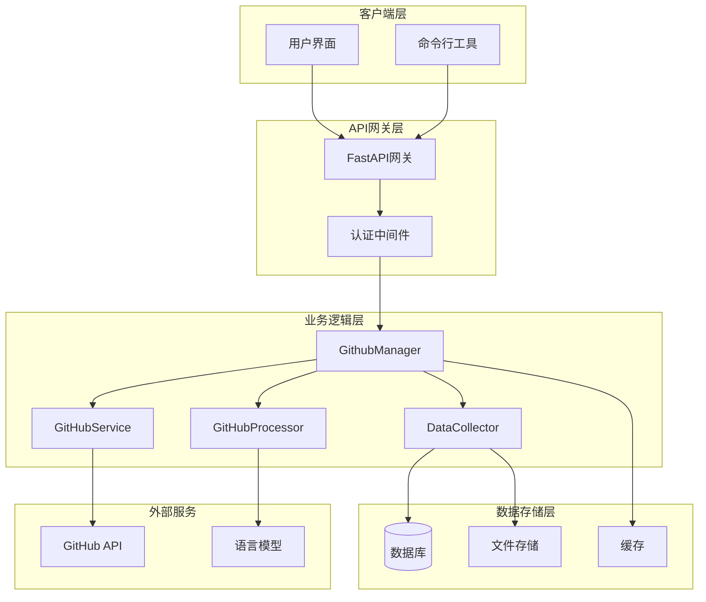
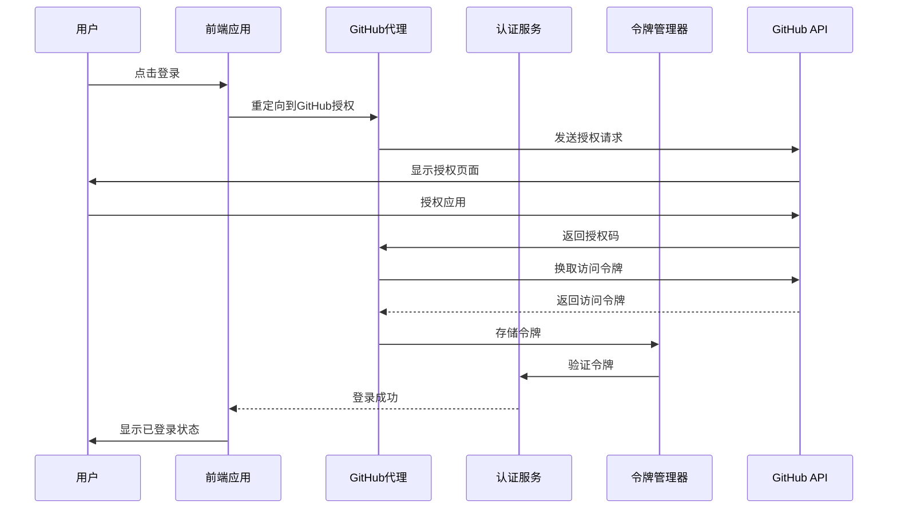
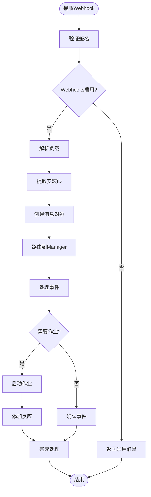
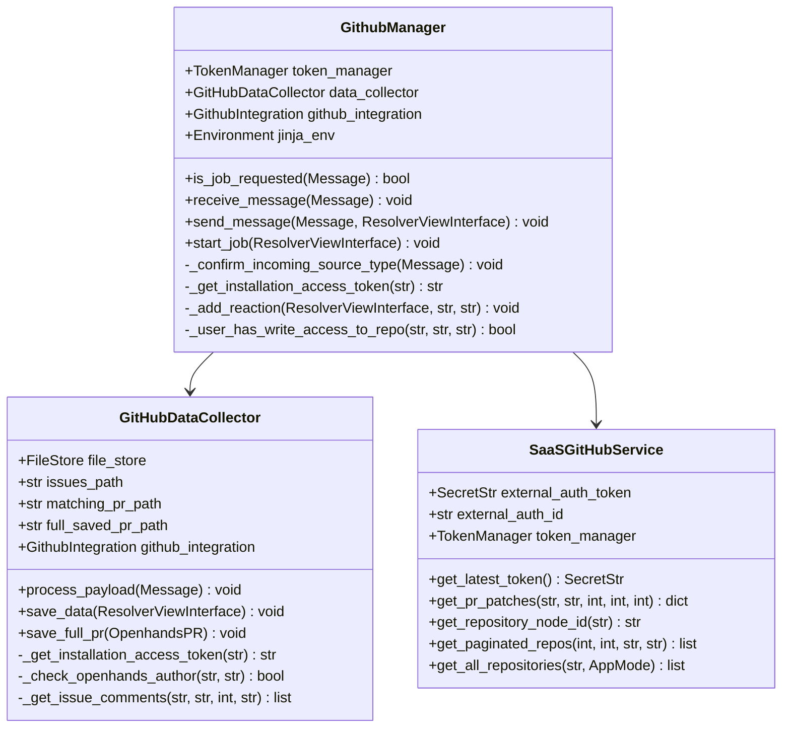
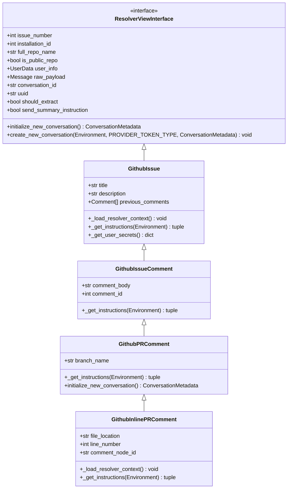
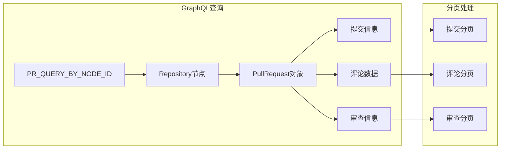
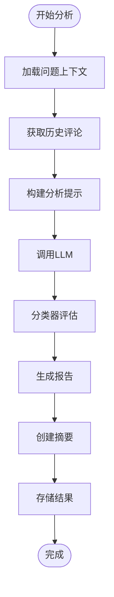
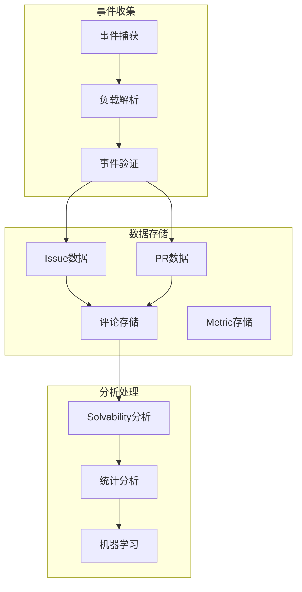
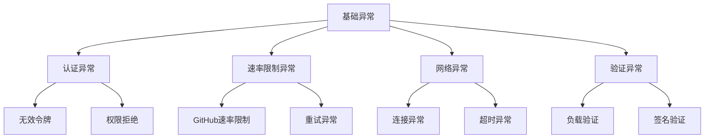
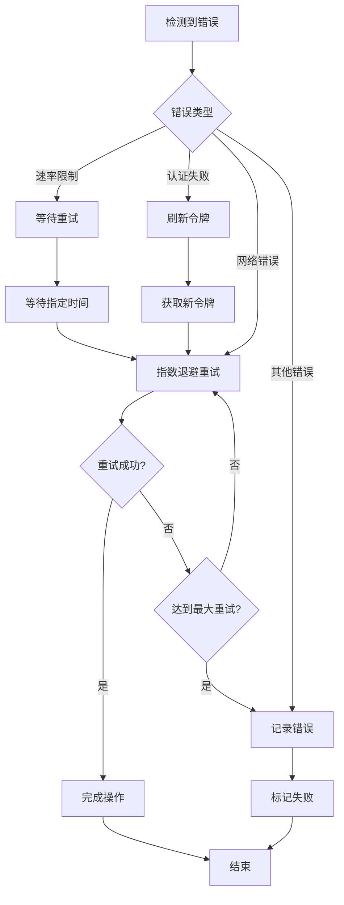

# GitHub集成

<cite>
**本文档中引用的文件**
- [microagents/github.md](file://microagents/github.md)
- [enterprise/integrations/github/github_service.py](file://enterprise/integrations/github/github_service.py)
- [enterprise/integrations/github/github_manager.py](file://enterprise/integrations/github/github_manager.py)
- [enterprise/integrations/github/data_collector.py](file://enterprise/integrations/github/data_collector.py)
- [enterprise/integrations/github/github_solvability.py](file://enterprise/integrations/github/github_solvability.py)
- [enterprise/integrations/github/github_view.py](file://enterprise/integrations/github/github_view.py)
- [enterprise/integrations/github/github_types.py](file://enterprise/integrations/github/github_types.py)
- [enterprise/integrations/github/queries.py](file://enterprise/integrations/github/queries.py)
- [enterprise/server/routes/integration/github.py](file://enterprise/server/routes/integration/github.py)
- [enterprise/conversation_callback_processor/github_callback_processor.py](file://enterprise/conversation_callback_processor/github_callback_processor.py)
- [enterprise/server/auth/token_manager.py](file://enterprise/server/auth/token_manager.py)
</cite>

## 目录
1. [简介](#简介)
2. [系统架构概览](#系统架构概览)
3. [OAuth认证流程](#oauth认证流程)
4. [Webhook事件处理](#webhook事件处理)
5. [核心组件详细分析](#核心组件详细分析)
6. [API调用模式](#api调用模式)
7. [数据收集与分析](#数据收集与分析)
8. [权限配置指南](#权限配置指南)
9. [错误处理策略](#错误处理策略)
10. [实际应用场景](#实际应用场景)
11. [故障排除指南](#故障排除指南)
12. [总结](#总结)

## 简介

OpenHands的GitHub集成功能提供了完整的GitHub平台自动化解决方案，支持OAuth认证、Webhook事件处理、PR操作、分支管理、代码审查等功能。该系统采用企业级架构设计，具备高可用性、可扩展性和安全性。

### 主要特性

- **OAuth 2.0认证**：支持GitHub应用安装和用户授权
- **Webhook事件处理**：实时响应GitHub事件
- **智能数据分析**：基于LLM的可解决性分析
- **自动PR创建**：智能分支管理和代码提交
- **权限管理**：细粒度的访问控制
- **错误恢复**：完善的重试机制和错误处理

## 系统架构概览



**图表来源**
- [enterprise/integrations/github/github_manager.py](file://enterprise/integrations/github/github_manager.py#L38-L44)
- [enterprise/server/routes/integration/github.py](file://enterprise/server/routes/integration/github.py#L20-L23)

## OAuth认证流程

### 认证架构



**图表来源**
- [enterprise/server/routes/github_proxy.py](file://enterprise/server/routes/github_proxy.py#L47-L98)
- [enterprise/server/auth/token_manager.py](file://enterprise/server/auth/token_manager.py#L324-L346)

### 令牌管理机制

系统采用多层令牌管理策略：

1. **外部认证令牌**：通过身份提供商获取
2. **离线令牌**：长期存储的刷新令牌
3. **用户ID令牌**：基于用户标识的访问令牌

**章节来源**
- [enterprise/integrations/github/github_service.py](file://enterprise/integrations/github/github_service.py#L39-L73)
- [enterprise/server/auth/token_manager.py](file://enterprise/server/auth/token_manager.py#L324-L346)

## Webhook事件处理

### 事件处理流程



**图表来源**
- [enterprise/server/routes/integration/github.py](file://enterprise/server/routes/integration/github.py#L45-L84)
- [enterprise/integrations/github/github_manager.py](file://enterprise/integrations/github/github_manager.py#L121-L155)

### 支持的事件类型

| 事件类型 | 描述 | 触发条件 |
|---------|------|----------|
| `issues:labeled` | 标签事件 | 添加`@openhands`标签 |
| `issue_comment:created` | 评论事件 | 包含`@openhands`提及 |
| `pull_request:comment` | PR评论事件 | 包含`@openhands`提及 |
| `pull_request:review_comment` | 审查评论事件 | 内联评论包含提及 |
| `workflow_run:completed` | 工作流完成事件 | 自动触发对话开始 |

**章节来源**
- [enterprise/integrations/github/github_view.py](file://enterprise/integrations/github/github_view.py#L431-L498)

## 核心组件详细分析

### GitHubManager - 事件协调器

GitHubManager是整个GitHub集成的核心协调器，负责：

- **事件路由**：根据事件类型分发到相应的处理器
- **权限验证**：检查用户对仓库的写入权限
- **作业启动**：初始化新的对话会话
- **消息发送**：向GitHub发送回复消息



**图表来源**
- [enterprise/integrations/github/github_manager.py](file://enterprise/integrations/github/github_manager.py#L38-L44)
- [enterprise/integrations/github/data_collector.py](file://enterprise/integrations/github/data_collector.py#L45-L89)
- [enterprise/integrations/github/github_service.py](file://enterprise/integrations/github/github_service.py#L13-L38)

### GitHubView - 事件视图抽象

GitHubView提供了统一的事件处理接口，支持多种GitHub事件类型：



**图表来源**
- [enterprise/integrations/github/github_view.py](file://enterprise/integrations/github/github_view.py#L83-L294)

**章节来源**
- [enterprise/integrations/github/github_manager.py](file://enterprise/integrations/github/github_manager.py#L38-L345)
- [enterprise/integrations/github/data_collector.py](file://enterprise/integrations/github/data_collector.py#L45-L693)
- [enterprise/integrations/github/github_view.py](file://enterprise/integrations/github/github_view.py#L83-L757)

## API调用模式

### GraphQL查询优化

系统使用GraphQL查询来高效获取PR数据：



**图表来源**
- [enterprise/integrations/github/queries.py](file://enterprise/integrations/github/queries.py#L1-L103)

### REST API调用模式

| API端点 | 方法 | 功能 | 分页支持 |
|---------|------|------|----------|
| `/repos/{owner}/{repo}/pulls/{pr_number}/files` | GET | 获取PR补丁 | 是 |
| `/repositories/{repo_id}` | GET | 获取仓库节点ID | 否 |
| `/repos/{owner}/{repo}/issues/{number}/comments` | GET | 获取问题评论 | 是 |
| `/repos/{owner}/{repo}/pulls/{number}/commits` | GET | 获取PR提交 | 是 |

**章节来源**
- [enterprise/integrations/github/github_service.py](file://enterprise/integrations/github/github_service.py#L75-L144)
- [enterprise/integrations/github/queries.py](file://enterprise/integrations/github/queries.py#L1-L103)

## 数据收集与分析

### 可解决性分析



**图表来源**
- [enterprise/integrations/github/github_solvability.py](file://enterprise/integrations/github/github_solvability.py#L63-L184)

### 数据收集架构



**图表来源**
- [enterprise/integrations/github/data_collector.py](file://enterprise/integrations/github/data_collector.py#L45-L89)

**章节来源**
- [enterprise/integrations/github/github_solvability.py](file://enterprise/integrations/github/github_solvability.py#L26-L184)
- [enterprise/integrations/github/data_collector.py](file://enterprise/integrations/github/data_collector.py#L45-L693)

## 权限配置指南

### GitHub应用权限

| 权限类型 | 权限范围 | 必需权限 |
|---------|----------|----------|
| 仓库权限 | 读取和写入 | Issues, Pull Requests, Contents |
| 组织权限 | 读取 | Members |
| 事件订阅 | 全部事件 | Issues, Pull Request, Issue Comment |

### 环境变量配置

```bash
# GitHub应用配置
GITHUB_APP_CLIENT_ID=your_client_id
GITHUB_APP_PRIVATE_KEY=your_private_key
GITHUB_APP_WEBHOOK_SECRET=your_webhook_secret

# 应用配置
GITHUB_WEBHOOKS_ENABLED=true
COLLECT_GITHUB_INTERACTIONS=true
ENABLE_SOLVABILITY_ANALYSIS=true

# 身份提供商配置
KEYCLOAK_URL=https://your-keycloak.com
KEYCLOAK_REALM=openhands
```

### 用户权限验证

系统通过以下步骤验证用户权限：

1. **安装令牌获取**：从GitHub应用获取访问令牌
2. **仓库访问检查**：验证用户对仓库的写入权限
3. **协作关系确认**：检查用户是否为协作者或所有者
4. **组织成员验证**：对于组织仓库，验证成员身份

**章节来源**
- [enterprise/integrations/github/github_manager.py](file://enterprise/integrations/github/github_manager.py#L95-L119)

## 错误处理策略

### 异常层次结构



### 重试机制

| 异常类型 | 重试次数 | 退避策略 | 最大等待时间 |
|---------|----------|----------|-------------|
| 速率限制 | 3次 | 指数退避 | 60秒 |
| 连接错误 | 5次 | 线性退避 | 30秒 |
| 认证失败 | 1次 | 不重试 | - |
| 网络超时 | 3次 | 固定间隔 | 10秒 |

### 错误恢复流程



**章节来源**
- [enterprise/server/rate_limit.py](file://enterprise/server/rate_limit.py#L123-L137)

## 实际应用场景

### 微代理使用案例

基于[microagents/github.md](file://microagents/github.md)，以下是典型的应用场景：

#### 1. 问题标签触发
当仓库添加`@openhands`标签时：
- 自动创建新的对话会话
- 加载问题上下文和历史评论
- 初始化可解决性分析
- 启动AI代理进行问题分析

#### 2. 评论触发
当PR或Issue包含`@openhands`提及时：
- 解析特定的评论内容
- 创建专门的PR评论视图
- 提供分支名称和文件位置信息
- 启动针对性的修复任务

#### 3. 工作流完成触发
当GitHub Actions工作流完成时：
- 检查工作流状态和结论
- 如果失败，自动生成修复建议
- 在相关PR上留下指导性评论
- 触发自动修复流程

### 实际部署示例

```bash
# 设置环境变量
export GITHUB_APP_CLIENT_ID=your_github_app_id
export GITHUB_APP_PRIVATE_KEY=$(cat private_key.pem)
export GITHUB_APP_WEBHOOK_SECRET=your_webhook_secret

# 启动服务
python -m enterprise.server.main

# 配置Webhook
curl -X POST \
  -H "Authorization: token YOUR_GITHUB_TOKEN" \
  -H "Content-Type: application/json" \
  https://api.github.com/repos/OWNER/REPO/hooks \
  -d '{
    "name": "web",
    "active": true,
    "events": ["issues", "pull_request", "issue_comment", "pull_request_review_comment"],
    "config": {
      "url": "https://your-domain.com/integration/github/events",
      "content_type": "json",
      "secret": "your_webhook_secret"
    }
  }'
```

**章节来源**
- [microagents/github.md](file://microagents/github.md#L1-L36)

## 故障排除指南

### 常见问题及解决方案

#### 1. Webhook签名验证失败
**症状**：收到403错误，"Request signatures didn't match!"
**原因**：Webhook密钥不匹配或请求被篡改
**解决方案**：
- 检查`GITHUB_APP_WEBHOOK_SECRET`环境变量
- 确认GitHub应用设置中的Webhook密钥
- 验证代理服务器的签名计算逻辑

#### 2. 令牌过期或无效
**症状**：401 Unauthorized错误
**原因**：GitHub令牌已过期或权限不足
**解决方案**：
- 检查令牌的有效期
- 验证令牌的权限范围
- 使用令牌管理器刷新令牌

#### 3. 速率限制问题
**症状**：429 Too Many Requests错误
**原因**：超出GitHub API速率限制
**解决方案**：
- 实现指数退避重试机制
- 监控速率限制头部信息
- 优化API调用频率

#### 4. 权限不足
**症状**：无法创建PR或修改仓库
**原因**：用户没有足够的仓库权限
**解决方案**：
- 验证用户在仓库中的角色
- 检查GitHub应用的安装范围
- 确认组织级别的权限设置

### 调试工具和技巧

#### 日志配置
```python
import logging
from openhands.core.logger import openhands_logger as logger

# 启用详细日志
logger.setLevel(logging.DEBUG)

# 监控关键事件
logger.info(f"[GitHub] Processing event: {event_type}")
logger.debug(f"[GitHub] Installation ID: {installation_id}")
logger.warning(f"[GitHub] Rate limit remaining: {remaining}")
```

#### 状态监控
```bash
# 检查服务健康状态
curl -X GET https://your-domain.com/health

# 查看最近的错误日志
tail -f logs/github_errors.log

# 监控API调用统计
curl -X GET https://your-domain.com/metrics/github
```

**章节来源**
- [enterprise/server/routes/integration/github.py](file://enterprise/server/routes/integration/github.py#L26-L43)

## 总结

OpenHands的GitHub集成功能提供了一个完整的企业级解决方案，涵盖了从OAuth认证到Webhook处理的全流程。系统的主要优势包括：

### 技术优势
- **模块化设计**：清晰的组件分离和职责划分
- **高可用性**：完善的错误处理和重试机制
- **可扩展性**：支持多种事件类型和处理模式
- **安全性**：严格的权限验证和令牌管理

### 功能特性
- **实时响应**：基于Webhook的事件驱动架构
- **智能分析**：基于LLM的可解决性评估
- **自动化程度高**：从问题识别到PR创建的全自动化流程
- **数据驱动**：全面的数据收集和分析能力

### 应用价值
- **提高开发效率**：自动化处理重复性任务
- **质量保证**：智能的代码审查和问题分析
- **团队协作**：无缝的GitHub平台集成
- **成本优化**：减少人工干预和错误率

该集成系统为企业用户提供了一个强大而灵活的GitHub自动化平台，能够显著提升软件开发的效率和质量。