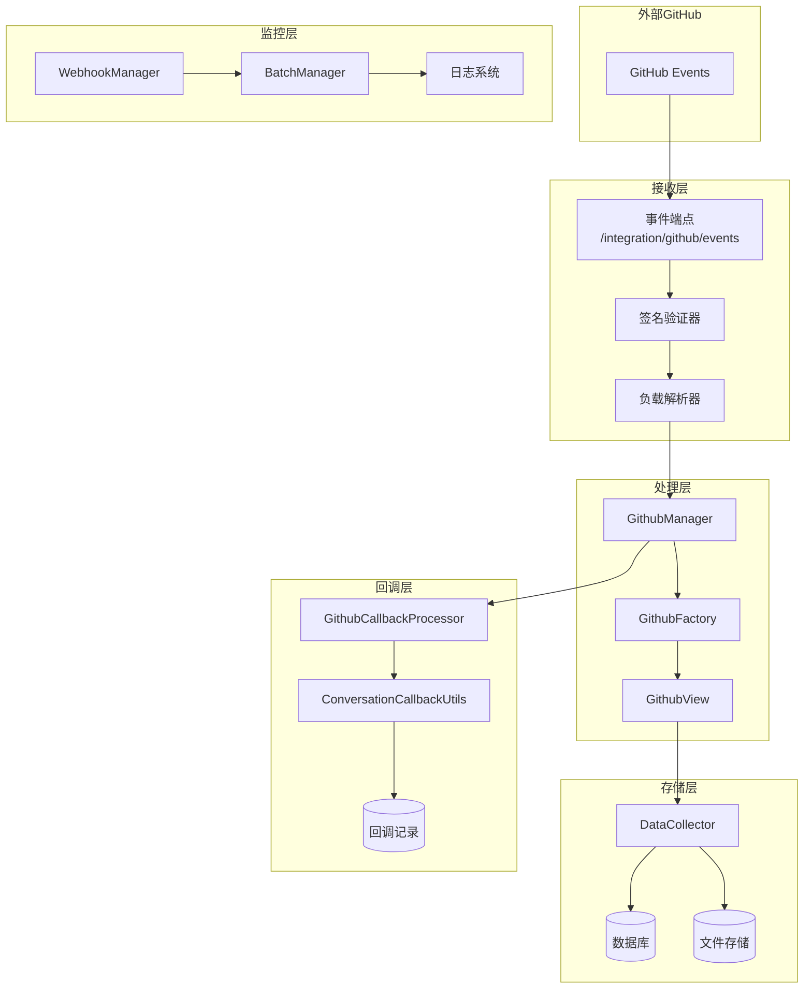
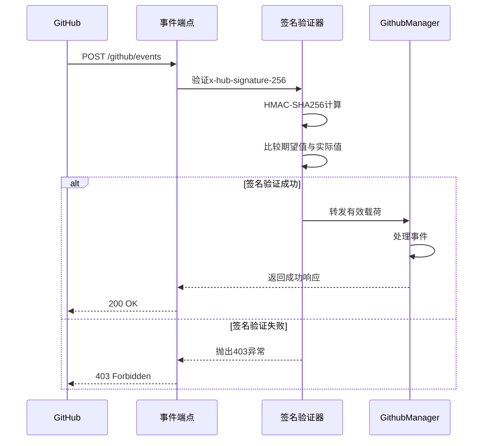
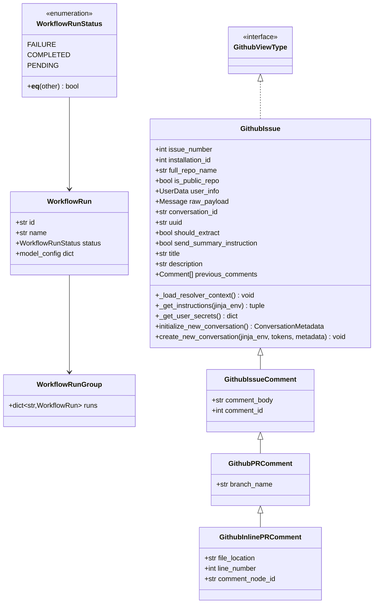
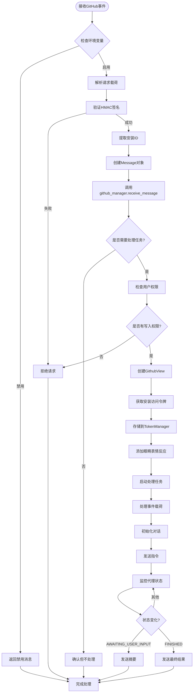
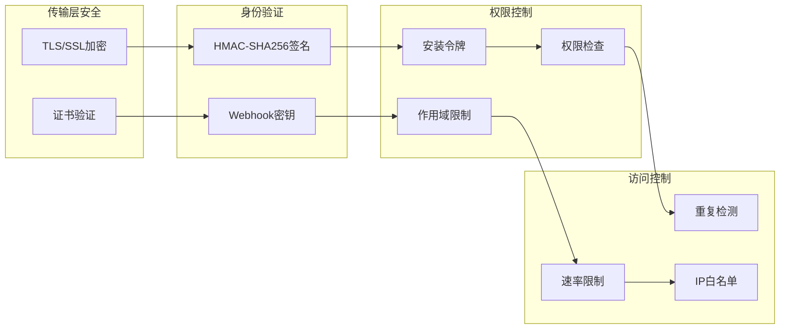
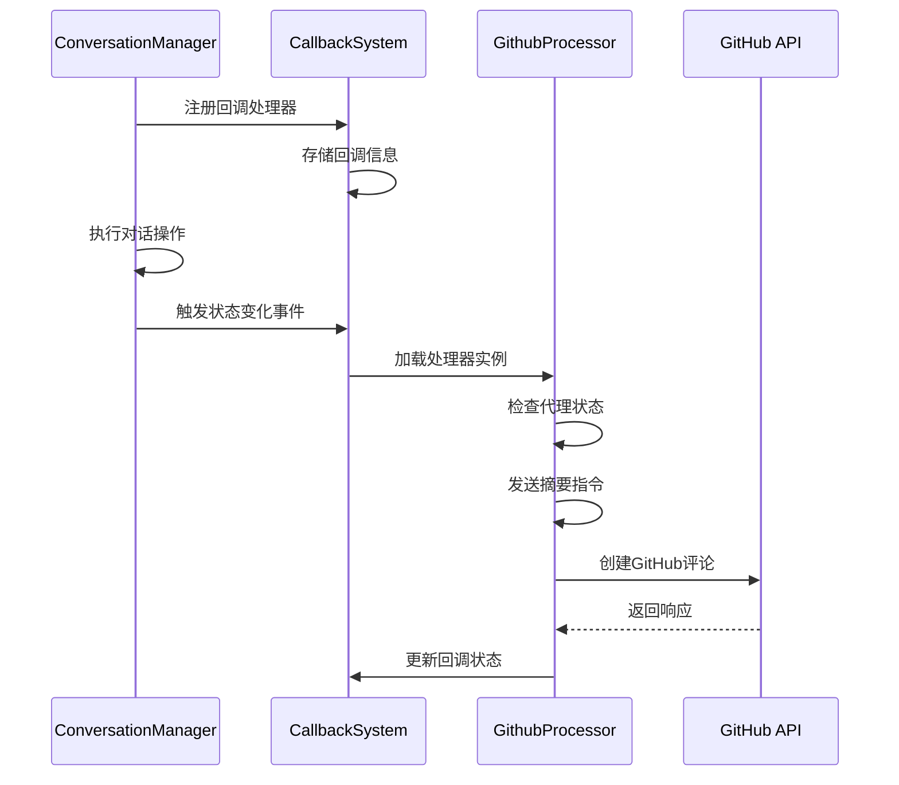
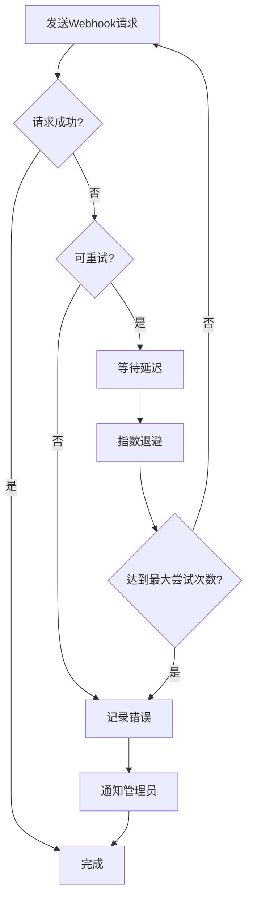
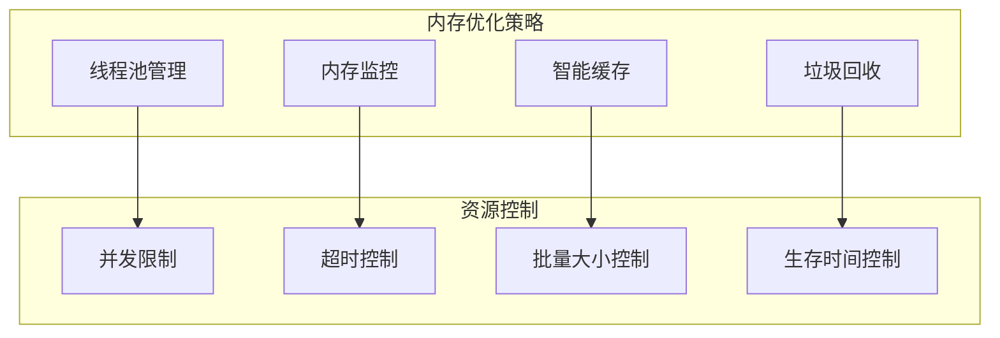

# GitHub Webhook事件处理系统技术文档

<cite>
**本文档引用的文件**
- [github_view.py](file://enterprise/integrations/github/github_view.py)
- [github_types.py](file://enterprise/integrations/github/github_types.py)
- [queries.py](file://enterprise/integrations/github/queries.py)
- [event_webhook.py](file://enterprise/server/routes/event_webhook.py)
- [github.py](file://enterprise/server/routes/integration/github.py)
- [conversation_callback_utils.py](file://enterprise/server/utils/conversation_callback_utils.py)
- [github_callback_processor.py](file://enterprise/server/conversation_callback_processor/github_callback_processor.py)
- [github_manager.py](file://enterprise/integrations/github/github_manager.py)
- [batched_web_hook.py](file://openhands/storage/batched_web_hook.py)
- [web_hook.py](file://openhands/storage/web_hook.py)
</cite>

## 目录
1. [概述](#概述)
2. [系统架构](#系统架构)
3. [事件接收与验证](#事件接收与验证)
4. [事件数据模型](#事件数据模型)
5. [事件处理流程](#事件处理流程)
6. [安全防护机制](#安全防护机制)
7. [回调处理器系统](#回调处理器系统)
8. [错误处理与重试机制](#错误处理与重试机制)
9. [性能优化策略](#性能优化策略)
10. [故障排除指南](#故障排除指南)

## 概述

GitHub Webhook事件处理系统是一个复杂的企业级解决方案，负责接收、验证、处理和响应来自GitHub的各种事件。该系统支持多种事件类型，包括issue评论、pull request操作、工作流完成等，并提供了完整的安全验证、错误处理和重试机制。

### 核心功能特性

- **多事件类型支持**：处理push、pull_request、issue、workflow_run等多种GitHub事件
- **安全签名验证**：使用HMAC-SHA256算法验证Webhook请求的真实性
- **智能事件分类**：自动识别和分类不同的GitHub事件类型
- **异步处理架构**：采用异步处理模式提高系统吞吐量
- **重试机制**：内置指数退避重试策略确保消息可靠传递
- **回调系统**：支持事件触发后的后续处理流程

## 系统架构



**图表来源**
- [github.py](file://enterprise/server/routes/integration/github.py#L45-L83)
- [github_manager.py](file://enterprise/integrations/github/github_manager.py#L157-L184)
- [github_view.py](file://enterprise/integrations/github/github_view.py#L607-L757)

## 事件接收与验证

### HTTP端点配置

系统通过FastAPI路由 `/integration/github/events` 接收GitHub Webhook事件。该端点实现了完整的请求验证流程。

### 签名验证机制



**图表来源**
- [github.py](file://enterprise/server/routes/integration/github.py#L26-L43)
- [github.py](file://enterprise/server/routes/integration/github.py#L45-L83)

### 验证流程详解

1. **环境变量检查**：验证 `GITHUB_WEBHOOKS_ENABLED` 环境变量
2. **签名头部验证**：检查 `x-hub-signature-256` 头部是否存在
3. **HMAC计算**：使用 `GITHUB_APP_WEBHOOK_SECRET` 计算期望签名
4. **安全比较**：使用 `hmac.compare_digest` 进行安全字符串比较
5. **负载解析**：将请求体解析为JSON格式
6. **安装ID提取**：从载荷中提取安装ID用于后续处理

**章节来源**
- [github.py](file://enterprise/server/routes/integration/github.py#L15-L83)

## 事件数据模型

### 核心数据结构

系统定义了完整的事件数据模型来处理各种GitHub事件类型：



**图表来源**
- [github_types.py](file://enterprise/integrations/github/github_types.py#L6-L27)
- [github_view.py](file://enterprise/integrations/github/github_view.py#L84-L294)

### 事件类型识别

系统通过智能工厂模式识别和分类不同的GitHub事件：

| 事件类型 | 识别条件 | 处理方式 |
|---------|---------|---------|
| labeled_issue | `action == 'labeled' && label.name == OH_LABEL` | 创建GithubIssue对象 |
| issue_comment | `action == 'created' && comment.body.contains(INLINE_OH_LABEL)` | 创建GithubIssueComment对象 |
| pr_comment | `action == 'created' && pull_request exists && body.contains(INLINE_OH_LABEL)` | 创建GithubPRComment对象 |
| inline_pr_comment | `action == 'created' && comment.body.contains(INLINE_OH_LABEL)` | 创建GithubInlinePRComment对象 |

**章节来源**
- [github_view.py](file://enterprise/integrations/github/github_view.py#L431-L489)

## 事件处理流程

### 完整处理链路



**图表来源**
- [github_manager.py](file://enterprise/integrations/github/github_manager.py#L157-L184)
- [github_view.py](file://enterprise/integrations/github/github_view.py#L607-L757)

### 异步处理机制

系统采用异步处理模式，确保高并发场景下的性能：

1. **非阻塞接收**：Webhook端点立即返回，不等待处理完成
2. **后台任务队列**：使用FastAPI的BackgroundTasks进行异步处理
3. **并发控制**：通过线程池管理并发任务
4. **资源隔离**：每个事件处理在独立的上下文中执行

**章节来源**
- [github_manager.py](file://enterprise/integrations/github/github_manager.py#L157-L184)
- [event_webhook.py](file://enterprise/server/routes/event_webhook.py#L53-L161)

## 安全防护机制

### 多层安全验证



### 签名验证实现

系统使用严格的HMAC-SHA256签名验证：

```python
# 签名验证核心逻辑
expected_signature = 'sha256=' + hmac.new(
    GITHUB_APP_WEBHOOK_SECRET.encode('utf-8'),
    msg=payload,
    digestmod=hashlib.sha256
).hexdigest()

if not hmac.compare_digest(expected_signature, signature):
    raise HTTPException(status_code=403, detail="Request signatures didn't match!")
```

### 重复攻击防护

1. **Redis去重**：使用Redis缓存已处理的事件ID
2. **时间窗口**：设置60秒的去重时间窗口
3. **哈希标识**：对完整载荷计算SHA256哈希作为唯一标识

**章节来源**
- [github.py](file://enterprise/server/routes/integration/github.py#L26-L43)

## 回调处理器系统

### 回调架构设计



**图表来源**
- [github_callback_processor.py](file://enterprise/server/conversation_callback_processor/github_callback_processor.py#L27-L109)
- [conversation_callback_utils.py](file://enterprise/server/utils/conversation_callback_utils.py#L72-L118)

### 处理器生命周期

1. **注册阶段**：处理器被注册到回调系统
2. **监控阶段**：监听代理状态变化事件
3. **触发阶段**：当代理进入特定状态时触发处理
4. **执行阶段**：执行具体的处理逻辑
5. **清理阶段**：更新状态并清理资源

### 支持的回调类型

| 状态类型 | 触发条件 | 处理动作 |
|---------|---------|---------|
| AWAITING_USER_INPUT | 代理等待用户输入 | 发送摘要指令，提取当前进度 |
| FINISHED | 代理完成任务 | 发送最终结果，总结完成情况 |
| ERROR | 代理遇到错误 | 记录错误信息，通知用户 |

**章节来源**
- [github_callback_processor.py](file://enterprise/server/conversation_callback_processor/github_callback_processor.py#L78-L109)

## 错误处理与重试机制

### 重试策略

系统实现了多层次的重试机制：



### 重试配置

系统使用tenacity库实现智能重试：

```python
@tenacity.retry(
    wait=tenacity.wait_fixed(1),      # 基础等待1秒
    stop=tenacity.stop_after_attempt(3)  # 最多重试3次
)
def _send_batch_request(self, batch: dict) -> None:
    """发送批量请求到Webhook URL"""
    # 实际发送逻辑
```

### 错误分类处理

| 错误类型 | 处理策略 | 重试参数 |
|---------|---------|---------|
| 网络超时 | 指数退避重试 | 1s, 2s, 4s |
| HTTP 4xx | 不重试，记录错误 | 无 |
| HTTP 5xx | 指数退避重试 | 1s, 2s, 4s |
| 认证失败 | 不重试，检查配置 | 无 |

**章节来源**
- [batched_web_hook.py](file://openhands/storage/batched_web_hook.py#L216-L223)
- [web_hook.py](file://openhands/storage/web_hook.py#L89-L119)

## 性能优化策略

### 并发处理优化

1. **异步I/O**：所有网络操作采用异步模式
2. **连接池**：复用HTTP连接减少开销
3. **批量处理**：合并多个小请求为批量操作
4. **缓存机制**：缓存频繁访问的数据

### 内存管理



### 性能监控指标

- **处理延迟**：从接收事件到完成处理的时间
- **吞吐量**：每秒处理的事件数量
- **错误率**：失败请求的比例
- **资源使用率**：CPU和内存使用情况

## 故障排除指南

### 常见问题诊断

#### 签名验证失败

**症状**：收到403 Forbidden响应
**原因**：
- Webhook密钥配置错误
- 请求被中间件修改
- 时间同步问题

**解决方案**：
1. 验证 `GITHUB_APP_WEBHOOK_SECRET` 环境变量
2. 检查Webhook URL配置
3. 确认服务器时间同步

#### 权限不足错误

**症状**：无法读取或写入仓库
**原因**：
- 用户缺少仓库写入权限
- 安装令牌过期
- 作用域配置不正确

**解决方案**：
1. 检查GitHub应用权限范围
2. 刷新安装令牌
3. 验证用户权限

#### 处理超时

**症状**：事件处理长时间未完成
**原因**：
- 网络连接问题
- GitHub API限流
- 数据库连接问题

**解决方案**：
1. 增加超时配置
2. 实现断路器模式
3. 优化数据库查询

### 日志分析

系统提供了详细的日志记录，帮助诊断问题：

```python
# 关键日志级别
logger.info('[GitHub] Creating view for labeled issue')
logger.warning('[GitHub] Got invalid keycloak user id')
logger.error('callback_invocation_failed', extra={'error': str(e)})
```

### 监控告警

建议设置以下监控指标：

- Webhook接收成功率
- 处理延迟分布
- 错误率趋势
- 资源使用率

**章节来源**
- [github.py](file://enterprise/server/routes/integration/github.py#L77-L83)
- [conversation_callback_utils.py](file://enterprise/server/utils/conversation_callback_utils.py#L104-L117)

## 结论

GitHub Webhook事件处理系统是一个设计精良的企业级解决方案，具备以下优势：

1. **安全性**：多层验证机制确保请求真实性
2. **可靠性**：完善的错误处理和重试机制
3. **可扩展性**：模块化设计支持功能扩展
4. **高性能**：异步处理和并发优化
5. **可观测性**：全面的日志和监控支持

该系统为企业提供了稳定可靠的GitHub事件处理能力，能够满足大规模生产环境的需求。通过合理的架构设计和最佳实践的应用，确保了系统的高可用性和可维护性。