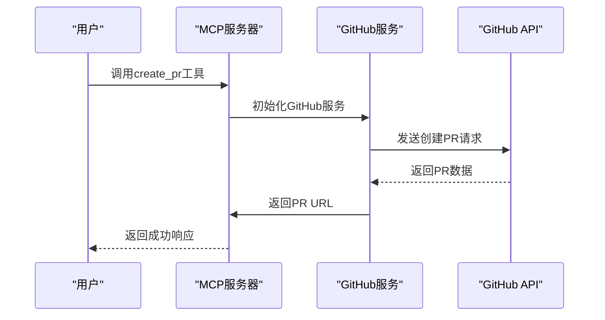
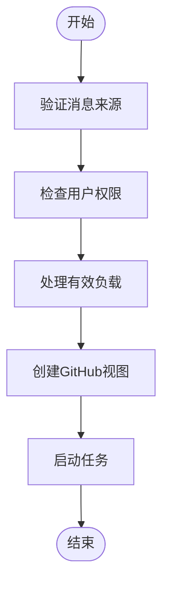
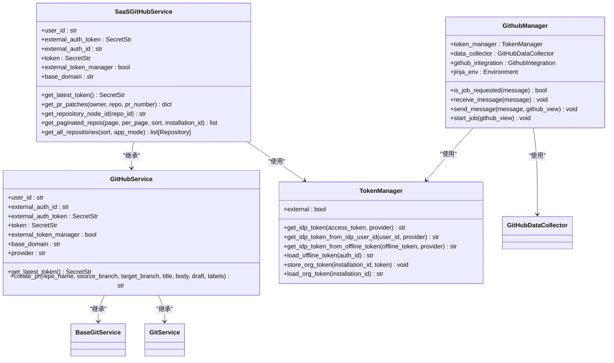

# 微代理集成

<cite>
**本文档中引用的文件**   
- [github.md](file://microagents/github.md)
- [github_manager.py](file://enterprise/integrations/github/github_manager.py)
- [github_service.py](file://enterprise/integrations/github/github_service.py)
- [github_service.py](file://openhands/integrations/github/github_service.py)
- [send_pull_request.py](file://openhands/resolver/send_pull_request.py)
- [mcp.py](file://openhands/server/routes/mcp.py)
- [microagent.py](file://openhands/microagent/microagent.py)
- [types.py](file://openhands/microagent/types.py)
</cite>

## 目录
1. [引言](#引言)
2. [GitHub微代理工作机制](#github微代理工作机制)
3. [API访问与GITHUB_TOKEN](#api访问与github_token)
4. [create_pr工具实现原理](#create_pr工具实现原理)
5. [微代理触发条件](#微代理触发条件)
6. [执行上下文分析](#执行上下文分析)
7. [最佳实践指南](#最佳实践指南)
8. [核心服务交互模式](#核心服务交互模式)

## 引言
本文档深入探讨OpenHands平台中GitHub微代理的集成机制。GitHub微代理是一种智能自动化组件，能够在特定条件下自动响应GitHub事件并执行相应操作。通过分析microagents/github.md中的配置规范以及相关代码实现，本文将详细说明微代理的工作机制、API访问方式、工具实现原理以及最佳实践。

## GitHub微代理工作机制
GitHub微代理是OpenHands平台中用于处理GitHub相关事件的智能代理。其工作机制基于事件驱动架构，当检测到特定的GitHub事件时，微代理会被激活并执行预定义的操作流程。

微代理的核心功能包括：
- 监听GitHub事件（如问题、PR评论等）
- 验证用户权限和仓库访问权限
- 启动自动化任务处理流程
- 与GitHub API进行交互
- 创建和管理Pull Request

微代理通过`GithubManager`类实现核心逻辑，该类负责处理来自GitHub的Webhook事件，并根据事件类型决定是否启动相应的自动化任务。

**Section sources**
- [github_manager.py](file://enterprise/integrations/github/github_manager.py#L38-L345)

## API访问与GITHUB_TOKEN
GitHub微代理通过`GITHUB_TOKEN`环境变量实现对GitHub API的安全访问。这种机制确保了微代理能够以授权用户的身份与GitHub进行交互，同时保持了安全性。

### 认证机制
微代理使用GitHub应用集成（GitHub App Integration）进行认证。系统通过以下步骤获取访问令牌：

1. 使用GitHub应用的客户端ID和私钥创建`GithubIntegration`实例
2. 通过安装ID获取安装访问令牌
3. 使用该令牌进行后续的API调用

```python
def _get_installation_access_token(self, installation_id: str) -> str:
    token_data = self.github_integration.get_access_token(installation_id)
    return token_data.token
```

### 令牌管理
系统实现了完善的令牌管理机制，包括：
- 令牌缓存：通过`token_manager`存储和检索安装令牌
- 权限验证：检查用户对仓库的写入权限
- 安全更新：在令牌过期时自动更新远程URL

当遇到认证问题时，系统会建议更新远程URL以包含当前令牌：
```
git remote set-url origin https://${GITHUB_TOKEN}@github.com/username/repo.git
```

**Section sources**
- [github_manager.py](file://enterprise/integrations/github/github_manager.py#L44-L67)
- [github_service.py](file://enterprise/integrations/github/github_service.py#L39-L73)

## create_pr工具实现原理
`create_pr`工具是GitHub微代理的核心功能之一，用于创建Pull Request。该工具的实现涉及多个层次的组件协作。

### 工具调用流程
1. **MCP服务器路由**：通过`@mcp_server.tool()`装饰器注册为可调用工具
2. **参数验证**：使用Pydantic模型验证输入参数
3. **服务初始化**：创建`GithubServiceImpl`实例
4. **API调用**：通过GitHub服务创建PR
5. **元数据保存**：记录PR创建的元数据



**Diagram sources**
- [mcp.py](file://openhands/server/routes/mcp.py#L82-L146)
- [github_service.py](file://openhands/integrations/github/service/prs.py#L10-L65)

### 实现细节
`create_pr`方法的具体实现包括：

1. **请求构建**：准备包含标题、源分支、目标分支等信息的请求负载
2. **API调用**：向GitHub API的`/repos/{repo_name}/pulls`端点发送POST请求
3. **标签处理**：如果提供了标签，则通过单独的API调用添加到PR
4. **结果返回**：返回创建的PR的HTML URL

```python
async def create_pr(
    self,
    repo_name: str,
    source_branch: str,
    target_branch: str,
    title: str,
    body: str | None = None,
    draft: bool = True,
    labels: list[str] | None = None,
) -> str:
    url = f'{self.BASE_URL}/repos/{repo_name}/pulls'
    payload = {
        'title': title,
        'head': source_branch,
        'base': target_branch,
        'body': body,
        'draft': draft,
    }
    response, _ = await self._make_request(
        url=url, params=payload, method=RequestMethod.POST
    )
    
    # 添加标签
    if labels and len(labels) > 0:
        pr_number = response['number']
        labels_url = f'{self.BASE_URL}/repos/{repo_name}/issues/{pr_number}/labels'
        labels_payload = {'labels': labels}
        await self._make_request(
            url=labels_url, params=labels_payload, method=RequestMethod.POST
        )
    
    return response['html_url']
```

**Section sources**
- [mcp.py](file://openhands/server/routes/mcp.py#L82-L146)
- [github_service.py](file://openhands/integrations/github/service/prs.py#L10-L65)

## 微代理触发条件
GitHub微代理的触发机制基于关键词匹配和事件类型判断。根据配置文件`microagents/github.md`，微代理会在检测到特定关键词时被激活。

### 触发关键词
微代理配置了两个主要的触发关键词：
- `github`
- `git`

这些关键词在用户消息中出现时，会触发微代理的激活流程。

### 事件类型判断
微代理会检查多种GitHub事件类型来决定是否启动任务：

1. **标记的问题**：带有特定标签的问题
2. **问题评论**：对问题的评论
3. **PR评论**：对Pull Request的评论
4. **内联PR评论**：PR中的具体代码行评论

```python
if not (
    GithubFactory.is_labeled_issue(message)
    or GithubFactory.is_issue_comment(message)
    or GithubFactory.is_pr_comment(message)
    or GithubFactory.is_inline_pr_comment(message)
):
    return False
```

### 权限验证
在触发任务之前，系统会验证用户是否具有仓库的写入权限：

```python
def _user_has_write_access_to_repo(
    self, installation_id: str, full_repo_name: str, username: str
) -> bool:
    """检查用户是否具有仓库的写入权限"""
    # 检查用户是否为协作者
    try:
        collaborator = repository.get_collaborator_permission(username)
        if collaborator in ['admin', 'write']:
            return True
    except Exception:
        pass
    
    # 检查用户是否为组织成员
    org = repository.organization
    if org:
        user = org.get_members(username)
        return user is not None
    
    return False
```

**Section sources**
- [github.md](file://microagents/github.md#L6-L8)
- [github_manager.py](file://enterprise/integrations/github/github_manager.py#L146-L155)

## 执行上下文分析
GitHub微代理的执行上下文包括环境配置、权限管理和任务启动等多个方面。

### 环境配置
微代理运行在预配置的环境中，其中包含必要的工具和配置：

- Git配置：用户名和邮箱已预设
- 环境变量：`GITHUB_TOKEN`可用于curl命令
- 工具支持：支持使用`create_pr`等工具

### 任务启动流程
当满足触发条件时，微代理会启动以下流程：

1. **消息验证**：确认消息来源为GitHub
2. **权限检查**：验证用户对仓库的写入权限
3. **数据收集**：处理有效负载数据
4. **视图创建**：创建GitHub视图对象
5. **任务启动**：调用`start_job`方法



**Diagram sources**
- [github_manager.py](file://enterprise/integrations/github/github_manager.py#L157-L183)

### 任务执行
任务执行过程中，系统会：

1. 获取用户凭证
2. 初始化新的对话
3. 保存交互数据
4. 发送进度更新

```python
async def start_job(self, github_view: ResolverViewInterface):
    """启动任务"""
    # 获取用户凭证
    user_token = await self.token_manager.get_idp_token_from_idp_user_id(
        str(user_info.user_id), ProviderType.GITHUB
    )
    
    # 初始化新对话
    convo_metadata = await github_view.initialize_new_conversation()
    
    # 创建新对话
    await github_view.create_new_conversation(
        self.jinja_env, secret_store.provider_tokens, convo_metadata
    )
    
    # 注册回调处理器
    register_callback_processor(conversation_id, processor)
```

**Section sources**
- [github_manager.py](file://enterprise/integrations/github/github_manager.py#L217-L345)

## 最佳实践指南
为了确保GitHub微代理的高效和安全运行，遵循以下最佳实践至关重要。

### 分支管理策略
微代理严格遵循以下分支管理原则：

- **禁止直接推送**：绝不直接推送到`main`或`master`分支
- **创建新分支**：在推送前创建具有描述性名称的新分支
- **分支命名**：使用有意义的分支名称描述更改内容
- **避免重复**：不创建重复的分支

```bash
git checkout -b create-widget && git add . && git commit -m "Create widget" && git push -u origin create-widget
```

### PR创建流程
PR创建应遵循标准化流程：

1. **创建分支**：基于主分支创建新功能分支
2. **提交更改**：将更改提交到功能分支
3. **推送分支**：将功能分支推送到远程仓库
4. **创建PR**：使用`create_pr`工具创建Pull Request
5. **更新PR**：在需要时更新现有PR，而不是创建新的

### 推送优化技巧
为了提高效率，可以使用以下优化技巧：

- **批量操作**：将多个Git命令组合成单个命令执行
- **自动配置**：利用预设的Git配置，避免重复设置
- **错误处理**：在认证失败时自动更新远程URL
- **最小步骤**：以最少的步骤完成操作

```bash
# 一行命令完成分支创建、添加文件、提交和推送
git checkout -b feature-branch && git add . && git commit -m "Add feature" && git push -u origin feature-branch
```

### PR管理规范
PR管理应遵循以下规范：

- **基础分支**：除非用户另有要求，否则使用主分支作为基础分支
- **PR更新**：继续更新已创建的PR，而不是创建新的
- **标题和描述**：根据需要更新PR标题和描述，但不更改分支名称
- **就绪状态**：除非用户明确指示，否则不要将PR标记为"准备审查"

**Section sources**
- [github.md](file://microagents/github.md#L23-L35)

## 核心服务交互模式
GitHub微代理与核心服务的交互模式体现了系统的模块化设计和分层架构。

### 组件关系
系统主要组件及其关系如下：



**Diagram sources**
- [github_manager.py](file://enterprise/integrations/github/github_manager.py#L38-L345)
- [github_service.py](file://enterprise/integrations/github/github_service.py#L13-L144)
- [github_service.py](file://openhands/integrations/github/github_service.py#L21-L78)

### 交互流程
微代理与核心服务的交互流程如下：

1. **事件接收**：`GithubManager`接收来自GitHub的Webhook事件
2. **权限验证**：通过`TokenManager`验证用户权限
3. **数据处理**：`GitHubDataCollector`处理事件有效负载
4. **服务调用**：`SaaSGitHubService`执行具体的GitHub操作
5. **结果返回**：将操作结果返回给用户

### 服务分层
系统采用分层服务架构：

- **应用层**：`GithubManager`处理业务逻辑
- **服务层**：`SaaSGitHubService`提供具体服务实现
- **基础层**：`GitHubService`定义服务接口和基础功能
- **工具层**：`TokenManager`提供认证和令牌管理功能

这种分层架构确保了系统的可维护性和可扩展性，同时实现了关注点分离。

**Section sources**
- [github_manager.py](file://enterprise/integrations/github/github_manager.py#L38-L345)
- [github_service.py](file://enterprise/integrations/github/github_service.py#L13-L144)
- [github_service.py](file://openhands/integrations/github/github_service.py#L21-L78)