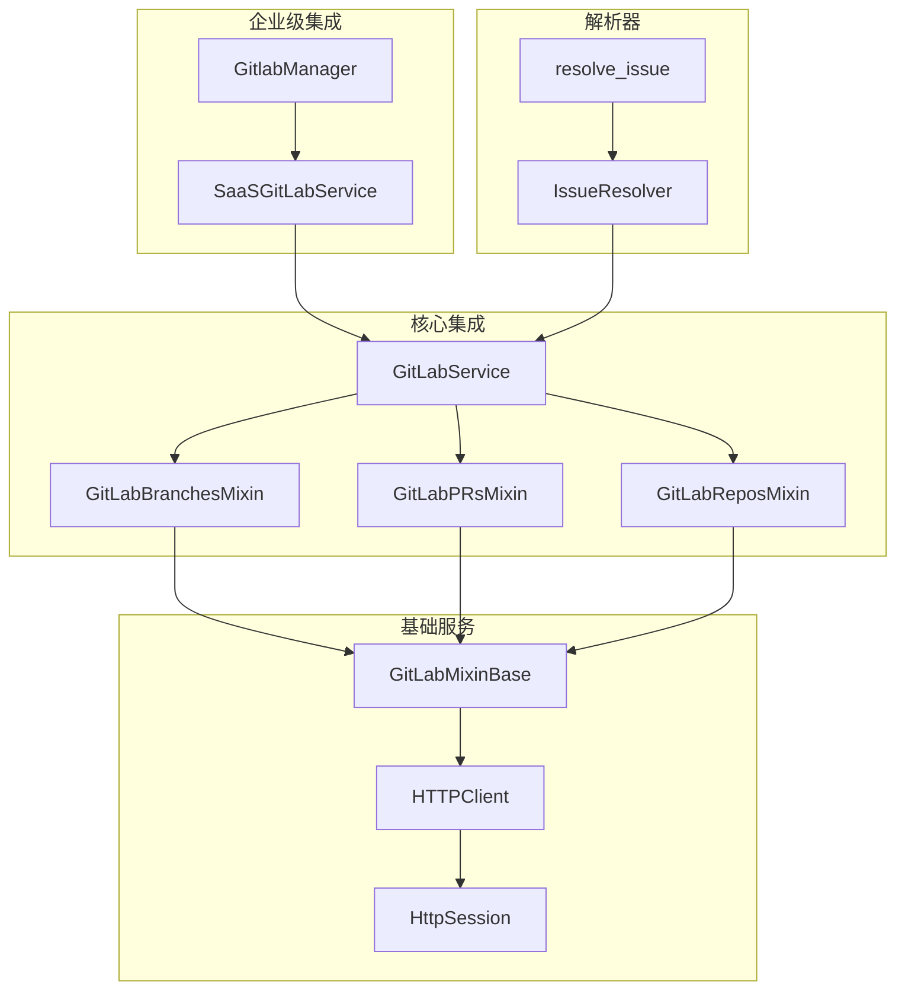
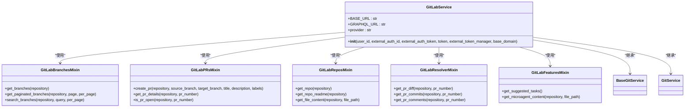
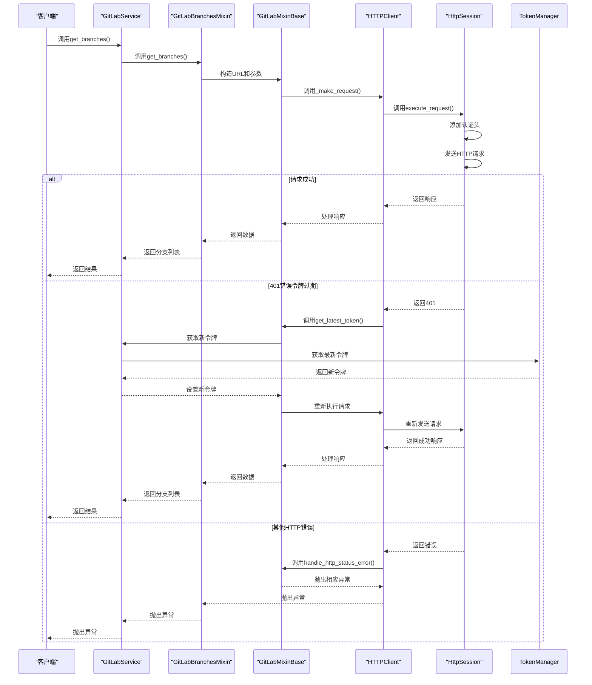
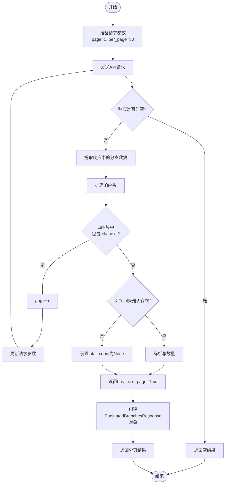
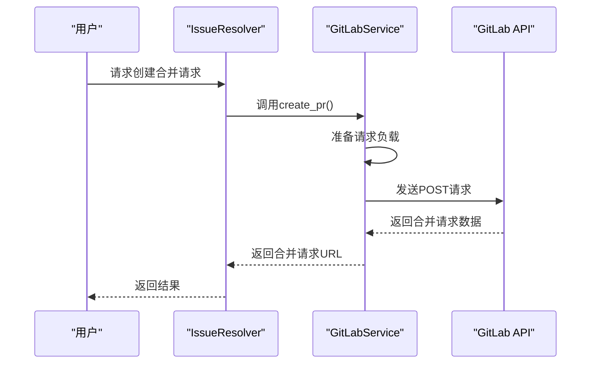
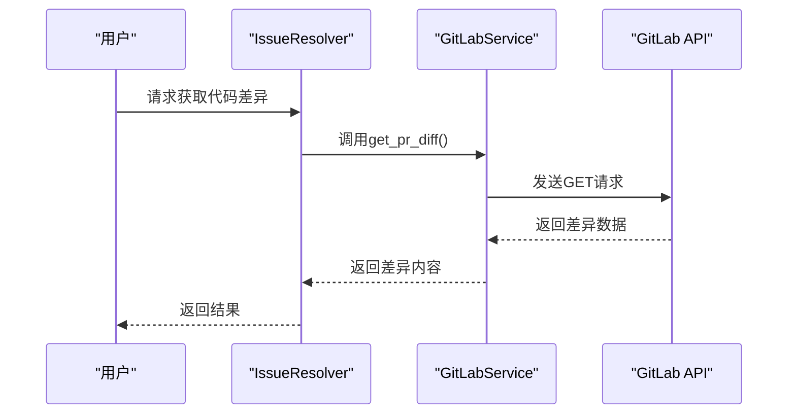
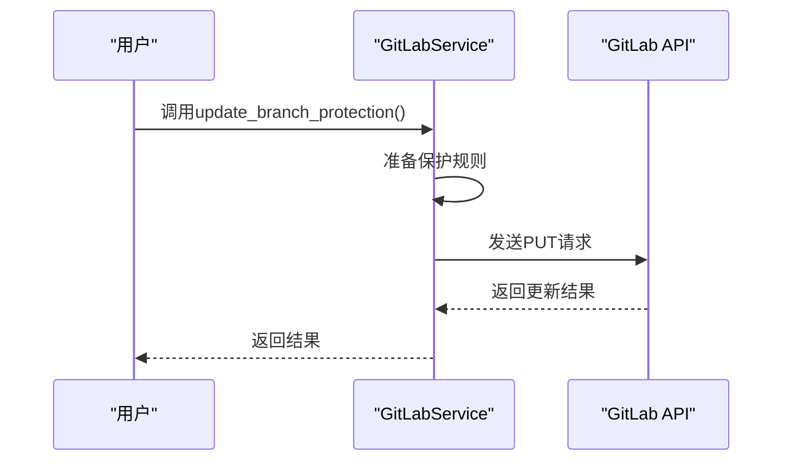
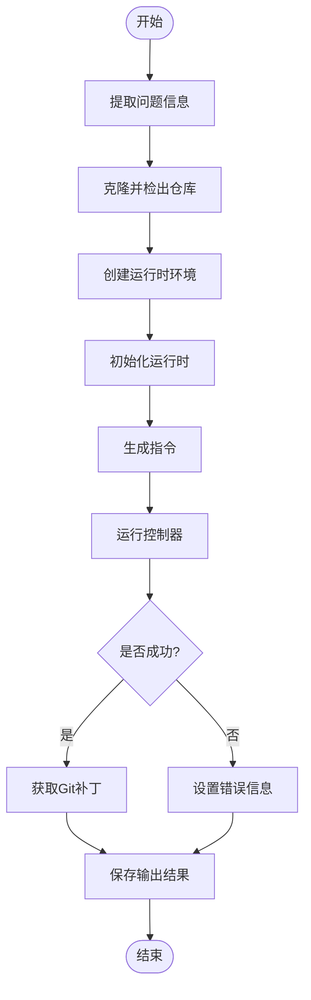
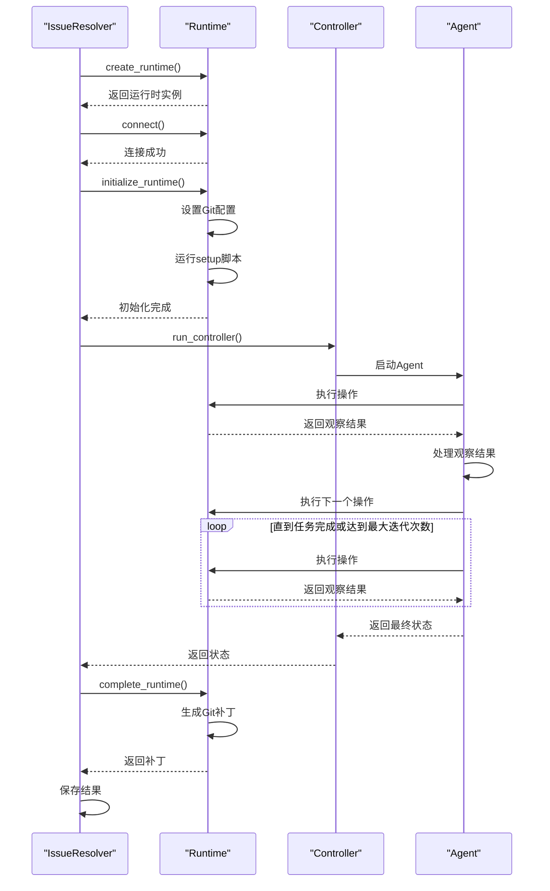

# API操作

<cite>
**本文档引用的文件**   
- [gitlab_service.py](file://enterprise/integrations/gitlab/gitlab_service.py)
- [gitlab_manager.py](file://enterprise/integrations/gitlab/gitlab_manager.py)
- [issue_resolver.py](file://openhands/resolver/issue_resolver.py)
- [resolve_issue.py](file://openhands/resolver/resolve_issue.py)
- [base.py](file://openhands/integrations/gitlab/service/base.py)
- [branches.py](file://openhands/integrations/gitlab/service/branches.py)
- [prs.py](file://openhands/integrations/gitlab/service/prs.py)
- [gitlab_view.py](file://enterprise/integrations/gitlab/gitlab_view.py)
- [http_session.py](file://openhands/utils/http_session.py)
</cite>

## 目录
1. [项目结构](#项目结构)
2. [核心组件](#核心组件)
3. [GitLab API服务实现](#gitlab-api服务实现)
4. [HTTP请求封装与错误重试](#http请求封装与错误重试)
5. [分页处理机制](#分页处理机制)
6. [API调用示例](#api调用示例)
7. [resolver.py中的智能解析逻辑](#resolverpy中的智能解析逻辑)
8. [与OpenHands运行时环境的协同工作](#与openhands运行时环境的协同工作)

## 项目结构

OpenHands项目中的GitLab集成主要分布在`enterprise/integrations/gitlab/`和`openhands/integrations/gitlab/`目录下，形成了一个分层的架构设计。企业级功能和核心功能分离，确保了系统的可扩展性和维护性。

**图源**
- [gitlab_service.py](file://enterprise/integrations/gitlab/gitlab_service.py#L21-L530)
- [gitlab_manager.py](file://enterprise/integrations/gitlab/gitlab_manager.py#L31-L262)
- [issue_resolver.py](file://openhands/resolver/issue_resolver.py#L52-L666)

**本节源**
- [gitlab_service.py](file://enterprise/integrations/gitlab/gitlab_service.py#L1-L530)
- [gitlab_manager.py](file://enterprise/integrations/gitlab/gitlab_manager.py#L1-L262)
- [issue_resolver.py](file://openhands/resolver/issue_resolver.py#L1-L666)

## 核心组件

OpenHands的GitLab API操作核心由几个关键组件构成：`SaaSGitLabService`作为企业级服务入口，`GitLabService`作为核心服务聚合类，以及`IssueResolver`作为问题解析的核心处理器。这些组件通过分层设计实现了功能的解耦和复用。

`SaaSGitLabService`继承自`GitLabService`，并扩展了企业级功能，如令牌管理和数据库存储。它通过`TokenManager`获取最新的GitLab令牌，并将仓库和Webhook信息存储在数据库中，确保了企业环境下的安全性和可追踪性。

`GitLabService`采用Mixin模式，将不同功能领域（分支、合并请求、仓库等）的方法组织在不同的Mixin类中，然后通过多重继承将它们组合在一起。这种设计使得代码更加模块化，易于维护和扩展。

`IssueResolver`是问题解析的核心，它负责从GitLab获取问题或合并请求的详细信息，启动一个运行时环境来解决问题，并将结果提交回GitLab。它与OpenHands的运行时环境紧密协作，实现了自动化的问题解决流程。

**本节源**
- [gitlab_service.py](file://enterprise/integrations/gitlab/gitlab_service.py#L21-L530)
- [gitlab_service.py](file://openhands/integrations/gitlab/gitlab_service.py#L20-L83)
- [issue_resolver.py](file://openhands/resolver/issue_resolver.py#L52-L666)

## GitLab API服务实现

GitLab API服务的实现采用了分层和模块化的设计，核心是`GitLabService`类，它通过继承多个Mixin类来组合不同的功能。这种设计模式使得代码结构清晰，职责分明。

**图源**
- [gitlab_service.py](file://openhands/integrations/gitlab/gitlab_service.py#L20-L83)
- [branches.py](file://openhands/integrations/gitlab/service/branches.py#L5-L108)
- [prs.py](file://openhands/integrations/gitlab/service/prs.py#L1-L111)
- [repos.py](file://openhands/integrations/gitlab/service/repos.py#L1-L50)
- [resolver.py](file://openhands/integrations/gitlab/service/resolver.py#L1-L50)

**本节源**
- [gitlab_service.py](file://openhands/integrations/gitlab/gitlab_service.py#L1-L83)
- [branches.py](file://openhands/integrations/gitlab/service/branches.py#L1-L108)
- [prs.py](file://openhands/integrations/gitlab/service/prs.py#L1-L111)

## HTTP请求封装与错误重试

HTTP请求的封装和错误重试机制是GitLab API服务稳定性的关键。该机制通过`GitLabMixinBase`类和`HTTPClient`协议实现，提供了统一的请求处理和错误处理能力。

**图源**
- [base.py](file://openhands/integrations/gitlab/service/base.py#L16-L179)
- [http_session.py](file://openhands/utils/http_session.py#L1-L87)

**本节源**
- [base.py](file://openhands/integrations/gitlab/service/base.py#L1-L179)
- [http_session.py](file://openhands/utils/http_session.py#L1-L87)

## 分页处理机制

GitLab API的分页处理机制通过`get_paginated_branches`方法实现，它利用GitLab API的`Link`头信息来判断是否有下一页，并自动处理分页逻辑。该机制确保了在处理大量数据时的效率和可靠性。

**图源**
- [branches.py](file://openhands/integrations/gitlab/service/branches.py#L48-L86)

**本节源**
- [branches.py](file://openhands/integrations/gitlab/service/branches.py#L48-L86)

## API调用示例

以下是一些常见的GitLab API调用示例，展示了如何使用OpenHands的GitLab服务进行各种操作。

### 创建合并请求

创建合并请求是GitLab工作流中的核心操作之一。通过`create_pr`方法，可以轻松地在两个分支之间创建合并请求。

**图源**
- [prs.py](file://openhands/integrations/gitlab/service/prs.py#L1-L59)

### 获取代码差异

获取代码差异是代码审查过程中的重要环节。通过`get_pr_diff`方法，可以获取合并请求中所有更改的详细信息。

**图源**
- [resolver.py](file://openhands/integrations/gitlab/service/resolver.py#L1-L50)

### 更新分支保护规则

更新分支保护规则是确保代码质量的重要手段。虽然具体实现未在提供的代码中展示，但可以通过类似的API调用模式来实现。

**本节源**
- [prs.py](file://openhands/integrations/gitlab/service/prs.py#L1-L59)
- [resolver.py](file://openhands/integrations/gitlab/service/resolver.py#L1-L50)

## resolver.py中的智能解析逻辑

`resolver.py`中的智能解析逻辑是OpenHands自动化能力的核心。它通过`IssueResolver`类实现了从问题识别到解决方案生成的完整流程。

**图源**
- [issue_resolver.py](file://openhands/resolver/issue_resolver.py#L52-L666)

**本节源**
- [issue_resolver.py](file://openhands/resolver/issue_resolver.py#L52-L666)

## 与OpenHands运行时环境的协同工作

`IssueResolver`与OpenHands运行时环境的协同工作是实现自动化问题解决的关键。通过`create_runtime`和`run_controller`函数，`IssueResolver`能够启动一个隔离的运行时环境来执行代码修改。

**图源**
- [issue_resolver.py](file://openhands/resolver/issue_resolver.py#L267-L386)
- [issue_resolver.py](file://openhands/resolver/issue_resolver.py#L417-L447)

**本节源**
- [issue_resolver.py](file://openhands/resolver/issue_resolver.py#L267-L447)