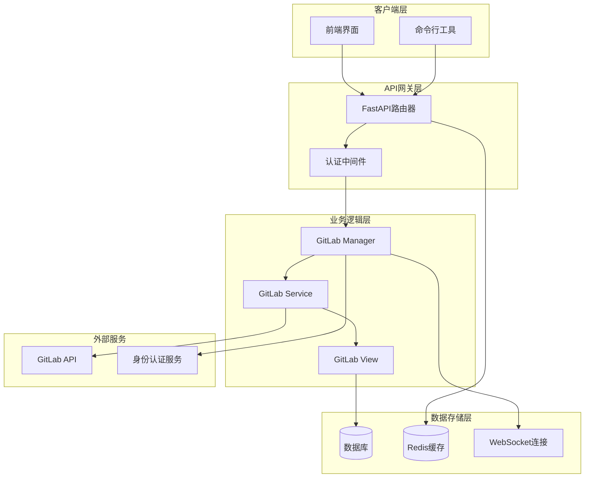
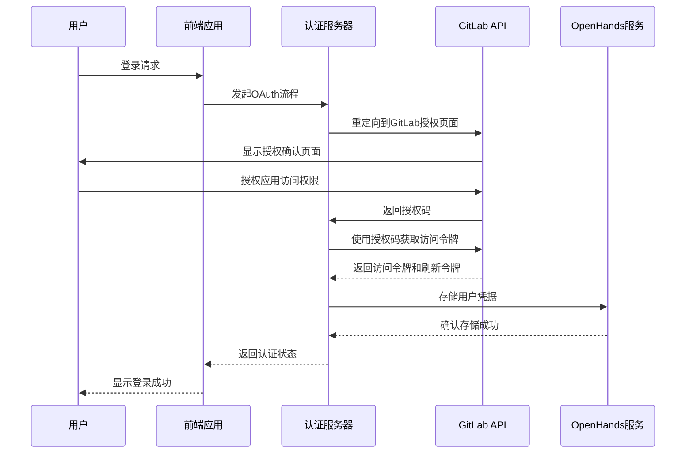
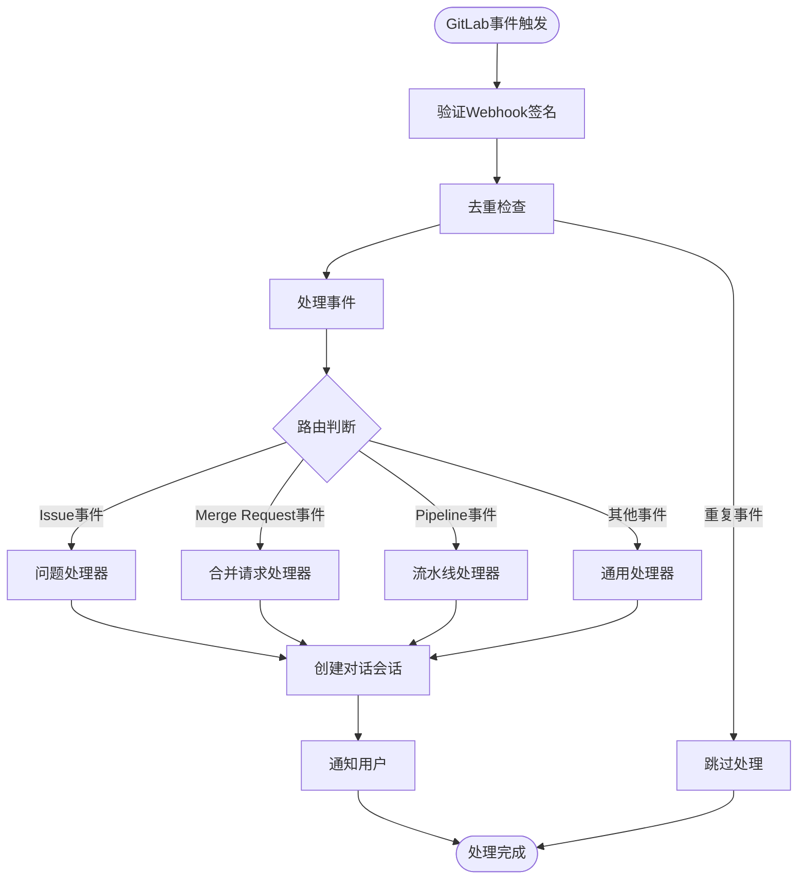
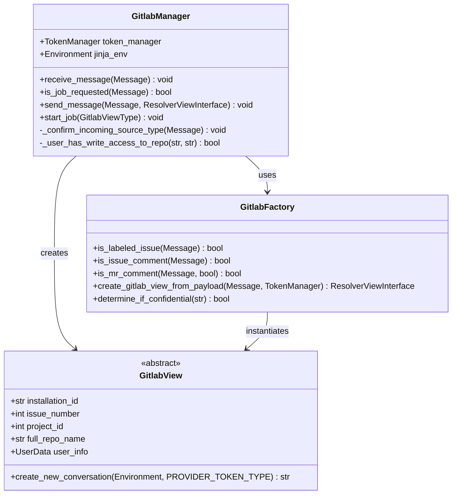
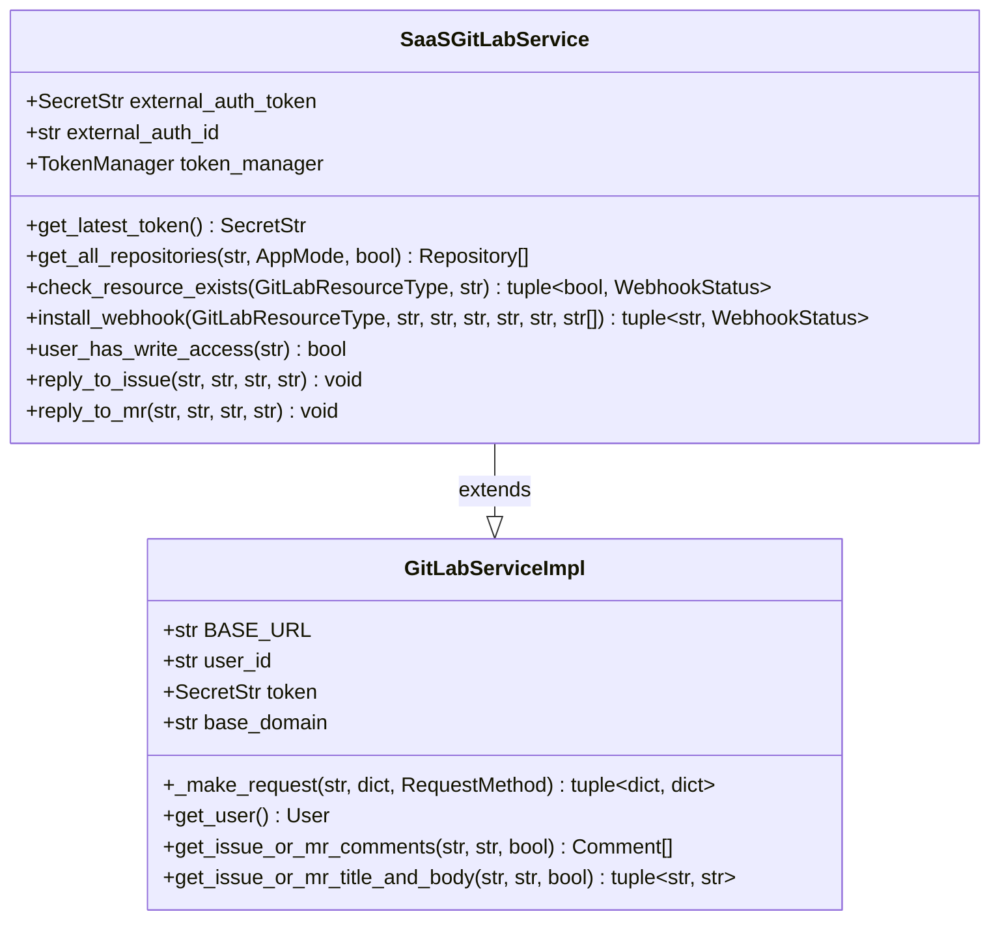
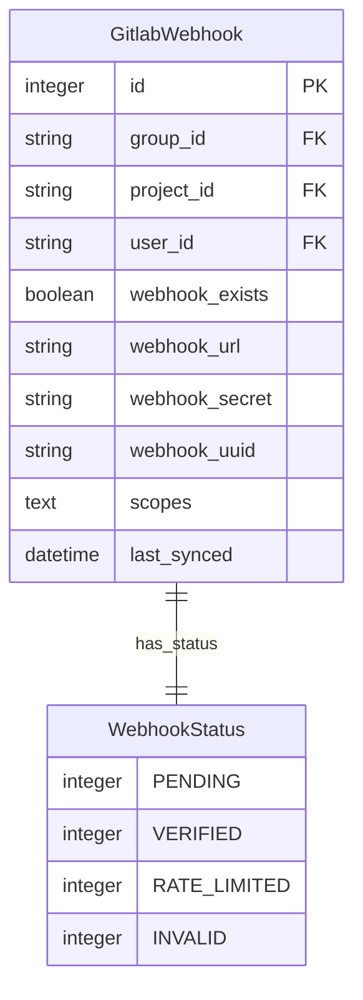
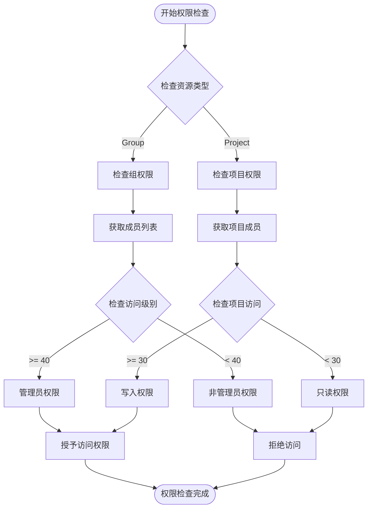
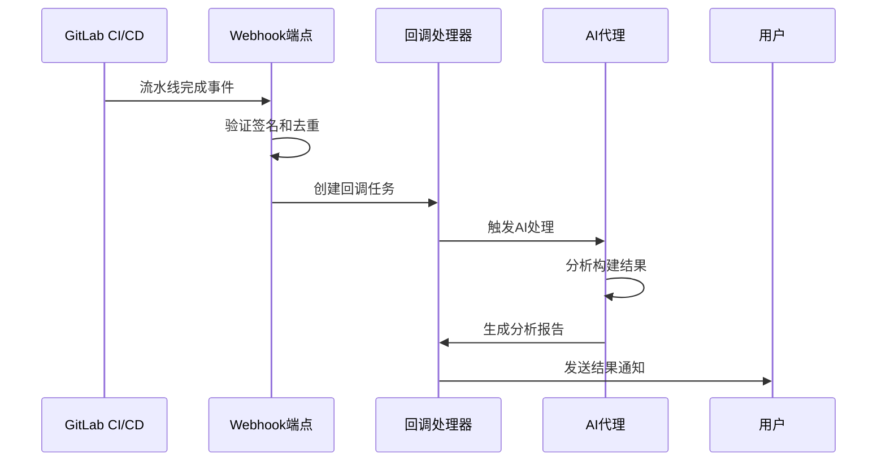
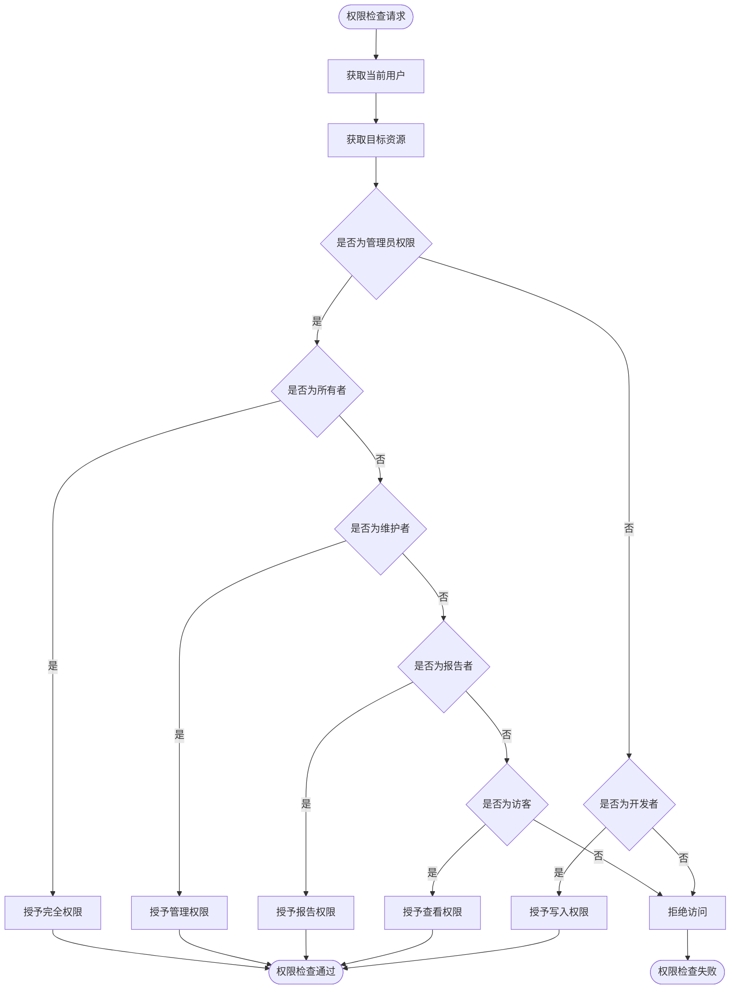

# GitLab集成

<cite>
**本文档中引用的文件**
- [microagents/gitlab.md](file://microagents/gitlab.md)
- [enterprise/integrations/gitlab/gitlab_service.py](file://enterprise/integrations/gitlab/gitlab_service.py)
- [enterprise/integrations/gitlab/gitlab_manager.py](file://enterprise/integrations/gitlab/gitlab_manager.py)
- [enterprise/integrations/gitlab/gitlab_view.py](file://enterprise/integrations/gitlab/gitlab_view.py)
- [enterprise/sync/install_gitlab_webhooks.py](file://enterprise/sync/install_gitlab_webhooks.py)
- [enterprise/storage/gitlab_webhook.py](file://enterprise/storage/gitlab_webhook.py)
- [enterprise/storage/gitlab_webhook_store.py](file://enterprise/storage/gitlab_webhook_store.py)
- [enterprise/server/routes/integration/gitlab.py](file://enterprise/server/routes/integration/gitlab.py)
- [enterprise/server/conversation_callback_processor/gitlab_callback_processor.py](file://enterprise/server/conversation_callback_processor/gitlab_callback_processor.py)
- [enterprise/server/auth/token_manager.py](file://enterprise/server/auth/token_manager.py)
- [enterprise/server/auth/constants.py](file://enterprise/server/auth/constants.py)
</cite>

## 目录
1. [概述](#概述)
2. [系统架构](#系统架构)
3. [OAuth认证流程](#oauth认证流程)
4. [Webhook处理机制](#webhook处理机制)
5. [核心组件分析](#核心组件分析)
6. [项目管理功能](#项目管理功能)
7. [CI/CD集成](#cicd集成)
8. [自托管GitLab配置](#自托管gitlab配置)
9. [权限管理](#权限管理)
10. [使用场景示例](#使用场景示例)
11. [故障排除](#故障排除)
12. [总结](#总结)

## 概述

OpenHands的GitLab集成为用户提供了全面的GitLab平台集成能力，支持OAuth认证、Webhook事件处理、项目管理、合并请求处理和CI/CD集成。该集成系统采用微服务架构，通过SAAS模式为用户提供云端服务，同时支持自托管部署。

### 主要特性

- **OAuth 2.0认证**：支持GitLab OAuth 2.0标准认证流程
- **Webhook事件处理**：实时响应GitLab事件（issue、merge request、pipeline等）
- **多层级权限控制**：基于角色的访问控制（RBAC）
- **自动Webhook安装**：智能检测和安装Webhook到项目或组
- **会话管理**：基于WebSocket的实时通信
- **错误处理**：完善的重试机制和错误恢复

## 系统架构



**图表来源**
- [enterprise/integrations/gitlab/gitlab_manager.py](file://enterprise/integrations/gitlab/gitlab_manager.py#L31-L262)
- [enterprise/integrations/gitlab/gitlab_service.py](file://enterprise/integrations/gitlab/gitlab_service.py#L21-L530)
- [enterprise/server/routes/integration/gitlab.py](file://enterprise/server/routes/integration/gitlab.py#L1-L86)

## OAuth认证流程

### 认证架构



**图表来源**
- [enterprise/server/auth/token_manager.py](file://enterprise/server/auth/token_manager.py#L324-L346)
- [enterprise/server/auth/constants.py](file://enterprise/server/auth/constants.py#L16-L17)

### 认证流程详解

1. **初始化认证**：用户在前端发起GitLab认证请求
2. **OAuth重定向**：系统重定向到GitLab OAuth授权页面
3. **权限授予**：用户在GitLab上确认应用权限
4. **令牌交换**：系统使用授权码从GitLab获取访问令牌
5. **令牌存储**：将访问令牌和刷新令牌安全存储
6. **用户同步**：同步用户的GitLab项目和权限信息

**章节来源**
- [enterprise/server/auth/token_manager.py](file://enterprise/server/auth/token_manager.py#L47-L81)
- [enterprise/sync/install_gitlab_webhooks.py](file://enterprise/sync/install_gitlab_webhooks.py#L200-L238)

## Webhook处理机制

### Webhook架构设计



**图表来源**
- [enterprise/server/routes/integration/gitlab.py](file://enterprise/server/routes/integration/gitlab.py#L35-L85)
- [enterprise/integrations/gitlab/gitlab_manager.py](file://enterprise/integrations/gitlab/gitlab_manager.py#L74-L118)

### Webhook事件类型

系统支持以下GitLab事件类型的Webhook处理：

| 事件类型 | 描述 | 触发条件 |
|---------|------|----------|
| `issues_events` | 问题事件 | 问题创建、更新、关闭等 |
| `merge_requests_events` | 合并请求事件 | MR创建、更新、合并等 |
| `note_events` | 评论事件 | 问题或MR的评论 |
| `confidential_issues_events` | 机密问题事件 | 机密问题的变更 |
| `confidential_note_events` | 机密评论事件 | 机密评论的添加 |
| `job_events` | 作业事件 | CI/CD作业状态变更 |
| `pipeline_events` | 流水线事件 | CI/CD流水线状态变更 |

### 事件去重机制

为了防止重复处理相同的GitLab事件，系统实现了智能去重机制：

1. **基于ID去重**：优先使用`object_attributes.id`作为去重键
2. **基于哈希去重**：当事件不包含ID时，使用整个payload的SHA256哈希值
3. **时间窗口**：每个去重键的有效期为60秒
4. **Redis存储**：使用Redis作为去重键的存储介质

**章节来源**
- [enterprise/server/routes/integration/gitlab.py](file://enterprise/server/routes/integration/gitlab.py#L50-L67)
- [enterprise/sync/install_gitlab_webhooks.py](file://enterprise/sync/install_gitlab_webhooks.py#L16-L24)

## 核心组件分析

### GitLab Manager

GitLab Manager是GitLab集成的核心协调器，负责处理来自GitLab的各种事件和消息。



**图表来源**
- [enterprise/integrations/gitlab/gitlab_manager.py](file://enterprise/integrations/gitlab/gitlab_manager.py#L31-L262)
- [enterprise/integrations/gitlab/gitlab_view.py](file://enterprise/integrations/gitlab/gitlab_view.py#L28-L452)

### GitLab Service

GitLab Service提供了与GitLab API交互的核心功能，包括项目管理、权限检查和事件处理。



**图表来源**
- [enterprise/integrations/gitlab/gitlab_service.py](file://enterprise/integrations/gitlab/gitlab_service.py#L21-L530)

### 数据库模型

GitLab Webhook存储使用专门的数据模型来管理Webhook配置和状态。



**图表来源**
- [enterprise/storage/gitlab_webhook.py](file://enterprise/storage/gitlab_webhook.py#L15-L43)

**章节来源**
- [enterprise/integrations/gitlab/gitlab_manager.py](file://enterprise/integrations/gitlab/gitlab_manager.py#L31-L262)
- [enterprise/integrations/gitlab/gitlab_service.py](file://enterprise/integrations/gitlab/gitlab_service.py#L21-L530)
- [enterprise/storage/gitlab_webhook.py](file://enterprise/storage/gitlab_webhook.py#L15-L43)

## 项目管理功能

### 仓库发现和同步

系统能够自动发现和同步用户在GitLab上的所有项目：

1. **分页获取**：使用GitLab API的分页机制获取所有项目
2. **权限过滤**：只显示用户有访问权限的项目
3. **个人项目识别**：自动识别用户拥有的个人项目
4. **后台同步**：异步执行仓库数据的存储和更新

### 权限检查机制



**图表来源**
- [enterprise/integrations/gitlab/gitlab_service.py](file://enterprise/integrations/gitlab/gitlab_service.py#L343-L403)

### Webhook自动安装

系统能够自动检测需要Webhook的项目，并为其安装相应的Webhook：

1. **资源验证**：检查项目或组是否存在且可访问
2. **权限验证**：确认用户对资源具有管理员权限
3. **重复检查**：避免在同一资源上重复安装Webhook
4. **配置管理**：存储Webhook的配置信息和状态

**章节来源**
- [enterprise/integrations/gitlab/gitlab_service.py](file://enterprise/integrations/gitlab/gitlab_service.py#L171-L268)
- [enterprise/integrations/gitlab/gitlab_service.py](file://enterprise/integrations/gitlab/gitlab_service.py#L343-L403)
- [enterprise/sync/install_gitlab_webhooks.py](file://enterprise/sync/install_gitlab_webhooks.py#L243-L325)

## CI/CD集成

### 流水线事件处理

系统能够响应GitLab CI/CD流水线的各种事件：

- **流水线状态变化**：构建开始、成功、失败、取消等
- **作业状态监控**：单个作业的开始、完成、失败状态
- **构建产物管理**：自动下载和处理构建产物
- **测试结果集成**：收集和报告测试结果

### 自动化工作流



**图表来源**
- [enterprise/server/conversation_callback_processor/gitlab_callback_processor.py](file://enterprise/server/conversation_callback_processor/gitlab_callback_processor.py#L119-L142)

**章节来源**
- [enterprise/server/conversation_callback_processor/gitlab_callback_processor.py](file://enterprise/server/conversation_callback_processor/gitlab_callback_processor.py#L119-L142)

## 自托管GitLab配置

### 环境变量配置

自托管GitLab实例需要配置以下环境变量：

| 变量名 | 描述 | 示例值 |
|--------|------|--------|
| `GITLAB_APP_CLIENT_ID` | GitLab应用客户端ID | `your-client-id` |
| `GITLAB_APP_CLIENT_SECRET` | GitLab应用客户端密钥 | `your-client-secret` |
| `KEYCLOAK_SERVER_URL` | Keycloak服务器地址 | `https://keycloak.example.com` |
| `KEYCLOAK_REALM_NAME` | Keycloak领域名称 | `openhands` |
| `KEYCLOAK_CLIENT_ID` | Keycloak客户端ID | `openhands-client` |
| `KEYCLOAK_CLIENT_SECRET` | Keycloak客户端密钥 | `client-secret` |

### 自定义GitLab域名

对于自托管的GitLab实例，需要配置自定义域名：

```bash
# 设置GitLab主机地址
export GITLAB_HOST=gitlab.company.com

# 设置基础URL
export GITLAB_BASE_URL=https://gitlab.company.com/api/v4
```

### 配置步骤

1. **注册GitLab应用**：在GitLab实例中注册OpenHands应用
2. **配置回调URL**：设置正确的OAuth回调URL
3. **环境变量设置**：配置所有必要的环境变量
4. **SSL证书**：确保存在有效的SSL证书
5. **防火墙配置**：开放必要的网络端口

**章节来源**
- [enterprise/server/auth/constants.py](file://enterprise/server/auth/constants.py#L16-L17)

## 权限管理

### 访问级别定义

GitLab集成支持以下访问级别的权限控制：

| 权限级别 | 数值 | 描述 | 支持的操作 |
|----------|------|------|------------|
| 无访问 | 0 | 无法访问资源 | 无 |
| 访客 | 10 | 只能查看公开内容 | 查看项目、问题、MR |
| 报告者 | 20 | 可以创建问题和评论 | 创建问题、评论 |
| 开发者 | 30 | 可以克隆和推送代码 | 克隆、推送、创建分支 |
| 维护者 | 40 | 可以管理项目 | 管理权限、删除项目 |
| 所有者 | 60 | 完全控制权 | 删除项目、管理用户 |

### 权限检查流程



**图表来源**
- [enterprise/integrations/gitlab/gitlab_service.py](file://enterprise/integrations/gitlab/gitlab_service.py#L343-L403)

### 动态权限验证

系统支持运行时动态验证用户权限：

1. **实时检查**：每次操作前验证用户权限
2. **缓存优化**：使用Redis缓存权限结果
3. **权限继承**：支持组权限向项目的继承
4. **权限更新**：自动检测权限变更并更新缓存

**章节来源**
- [enterprise/integrations/gitlab/gitlab_service.py](file://enterprise/integrations/gitlab/gitlab_service.py#L343-L403)

## 使用场景示例

### 微代理使用场景

根据[microagents/gitlab.md](file://microagents/gitlab.md)，GitLab集成支持多种自动化场景：

#### 1. 问题标签处理
当问题被标记特定标签时，系统自动启动AI代理进行处理：
- 检查用户权限
- 创建新的对话会话
- 初始化AI代理
- 跟踪处理进度

#### 2. 评论回复
支持对问题和合并请求的评论进行AI驱动的回复：
- 识别@提及的评论
- 提取上下文信息
- 生成智能回复
- 发送回复到GitLab

#### 3. 合并请求处理
针对合并请求的特殊处理流程：
- 获取源分支信息
- 提取代码审查上下文
- 处理内联评论
- 自动生成回复

### 实际应用案例

#### 案例1：自动化代码审查
```bash
# 用户在GitLab问题中标记标签
@openhands resolve this issue

# 系统响应
I'm on it! username can track my progress at all-hands.dev
```

#### 案例2：CI/CD结果分析
```bash
# GitLab流水线完成后
Pipeline #123 finished with status: success

# 系统分析
Analyzing build results...
- Tests passed: 95%
- Coverage increased by 2%
- No critical issues found
```

#### 案例3：自动化文档生成
```bash
# 当MR被标记时
@openhands document this change

# 系统响应
Generating documentation...
- Analyzing code changes
- Creating API documentation
- Updating README.md
```

**章节来源**
- [microagents/gitlab.md](file://microagents/gitlab.md#L1-L35)
- [enterprise/integrations/gitlab/gitlab_manager.py](file://enterprise/integrations/gitlab/gitlab_manager.py#L74-L118)

## 故障排除

### 常见问题及解决方案

#### 1. 认证失败
**症状**：用户无法登录或收到认证错误
**原因**：OAuth令牌过期或无效
**解决方案**：
- 检查GitLab应用的权限范围
- 验证客户端ID和密钥
- 重新授权应用

#### 2. Webhook未触发
**症状**：GitLab事件不被系统处理
**原因**：Webhook配置错误或签名验证失败
**解决方案**：
- 验证Webhook URL的可达性
- 检查签名密钥的正确性
- 确认网络防火墙设置

#### 3. 权限不足
**症状**：系统提示权限不足错误
**原因**：用户在GitLab项目中权限不够
**解决方案**：
- 检查用户在项目中的访问级别
- 确认用户具有管理员权限
- 验证项目可见性设置

#### 4. 速率限制
**症状**：API请求频繁失败
**原因**：GitLab API速率限制
**解决方案**：
- 实现指数退避重试
- 优化API调用频率
- 使用批量操作

### 调试工具

#### 日志分析
系统提供详细的日志记录用于调试：

```python
# 启用详细日志
logger.setLevel(logging.DEBUG)

# 关键日志点
logger.info('Webhook received', extra={'payload': payload})
logger.warning('Rate limited', extra={'retry_after': retry_after})
logger.error('Permission denied', extra={'user_id': user_id, 'project_id': project_id})
```

#### 状态检查
使用以下命令检查系统状态：

```bash
# 检查Webhook状态
curl -X GET "https://api.openhands.dev/integration/gitlab/webhooks/status"

# 检查认证状态
curl -X GET "https://api.openhands.dev/integration/gitlab/auth/status"
```

**章节来源**
- [enterprise/server/routes/integration/gitlab.py](file://enterprise/server/routes/integration/gitlab.py#L83-L85)
- [enterprise/integrations/gitlab/gitlab_service.py](file://enterprise/integrations/gitlab/gitlab_service.py#L47-L81)

## 总结

OpenHands的GitLab集成为用户提供了完整的企业级GitLab平台集成解决方案。通过OAuth认证、Webhook事件处理、智能权限管理和自动化工作流，系统能够无缝集成到现有的GitLab开发环境中。

### 主要优势

1. **安全性**：采用OAuth 2.0标准认证，支持令牌刷新和安全存储
2. **可靠性**：完善的错误处理和重试机制，确保高可用性
3. **可扩展性**：模块化架构支持功能扩展和定制
4. **易用性**：直观的配置界面和自动化安装流程
5. **兼容性**：支持GitLab.com和自托管GitLab实例

### 最佳实践

1. **定期维护**：定期检查Webhook状态和权限配置
2. **监控告警**：设置适当的监控和告警机制
3. **备份策略**：定期备份Webhook配置和用户数据
4. **性能优化**：合理配置API调用频率和缓存策略
5. **安全更新**：及时更新依赖库和安全补丁

通过本文档的指导，开发团队可以充分利用OpenHands的GitLab集成功能，提高开发效率和协作质量。