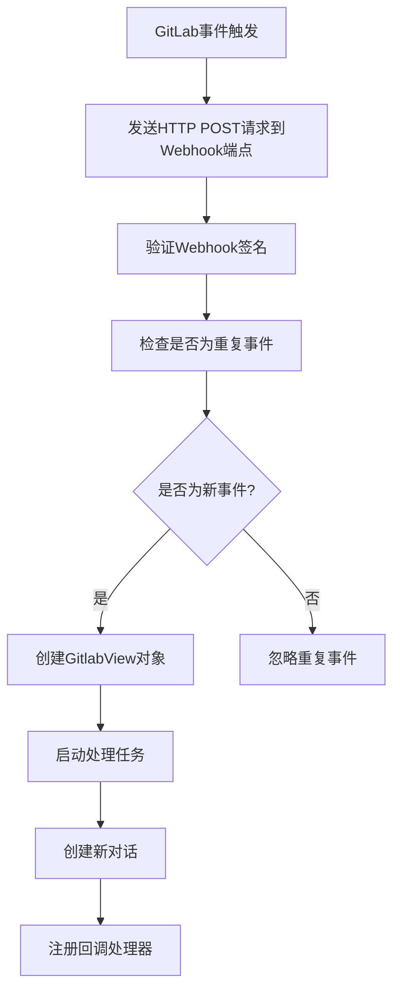
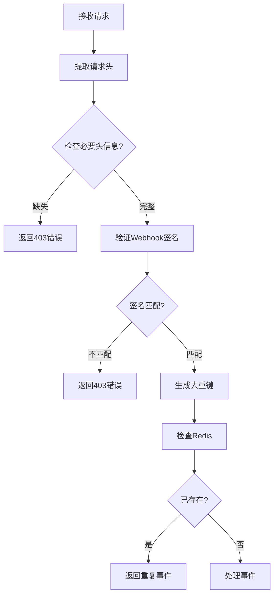
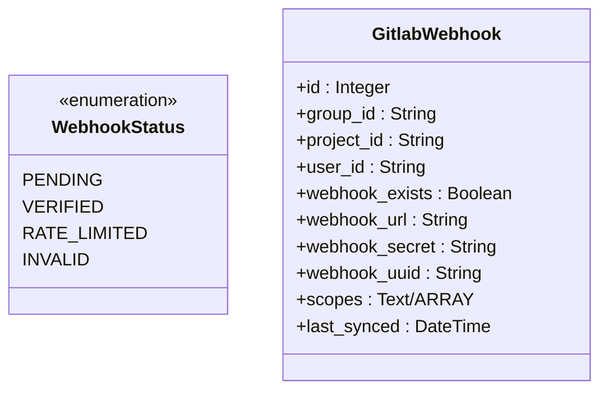
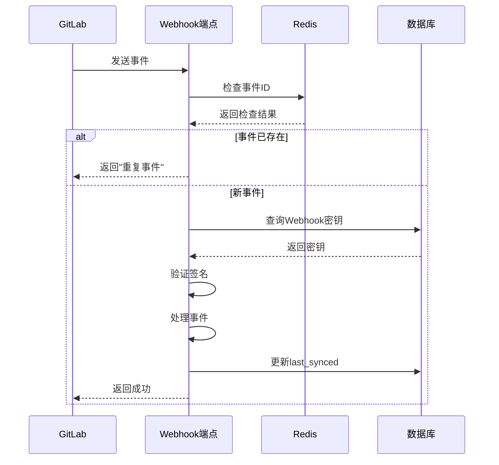
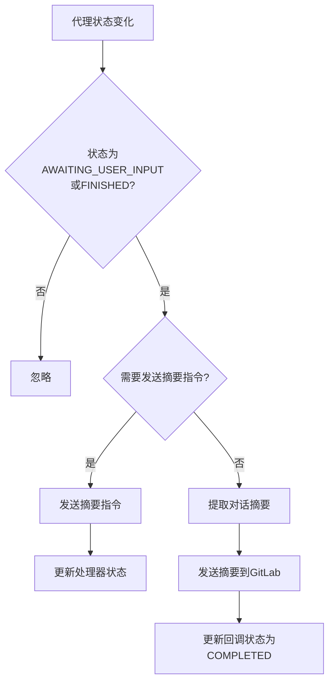

# Webhook集成

<cite>
**本文档引用的文件**   
- [gitlab_view.py](file://enterprise/integrations/gitlab/gitlab_view.py)
- [gitlab.py](file://enterprise/server/routes/integration/gitlab.py)
- [gitlab_service.py](file://enterprise/integrations/gitlab/gitlab_service.py)
- [gitlab_webhook.py](file://enterprise/storage/gitlab_webhook.py)
- [gitlab_webhook_store.py](file://enterprise/storage/gitlab_webhook_store.py)
- [install_gitlab_webhooks.py](file://enterprise/sync/install_gitlab_webhooks.py)
- [gitlab_manager.py](file://enterprise/integrations/gitlab/gitlab_manager.py)
- [gitlab_callback_processor.py](file://enterprise/server/conversation_callback_processor/gitlab_callback_processor.py)
</cite>

## 目录
1. [介绍](#介绍)
2. [事件订阅与回调处理机制](#事件订阅与回调处理机制)
3. [路由定义与请求验证](#路由定义与请求验证)
4. [数据库设计与状态管理](#数据库设计与状态管理)
5. [支持的事件类型与Payload结构](#支持的事件类型与payload结构)
6. [Webhook签名验证](#webhook签名验证)
7. [故障恢复与重试策略](#故障恢复与重试策略)
8. [与conversation_callback_processor的集成](#与conversation_callback_processor的集成)

## 介绍
本文档详细描述了GitLab Webhook集成的实现机制，涵盖事件订阅、回调处理、数据库设计、状态管理、支持的事件类型、Webhook签名验证、故障恢复机制以及与conversation_callback_processor的集成方式。

## 事件订阅与回调处理机制

GitLab Webhook集成通过事件驱动架构实现，当GitLab中发生特定事件时，会向预设的Webhook端点发送HTTP POST请求。系统通过`GitlabFactory`类的工厂方法来确定事件类型，并创建相应的视图对象进行处理。

事件处理流程如下：
1. 接收GitLab事件
2. 验证请求签名
3. 去重处理
4. 创建相应的视图对象
5. 启动处理任务



**图源**
- [gitlab.py](file://enterprise/server/routes/integration/gitlab.py#L35-L86)
- [gitlab_manager.py](file://enterprise/integrations/gitlab/gitlab_manager.py#L74-L85)

**本节源**
- [gitlab_view.py](file://enterprise/integrations/gitlab/gitlab_view.py#L239-L452)
- [gitlab_manager.py](file://enterprise/integrations/gitlab/gitlab_manager.py#L74-L85)

## 路由定义与请求验证

### 路由定义
系统在`gitlab.py`文件中定义了GitLab事件的路由，使用FastAPI框架创建了一个POST端点`/integration/gitlab/events`来接收GitLab事件。

### 请求验证逻辑
请求验证包含三个关键步骤：

1. **签名验证**：通过`verify_gitlab_signature`函数验证请求的签名
2. **去重处理**：使用Redis存储事件ID，防止重复处理
3. **权限检查**：验证用户对仓库的写入权限



**图源**
- [gitlab.py](file://enterprise/server/routes/integration/gitlab.py#L21-L86)

**本节源**
- [gitlab.py](file://enterprise/server/routes/integration/gitlab.py#L21-L86)

## 数据库设计与状态管理

### gitlab_webhook表设计
`gitlab_webhook`表用于存储GitLab Webhook的配置信息，其主要字段包括：

| 字段名 | 类型 | 是否可为空 | 描述 |
|-------|------|-----------|------|
| id | Integer | 否 | 主键，自增 |
| group_id | String | 是 | GitLab组ID |
| project_id | String | 是 | GitLab项目ID |
| user_id | String | 否 | 用户ID |
| webhook_exists | Boolean | 否 | Webhook是否存在 |
| webhook_url | String | 是 | Webhook URL |
| webhook_secret | String | 是 | Webhook密钥 |
| webhook_uuid | String | 是 | Webhook UUID |
| scopes | Text/ARRAY | 是 | Webhook监听的事件范围 |
| last_synced | DateTime | 是 | 最后同步时间 |

### 状态管理
系统使用`WebhookStatus`枚举来管理Webhook的状态：



**图源**
- [gitlab_webhook.py](file://enterprise/storage/gitlab_webhook.py#L8-L43)
- [027_create_gitlab_webhook_table.py](file://enterprise/migrations/versions/027_create_gitlab_webhook_table.py#L24-L37)

**本节源**
- [gitlab_webhook.py](file://enterprise/storage/gitlab_webhook.py#L8-L43)
- [027_create_gitlab_webhook_table.py](file://enterprise/migrations/versions/027_create_gitlab_webhook_table.py#L24-L37)
- [032_add_status_column_to_gitlab_webhook.py](file://enterprise/migrations/versions/032_add_status_column_to_gitlab_webhook.py#L24-L33)

## 支持的事件类型与Payload结构

### 支持的事件类型
系统支持以下GitLab事件类型：

1. **Issue标签事件**：当Issue被标记时触发
2. **Issue评论事件**：当Issue有新评论时触发
3. **Merge Request评论事件**：当MR有新评论时触发
4. **Inline MR评论事件**：当MR有内联评论时触发

### Payload结构
不同事件类型的Payload结构如下：

#### Issue标签事件Payload
```json
{
  "object_kind": "issue",
  "event_type": "issue",
  "changes": {
    "labels": {
      "previous": [],
      "current": [
        {"title": "openhands"}
      ]
    }
  },
  "issue": {
    "iid": 123,
    "title": "Issue标题",
    "description": "Issue描述"
  },
  "project": {
    "id": 456,
    "path_with_namespace": "group/project"
  },
  "user": {
    "id": 789,
    "username": "用户名"
  }
}
```

#### 评论事件Payload
```json
{
  "object_kind": "note",
  "event_type": "note",
  "issue": {
    "iid": 123
  },
  "merge_request": {
    "iid": 456,
    "source_branch": "feature-branch"
  },
  "object_attributes": {
    "note": "评论内容 @openhands",
    "discussion_id": "讨论ID",
    "position": {
      "new_path": "文件路径",
      "new_line": 10
    }
  },
  "project": {
    "id": 789,
    "path_with_namespace": "group/project"
  },
  "user": {
    "id": 101,
    "username": "用户名"
  }
}
```

**本节源**
- [gitlab_view.py](file://enterprise/integrations/gitlab/gitlab_view.py#L240-L302)
- [gitlab_manager.py](file://enterprise/integrations/gitlab/gitlab_manager.py#L86-L93)

## Webhook签名验证

### 验证流程
Webhook签名验证流程如下：

1. 从请求头中提取`X-Gitlab-Token`、`X-OpenHands-Webhook-ID`和`X-OpenHands-User-ID`
2. 根据Webhook UUID和用户ID从数据库中查询对应的Webhook密钥
3. 比较请求头中的Token与数据库中的密钥
4. 如果匹配则验证通过，否则返回403错误

### 实现细节
签名验证的实现代码位于`gitlab.py`文件中：

```python
async def verify_gitlab_signature(
    header_webhook_secret: str, webhook_uuid: str, user_id: str
):
    if not header_webhook_secret or not webhook_uuid or not user_id:
        raise HTTPException(status_code=403, detail='Required payload headers missing!')

    webhook_secret = await webhook_store.get_webhook_secret(
        webhook_uuid=webhook_uuid, user_id=user_id
    )

    if header_webhook_secret != webhook_secret:
        raise HTTPException(status_code=403, detail="Request signatures didn't match!")
```

**本节源**
- [gitlab.py](file://enterprise/server/routes/integration/gitlab.py#L21-L33)
- [gitlab_webhook_store.py](file://enterprise/storage/gitlab_webhook_store.py#L200-L221)

## 故障恢复与重试策略

### 故障恢复机制
系统实现了多层次的故障恢复机制：

1. **去重机制**：使用Redis存储事件ID，防止重复处理
2. **状态管理**：记录Webhook的最后同步时间，避免立即重新处理
3. **异常处理**：捕获并记录各种异常，确保系统稳定性

### 重试策略
重试策略主要体现在以下几个方面：

1. **API限流处理**：当GitLab API返回限流错误时，系统会记录`RATE_LIMITED`状态并中断当前处理循环
2. **异步任务**：使用`asyncio.create_task`创建异步任务，确保主流程不受影响
3. **事务管理**：在数据库操作中使用事务，确保数据一致性



**图源**
- [gitlab.py](file://enterprise/server/routes/integration/gitlab.py#L59-L66)
- [install_gitlab_webhooks.py](file://enterprise/sync/install_gitlab_webhooks.py#L303-L319)

**本节源**
- [gitlab.py](file://enterprise/server/routes/integration/gitlab.py#L59-L66)
- [install_gitlab_webhooks.py](file://enterprise/sync/install_gitlab_webhooks.py#L303-L319)
- [gitlab_service.py](file://enterprise/integrations/gitlab/gitlab_service.py#L295-L299)

## 与conversation_callback_processor的集成

### 集成方式
系统通过`GitlabCallbackProcessor`类实现与`conversation_callback_processor`的集成，主要功能包括：

1. **消息发送**：将对话摘要发送回GitLab
2. **状态监控**：监控代理状态变化
3. **摘要生成**：提取对话摘要并发送

### 处理流程
集成处理流程如下：

1. 当代理状态变为`AWAITING_USER_INPUT`或`FINISHED`时触发回调
2. 如果需要，先发送摘要指令
3. 提取对话摘要
4. 将摘要发送回GitLab
5. 更新回调状态



**图源**
- [gitlab_callback_processor.py](file://enterprise/server/conversation_callback_processor/gitlab_callback_processor.py#L65-L138)

**本节源**
- [gitlab_callback_processor.py](file://enterprise/server/conversation_callback_processor/gitlab_callback_processor.py#L30-L143)
- [gitlab_manager.py](file://enterprise/integrations/gitlab/gitlab_manager.py#L222-L229)