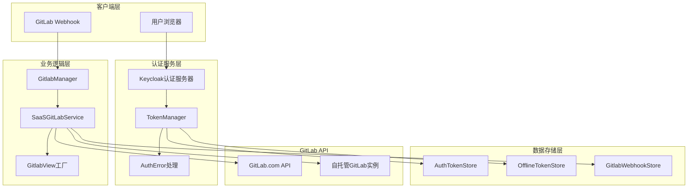
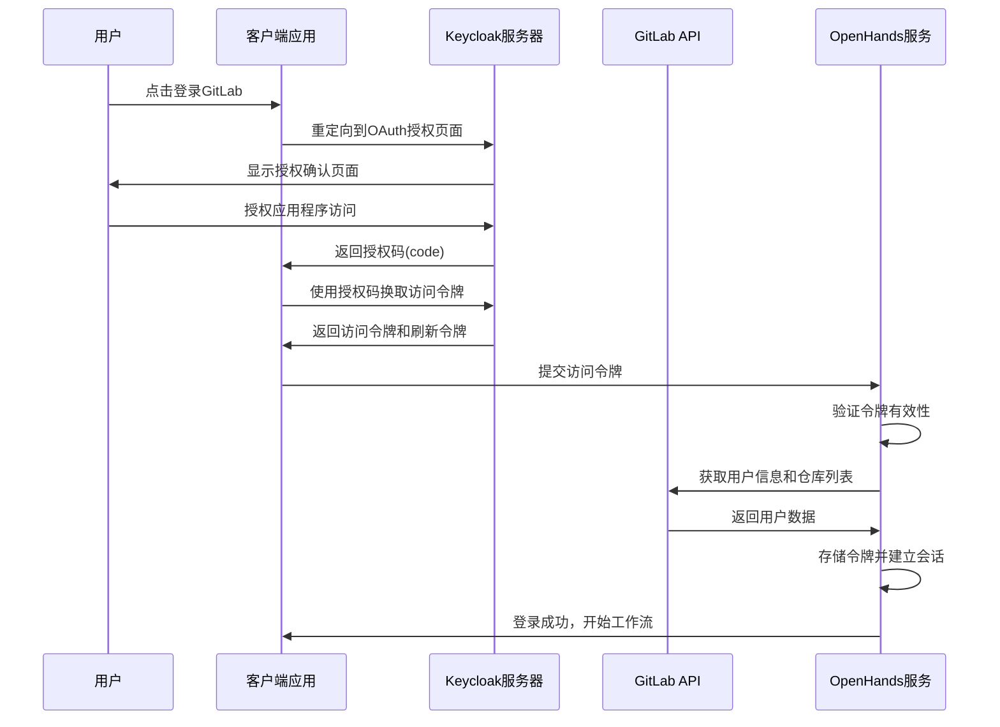
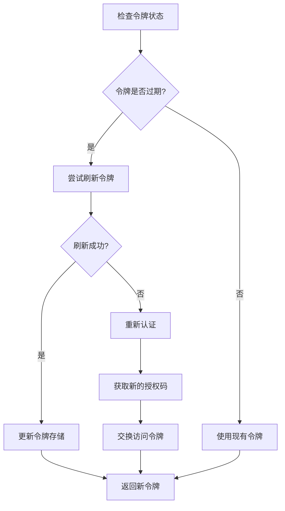
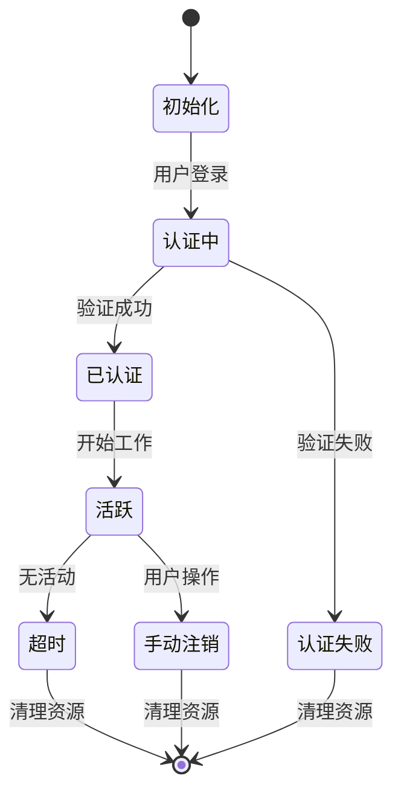
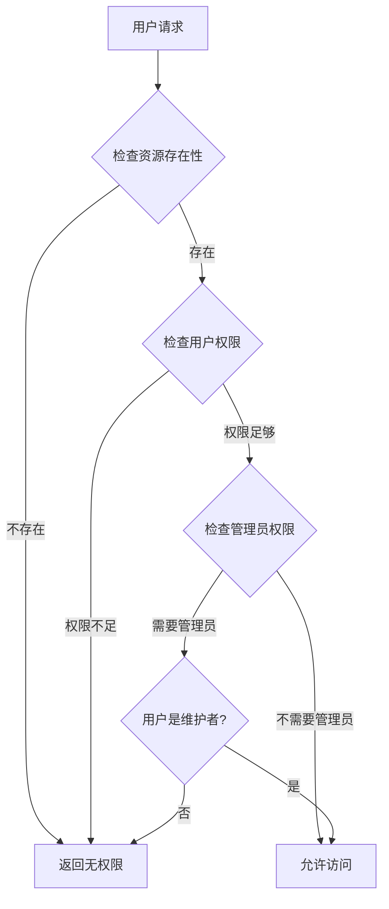
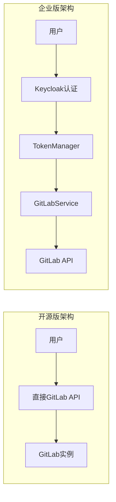
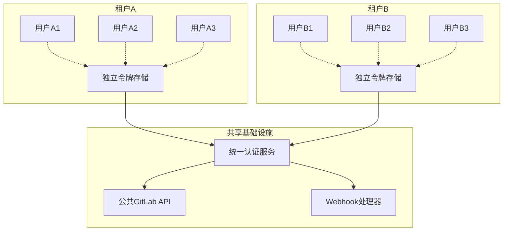
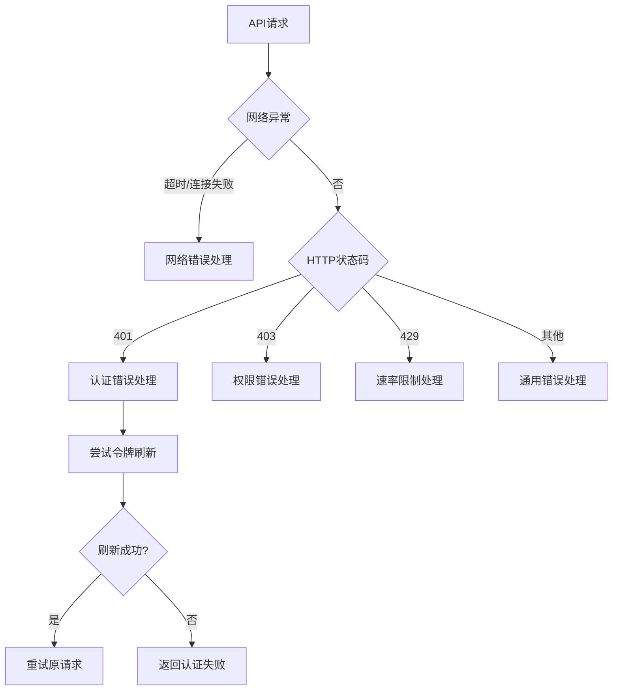

# 认证机制

<cite>
**本文档中引用的文件**
- [gitlab_service.py](file://enterprise/integrations/gitlab/gitlab_service.py)
- [gitlab_manager.py](file://enterprise/integrations/gitlab/gitlab_manager.py)
- [gitlab_view.py](file://enterprise/integrations/gitlab/gitlab_view.py)
- [token_manager.py](file://enterprise/server/auth/token_manager.py)
- [constants.py](file://enterprise/server/auth/constants.py)
- [auth_error.py](file://enterprise/server/auth/auth_error.py)
- [gitlab.py](file://enterprise/server/routes/integration/gitlab.py)
- [install_gitlab_webhooks.py](file://enterprise/sync/install_gitlab_webhooks.py)
- [gitlab_service.py](file://openhands/integrations/gitlab/gitlab_service.py)
</cite>

## 目录
1. [概述](#概述)
2. [系统架构](#系统架构)
3. [OAuth2认证流程](#oauth2认证流程)
4. [Token管理机制](#token管理机制)
5. [会话管理](#会话管理)
6. [SSL配置与域名设置](#ssl配置与域名设置)
7. [权限范围与访问控制](#权限范围与访问控制)
8. [企业版与开源版差异](#企业版与开源版差异)
9. [多租户认证隔离](#多租户认证隔离)
10. [错误处理与安全加固](#错误处理与安全加固)
11. [最佳实践建议](#最佳实践建议)

## 概述

OpenHands的GitLab认证机制是一个完整的身份验证和授权系统，支持OAuth2流程、API令牌管理、会话控制和多租户隔离。该系统主要分为两个版本：开源版（OSS）和企业版（SAAS），每个版本都有不同的认证策略和功能特性。

### 核心特性

- **OAuth2完整流程**：支持标准的OAuth2授权码流程
- **多Token管理**：支持访问令牌、刷新令牌和离线令牌
- **会话隔离**：为不同用户提供独立的认证上下文
- **Webhook集成**：自动安装和管理GitLab Webhook
- **权限验证**：细粒度的资源访问控制
- **安全加密**：使用AES-256加密存储敏感信息

## 系统架构



**图表来源**
- [gitlab_manager.py](file://enterprise/integrations/gitlab/gitlab_manager.py#L31-L40)
- [token_manager.py](file://enterprise/server/auth/token_manager.py#L78-L88)
- [gitlab_service.py](file://enterprise/integrations/gitlab/gitlab_service.py#L21-L46)

## OAuth2认证流程

### 完整OAuth2流程



**图表来源**
- [token_manager.py](file://enterprise/server/auth/token_manager.py#L89-L109)
- [gitlab_manager.py](file://enterprise/integrations/gitlab/gitlab_manager.py#L74-L85)

### 认证初始化过程

认证系统的初始化通过以下步骤完成：

1. **TokenManager初始化**：负责管理所有身份提供商的令牌
2. **外部认证标识**：支持外部认证系统（如Keycloak）的集成
3. **令牌获取策略**：优先级从高到低：外部认证令牌 > 外部认证ID > 用户ID

**章节来源**
- [gitlab_service.py](file://enterprise/integrations/gitlab/gitlab_service.py#L47-L81)

## Token管理机制

### Token刷新机制



**图表来源**
- [token_manager.py](file://enterprise/server/auth/token_manager.py#L331-L342)
- [gitlab_service.py](file://enterprise/integrations/gitlab/gitlab_service.py#L47-L81)

### 令牌类型与生命周期

| 令牌类型 | 生命周期 | 用途 | 刷新策略 |
|---------|---------|------|---------|
| 访问令牌 | 1小时 | API调用认证 | 自动刷新 |
| 刷新令牌 | 30天 | 获取新的访问令牌 | 手动刷新 |
| 离线令牌 | 永久 | 用户身份验证 | 不可刷新 |
| Webhook密钥 | 会话期 | Webhook签名验证 | 每次安装生成 |

**章节来源**
- [token_manager.py](file://enterprise/server/auth/token_manager.py#L324-L330)

### 加密存储机制

系统使用AES-256对称加密保护敏感令牌信息：

- **加密密钥**：基于JWT密钥生成的32字节密钥
- **加密算法**：Fernet对称加密
- **存储格式**：Base64编码的加密字符串
- **安全性**：内存中不保留明文令牌

**章节来源**
- [token_manager.py](file://enterprise/server/auth/token_manager.py#L47-L75)

## 会话管理

### 会话生命周期



**图表来源**
- [gitlab_manager.py](file://enterprise/integrations/gitlab/gitlab_manager.py#L167-L262)

### 会话隔离策略

每个用户的GitLab会话都具有完全的隔离性：

- **独立令牌存储**：每个用户有独立的令牌存储空间
- **资源访问限制**：只能访问授权的仓库和组
- **Webhook隔离**：每个用户的Webhook配置独立
- **权限边界**：严格遵循GitLab的访问级别控制

**章节来源**
- [gitlab_manager.py](file://enterprise/integrations/gitlab/gitlab_manager.py#L31-L40)

## SSL配置与域名设置

### 自托管GitLab支持

系统支持连接到自托管的GitLab实例：

```python
# 基础域名配置示例
base_domain = "gitlab.company.com"  # HTTPS协议自动添加
base_domain = "https://gitlab.company.com"  # 明确指定协议
```

### SSL证书验证

- **默认启用**：生产环境中强制SSL验证
- **自签名证书**：开发环境可配置跳过验证
- **证书链验证**：确保完整的证书信任链

**章节来源**
- [gitlab_service.py](file://openhands/integrations/gitlab/gitlab_service.py#L62-L71)

### 域名配置表

| 配置项 | 描述 | 默认值 | 示例 |
|-------|------|--------|------|
| BASE_URL | GitLab API基础URL | https://gitlab.com/api/v4 | https://gitlab.company.com/api/v4 |
| GRAPHQL_URL | GraphQL API地址 | https://gitlab.com/api/graphql | https://gitlab.company.com/api/graphql |
| WEBHOOK_URL | Webhook回调地址 | 自动生成 | https://app.all-hands.dev/api/integration/gitlab/events |

**章节来源**
- [gitlab_service.py](file://openhands/integrations/gitlab/gitlab_service.py#L42-L43)

## 权限范围与访问控制

### GitLab权限级别

GitLab提供了多层次的访问控制：

| 权限级别 | 数值 | 描述 | 允许的操作 |
|---------|------|------|-----------|
| Guest | 10 | 访客 | 查看公开项目 |
| Reporter | 20 | 报告者 | 查看、评论 |
| Developer | 30 | 开发者 | 查看、提交、合并请求 |
| Maintainer | 40 | 维护者 | 包含所有开发者权限+管理 |
| Owner | 50 | 所有者 | 完全控制权限 |

### Webhook权限范围

系统支持多种Webhook事件类型的权限配置：

```python
# 支持的权限范围
SCOPES = [
    'push_events',           # 推送事件
    'issues_events',         # 问题事件  
    'merge_requests_events', # 合并请求事件
    'note_events',           # 评论事件
    'confidential_issues_events', # 机密问题事件
    'confidential_notes_events'   # 机密评论事件
]
```

**章节来源**
- [gitlab_service.py](file://enterprise/integrations/gitlab/gitlab_service.py#L443-L445)

### 访问控制检查



**图表来源**
- [gitlab_service.py](file://enterprise/integrations/gitlab/gitlab_service.py#L343-L403)

**章节来源**
- [gitlab_service.py](file://enterprise/integrations/gitlab/gitlab_service.py#L382-L403)

## 企业版与开源版差异

### 功能对比矩阵

| 功能特性 | 开源版(OSS) | 企业版(SAAS) |
|---------|------------|-------------|
| OAuth2认证 | 基础支持 | 完整OAuth2流程 |
| 多租户隔离 | 有限支持 | 完全隔离 |
| Webhook管理 | 手动配置 | 自动化管理 |
| 令牌刷新 | 手动刷新 | 自动刷新 |
| 企业SSO | 不支持 | Keycloak集成 |
| 访问日志 | 基础记录 | 完整审计 |
| 权限控制 | 基础权限 | 细粒度控制 |

### 架构差异



**图表来源**
- [gitlab_service.py](file://enterprise/integrations/gitlab/gitlab_service.py#L21-L46)
- [gitlab_service.py](file://openhands/integrations/gitlab/gitlab_service.py#L20-L83)

**章节来源**
- [gitlab_service.py](file://enterprise/integrations/gitlab/gitlab_service.py#L21-L46)
- [gitlab_service.py](file://openhands/integrations/gitlab/gitlab_service.py#L20-L83)

## 多租户认证隔离

### 租户隔离机制



**图表来源**
- [token_manager.py](file://enterprise/server/auth/token_manager.py#L78-L88)
- [gitlab_manager.py](file://enterprise/integrations/gitlab/gitlab_manager.py#L31-L40)

### 数据隔离策略

1. **令牌隔离**：每个租户的令牌存储完全隔离
2. **Webhook隔离**：Webhook配置按租户分离
3. **会话隔离**：用户会话不跨租户共享
4. **审计隔离**：操作日志按租户分类

**章节来源**
- [token_manager.py](file://enterprise/server/auth/token_manager.py#L78-L88)

## 错误处理与安全加固

### 异常处理层次



**图表来源**
- [auth_error.py](file://enterprise/server/auth/auth_error.py#L1-L40)
- [gitlab.py](file://enterprise/server/routes/integration/gitlab.py#L21-L33)

### 安全错误类型

| 错误类型 | 异常类 | 处理策略 | 用户体验 |
|---------|--------|---------|---------|
| 认证失败 | NoCredentialsError | 重新登录 | 显示登录提示 |
| 令牌过期 | ExpiredError | 自动刷新 | 无缝续期 |
| 权限不足 | BearerTokenError | 记录日志 | 显示权限提示 |
| 网络异常 | CookieError | 重试机制 | 显示网络错误 |

**章节来源**
- [auth_error.py](file://enterprise/server/auth/auth_error.py#L1-L40)

### 安全加固措施

1. **输入验证**：严格验证所有外部输入
2. **输出编码**：防止XSS攻击
3. **CSRF防护**：使用CSRF令牌
4. **HTTPS强制**：所有通信必须使用HTTPS
5. **日志脱敏**：敏感信息不记录在日志中

**章节来源**
- [gitlab.py](file://enterprise/server/routes/integration/gitlab.py#L21-L33)

## 最佳实践建议

### 部署配置建议

1. **SSL证书配置**
   - 使用有效的SSL证书
   - 配置HSTS头
   - 定期更新证书

2. **域名设置**
   - 使用子域名隔离
   - 配置CNAME记录
   - 设置适当的DNS TTL

3. **防火墙规则**
   - 限制GitLab API访问
   - 配置Webhook回调白名单
   - 监控异常流量

### 运维监控建议

1. **令牌健康检查**
   - 定期检查令牌有效性
   - 监控刷新成功率
   - 设置令牌过期预警

2. **API使用监控**
   - 监控GitLab API调用频率
   - 跟踪错误率变化
   - 分析性能瓶颈

3. **安全事件监控**
   - 监控认证失败次数
   - 检测异常登录行为
   - 跟踪权限变更

### 开发调试建议

1. **本地开发环境**
   - 使用HTTPS开发服务器
   - 配置正确的回调URL
   - 使用测试令牌进行调试

2. **错误诊断**
   - 启用详细日志记录
   - 使用调试工具跟踪请求
   - 模拟各种错误场景

3. **性能优化**
   - 实施令牌缓存机制
   - 优化API调用频率
   - 使用异步处理减少阻塞

**章节来源**
- [constants.py](file://enterprise/server/auth/constants.py#L1-L33)
- [token_manager.py](file://enterprise/server/auth/token_manager.py#L331-L342)