# Jira Cloud集成

<cite>
**本文档中引用的文件**
- [jira_manager.py](file://enterprise/integrations/jira/jira_manager.py)
- [jira_types.py](file://enterprise/integrations/jira/jira_types.py)
- [jira_view.py](file://enterprise/integrations/jira/jira_view.py)
- [jira_callback_processor.py](file://enterprise/server/conversation_callback_processor/jira_callback_processor.py)
- [jira_integration_store.py](file://enterprise/storage/jira_integration_store.py)
- [jira.py](file://enterprise/server/routes/integration/jira.py)
</cite>

## 目录
1. [简介](#简介)
2. [项目结构](#项目结构)
3. [核心组件](#核心组件)
4. [架构概览](#架构概览)
5. [详细组件分析](#详细组件分析)
6. [OAuth 2.0认证流程](#oauth-20认证流程)
7. [API调用模式](#api调用模式)
8. [数据模型映射](#数据模型映射)
9. [视图函数调用流程](#视图函数调用流程)
10. [错误处理与重试机制](#错误处理与重试机制)
11. [故障排除指南](#故障排除指南)
12. [结论](#结论)

## 简介

OpenHands Jira Cloud集成为用户提供了无缝的Jira问题管理体验，通过OAuth 2.0认证实现安全连接，并支持工单创建、状态更新和评论同步等功能。该集成系统采用事件驱动架构，能够处理Jira Webhook事件并自动触发相应的对话流程。

## 项目结构

Jira集成模块位于`enterprise/integrations/jira/`目录下，包含以下核心文件：

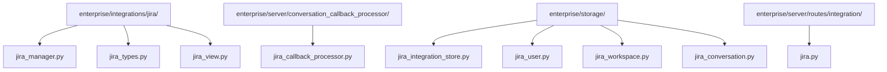

**图表来源**
- [jira_manager.py](file://enterprise/integrations/jira/jira_manager.py#L1-L50)
- [jira_types.py](file://enterprise/integrations/jira/jira_types.py#L1-L41)
- [jira_view.py](file://enterprise/integrations/jira/jira_view.py#L1-L225)

## 核心组件

### JiraManager类
负责处理所有Jira相关的业务逻辑，包括认证、Webhook验证、消息处理和API调用。

### JiraViewInterface接口
定义了Jira视图的基本契约，支持新建和现有对话的不同处理方式。

### JiraCallbackProcessor类
处理对话回调事件，自动发送总结到Jira问题。

### JiraIntegrationStore类
管理Jira工作空间、用户和对话的持久化存储。

**章节来源**
- [jira_manager.py](file://enterprise/integrations/jira/jira_manager.py#L40-L505)
- [jira_types.py](file://enterprise/integrations/jira/jira_types.py#L11-L41)
- [jira_view.py](file://enterprise/integrations/jira/jira_view.py#L1-L225)

## 架构概览

Jira Cloud集成采用分层架构设计，确保系统的可扩展性和维护性：

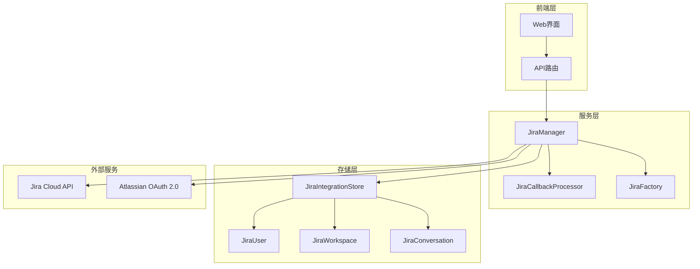

**图表来源**
- [jira_manager.py](file://enterprise/integrations/jira/jira_manager.py#L40-L80)
- [jira_callback_processor.py](file://enterprise/server/conversation_callback_processor/jira_callback_processor.py#L28-L50)

## 详细组件分析

### JiraManager详细分析

JiraManager是整个Jira集成的核心控制器，负责协调各个组件的工作。

#### 主要功能模块

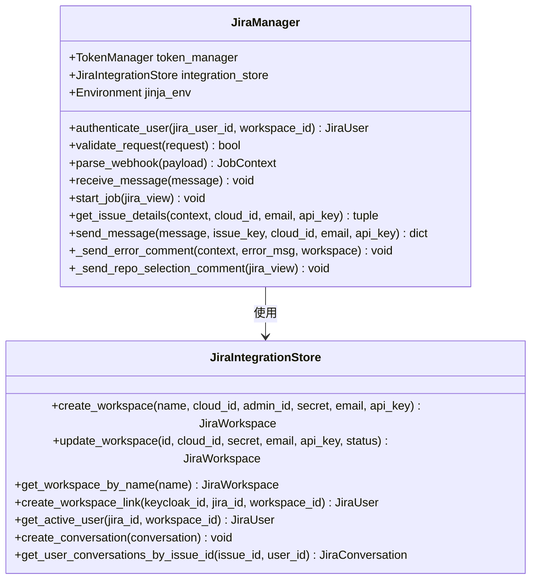

**图表来源**
- [jira_manager.py](file://enterprise/integrations/jira/jira_manager.py#L40-L100)
- [jira_integration_store.py](file://enterprise/storage/jira_integration_store.py#L14-L50)

#### 认证流程实现

JiraManager实现了完整的OAuth 2.0认证流程：

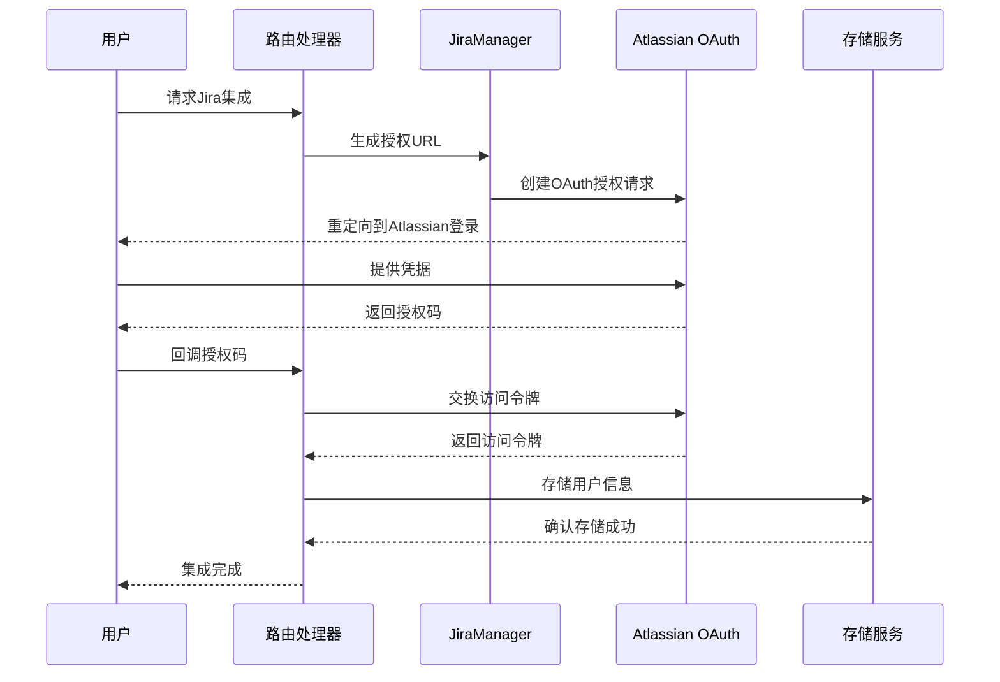

**图表来源**
- [jira.py](file://enterprise/server/routes/integration/jira.py#L376-L408)
- [jira_manager.py](file://enterprise/integrations/jira/jira_manager.py#L48-L67)

**章节来源**
- [jira_manager.py](file://enterprise/integrations/jira/jira_manager.py#L40-L505)
- [jira_integration_store.py](file://enterprise/storage/jira_integration_store.py#L1-L251)

### JiraViewInterface详细分析

JiraViewInterface定义了Jira交互的统一接口，支持两种不同的对话模式：

#### 视图类型对比

| 特性 | 新建对话视图 | 现有对话视图 |
|------|-------------|-------------|
| 初始化指令 | 从模板加载 | 空字符串 |
| 用户消息模板 | 新建对话模板 | 现有对话模板 |
| 仓库选择 | 必需 | 可选 |
| 对话创建 | 创建新对话 | 更新现有对话 |
| 响应消息 | 启动跟踪链接 | 继续跟踪链接 |

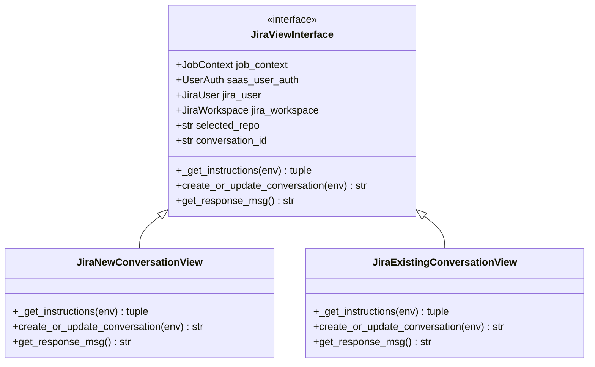

**图表来源**
- [jira_types.py](file://enterprise/integrations/jira/jira_types.py#L11-L41)
- [jira_view.py](file://enterprise/integrations/jira/jira_view.py#L27-L183)

**章节来源**
- [jira_types.py](file://enterprise/integrations/jira/jira_types.py#L1-L41)
- [jira_view.py](file://enterprise/integrations/jira/jira_view.py#L1-L225)

## OAuth 2.0认证流程

### 授权流程详解

Jira集成使用Atlassian的OAuth 2.0实现安全认证：

#### 授权端点配置

| 参数 | 值 | 描述 |
|------|-----|------|
| 客户端ID | JIRA_CLIENT_ID | Atlassian应用客户端标识 |
| 客户端密钥 | JIRA_CLIENT_SECRET | Atlassian应用客户端密钥 |
| 重定向URI | JIRA_REDIRECT_URI | 回调地址 |
| 作用域 | read:me read:jira-user read:jira-work | 请求的权限范围 |
| 授权URL | JIRA_AUTH_URL | Atlassian授权服务器地址 |

#### 令牌交换流程

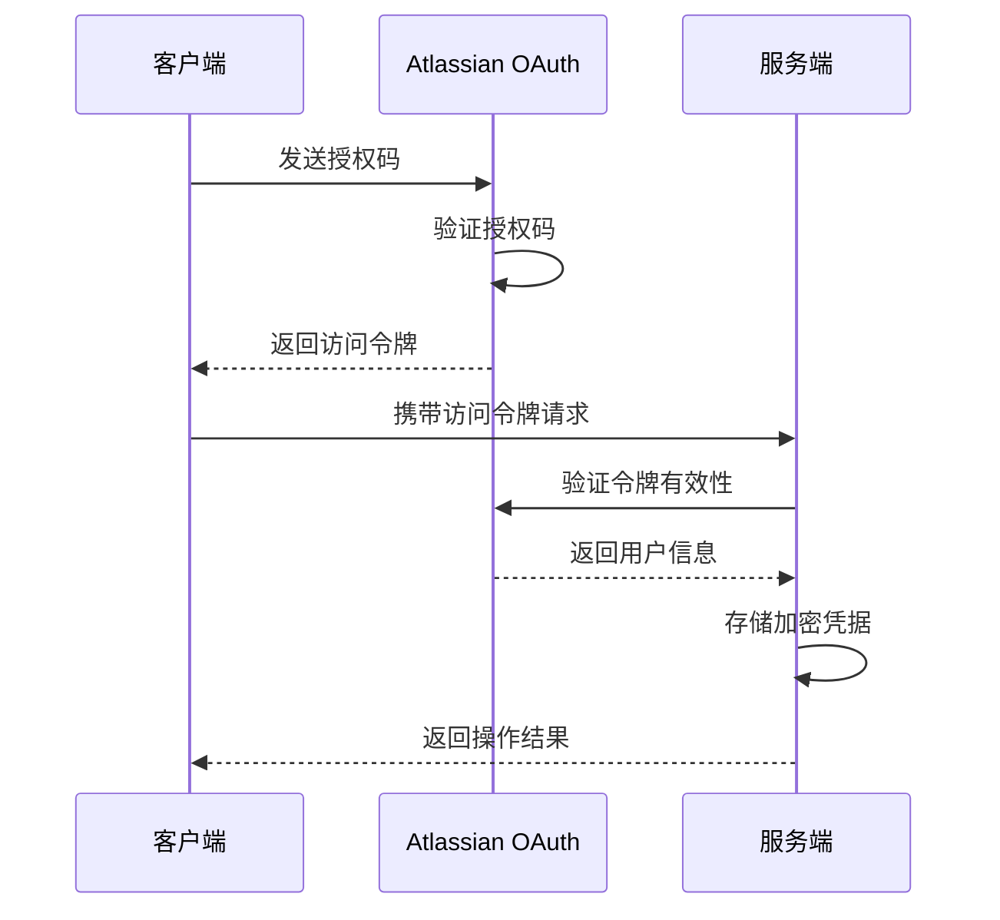

**图表来源**
- [jira.py](file://enterprise/server/routes/integration/jira.py#L394-L408)

**章节来源**
- [jira.py](file://enterprise/server/routes/integration/jira.py#L1-L200)

## API调用模式

### 工单创建和状态更新

JiraManager提供了标准化的API调用方法：

#### Issue详情获取

| 方法 | URL格式 | 参数 | 响应格式 |
|------|---------|------|----------|
| 获取Issue详情 | `{JIRA_CLOUD_API_URL}/{cloud_id}/rest/api/2/issue/{issue_key}` | 认证头 | JSON对象 |

#### 评论发送

| 方法 | URL格式 | 请求体 | 响应格式 |
|------|---------|--------|----------|
| 添加评论 | `{JIRA_CLOUD_API_URL}/{cloud_id}/rest/api/2/issue/{issue_key}/comment` | `{'body': message}` | 评论对象 |

### 错误处理策略

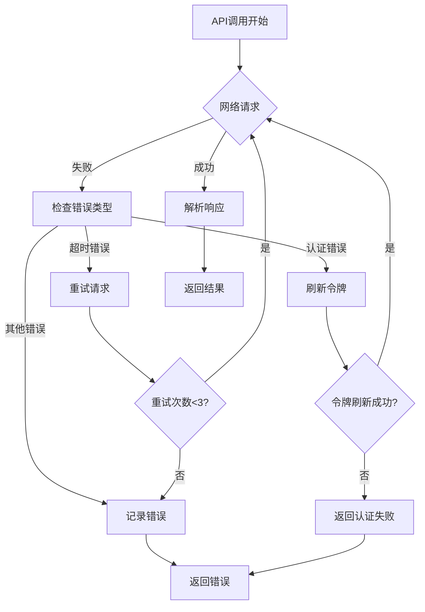

**图表来源**
- [jira_manager.py](file://enterprise/integrations/jira/jira_manager.py#L404-L452)

**章节来源**
- [jira_manager.py](file://enterprise/integrations/jira/jira_manager.py#L404-L505)

## 数据模型映射

### Jira Types数据模型

Jira集成使用强类型数据模型确保数据一致性：

#### 核心数据模型

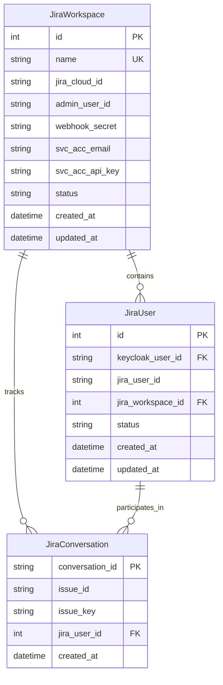

**图表来源**
- [jira_integration_store.py](file://enterprise/storage/jira_integration_store.py#L14-L251)

### REST API映射关系

| Jira字段 | 映射字段 | 类型 | 描述 |
|----------|----------|------|------|
| issue.id | issue_id | string | Jira问题内部ID |
| issue.key | issue_key | string | Jira问题键值 |
| issue.fields.summary | issue_title | string | 问题标题 |
| issue.fields.description | issue_description | string | 问题描述 |
| comment.body | user_msg | string | 用户评论内容 |
| user.accountId | platform_user_id | string | 平台用户ID |
| user.emailAddress | user_email | string | 用户邮箱 |
| user.displayName | display_name | string | 用户显示名称 |

**章节来源**
- [jira_types.py](file://enterprise/integrations/jira/jira_types.py#L1-L41)
- [jira_integration_store.py](file://enterprise/storage/jira_integration_store.py#L1-L251)

## 视图函数调用流程

### Webhook事件处理流程

Jira集成通过Webhook接收Jira事件并触发相应的处理流程：

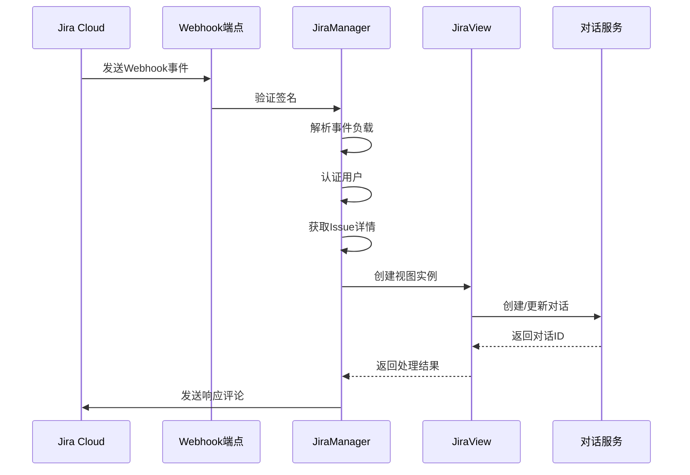

**图表来源**
- [jira_manager.py](file://enterprise/integrations/jira/jira_manager.py#L208-L399)
- [jira.py](file://enterprise/server/routes/integration/jira.py#L215-L254)

### 权限验证逻辑

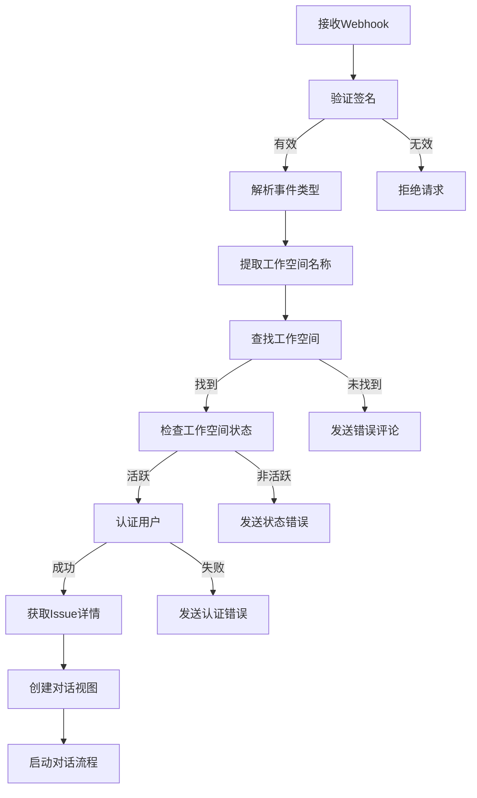

**图表来源**
- [jira_manager.py](file://enterprise/integrations/jira/jira_manager.py#L218-L298)

**章节来源**
- [jira_manager.py](file://enterprise/integrations/jira/jira_manager.py#L208-L399)
- [jira_view.py](file://enterprise/integrations/jira/jira_view.py#L185-L225)

## 错误处理与重试机制

### Webhook验证错误处理

JiraManager实现了多层次的错误处理机制：

#### 签名验证流程

| 验证步骤 | 失败处理 | 错误日志级别 |
|----------|----------|--------------|
| 签名存在性检查 | 记录警告并拒绝 | WARNING |
| 签名计算比较 | 记录错误并拒绝 | ERROR |
| 工作空间识别 | 记录警告并拒绝 | WARNING |
| 工作空间状态检查 | 记录警告并拒绝 | WARNING |

#### 异常处理策略

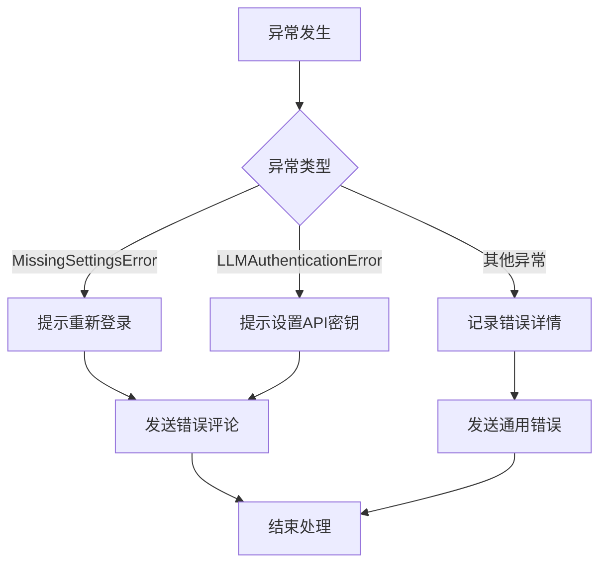

**图表来源**
- [jira_manager.py](file://enterprise/integrations/jira/jira_manager.py#L375-L388)

### 重试机制实现

#### Webhook重复请求防护

系统使用Redis缓存防止重复处理相同的Webhook事件：

| 缓存键格式 | 过期时间 | 用途 |
|------------|----------|------|
| `jira:{signature}` | 300秒 | 防止重复处理 |
| `jira:{issue_id}:{timestamp}` | 60秒 | 防止快速重复 |

**章节来源**
- [jira_manager.py](file://enterprise/integrations/jira/jira_manager.py#L103-L132)
- [jira.py](file://enterprise/server/routes/integration/jira.py#L238-L247)

## 故障排除指南

### 常见问题及解决方案

#### 认证问题

| 问题症状 | 可能原因 | 解决方案 |
|----------|----------|----------|
| OAuth授权失败 | 客户端ID或密钥错误 | 检查Atlassian应用配置 |
| 令牌刷新失败 | 网络连接问题 | 检查防火墙设置 |
| 用户认证失败 | 用户未激活 | 检查用户状态 |

#### Webhook问题

| 问题症状 | 可能原因 | 解决方案 |
|----------|----------|----------|
| Webhook被拒绝 | 签名验证失败 | 检查Webhook密钥 |
| 事件处理超时 | 网络延迟 | 增加超时时间 |
| 重复处理事件 | Redis缓存问题 | 清理过期缓存 |

#### API调用问题

| 问题症状 | 可能原因 | 解决方案 |
|----------|----------|----------|
| API调用失败 | 认证凭据过期 | 刷新访问令牌 |
| 响应格式错误 | API版本不匹配 | 检查API版本号 |
| 速率限制 | 请求频率过高 | 实现指数退避 |

**章节来源**
- [jira_manager.py](file://enterprise/integrations/jira/jira_manager.py#L454-L505)
- [jira_callback_processor.py](file://enterprise/server/conversation_callback_processor/jira_callback_processor.py#L149-L155)

## 结论

OpenHands Jira Cloud集成为企业级协作提供了强大的自动化能力。通过OAuth 2.0认证确保安全性，通过事件驱动架构实现高效的消息处理，通过强类型数据模型保证数据一致性。该集成系统具有良好的可扩展性和维护性，为开发者提供了清晰的API接口和完善的错误处理机制。

主要优势包括：
- **安全性**：基于OAuth 2.0的认证流程
- **可靠性**：完善的错误处理和重试机制
- **可扩展性**：模块化的架构设计
- **易用性**：直观的API接口和清晰的文档

未来改进方向：
- 支持更多的Jira事件类型
- 实现更智能的仓库推荐算法
- 增强对话上下文理解能力
- 优化性能和资源利用率