# Jira DC集成

<cite>
**本文档引用的文件**
- [jira_dc_manager.py](file://enterprise/integrations/jira_dc/jira_dc_manager.py)
- [jira_dc_types.py](file://enterprise/integrations/jira_dc/jira_dc_types.py)
- [jira_dc_view.py](file://enterprise/integrations/jira_dc/jira_dc_view.py)
- [jira_dc_integration_store.py](file://enterprise/storage/jira_dc_integration_store.py)
- [jira_dc_workspace.py](file://enterprise/storage/jira_dc_workspace.py)
- [jira_dc_user.py](file://enterprise/storage/jira_dc_user.py)
- [jira_dc_conversation.py](file://enterprise/storage/jira_dc_conversation.py)
- [jira_dc.py](file://enterprise/server/routes/integration/jira_dc.py)
- [http_session.py](file://openhands/utils/http_session.py)
</cite>

## 目录
1. [简介](#简介)
2. [项目结构](#项目结构)
3. [核心组件](#核心组件)
4. [架构概览](#架构概览)
5. [详细组件分析](#详细组件分析)
6. [认证机制](#认证机制)
7. [数据模型](#数据模型)
8. [REST端点实现](#rest端点实现)
9. [网络配置与SSL处理](#网络配置与ssl处理)
10. [性能优化策略](#性能优化策略)
11. [故障排除指南](#故障排除指南)
12. [结论](#结论)

## 简介

Jira Data Center (DC) 集成是OpenHands平台为本地部署的Atlassian Jira Data Center环境提供的企业级集成功能。该集成支持基于OAuth 2.0的用户认证、个人访问令牌(PAT)的身份验证，以及通过Webhook进行实时事件触发。

与云端版本相比，Jira DC集成在以下方面具有显著差异：
- **认证方式**：支持OAuth 2.0和PAT两种认证模式
- **网络架构**：需要处理本地网络环境和防火墙配置
- **SSL证书**：需要正确配置本地SSL证书信任链
- **连接池管理**：需要更精细的连接池配置以支持大规模实例

## 项目结构

Jira DC集成采用模块化架构，主要包含以下核心模块：

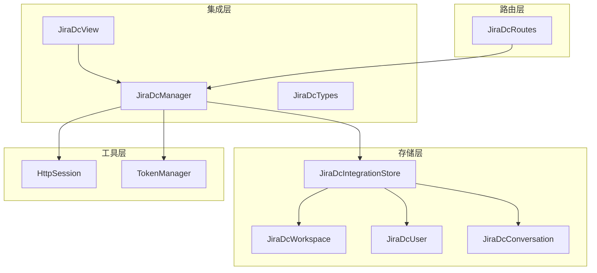

**图表来源**
- [jira_dc_manager.py](file://enterprise/integrations/jira_dc/jira_dc_manager.py#L40-L47)
- [jira_dc_integration_store.py](file://enterprise/storage/jira_dc_integration_store.py#L14-L263)

## 核心组件

### JiraDcManager - 主要管理器

JiraDcManager是整个集成系统的核心控制器，负责：
- 用户身份验证和授权
- Webhook请求验证
- 问题详情获取
- 会话管理和对话创建

### JiraDcView - 视图抽象层

提供了统一的视图接口，支持两种对话类型：
- **新对话视图**：创建新的Jira问题对话
- **现有对话视图**：继续已有的问题对话

### 数据存储层

包含四个核心数据模型：
- 工作空间配置
- 用户映射关系
- 对话记录
- 集成状态管理

**章节来源**
- [jira_dc_manager.py](file://enterprise/integrations/jira_dc/jira_dc_manager.py#L40-L510)
- [jira_dc_view.py](file://enterprise/integrations/jira_dc/jira_dc_view.py#L30-L226)

## 架构概览

Jira DC集成采用分层架构设计，确保了良好的可扩展性和维护性：

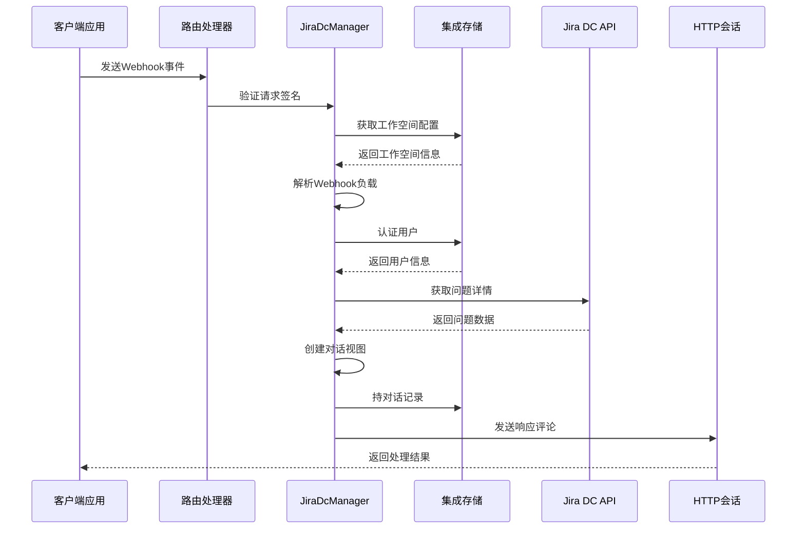

**图表来源**
- [jira_dc_manager.py](file://enterprise/integrations/jira_dc/jira_dc_manager.py#L223-L310)
- [jira_dc.py](file://enterprise/server/routes/integration/jira_dc.py#L224-L270)

## 详细组件分析

### JiraDcManager详细分析

#### 认证流程

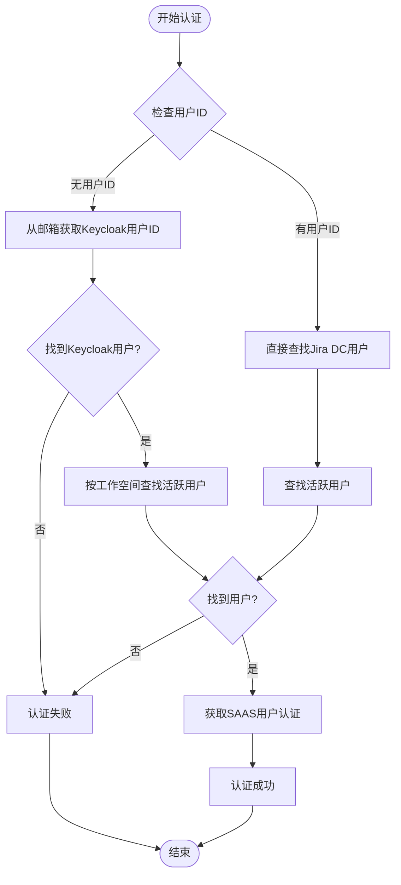

**图表来源**
- [jira_dc_manager.py](file://enterprise/integrations/jira_dc/jira_dc_manager.py#L48-L82)

#### Webhook验证机制

Webhook验证采用HMAC-SHA256签名算法，确保请求来源的合法性：

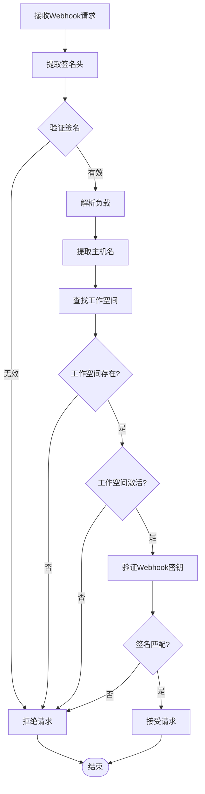

**图表来源**
- [jira_dc_manager.py](file://enterprise/integrations/jira_dc/jira_dc_manager.py#L101-L147)

**章节来源**
- [jira_dc_manager.py](file://enterprise/integrations/jira_dc/jira_dc_manager.py#L48-L147)

### JiraDcView详细分析

#### 视图工厂模式

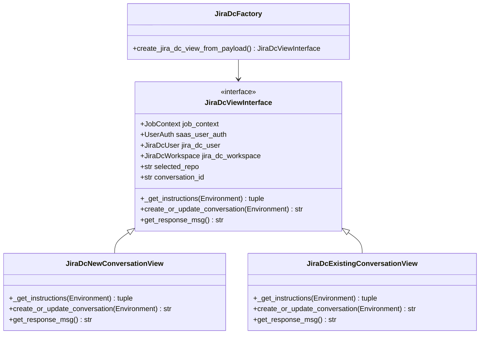

**图表来源**
- [jira_dc_types.py](file://enterprise/integrations/jira_dc/jira_dc_types.py#L11-L41)
- [jira_dc_view.py](file://enterprise/integrations/jira_dc/jira_dc_view.py#L30-L226)

**章节来源**
- [jira_dc_view.py](file://enterprise/integrations/jira_dc/jira_dc_view.py#L30-L226)

## 认证机制

### 基本认证 vs PAT认证

Jira DC集成支持两种主要的认证方式：

#### OAuth 2.0认证流程

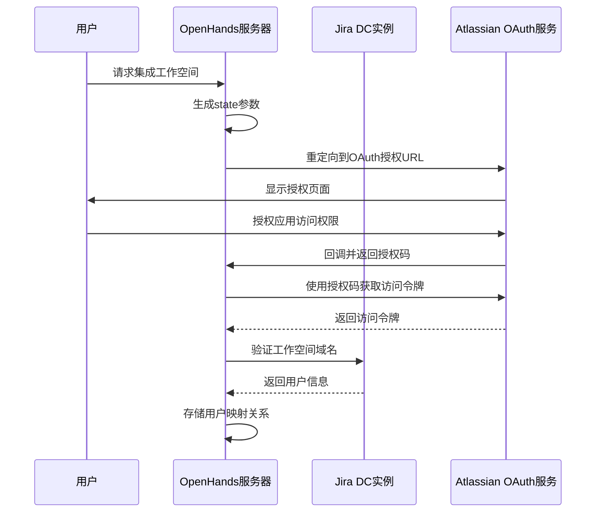

**图表来源**
- [jira_dc.py](file://enterprise/server/routes/integration/jira_dc.py#L471-L582)

#### PAT（个人访问令牌）认证

对于不需要OAuth流程的场景，支持直接使用PAT进行认证：

| 认证方式 | 优势 | 劣势 | 适用场景 |
|---------|------|------|----------|
| OAuth 2.0 | 更安全，支持自动刷新令牌 | 配置复杂，需要额外的OAuth服务 | 生产环境，安全性要求高 |
| PAT | 配置简单，立即可用 | 令牌泄露风险，需要手动更新 | 开发测试，临时集成 |

**章节来源**
- [jira_dc.py](file://enterprise/server/routes/integration/jira_dc.py#L328-L386)
- [jira_dc.py](file://enterprise/server/routes/integration/jira_dc.py#L471-L582)

## 数据模型

### Jira DC特有字段的数据模型

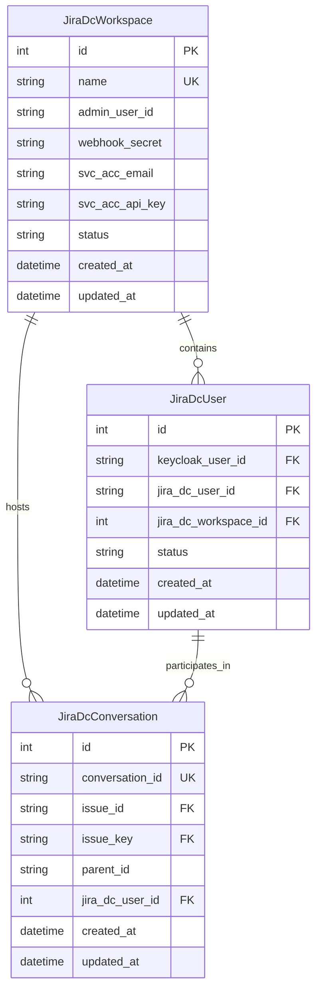

**图表来源**
- [jira_dc_workspace.py](file://enterprise/storage/jira_dc_workspace.py#L5-L25)
- [jira_dc_user.py](file://enterprise/storage/jira_dc_user.py#L5-L23)
- [jira_dc_conversation.py](file://enterprise/storage/jira_dc_conversation.py#L5-L24)

### 关键字段说明

| 字段名 | 类型 | 描述 | 约束 |
|--------|------|------|------|
| webhook_secret | string | Webhook签名验证密钥 | 必填，加密存储 |
| svc_acc_email | string | 服务账户邮箱地址 | 必填，格式验证 |
| svc_acc_api_key | string | 服务账户API密钥或PAT | 必填，加密存储 |
| status | string | 工作空间状态(active/inactive) | 必填，默认active |

**章节来源**
- [jira_dc_workspace.py](file://enterprise/storage/jira_dc_workspace.py#L5-L25)
- [jira_dc_user.py](file://enterprise/storage/jira_dc_user.py#L5-L23)
- [jira_dc_conversation.py](file://enterprise/storage/jira_dc_conversation.py#L5-L24)

## REST端点实现

### 主要REST端点

#### 工作空间管理端点

| 端点 | 方法 | 功能 | 参数 |
|------|------|------|------|
| `/integration/jira-dc/workspaces` | POST | 创建或更新Jira DC工作空间 | JiraDcWorkspaceCreate模型 |
| `/integration/jira-dc/workspaces/link` | POST | 注册用户到Jira DC工作空间 | JiraDcLinkCreate模型 |
| `/integration/jira-dc/events` | POST | 处理Jira DC Webhook事件 | Webhook负载 |
| `/integration/jira-dc/callback` | GET | OAuth回调处理 | code, state参数 |

#### 端点实现细节

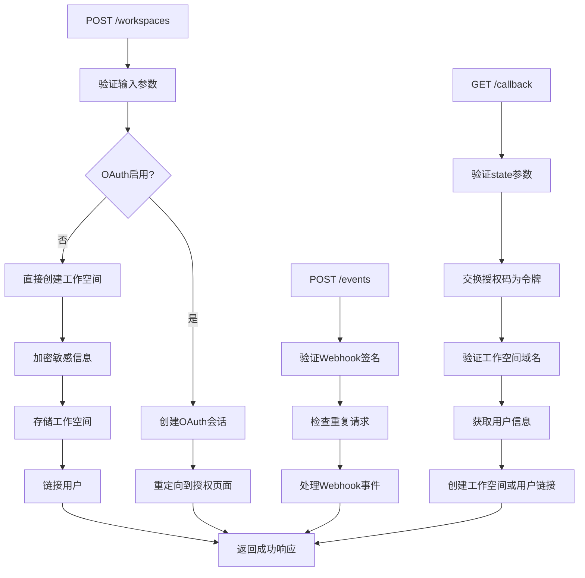

**图表来源**
- [jira_dc.py](file://enterprise/server/routes/integration/jira_dc.py#L224-L270)
- [jira_dc.py](file://enterprise/server/routes/integration/jira_dc.py#L273-L386)
- [jira_dc.py](file://enterprise/server/routes/integration/jira_dc.py#L471-L582)

**章节来源**
- [jira_dc.py](file://enterprise/server/routes/integration/jira_dc.py#L224-L733)

## 网络配置与SSL处理

### SSL证书处理

Jira DC集成在网络通信中采用了多层次的SSL证书处理机制：

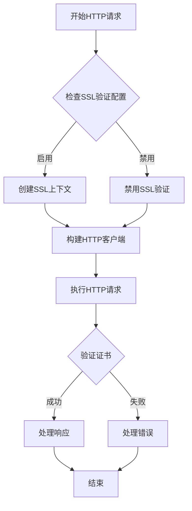

**图表来源**
- [http_session.py](file://openhands/utils/http_session.py#L15-L22)

### 网络配置参数

| 配置项 | 默认值 | 描述 | 影响范围 |
|--------|--------|------|----------|
| SSL验证 | 启用 | 是否验证SSL证书 | 所有HTTPS请求 |
| 连接超时 | 15秒 | HTTP请求超时时间 | 单个请求 |
| 连接池大小 | 动态 | HTTP连接池最大连接数 | 并发请求 |
| 重试次数 | 3次 | 请求失败重试次数 | 错误恢复 |

**章节来源**
- [http_session.py](file://openhands/utils/http_session.py#L15-L87)

## 性能优化策略

### 连接池配置

#### HTTP客户端优化

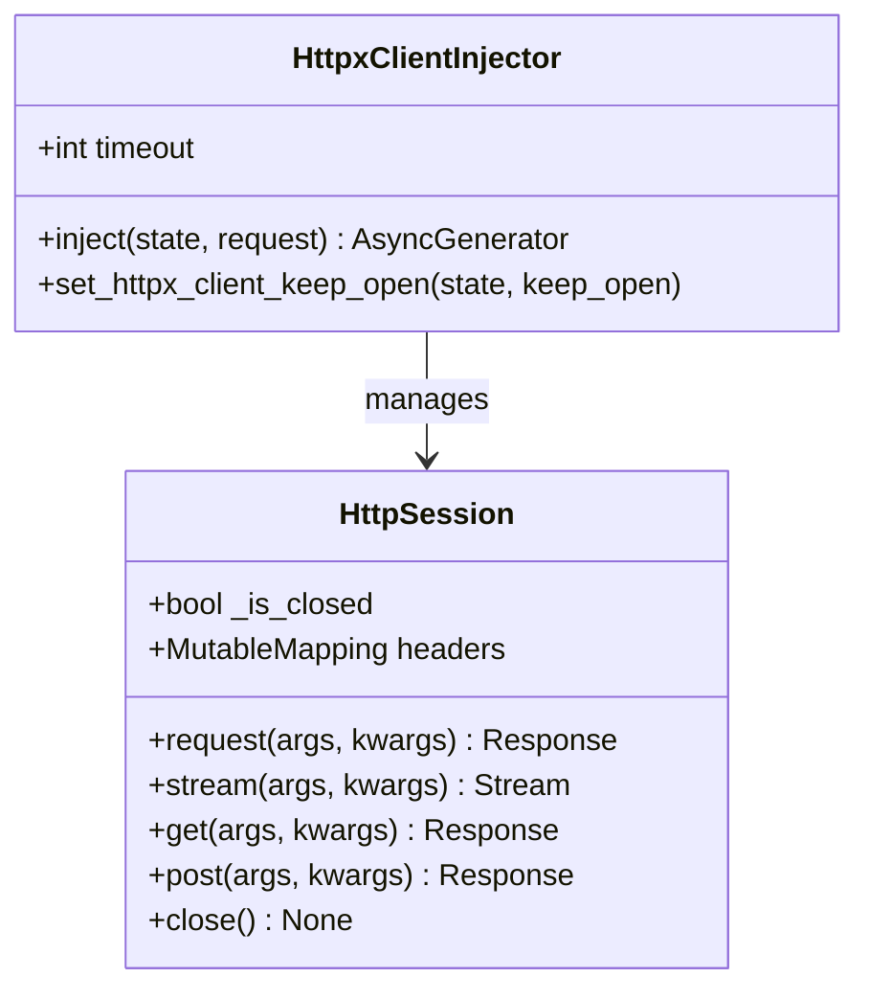

**图表来源**
- [http_session.py](file://openhands/utils/http_session.py#L34-L87)

### 超时设置策略

| 组件 | 超时配置 | 重试策略 | 缓存策略 |
|------|----------|----------|----------|
| Webhook验证 | 10秒 | 1次 | Redis缓存签名 |
| API请求 | 15秒 | 3次 | 会话级别缓存 |
| OAuth令牌获取 | 20秒 | 2次 | 内存缓存 |
| 问题详情获取 | 30秒 | 1次 | 数据库缓存 |

### 大规模实例优化

#### Redis去重机制

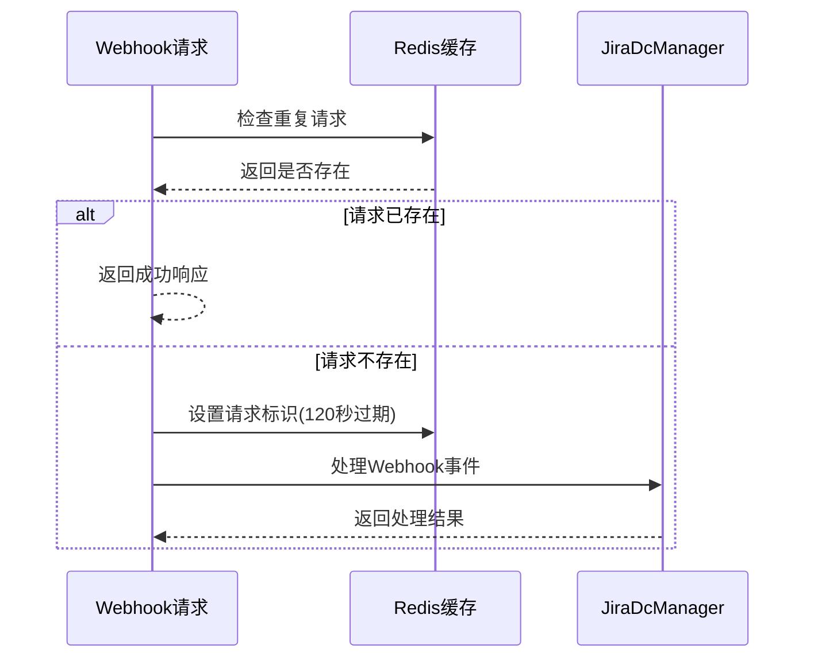

**图表来源**
- [jira_dc.py](file://enterprise/server/routes/integration/jira_dc.py#L246-L253)

**章节来源**
- [http_session.py](file://openhands/utils/http_session.py#L15-L87)
- [jira_dc.py](file://enterprise/server/routes/integration/jira_dc.py#L246-L253)

## 故障排除指南

### 常见问题及解决方案

#### 认证问题

| 问题症状 | 可能原因 | 解决方案 |
|----------|----------|----------|
| 用户认证失败 | Keycloak用户ID不匹配 | 检查邮箱映射关系 |
| OAuth回调失败 | state参数不匹配 | 清除浏览器缓存重新尝试 |
| PAT无效 | 密钥格式错误 | 验证PAT格式和权限范围 |

#### 网络连接问题

| 问题症状 | 可能原因 | 解决方案 |
|----------|----------|----------|
| SSL证书验证失败 | 证书链不完整 | 配置完整的CA证书链 |
| 连接超时 | 网络延迟过高 | 调整超时配置 |
| Webhook无法到达 | 防火墙阻止 | 配置防火墙规则 |

#### 性能问题

| 问题症状 | 可能原因 | 解决方案 |
|----------|----------|----------|
| Webhook处理缓慢 | 连接池耗尽 | 增加连接池大小 |
| 内存占用过高 | 缓存数据过多 | 调整缓存过期时间 |
| 并发处理能力不足 | 无连接池复用 | 启用HTTP连接池 |

**章节来源**
- [jira_dc_manager.py](file://enterprise/integrations/jira_dc/jira_dc_manager.py#L260-L310)
- [jira_dc.py](file://enterprise/server/routes/integration/jira_dc.py#L471-L582)

## 结论

Jira DC集成提供了企业级的本地Jira Data Center集成功能，通过模块化的架构设计实现了高度的可扩展性和可靠性。关键特性包括：

### 主要优势

1. **灵活的认证机制**：支持OAuth 2.0和PAT两种认证方式
2. **强大的Webhook处理**：实时事件驱动的交互模式
3. **完善的错误处理**：多层次的异常捕获和恢复机制
4. **高性能设计**：连接池优化和Redis去重机制

### 最佳实践建议

1. **生产环境部署**：优先使用OAuth 2.0认证以获得更高的安全性
2. **网络配置**：确保正确的SSL证书配置和防火墙规则
3. **监控告警**：建立完善的监控体系及时发现和处理问题
4. **定期维护**：定期检查和更新PAT令牌和配置信息

通过遵循本文档的指导原则和最佳实践，可以确保Jira DC集成的稳定运行和高效性能。