# Jira集成

<cite>
**本文档中引用的文件**
- [jira_manager.py](file://enterprise/integrations/jira/jira_manager.py)
- [jira_dc_manager.py](file://enterprise/integrations/jira_dc/jira_dc_manager.py)
- [jira_types.py](file://enterprise/integrations/jira/jira_types.py)
- [jira_dc_types.py](file://enterprise/integrations/jira_dc/jira_dc_types.py)
- [jira_view.py](file://enterprise/integrations/jira/jira_view.py)
- [jira_dc_view.py](file://enterprise/integrations/jira_dc/jira_dc_view.py)
- [jira_integration_store.py](file://enterprise/storage/jira_integration_store.py)
- [jira_dc_integration_store.py](file://enterprise/storage/jira_dc_integration_store.py)
- [jira.py](file://enterprise/server/routes/integration/jira.py)
- [jira_dc.py](file://enterprise/server/routes/integration/jira_dc.py)
- [constants.py](file://enterprise/server/auth/constants.py)
</cite>

## 目录
1. [简介](#简介)
2. [系统架构概览](#系统架构概览)
3. [Jira Cloud集成](#jira-cloud集成)
4. [Jira Data Center集成](#jira-data-center集成)
5. [核心组件分析](#核心组件分析)
6. [OAuth 2.0认证流程](#oauth-20认证流程)
7. [Webhook处理机制](#webhook处理机制)
8. [工单生命周期管理](#工单生命周期管理)
9. [错误处理与数据同步](#错误处理与数据同步)
10. [配置与部署指南](#配置与部署指南)
11. [故障排除](#故障排除)

## 简介

OpenHands提供了完整的Jira集成解决方案，支持两种Jira部署模式：Jira Cloud和Jira Data Center。该集成允许用户通过Jira平台触发AI驱动的问题解决流程，实现智能工单处理和自动化开发任务。

### 主要功能特性

- **双平台支持**：同时支持Jira Cloud和Jira Data Center
- **智能触发**：基于@openhands标签的智能工单触发
- **双向通信**：支持工单评论同步和状态更新
- **OAuth 2.0认证**：安全的用户身份验证机制
- **Webhook集成**：实时事件响应和状态同步
- **会话管理**：持久化的对话状态跟踪

## 系统架构概览

Jira集成为OpenHands提供了统一的接口层，通过抽象化处理不同Jira版本的差异。

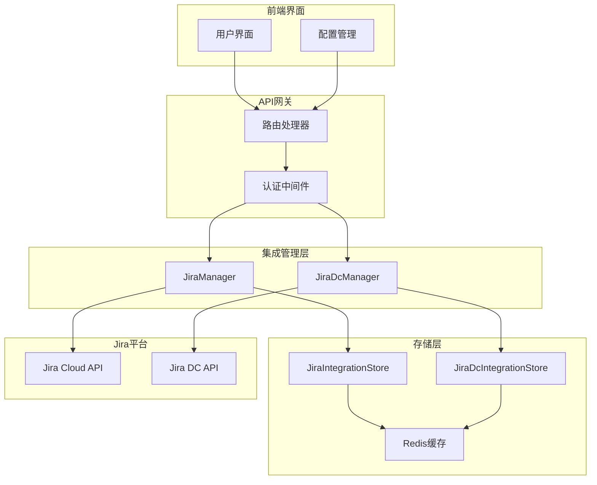

**图表来源**
- [jira_manager.py](file://enterprise/integrations/jira/jira_manager.py#L40-L47)
- [jira_dc_manager.py](file://enterprise/integrations/jira_dc/jira_dc_manager.py#L40-L47)

## Jira Cloud集成

### 架构特点

Jira Cloud集成使用Atlassian提供的标准REST API和OAuth 2.0认证流程。

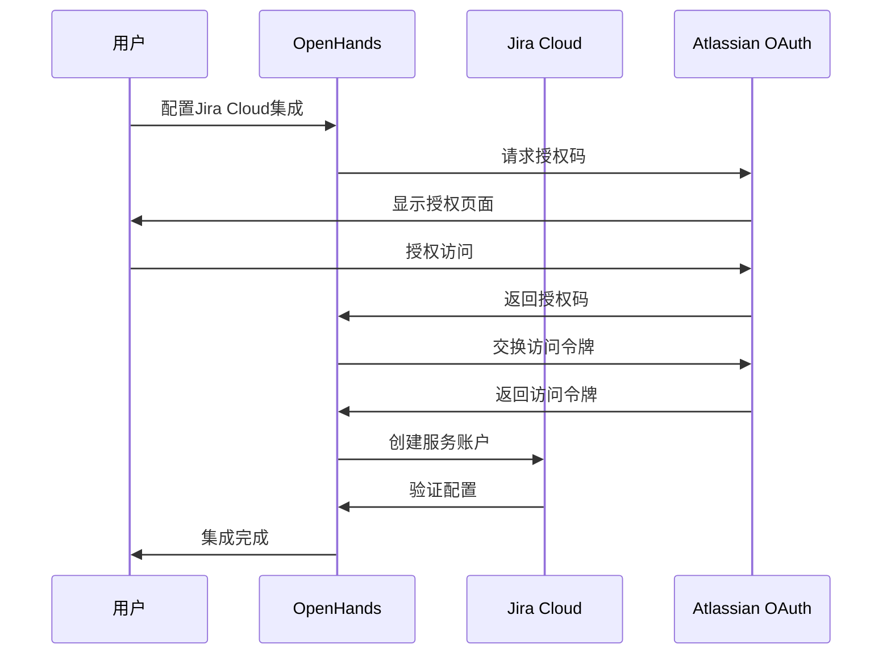

**图表来源**
- [jira.py](file://enterprise/server/routes/integration/jira.py#L376-L541)
- [jira_manager.py](file://enterprise/integrations/jira/jira_manager.py#L48-L67)

### 核心配置参数

| 参数名称 | 描述 | 示例值 |
|---------|------|--------|
| JIRA_CLIENT_ID | Atlassian应用客户端ID | `your-client-id` |
| JIRA_CLIENT_SECRET | Atlassian应用密钥 | `your-client-secret` |
| JIRA_SCOPES | OAuth作用域权限 | `read:me read:jira-user read:jira-work` |
| JIRA_REDIRECT_URI | 回调重定向地址 | `https://your-domain.com/integration/jira/callback` |

**节来源**
- [jira.py](file://enterprise/server/routes/integration/jira.py#L27-L32)
- [constants.py](file://enterprise/server/auth/constants.py#L24-L25)

## Jira Data Center集成

### 架构特点

Jira Data Center集成针对企业内部部署的Jira环境进行了优化，支持自定义认证和API端点。

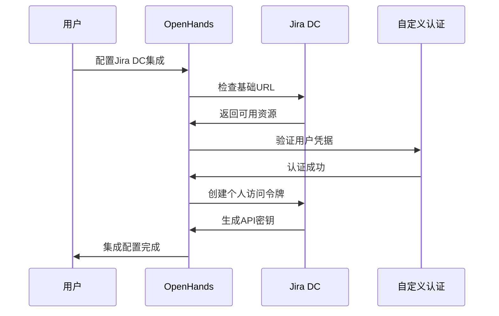

**图表来源**
- [jira_dc.py](file://enterprise/server/routes/integration/jira_dc.py#L283-L555)
- [jira_dc_manager.py](file://enterprise/integrations/jira_dc/jira_dc_manager.py#L48-L82)

### 核心配置参数

| 参数名称 | 描述 | 示例值 |
|---------|------|--------|
| JIRA_DC_CLIENT_ID | Jira DC客户端ID | `your-dc-client-id` |
| JIRA_DC_CLIENT_SECRET | Jira DC客户端密钥 | `your-dc-client-secret` |
| JIRA_DC_BASE_URL | Jira DC基础URL | `https://jira.company.com` |
| JIRA_DC_ENABLE_OAUTH | 启用OAuth标志 | `true`/`false` |

**节来源**
- [jira_dc.py](file://enterprise/server/routes/integration/jira_dc.py#L38-L43)
- [constants.py](file://enterprise/server/auth/constants.py#L28-L31)

## 核心组件分析

### JiraManager vs JiraDcManager

两个管理器类在架构上保持一致的设计模式，但在具体实现上有以下关键差异：

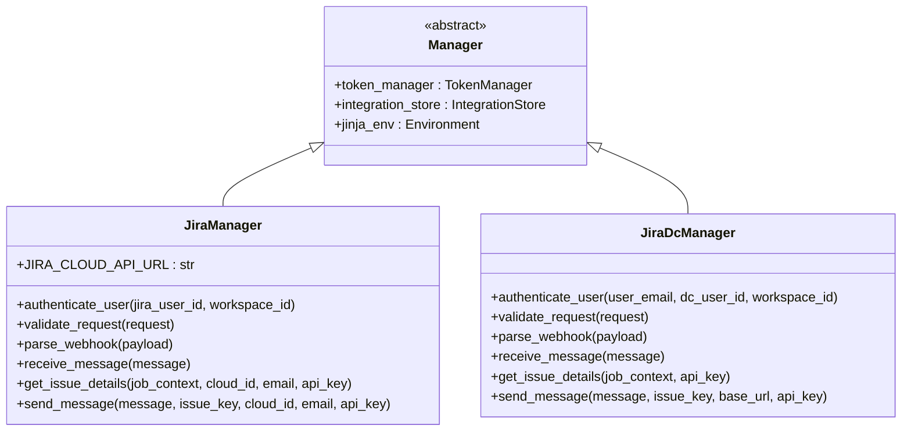

**图表来源**
- [jira_manager.py](file://enterprise/integrations/jira/jira_manager.py#L40-L47)
- [jira_dc_manager.py](file://enterprise/integrations/jira_dc/jira_dc_manager.py#L40-L47)

### 视图工厂模式

系统采用工厂模式来创建不同类型的视图对象，处理新工单和现有工单的不同场景。

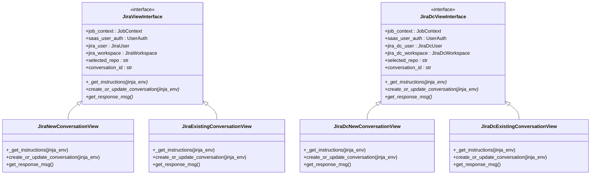

**图表来源**
- [jira_types.py](file://enterprise/integrations/jira/jira_types.py#L11-L35)
- [jira_dc_types.py](file://enterprise/integrations/jira_dc/jira_dc_types.py#L11-L35)
- [jira_view.py](file://enterprise/integrations/jira/jira_view.py#L27-L225)
- [jira_dc_view.py](file://enterprise/integrations/jira_dc/jira_dc_view.py#L30-L226)

**节来源**
- [jira_view.py](file://enterprise/integrations/jira/jira_view.py#L185-L225)
- [jira_dc_view.py](file://enterprise/integrations/jira_dc/jira_dc_view.py#L189-L226)

## OAuth 2.0认证流程

### Jira Cloud OAuth流程

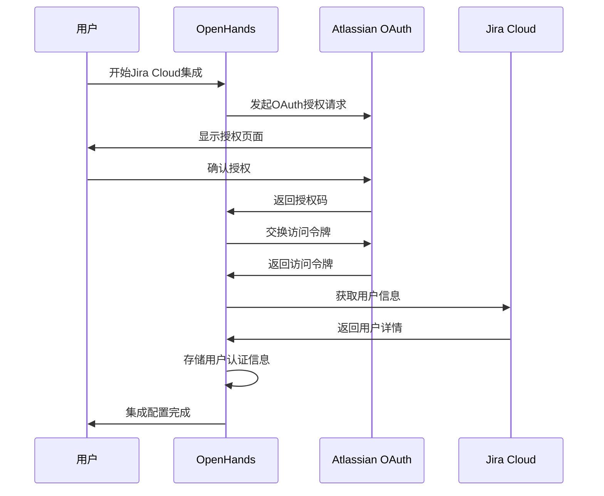

**图表来源**
- [jira.py](file://enterprise/server/routes/integration/jira.py#L376-L541)

### Jira Data Center OAuth流程

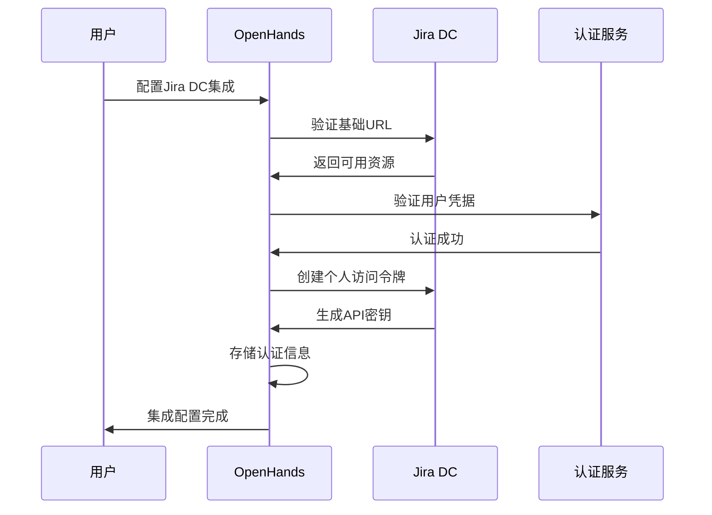

**图表来源**
- [jira_dc.py](file://enterprise/server/routes/integration/jira_dc.py#L283-L555)

### 权限范围管理

| 权限范围 | 描述 | 使用场景 |
|---------|------|----------|
| `read:me` | 读取用户个人信息 | 获取用户基本信息 |
| `read:jira-user` | 读取Jira用户信息 | 获取用户在Jira中的角色和权限 |
| `read:jira-work` | 读取Jira工作区信息 | 访问项目和工单数据 |

**节来源**
- [jira.py](file://enterprise/server/routes/integration/jira.py#L28-L29)
- [jira_dc.py](file://enterprise/server/routes/integration/jira_dc.py#L39-L40)

## Webhook处理机制

### Webhook签名验证

系统实现了基于HMAC-SHA256的签名验证机制，确保Webhook请求的真实性和完整性。

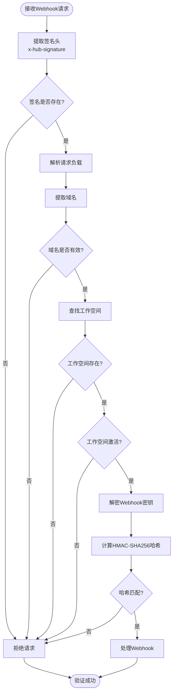

**图表来源**
- [jira_manager.py](file://enterprise/integrations/jira/jira_manager.py#L86-L132)
- [jira_dc_manager.py](file://enterprise/integrations/jira_dc/jira_dc_manager.py#L101-L147)

### 支持的Webhook事件

| 事件类型 | 描述 | 处理方式 |
|---------|------|----------|
| `comment_created` | 工单评论创建 | 检查@openhands标签，触发AI处理 |
| `jira:issue_updated` | 工单状态更新 | 检查标签变化，更新对话状态 |

**节来源**
- [jira_manager.py](file://enterprise/integrations/jira/jira_manager.py#L134-L206)
- [jira_dc_manager.py](file://enterprise/integrations/jira_dc/jira_dc_manager.py#L149-L221)

## 工单生命周期管理

### 工单创建流程

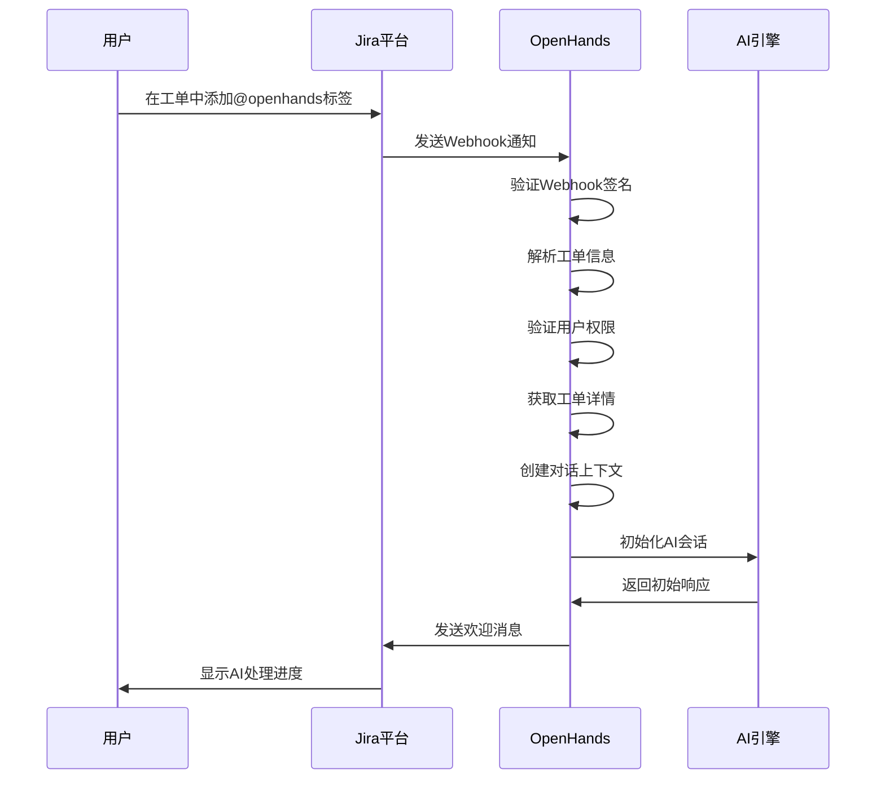

**图表来源**
- [jira_manager.py](file://enterprise/integrations/jira/jira_manager.py#L208-L399)
- [jira_dc_manager.py](file://enterprise/integrations/jira_dc/jira_dc_manager.py#L223-L418)

### 状态更新机制

系统支持多种工单状态的自动更新：

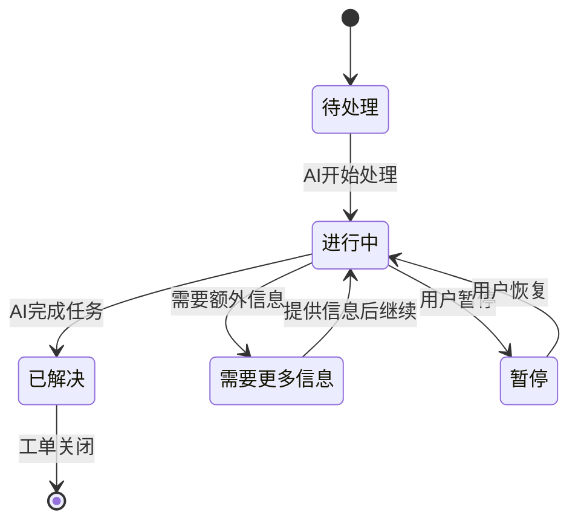

**节来源**
- [jira_view.py](file://enterprise/integrations/jira/jira_view.py#L98-L102)
- [jira_dc_view.py](file://enterprise/integrations/jira_dc/jira_dc_view.py#L101-L105)

### 评论同步功能

系统实现了双向评论同步机制：

| 方向 | 触发条件 | 内容格式 |
|------|----------|----------|
| Jira → OpenHands | 用户添加@openhands标签 | 原始评论内容 |
| OpenHands → Jira | AI生成回复 | 结构化响应消息 |
| 状态更新 | 工单状态变化 | 状态变更通知 |

**节来源**
- [jira_manager.py](file://enterprise/integrations/jira/jira_manager.py#L435-L452)
- [jira_dc_manager.py](file://enterprise/integrations/jira_dc/jira_dc_manager.py#L449-L459)

## 错误处理与数据同步

### 错误处理策略

系统实现了多层次的错误处理机制：

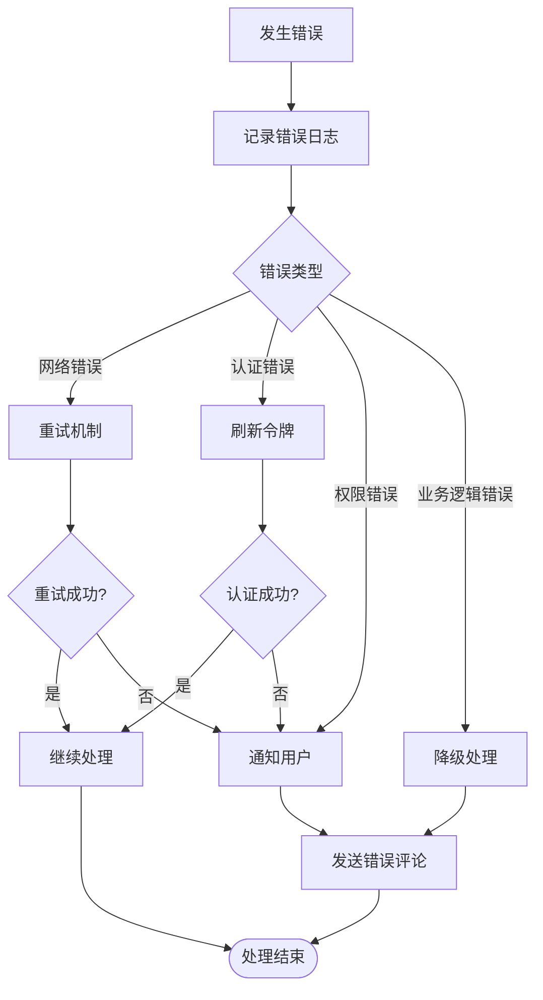

**图表来源**
- [jira_manager.py](file://enterprise/integrations/jira/jira_manager.py#L375-L398)
- [jira_dc_manager.py](file://enterprise/integrations/jira/dc/jira_dc_manager.py#L392-L409)

### 数据同步策略

| 同步类型 | 触发时机 | 数据范围 | 一致性保证 |
|---------|----------|----------|-----------|
| 实时同步 | Webhook事件 | 评论内容、状态变更 | 强一致性 |
| 批量同步 | 定期任务 | 工单元数据 | 最终一致性 |
| 缓存同步 | 首次访问 | 用户信息、权限 | 超时失效 |

**节来源**
- [jira_integration_store.py](file://enterprise/storage/jira_integration_store.py#L227-L251)
- [jira_dc_integration_store.py](file://enterprise/storage/jira_dc_integration_store.py#L237-L263)

### 故障恢复机制

系统提供了完善的故障恢复能力：

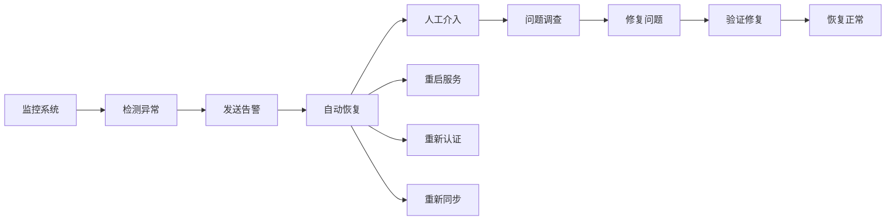

**节来源**
- [jira_manager.py](file://enterprise/integrations/jira/jira_manager.py#L375-L398)
- [jira_dc_manager.py](file://enterprise/integrations/jira_dc/jira_dc_manager.py#L392-L409)

## 配置与部署指南

### 环境变量配置

```bash
# Jira Cloud配置
JIRA_CLIENT_ID=your_atlassian_client_id
JIRA_CLIENT_SECRET=your_atlassian_client_secret
JIRA_REDIRECT_URI=https://your-domain.com/integration/jira/callback
JIRA_WEBHOOKS_ENABLED=true

# Jira Data Center配置
JIRA_DC_CLIENT_ID=your_dc_client_id
JIRA_DC_CLIENT_SECRET=your_dc_client_secret
JIRA_DC_BASE_URL=https://jira.company.com
JIRA_DC_ENABLE_OAUTH=true
JIRA_DC_WEBHOOKS_ENABLED=true
```

### 数据库表结构

系统需要创建以下数据库表来支持Jira集成：

| 表名 | 用途 | 关键字段 |
|------|------|----------|
| `jira_workspaces` | Jira Cloud工作空间配置 | name, jira_cloud_id, webhook_secret |
| `jira_users` | Jira Cloud用户映射 | keycloak_user_id, jira_user_id, status |
| `jira_conversations` | Jira Cloud对话记录 | conversation_id, issue_id, jira_user_id |
| `jira_dc_workspaces` | Jira DC工作空间配置 | name, webhook_secret, svc_acc_email |
| `jira_dc_users` | Jira DC用户映射 | keycloak_user_id, jira_dc_user_id, status |
| `jira_dc_conversations` | Jira DC对话记录 | conversation_id, issue_id, jira_dc_user_id |

**节来源**
- [jira_integration_store.py](file://enterprise/storage/jira_integration_store.py#L14-L251)
- [jira_dc_integration_store.py](file://enterprise/storage/jira_dc_integration_store.py#L14-L263)

### 前端配置

用户可以通过Web界面进行集成配置：

```typescript
// 集成配置示例
interface IntegrationConfig {
  workspace: string;           // 工作空间名称
  webhookSecret: string;       // Webhook密钥
  serviceAccountEmail: string; // 服务账户邮箱
  serviceAccountApiKey: string;// API密钥
  isActive: boolean;           // 是否启用
}
```

**节来源**
- [frontend/src/hooks/mutation/use-configure-integration.ts](file://frontend/src/hooks/mutation/use-configure-integration.ts#L9-L24)

## 故障排除

### 常见问题及解决方案

| 问题类型 | 症状 | 可能原因 | 解决方案 |
|---------|------|----------|----------|
| Webhook验证失败 | 403 Forbidden错误 | 签名不匹配或密钥错误 | 检查Webhook密钥配置 |
| OAuth认证失败 | 无法获取访问令牌 | 客户端ID或密钥错误 | 验证Atlassian应用配置 |
| 工单创建失败 | 评论未发送到Jira | API权限不足 | 检查Jira用户权限设置 |
| 会话丢失 | 对话中断 | Redis连接问题 | 检查Redis服务状态 |

### 日志分析

系统提供了详细的日志记录功能：

```python
# 关键日志级别
logger.info('[Jira] Webhook signature verified successfully')
logger.warning('[Jira] No active Jira user found')
logger.error('[Jira] Failed to create conversation: {error}')
```

### 性能监控指标

| 指标名称 | 监控目标 | 告警阈值 |
|---------|----------|----------|
| Webhook延迟 | 平均响应时间 | >5秒 |
| 认证成功率 | OAuth认证通过率 | <95% |
| 工单处理时间 | 从触发到响应 | >30秒 |
| 错误率 | 失败请求数比例 | >5% |

**节来源**
- [jira_manager.py](file://enterprise/integrations/jira/jira_manager.py#L129-L130)
- [jira_dc_manager.py](file://enterprise/integrations/jira_dc/jira_dc_manager.py#L144-L145)

通过以上详细的文档，开发者可以全面了解OpenHands的Jira集成功能，包括架构设计、实现细节、配置方法和故障排除方案。该集成提供了稳定可靠的Jira平台集成能力，支持企业级的自动化开发工作流。