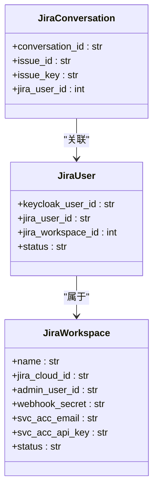
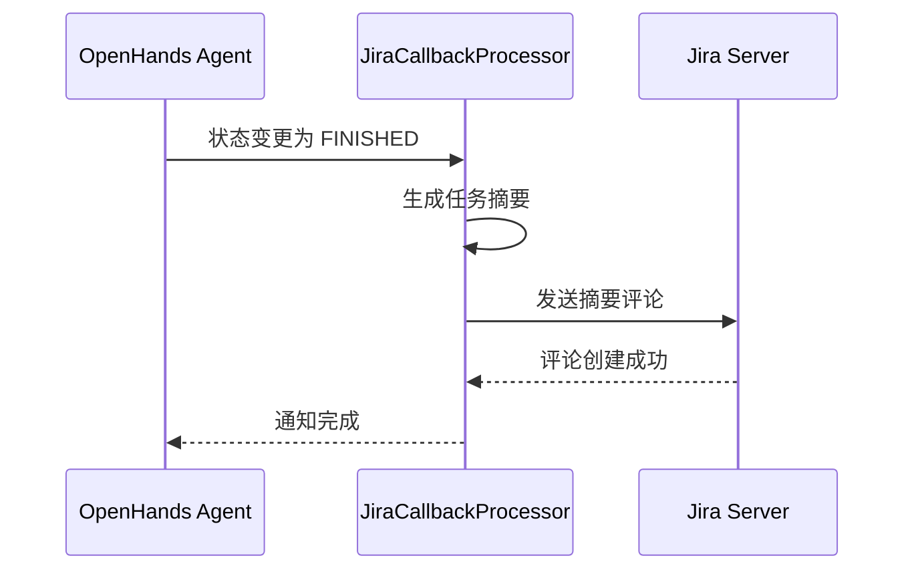

# 通用功能

<cite>
**本文档引用的文件**   
- [jira_manager.py](file://enterprise/integrations/jira/jira_manager.py)
- [jira_view.py](file://enterprise/integrations/jira/jira_view.py)
- [jira_types.py](file://enterprise/integrations/jira/jira_types.py)
- [jira_dc_manager.py](file://enterprise/integrations/jira_dc/jira_dc_manager.py)
- [jira_dc_view.py](file://enterprise/integrations/jira_dc/jira_dc_view.py)
- [jira_dc_types.py](file://enterprise/integrations/jira_dc/jira_dc_types.py)
- [jira_integration_store.py](file://enterprise/storage/jira_integration_store.py)
- [jira_dc_integration_store.py](file://enterprise/storage/jira_dc_integration_store.py)
- [jira_callback_processor.py](file://enterprise/server/conversation_callback_processor/jira_callback_processor.py)
- [jira_dc_callback_processor.py](file://enterprise/server/conversation_callback_processor/jira_dc_callback_processor.py)
- [microagent.py](file://openhands/microagent/microagent.py)
- [types.py](file://openhands/microagent/types.py)
</cite>

## 目录
1. [引言](#引言)
2. [工单同步机制](#工单同步机制)
3. [状态映射与用户身份关联](#状态映射与用户身份关联)
4. [微代理在Jira集成中的应用](#微代理在jira集成中的应用)
5. [错误处理框架与日志记录策略](#错误处理框架与日志记录策略)
6. [配置模板与最佳实践](#配置模板与最佳实践)
7. [结论](#结论)

## 引言
本文档详细阐述了OpenHands平台中Jira集成的通用功能，涵盖云版（Jira Cloud）和数据中心版（Jira DC）两种部署模式。文档重点介绍了工单同步、状态映射、用户身份关联等核心逻辑的实现方式，以及微代理（microagents）在自动化任务中的应用。同时，文档还解释了统一的错误处理框架和日志记录策略，并提供了配置模板和最佳实践指南，以确保在不同部署模式下提供一致的用户体验。

## 工单同步机制

Jira集成的工单同步机制通过Webhook事件驱动，实现了从Jira到OpenHands的双向通信。当用户在Jira工单中创建评论或更新工单状态时，会触发相应的Webhook，OpenHands服务器接收并处理这些事件，从而启动或更新与之关联的对话。

### 同步流程
工单同步的核心流程如下：
1.  **事件触发**：用户在Jira工单中进行操作（如添加评论`@openhands`或更新标签）。
2.  **请求验证**：OpenHands服务器通过验证`x-hub-signature`头来确保Webhook请求的来源可信。
3.  **上下文解析**：服务器解析Webhook负载，提取关键信息，如工单ID、工单键、用户信息和操作内容。
4.  **用户认证**：根据Jira用户ID和工作区ID，验证用户在OpenHands系统中的身份。
5.  **对话管理**：判断是创建新对话还是更新现有对话，并启动相应的处理流程。

```mermaid
flowchart TD
A[Jira事件触发] --> B{是否包含@openhands或标签?}
B --> |是| C[验证Webhook签名]
C --> D{签名有效?}
D --> |是| E[解析工单上下文]
E --> F[认证Jira用户]
F --> G{是否存在现有对话?}
G --> |是| H[更新现有对话]
G --> |否| I[创建新对话]
H --> J[发送状态更新]
I --> J
J --> K[在Jira工单中更新状态]
```

**图示来源**
- [jira_manager.py](file://enterprise/integrations/jira/jira_manager.py#L86-L207)
- [jira_dc_manager.py](file://enterprise/integrations/jira_dc/jira_dc_manager.py#L101-L222)

**本节来源**
- [jira_manager.py](file://enterprise/integrations/jira/jira_manager.py#L86-L207)
- [jira_dc_manager.py](file://enterprise/integrations/jira_dc/jira_dc_manager.py#L101-L222)

## 状态映射与用户身份关联

### 状态映射
Jira集成实现了工单状态与OpenHands对话状态的映射。当OpenHands代理完成任务或需要用户输入时，会通过回调处理器（Callback Processor）将状态变更同步回Jira工单。例如，当代理状态变为`AWAITING_USER_INPUT`或`FINISHED`时，系统会自动生成一个包含任务摘要的评论并发布到Jira工单中。

### 用户身份关联
用户身份关联是确保操作安全性和数据一致性的关键。系统通过以下方式建立Jira用户与OpenHands用户的映射关系：
1.  **工作区级关联**：管理员在配置Jira集成时，会创建一个工作区（Workspace），并关联一个服务账户（Service Account）。
2.  **用户级关联**：每个Jira用户通过其`keycloak_user_id`与OpenHands中的用户账户进行绑定。当用户在Jira中触发操作时，系统会通过`keycloak_user_id`找到对应的OpenHands用户，并验证其权限。



**图示来源**
- [jira_integration_store.py](file://enterprise/storage/jira_integration_store.py#L15-L251)
- [jira_dc_integration_store.py](file://enterprise/storage/jira_dc_integration_store.py#L15-L263)

**本节来源**
- [jira_manager.py](file://enterprise/integrations/jira/jira_manager.py#L48-L67)
- [jira_dc_manager.py](file://enterprise/integrations/jira_dc/jira_dc_manager.py#L48-L82)

## 微代理在Jira集成中的应用

微代理（Microagents）是OpenHands平台中用于执行特定自动化任务的轻量级组件。在Jira集成中，微代理被用于实现自动化工单创建和状态更新通知。

### 自动化工单创建
当用户在代码仓库中创建拉取请求（Pull Request）或提交代码时，微代理可以监听这些事件，并根据预设规则自动在Jira中创建新的工单。例如，一个名为`address_pr_comments.md`的微代理可以被配置为：当PR评论中包含特定关键词时，自动创建一个“修复问题”的Jira工单。

### 状态更新通知
微代理还负责在任务状态发生变化时，向Jira工单发送通知。`JiraCallbackProcessor`和`JiraDcCallbackProcessor`就是这类微代理的实现。它们监听对话状态的变化，一旦代理完成任务或需要用户输入，就会调用`_send_comment_to_jira`方法，将任务摘要以Jira Markup格式的评论形式发布到工单中。



**图示来源**
- [jira_callback_processor.py](file://enterprise/server/conversation_callback_processor/jira_callback_processor.py#L28-L155)
- [jira_dc_callback_processor.py](file://enterprise/server/conversation_callback_processor/jira_dc_callback_processor.py#L27-L159)

**本节来源**
- [jira_callback_processor.py](file://enterprise/server/conversation_callback_processor/jira_callback_processor.py#L28-L155)
- [jira_dc_callback_processor.py](file://enterprise/server/conversation_callback_processor/jira_dc_callback_processor.py#L27-L159)

## 错误处理框架与日志记录策略

### 错误处理框架
Jira集成采用分层的错误处理框架，确保系统在遇到异常时能够优雅地降级并提供清晰的反馈。

1.  **请求层**：在`validate_request`方法中，对Webhook签名、有效载荷完整性进行验证。如果验证失败，直接返回`False`，并记录警告日志。
2.  **业务逻辑层**：在`receive_message`和`start_job`等核心方法中，使用`try-except`块捕获特定异常，如`MissingSettingsError`和`LLMAuthenticationError`。对于这些已知错误，系统会向用户发送具体的错误信息。
3.  **未知错误**：对于未预期的异常，系统会捕获`Exception`基类，记录详细的错误堆栈，并向用户发送通用的错误提示，避免暴露内部实现细节。

### 日志记录策略
日志记录策略遵循清晰、可追溯的原则：
-   **日志级别**：使用`info`记录正常流程，`warning`记录可恢复的异常（如用户未认证），`error`记录严重错误（如API调用失败）。
-   **上下文信息**：日志消息中包含关键上下文，如`[Jira]`或`[Jira DC]`前缀、工单键（`issue_key`）、用户ID等，便于问题排查。
-   **统一日志器**：所有Jira相关的日志都通过`openhands_logger`输出，确保日志格式和输出位置的一致性。

**本节来源**
- [jira_manager.py](file://enterprise/integrations/jira/jira_manager.py#L375-L387)
- [jira_dc_manager.py](file://enterprise/integrations/jira_dc/jira_dc_manager.py#L392-L404)
- [jira_callback_processor.py](file://enterprise/server/conversation_callback_processor/jira_callback_processor.py#L149-L154)

## 配置模板与最佳实践

### 配置模板
为确保云版和数据中心版的一致性，建议使用统一的配置模板。以下是一个核心配置项的示例：

```yaml
jira:
  # 通用配置
  webhook_secret: "encrypted_secret_here"
  service_account:
    email: "service-account@your-domain.com"
    api_key: "encrypted_api_key_here"
  
  # 云版特有配置
  cloud:
    jira_cloud_id: "your-cloud-id"
  
  # 数据中心版特有配置
  data_center:
    base_api_url: "https://your-jira-dc.example.com"
```

### 最佳实践指南
1.  **安全第一**：所有敏感信息（如API密钥、Webhook密钥）必须经过加密存储，严禁在配置文件中明文存放。
2.  **权限最小化**：为Jira服务账户分配完成任务所需的最小权限，避免使用管理员账户。
3.  **命名规范**：工作区名称（`workspace_name`）应与Jira实例的域名保持一致，以便于自动识别和路由。
4.  **错误监控**：建立完善的错误监控和告警机制，及时发现并处理Webhook验证失败、API调用超时等问题。
5.  **测试验证**：在生产环境部署前，务必在测试环境中验证整个工单同步流程，包括评论触发、状态更新和错误处理。

**本节来源**
- [jira_manager.py](file://enterprise/integrations/jira/jira_manager.py#L37-L38)
- [jira_dc_manager.py](file://enterprise/integrations/jira_dc/jira_dc_manager.py#L421-L422)

## 结论
本文档全面介绍了OpenHands平台中Jira集成的通用功能。通过分析`jira_manager`和`jira_dc_manager`等核心组件，我们揭示了工单同步、状态映射和用户身份关联的实现逻辑。微代理机制为自动化任务提供了强大的支持，而统一的错误处理和日志记录策略则确保了系统的稳定性和可维护性。遵循本文档提供的配置模板和最佳实践，可以有效地在云版和数据中心版Jira中部署和管理集成，为用户提供一致且高效的开发体验。