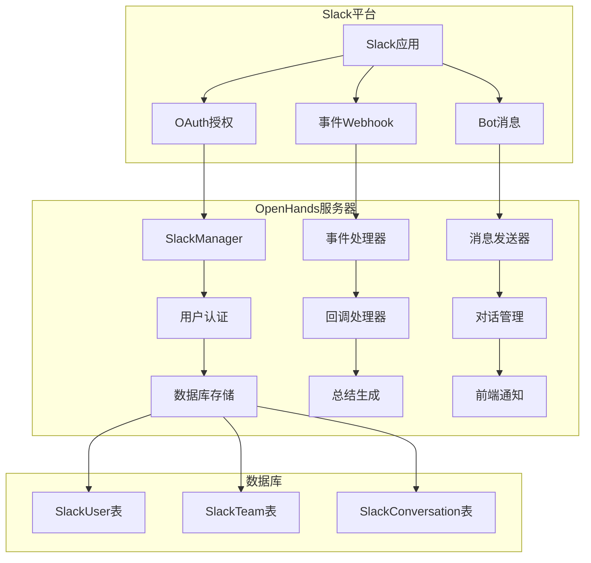
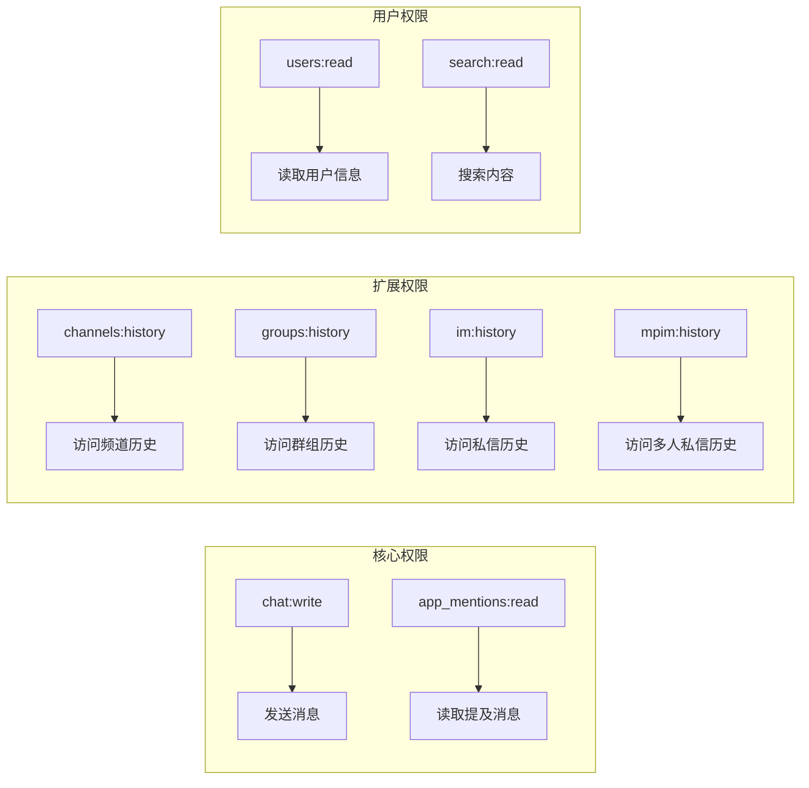
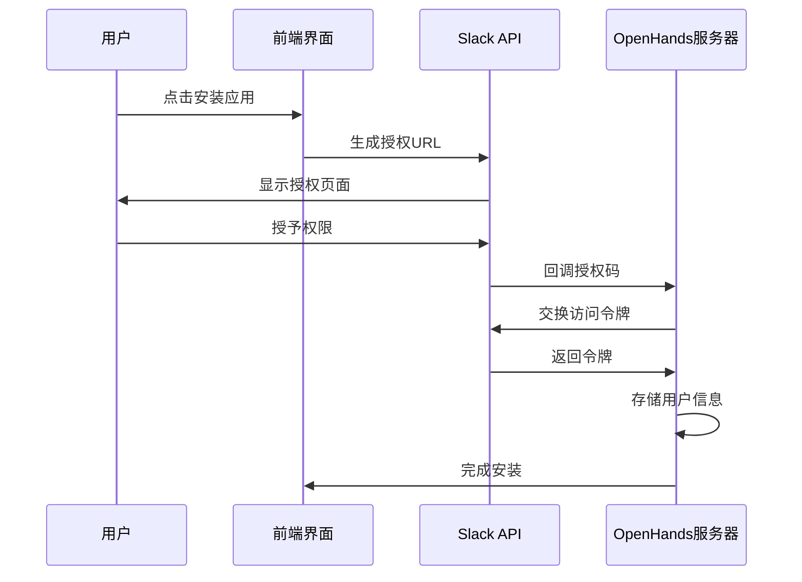
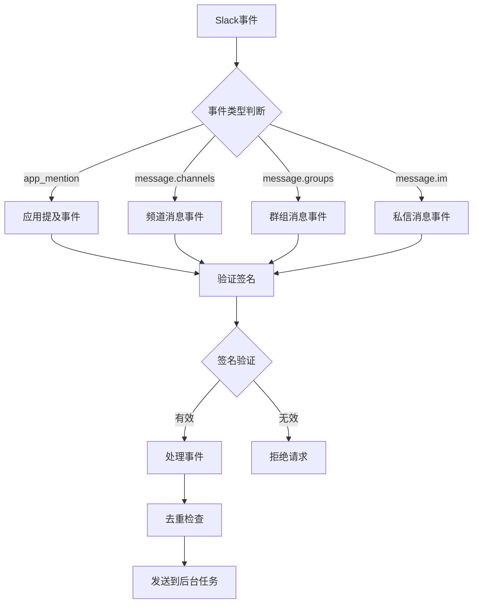
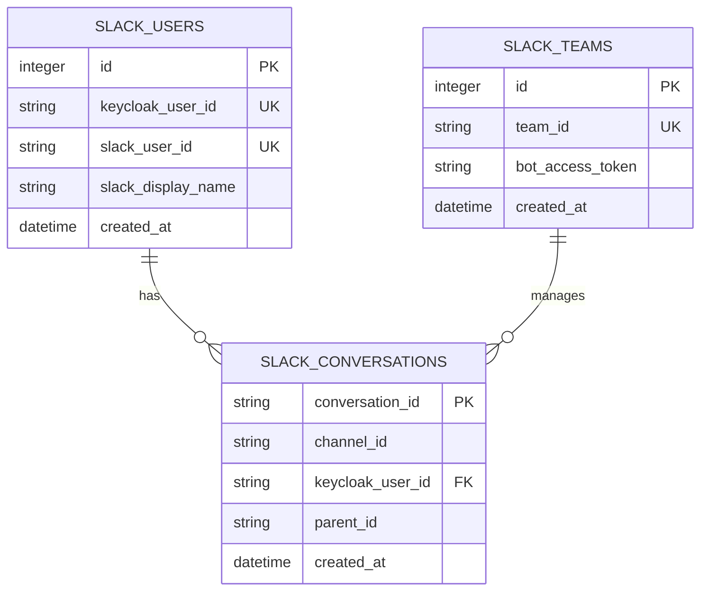
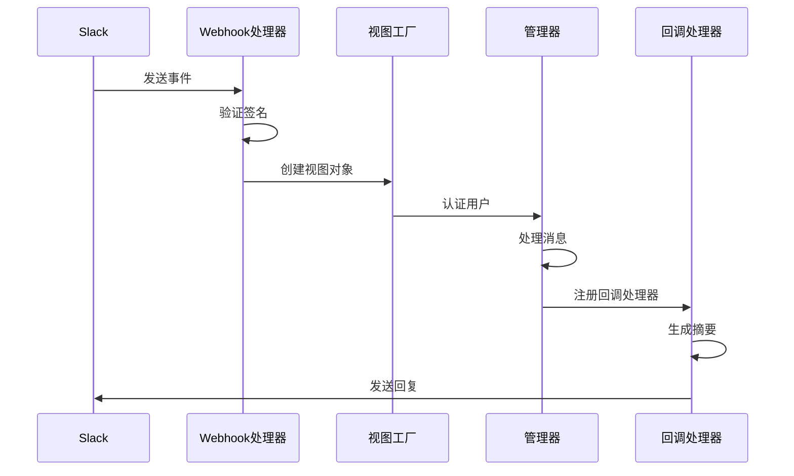
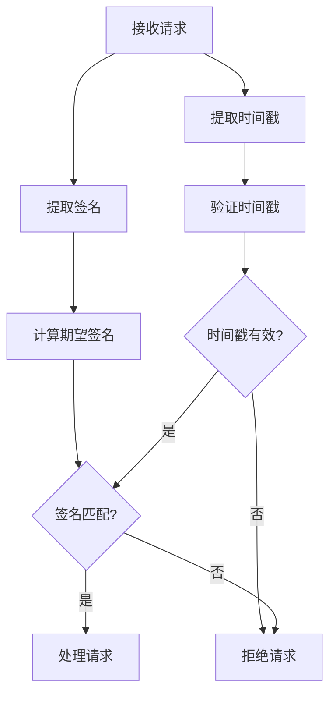

# Slack应用配置指南

<cite>
**本文档引用的文件**
- [slack.py](file://enterprise/server/routes/integration/slack.py)
- [slack_manager.py](file://enterprise/integrations/slack/slack_manager.py)
- [slack_types.py](file://enterprise/integrations/slack/slack_types.py)
- [slack_view.py](file://enterprise/integrations/slack/slack_view.py)
- [slack_callback_processor.py](file://enterprise/server/conversation_callback_processor/slack_callback_processor.py)
- [slack_user.py](file://enterprise/storage/slack_user.py)
- [slack_team.py](file://enterprise/storage/slack_team.py)
- [slack_team_store.py](file://enterprise/storage/slack_team_store.py)
- [constants.py](file://enterprise/server/constants.py)
- [install-slack-app-anchor.tsx](file://frontend/src/components/features/settings/git-settings/install-slack-app-anchor.tsx)
</cite>

## 目录
1. [简介](#简介)
2. [系统架构概览](#系统架构概览)
3. [Slack应用创建步骤](#slack应用创建步骤)
4. [权限范围配置](#权限范围配置)
5. [OAuth2.0授权流程](#oauth20授权流程)
6. [Webhook配置](#webhook配置)
7. [环境变量配置](#环境变量配置)
8. [事件处理机制](#事件处理机制)
9. [安全验证](#安全验证)
10. [故障排除指南](#故障排除指南)
11. [最佳实践](#最佳实践)

## 简介

OpenHands通过Slack集成提供了强大的AI驱动的开发协作功能。本指南详细介绍了如何在Slack API控制台创建和配置OpenHands应用，包括所需的权限范围、OAuth2.0授权流程、Webhook设置以及安全验证机制。

## 系统架构概览

OpenHands的Slack集成功架构采用事件驱动模式，支持实时消息处理和对话管理。



**图表来源**
- [slack_manager.py](file://enterprise/integrations/slack/slack_manager.py#L42-L364)
- [slack.py](file://enterprise/server/routes/integration/slack.py#L42-L310)

## Slack应用创建步骤

### 1. 访问Slack API控制台

1. 登录到 [Slack API控制台](https://api.slack.com/apps)
2. 点击"Create New App"按钮
3. 选择"From scratch"选项
4. 填写应用名称（如：OpenHands AI）
5. 选择目标工作区

### 2. 配置应用基本信息

- **应用名称**: OpenHands AI
- **描述**: AI驱动的代码审查和开发助手
- **图标**: 使用项目提供的图标
- **颜色**: 选择适合的颜色方案

### 3. 设置OAuth Scopes

根据应用需求配置以下权限范围：



**节来源**
- [slack_manager.py](file://enterprise/integrations/slack/slack_manager.py#L35-L39)
- [install-slack-app-anchor.tsx](file://frontend/src/components/features/settings/git-settings/install-slack-app-anchor.tsx#L16)

## 权限范围配置

### 必需权限范围

| 权限范围 | 描述 | 用途 |
|---------|------|------|
| `chat:write` | 发送聊天消息 | 向用户发送AI回复和状态更新 |
| `app_mentions:read` | 读取应用提及 | 处理用户对应用的直接调用 |
| `app_mentions:read` | 读取应用提及 | 处理用户对应用的直接调用 |

### 可选权限范围

| 权限范围 | 描述 | 用途 |
|---------|------|------|
| `channels:history` | 访问频道历史 | 获取对话上下文 |
| `groups:history` | 访问群组历史 | 处理群组对话 |
| `im:history` | 访问私信历史 | 处理一对一对话 |
| `mpim:history` | 访问多人私信历史 | 处理多人私信 |
| `users:read` | 读取用户信息 | 获取用户详细信息 |
| `search:read` | 搜索内容 | 搜索相关消息 |

### 用户作用域权限

| 权限范围 | 描述 | 用途 |
|---------|------|------|
| `search:read` | 搜索内容 | 用户搜索历史记录中的内容 |

**节来源**
- [slack_manager.py](file://enterprise/integrations/slack/slack_manager.py#L35-L39)

## OAuth2.0授权流程

### 授权URL生成

OpenHands使用Slack SDK自动生成授权URL：



**图表来源**
- [slack.py](file://enterprise/server/routes/integration/slack.py#L55-L60)
- [slack_manager.py](file://enterprise/integrations/slack/slack_manager.py#L35-L39)

### 重定向URI设置

配置正确的重定向URI：
- **生产环境**: `https://your-domain.com/slack/install-callback`
- **开发环境**: `http://localhost:8000/slack/install-callback`

### 客户端密钥管理

系统自动管理以下密钥：
- **客户端ID**: 从环境变量`SLACK_CLIENT_ID`获取
- **客户端密钥**: 从环境变量`SLACK_CLIENT_SECRET`获取
- **签名密钥**: 从环境变量`SLACK_SIGNING_SECRET`获取

**节来源**
- [slack.py](file://enterprise/server/routes/integration/slack.py#L55-L85)
- [constants.py](file://enterprise/server/constants.py#L58-L61)

## Webhook配置

### 事件订阅设置

启用以下事件类型：



**图表来源**
- [slack.py](file://enterprise/server/routes/integration/slack.py#L238-L297)

### Webhook URL配置

配置事件接收URL：
- **生产环境**: `https://your-domain.com/slack/on-event`
- **开发环境**: `http://localhost:8000/slack/on-event`

### 挑战响应机制

Slack定期发送挑战请求以验证Webhook有效性：
- 收到`challenge`字段时返回原始值
- 确保Webhook正常工作

**节来源**
- [slack.py](file://enterprise/server/routes/integration/slack.py#L255-L257)

## 环境变量配置

### 核心配置参数

| 环境变量 | 描述 | 示例值 |
|---------|------|--------|
| `SLACK_CLIENT_ID` | Slack应用客户端ID | `7477886716822.8729519890534` |
| `SLACK_CLIENT_SECRET` | Slack应用客户端密钥 | `your-client-secret` |
| `SLACK_SIGNING_SECRET` | Slack签名密钥 | `your-signing-secret` |
| `SLACK_WEBHOOKS_ENABLED` | 是否启用Webhooks | `1` 或 `true` |

### 数据库配置



**图表来源**
- [slack_user.py](file://enterprise/storage/slack_user.py#L5-L16)
- [slack_team.py](file://enterprise/storage/slack_team.py#L5-L15)

**节来源**
- [constants.py](file://enterprise/server/constants.py#L58-L61)

## 事件处理机制

### 消息处理流程



**图表来源**
- [slack_view.py](file://enterprise/integrations/slack/slack_view.py#L344-L447)
- [slack_manager.py](file://enterprise/integrations/slack/slack_manager.py#L180-L213)

### 对话管理

系统支持多种对话场景：

1. **新对话创建**: 用户首次与应用交互
2. **现有对话更新**: 在线程中继续之前的对话
3. **仓库选择**: 自动或手动选择关联的代码仓库

**节来源**
- [slack_view.py](file://enterprise/integrations/slack/slack_view.py#L321-L447)

## 安全验证

### 签名验证机制

所有来自Slack的请求都经过签名验证：



**图表来源**
- [slack.py](file://enterprise/server/routes/integration/slack.py#L247-L253)

### 去重机制

防止重复消息处理：
- 使用Redis缓存消息ID
- 设置60秒过期时间
- 避免重复处理相同消息

### 访问令牌管理

- 存储加密的访问令牌
- 支持令牌刷新机制
- 实现安全的令牌轮换

**节来源**
- [slack.py](file://enterprise/server/routes/integration/slack.py#L273-L279)
- [slack_team_store.py](file://enterprise/storage/slack_team_store.py#L12-L19)

## 故障排除指南

### 常见问题及解决方案

#### 1. OAuth授权失败

**症状**: 用户点击安装后收到错误信息
**原因**: 
- 客户端ID或密钥配置错误
- 重定向URI不匹配
- 权限范围不足

**解决方案**:
1. 检查环境变量配置
2. 验证重定向URI设置
3. 确认权限范围配置

#### 2. Webhook验证失败

**症状**: Slack显示Webhook验证失败
**原因**:
- 签名密钥错误
- 时间戳过期
- 请求格式错误

**解决方案**:
1. 验证`SLACK_SIGNING_SECRET`配置
2. 检查服务器时间同步
3. 确认请求头格式正确

#### 3. 消息处理延迟

**症状**: 用户消息响应缓慢
**原因**:
- 后台任务队列阻塞
- 数据库连接问题
- LLM服务超时

**解决方案**:
1. 检查Redis连接状态
2. 监控数据库性能
3. 调整超时配置

### 调试技巧

#### 启用详细日志

```python
# 在开发环境中启用详细日志
logger.setLevel(logging.DEBUG)
```

#### 检查环境变量

```bash
# 验证Slack相关环境变量
echo "SLACK_CLIENT_ID: $SLACK_CLIENT_ID"
echo "SLACK_WEBHOOKS_ENABLED: $SLACK_WEBHOOKS_ENABLED"
```

#### 测试Webhook连接

使用Slack开发者工具测试Webhook配置：
1. 访问应用的Webhook设置
2. 点击"Send Test"按钮
3. 查看响应结果

**节来源**
- [slack.py](file://enterprise/server/routes/integration/slack.py#L247-L253)

## 最佳实践

### 安全最佳实践

1. **定期轮换密钥**: 至少每6个月更换一次签名密钥
2. **最小权限原则**: 仅授予必要的权限范围
3. **监控异常活动**: 设置告警机制检测异常访问
4. **备份配置**: 定期备份Slack应用配置

### 性能优化

1. **异步处理**: 所有Slack事件处理都使用异步任务
2. **缓存机制**: 缓存用户认证信息和团队数据
3. **批量操作**: 合并相似的操作减少API调用
4. **资源池化**: 使用连接池管理数据库连接

### 用户体验优化

1. **快速响应**: 确保Webhook处理时间小于3秒
2. **清晰反馈**: 提供明确的安装和配置指示
3. **错误处理**: 显示友好的错误信息而非技术细节
4. **上下文感知**: 利用Slack消息上下文提供相关回复

### 监控和维护

1. **健康检查**: 定期检查Slack集成状态
2. **性能监控**: 监控响应时间和成功率
3. **错误追踪**: 记录和分析错误模式
4. **容量规划**: 根据使用情况调整资源配置

通过遵循这些配置指南和最佳实践，您可以成功部署和维护OpenHands的Slack集成功能，为用户提供流畅、安全的AI驱动开发体验。