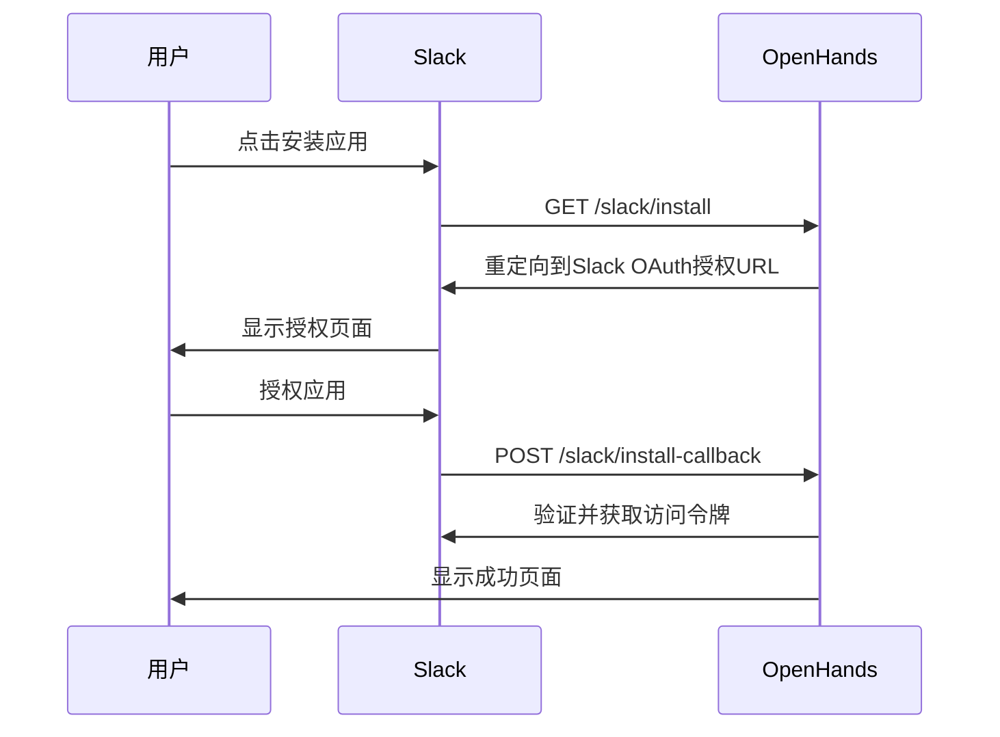
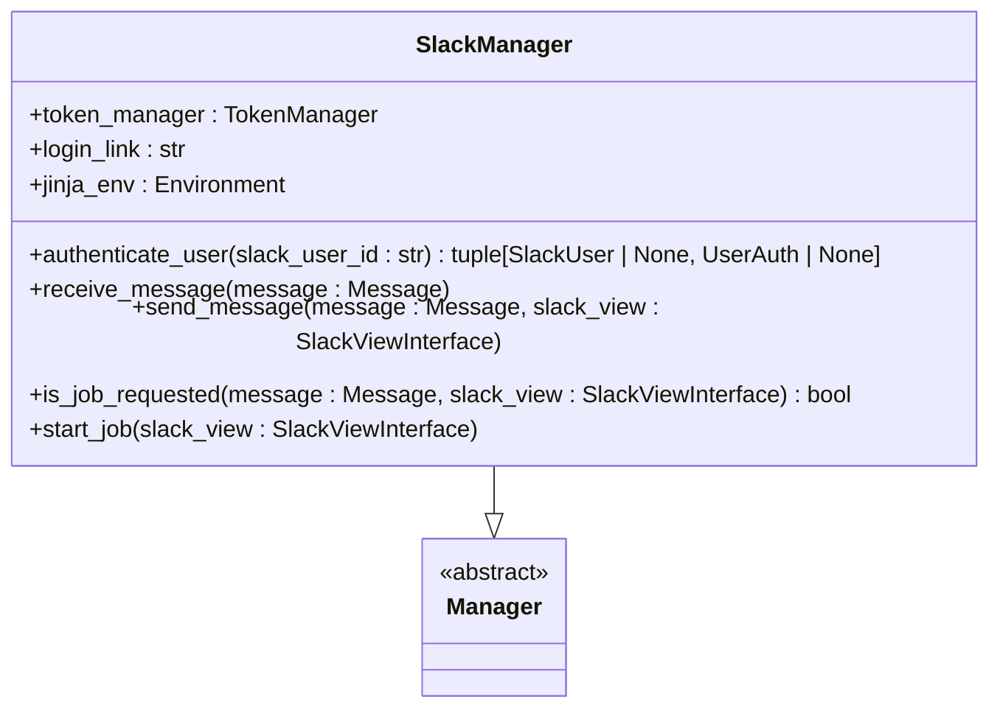
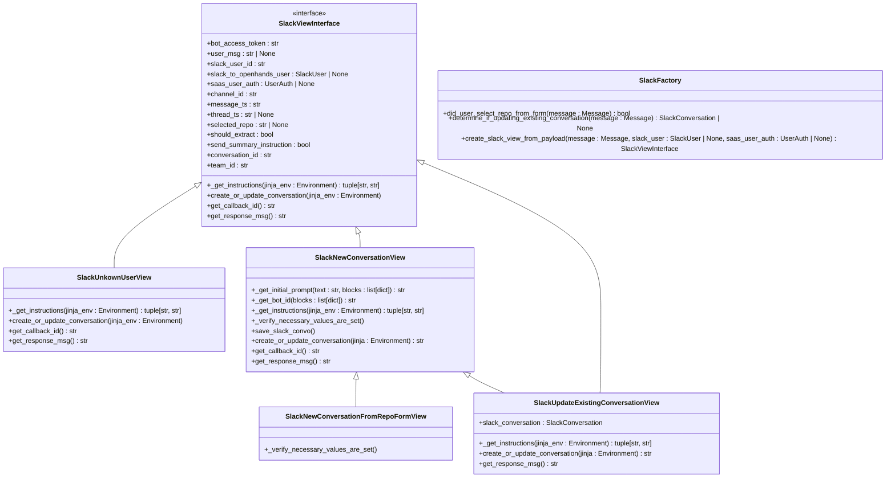
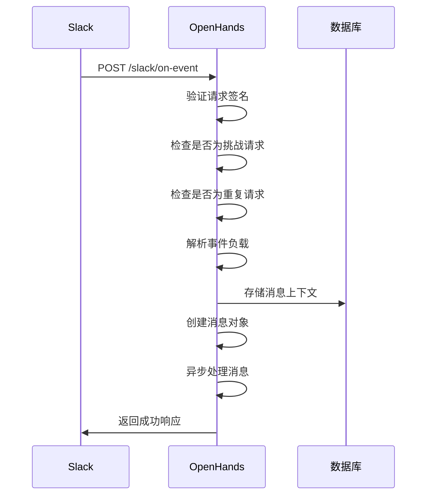
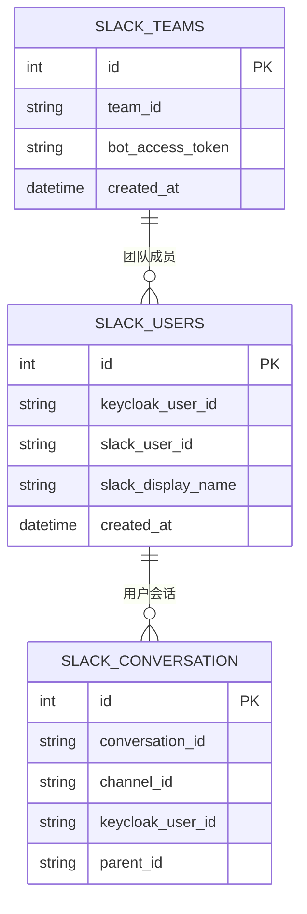

# Slack集成

<cite>
**本文档引用的文件**
- [slack_manager.py](file://enterprise/integrations/slack/slack_manager.py)
- [slack_view.py](file://enterprise/integrations/slack/slack_view.py)
- [slack_types.py](file://enterprise/integrations/slack/slack_types.py)
- [slack_callback_processor.py](file://enterprise/server/conversation_callback_processor/slack_callback_processor.py)
- [slack.py](file://enterprise/server/routes/integration/slack.py)
- [slack_user.py](file://enterprise/storage/slack_user.py)
- [slack_conversation.py](file://enterprise/storage/slack_conversation.py)
- [slack_team.py](file://enterprise/storage/slack_team.py)
</cite>

## 目录
1. [简介](#简介)
2. [Slack应用创建与配置](#slack应用创建与配置)
3. [核心组件分析](#核心组件分析)
4. [事件订阅与消息回调处理](#事件订阅与消息回调处理)
5. [权限范围配置](#权限范围配置)
6. [安全最佳实践](#安全最佳实践)
7. [会话管理机制](#会话管理机制)
8. [交互式组件处理](#交互式组件处理)
9. [结论](#结论)

## 简介

Slack集成允许用户通过Slack与OpenHands系统进行交互，实现无缝的开发工作流自动化。该集成支持通过Slack消息触发任务、管理会话以及接收任务执行的更新。系统通过Slack应用与OpenHands后端服务的深度集成，实现了从Slack消息到任务执行的完整闭环。

该集成的核心功能包括：
- 通过@提及触发任务执行
- 在Slack中管理与OpenHands的会话
- 通过交互式表单选择代码仓库
- 在Slack线程中持续跟踪任务进度
- 安全的身份验证和权限管理

## Slack应用创建与配置

创建Slack应用是集成的第一步，需要在Slack开发者平台完成应用的创建和配置。应用配置包括设置OAuth权限、事件订阅和重定向URL。

### 应用配置步骤

1. **创建Slack应用**：在Slack API控制台创建新应用，选择"From scratch"选项
2. **配置OAuth权限**：在"OAuth & Permissions"页面添加必要的权限范围
3. **设置重定向URL**：配置OAuth回调的重定向URL
4. **启用事件订阅**：在"Event Subscriptions"页面启用事件订阅功能
5. **配置请求URL**：设置事件订阅的请求URL

### OAuth配置

Slack应用使用OAuth 2.0进行身份验证，通过以下端点处理安装流程：



**图源**
- [slack.py](file://enterprise/server/routes/integration/slack.py#L55-L81)

## 核心组件分析

Slack集成由多个核心组件构成，每个组件负责特定的功能。这些组件协同工作，实现了完整的Slack集成功能。

### SlackManager组件

`SlackManager`是Slack集成的核心管理类，负责处理所有Slack相关的业务逻辑。它继承自`Manager`基类，并实现了消息接收、用户认证和任务启动等功能。



**图源**
- [slack_manager.py](file://enterprise/integrations/slack/slack_manager.py#L42-L364)

### SlackView组件

`SlackView`组件负责处理Slack消息的不同视图类型，根据消息上下文创建相应的视图实例。它通过工厂模式实现不同视图的创建。



**图源**
- [slack_view.py](file://enterprise/integrations/slack/slack_view.py#L37-L447)

## 事件订阅与消息回调处理

Slack集成通过事件订阅机制接收来自Slack平台的消息和事件。系统配置了多个端点来处理不同类型的事件。

### 事件处理流程

当Slack平台检测到配置的事件时，会向指定的请求URL发送HTTP POST请求。OpenHands后端服务接收这些请求并进行处理。



**图源**
- [slack.py](file://enterprise/server/routes/integration/slack.py#L238-L297)

### 消息监听机制

系统通过`on-event`端点监听Slack事件，主要处理`app_mention`事件类型，即当用户在Slack中@提及机器人时触发。

```python
@slack_router.post('/on-event')
async def on_event(request: Request, background_tasks: BackgroundTasks):
    if not SLACK_WEBHOOKS_ENABLED:
        return JSONResponse({'success': 'slack_webhooks_disabled'})
    
    body = await request.body()
    payload = json.loads(body.decode())

    # 验证请求签名
    if not signature_verifier.is_valid(
        body=body,
        timestamp=request.headers.get('x-slack-request-timestamp'),
        signature=request.headers.get('x-slack-signature'),
    ):
        raise HTTPException(status_code=403, detail='invalid_request')

    # 处理挑战请求
    if 'challenge' in payload:
        return PlainTextResponse(payload['challenge'])

    # 忽略非事件回调类型
    if payload.get('type') != 'event_callback':
        return JSONResponse({'success': True})

    # 检查是否为重复请求
    redis = sio.manager.redis
    key = f'slack_msg:{client_msg_id}'
    created = await redis.set(key, 1, nx=True, ex=60)
    if not created:
        logger.info('slack_is_duplicate')
        return JSONResponse({'success': True})

    # 处理消息
    message = Message(source=SourceType.SLACK, message=payload)
    background_tasks.add_task(slack_manager.receive_message, message)
    return JSONResponse({'success': True})
```

**本节源码**
- [slack.py](file://enterprise/server/routes/integration/slack.py#L238-L297)

## 权限范围配置

Slack应用需要配置适当的权限范围（scopes）以实现所需功能。权限范围决定了应用可以访问的Slack API和数据。

### 必需权限范围

根据代码分析，Slack集成需要以下权限范围：

| 权限范围 | 描述 | 类型 |
|--------|------|------|
| `app_mentions:read` | 读取对应用的提及 | Bot Token Scope |
| `chat:write` | 发送消息到聊天 | Bot Token Scope |
| `search:read` | 读取搜索结果 | User Token Scope |

这些权限在`slack_manager.py`文件中通过`AuthorizeUrlGenerator`进行配置：

```python
authorize_url_generator = AuthorizeUrlGenerator(
    client_id=SLACK_CLIENT_ID,
    scopes=['app_mentions:read', 'chat:write'],
    user_scopes=['search:read'],
)
```

### 权限配置最佳实践

1. **最小权限原则**：只请求应用正常运行所必需的权限
2. **明确权限用途**：在应用描述中清楚说明每个权限的用途
3. **定期审查权限**：定期检查应用权限，移除不再需要的权限
4. **用户透明度**：在用户安装应用时，清楚地告知将授予哪些权限

**本节源码**
- [slack_manager.py](file://enterprise/integrations/slack/slack_manager.py#L35-L39)

## 安全最佳实践

Slack集成实施了多项安全措施，确保用户数据和系统安全。

### 请求验证

系统通过Slack签名验证确保所有传入请求的合法性。每个请求都包含`x-slack-signature`和`x-slack-request-timestamp`头部，用于验证请求来源。

```python
if not signature_verifier.is_valid(
    body=body,
    timestamp=request.headers.get('x-slack-request-timestamp'),
    signature=request.headers.get('x-slack-signature'),
):
    raise HTTPException(status_code=403, detail='invalid_request')
```

### 重复请求防护

为防止重复事件处理，系统使用Redis存储最近处理的请求ID，并在一定时间内拒绝重复请求：

```python
redis = sio.manager.redis
key = f'slack_msg:{client_msg_id}'
created = await redis.set(key, 1, nx=True, ex=60)
if not created:
    logger.info('slack_is_duplicate')
    return JSONResponse({'success': True})
```

### JWT状态管理

在OAuth流程中，系统使用JWT（JSON Web Token）安全地传递状态信息，防止CSRF攻击：

```python
# 创建JWT状态令牌
state = jwt.encode(
    message.message, jwt_secret.get_secret_value(), algorithm='HS256'
)
link = authorize_url_generator.generate(state)
```

### 数据库安全

用户关联数据存储在数据库中，通过外键关系确保数据完整性：



**图源**
- [slack_user.py](file://enterprise/storage/slack_user.py#L1-L16)
- [slack_conversation.py](file://enterprise/storage/slack_conversation.py#L1-L12)
- [slack_team.py](file://enterprise/storage/slack_team.py#L1-L15)

## 会话管理机制

Slack集成实现了复杂的会话管理机制，支持在Slack线程中持续跟踪和管理与OpenHands的交互。

### 会话创建

当用户首次@提及机器人时，系统创建新的会话。会话信息存储在`slack_conversation`表中，关联Slack线程和OpenHands会话。

```python
async def save_slack_convo(self):
    if self.slack_to_openhands_user:
        user_info: SlackUser = self.slack_to_openhands_user
        
        slack_conversation = SlackConversation(
            conversation_id=self.conversation_id,
            channel_id=self.channel_id,
            keycloak_user_id=user_info.keycloak_user_id,
            parent_id=self.thread_ts or self.message_ts,
        )
        await slack_conversation_store.create_slack_conversation(slack_conversation)
```

### 会话更新

对于现有会话的后续消息，系统通过线程ID识别关联的会话，并将新消息添加到现有会话中：

```python
async def determine_if_updating_existing_conversation(
    message: Message,
) -> SlackConversation | None:
    payload = message.message
    channel_id = payload.get('channel_id')
    thread_ts = payload.get('thread_ts')
    
    # 跟进会话必须包含在线程中
    if not thread_ts:
        return None
        
    return await slack_conversation_store.get_slack_conversation(
        channel_id, thread_ts
    )
```

### 会话权限控制

系统实施了严格的会话权限控制，确保只有会话创建者才能向会话发送后续消息：

```python
# 只有创建会话的用户才能发送后续消息
if user_id != self.slack_conversation.keycloak_user_id:
    raise StartingConvoException(
        f'{user_info.slack_display_name} 无权向此会话发送消息。'
    )
```

**本节源码**
- [slack_view.py](file://enterprise/integrations/slack/slack_view.py#L328-L343)

## 交互式组件处理

Slack集成支持交互式组件，如选择菜单和按钮，用于增强用户体验。

### 仓库选择表单

当系统无法从用户消息中推断出代码仓库时，会显示一个交互式选择表单，让用户选择要操作的仓库：

```python
def _generate_repo_selection_form(
    self, repo_list: list[Repository], message_ts: str, thread_ts: str | None
):
    options = [
        {
            'text': {'type': 'plain_text', 'text': 'No Repository'},
            'value': '-',
        }
    ]
    options.extend(
        {
            'text': {
                'type': 'plain_text',
                'text': repo.full_name,
            },
            'value': repo.full_name,
        }
        for repo in repo_list
    )
    
    return [
        {
            'type': 'header',
            'text': {
                'type': 'plain_text',
                'text': 'Choose a repository',
                'emoji': True,
            },
        },
        {
            'type': 'actions',
            'elements': [
                {
                    'type': 'static_select',
                    'action_id': f'repository_select:{message_ts}:{thread_ts}',
                    'options': options,
                }
            ],
        },
    ]
```

### 表单交互处理

系统通过`on-form-interaction`端点处理表单交互：

```python
@slack_router.post('/on-form-interaction')
async def on_form_interaction(request: Request, background_tasks: BackgroundTasks):
    """处理表单交互"""
    if not SLACK_WEBHOOKS_ENABLED:
        return JSONResponse({'success': 'slack_webhooks_disabled'})
        
    body = await request.body()
    form = await request.form()
    payload = json.loads(form.get('payload'))
    
    logger.info('slack_on_form_interaction', extra={'payload': payload})
```

**本节源码**
- [slack_manager.py](file://enterprise/integrations/slack/slack_manager.py#L116-L155)
- [slack.py](file://enterprise/server/routes/integration/slack.py#L300-L310)

## 结论

Slack集成通过精心设计的架构和安全机制，实现了与OpenHands系统的无缝集成。该集成支持多种触发方式，包括直接消息、频道消息和快捷方式，为用户提供灵活的交互方式。

关键特性包括：
- 基于OAuth的安全身份验证
- 事件驱动的异步处理架构
- 会话感知的上下文管理
- 交互式组件支持
- 严格的权限控制

通过遵循Slack的安全最佳实践和权限最小化原则，该集成确保了用户数据的安全性和隐私保护。未来可以进一步扩展功能，如支持更多类型的交互式组件、增强的错误处理和更丰富的通知系统。