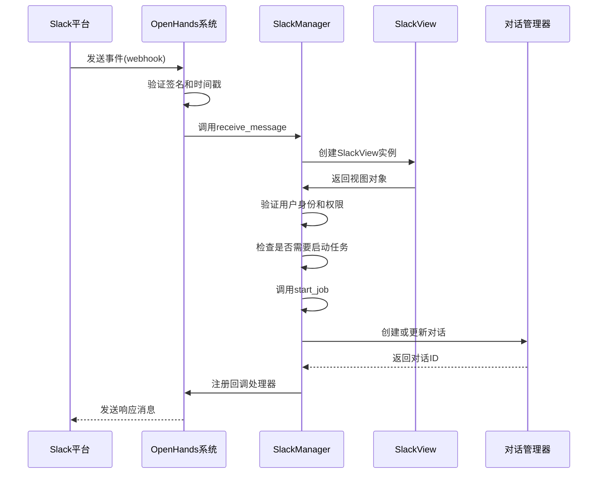
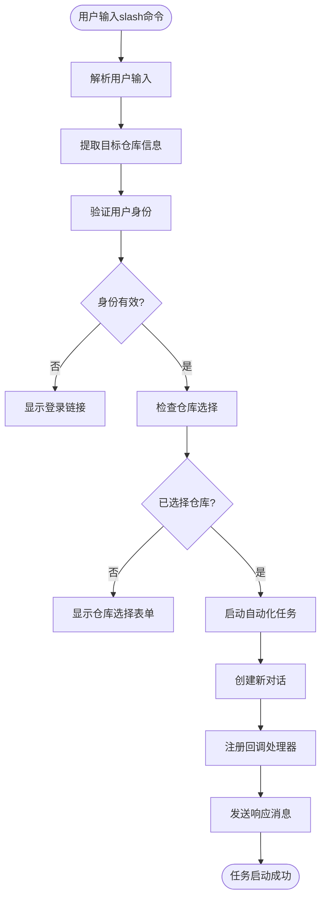
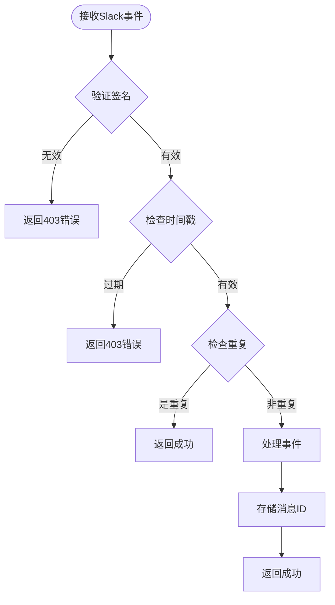
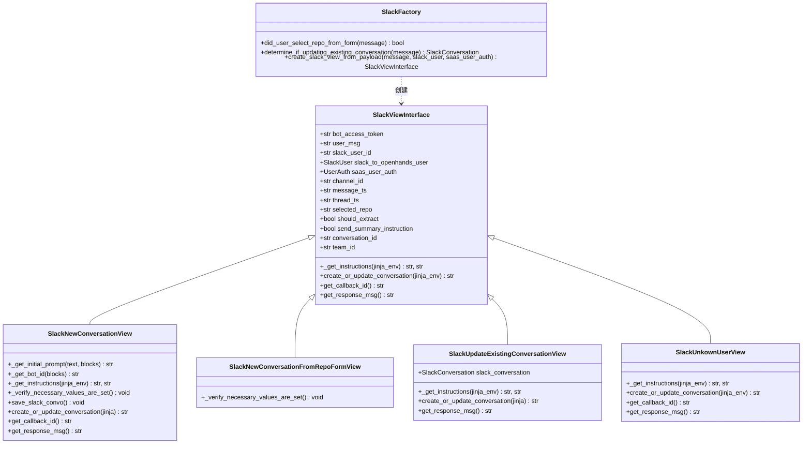
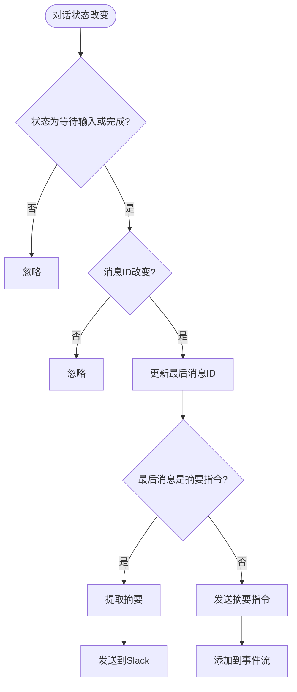

# 事件处理

<cite>
**本文档引用的文件**
- [slack_manager.py](file://enterprise/integrations/slack/slack_manager.py)
- [slack_types.py](file://enterprise/integrations/slack/slack_types.py)
- [slack_view.py](file://enterprise/integrations/slack/slack_view.py)
- [slack_callback_processor.py](file://enterprise/server/conversation_callback_processor/slack_callback_processor.py)
- [event_webhook.py](file://enterprise/server/routes/event_webhook.py)
- [slack.py](file://enterprise/server/routes/integration/slack.py)
- [slack_conversation.py](file://enterprise/storage/slack_conversation.py)
- [slack_team.py](file://enterprise/storage/slack_team.py)
- [slack_user.py](file://enterprise/storage/slack_user.py)
</cite>

## 目录
1. [简介](#简介)
2. [Slack事件订阅与回调处理流程](#slack事件订阅与回调处理流程)
3. [Slash命令与交互式组件处理](#slash命令与交互式组件处理)
4. [事件验证机制](#事件验证机制)
5. [Slack事件到OpenHands微代理的映射](#slack事件到openhands微代理的映射)
6. [性能优化与错误重试策略](#性能优化与错误重试策略)
7. [结论](#结论)

## 简介

本文档详细分析了OpenHands系统中Slack事件处理机制，重点关注事件订阅、回调处理流程以及如何将Slack事件映射到OpenHands微代理系统以实现自动化任务处理。文档涵盖了slash命令、交互式组件操作和消息动作事件的处理方式，同时深入探讨了确保请求来源安全性的事件验证机制，包括签名验证和时间戳检查。

**Section sources**
- [slack_manager.py](file://enterprise/integrations/slack/slack_manager.py#L1-L364)
- [slack_types.py](file://enterprise/integrations/slack/slack_types.py#L1-L49)

## Slack事件订阅与回调处理流程

OpenHands系统通过Slack集成实现了完整的事件处理机制，该机制基于事件驱动架构，能够响应各种Slack事件并触发相应的自动化任务。

事件处理流程始于Slack的`/on-event`端点，该端点接收来自Slack平台的各种事件通知。当用户在Slack中与OpenHands机器人交互时，Slack会向配置的Webhook URL发送HTTP POST请求。系统首先验证请求的签名和时间戳，确保请求来自可信的Slack来源。



**Diagram sources**
- [slack.py](file://enterprise/server/routes/integration/slack.py#L238-L297)
- [slack_manager.py](file://enterprise/integrations/slack/slack_manager.py#L180-L364)

**Section sources**
- [slack.py](file://enterprise/server/routes/integration/slack.py#L238-L297)
- [slack_manager.py](file://enterprise/integrations/slack/slack_manager.py#L180-L364)

## Slash命令与交互式组件处理

OpenHands系统支持多种Slack交互方式，包括slash命令、交互式组件操作和消息动作事件。这些交互方式通过不同的事件类型进行区分和处理。

### Slash命令处理

当用户在Slack中输入slash命令时，系统会创建`SlackNewConversationView`实例来处理该请求。这个视图类负责解析用户输入，提取关键信息如目标仓库，并启动相应的自动化任务。



**Diagram sources**
- [slack_view.py](file://enterprise/integrations/slack/slack_view.py#L66-L227)
- [slack_manager.py](file://enterprise/integrations/slack/slack_manager.py#L244-L296)

### 交互式组件处理

对于交互式组件（如按钮点击、下拉菜单选择等），系统使用`SlackNewConversationFromRepoFormView`和`SlackUpdateExistingConversationView`来处理。这些视图类能够识别用户通过交互式组件做出的选择，并相应地更新对话状态。

当用户通过表单选择仓库时，系统会创建`SlackNewConversationFromRepoFormView`实例，该实例继承自`SlackNewConversationView`但具有不同的验证逻辑。对于在现有对话线程中的回复，系统会创建`SlackUpdateExistingConversationView`实例，该实例会将新消息添加到现有对话中。

**Section sources**
- [slack_view.py](file://enterprise/integrations/slack/slack_view.py#L228-L447)
- [slack_manager.py](file://enterprise/integrations/slack/slack_manager.py#L244-L296)

## 事件验证机制

为了确保Slack事件请求的安全性，OpenHands系统实现了严格的验证机制，包括签名验证和时间戳检查。

### 签名验证

系统使用Slack提供的`SignatureVerifier`类来验证每个传入请求的签名。验证过程使用预先配置的`SLACK_SIGNING_SECRET`密钥来计算请求体的哈希值，并与请求头中的`x-slack-signature`进行比较。

```python
signature_verifier = SignatureVerifier(signing_secret=SLACK_SIGNING_SECRET)

# 在请求处理中验证签名
if not signature_verifier.is_valid(
    body=body,
    timestamp=request.headers.get('x-slack-request-timestamp'),
    signature=request.headers.get('x-slack-signature'),
):
    raise HTTPException(status_code=403, detail='invalid_request')
```

### 时间戳检查

除了签名验证，系统还检查请求的时间戳，以防止重放攻击。通过验证`x-slack-request-timestamp`头，系统确保请求是在合理的时间窗口内发送的。

### 重复请求防护

为了防止Slack可能发送的重复事件，系统使用Redis来跟踪已处理的消息。每个消息都有一个唯一的`client_msg_id`，系统会为每个消息ID设置一个60秒的过期时间。如果发现重复的消息ID，系统会直接返回成功响应而不进行重复处理。



**Diagram sources**
- [slack.py](file://enterprise/server/routes/integration/slack.py#L247-L279)
- [slack_manager.py](file://enterprise/integrations/slack/slack_manager.py#L180-L197)

**Section sources**
- [slack.py](file://enterprise/server/routes/integration/slack.py#L247-L279)
- [slack_manager.py](file://enterprise/integrations/slack/slack_manager.py#L180-L197)

## Slack事件到OpenHands微代理的映射

OpenHands系统通过一系列组件将Slack事件映射到微代理系统，实现自动化任务处理。这个映射过程涉及多个层次的抽象和转换。

### 视图抽象层

系统使用`SlackViewInterface`接口定义了所有Slack视图的公共契约。这个接口定义了处理Slack事件所需的各种属性和方法，包括：

- `bot_access_token`: 机器人访问令牌
- `user_msg`: 用户消息内容
- `slack_user_id`: Slack用户ID
- `channel_id`: 频道ID
- `message_ts`: 消息时间戳
- `thread_ts`: 线程时间戳

具体的视图实现类（如`SlackNewConversationView`、`SlackUpdateExistingConversationView`等）都继承自这个接口，并提供了特定场景下的实现。

### 事件到对话的映射

当Slack事件被验证和处理后，系统会将其映射到OpenHands的对话系统。这个过程通过`create_or_update_conversation`方法实现，该方法会：

1. 验证必要的值是否已设置
2. 获取用户的提供商令牌和密钥
3. 提取对话指令和上下文
4. 创建新的对话或更新现有对话
5. 注册回调处理器以接收后续更新



**Diagram sources**
- [slack_types.py](file://enterprise/integrations/slack/slack_types.py#L10-L49)
- [slack_view.py](file://enterprise/integrations/slack/slack_view.py#L37-L447)

**Section sources**
- [slack_types.py](file://enterprise/integrations/slack/slack_types.py#L10-L49)
- [slack_view.py](file://enterprise/integrations/slack/slack_view.py#L37-L447)

## 性能优化与错误重试策略

为了确保系统的高性能和可靠性，OpenHands实现了多种性能优化和错误重试策略。

### 异步处理

系统广泛使用异步处理来提高性能和响应速度。所有Slack事件的处理都在后台任务中执行，避免阻塞主线程。这通过FastAPI的`BackgroundTasks`机制实现：

```python
background_tasks.add_task(slack_manager.receive_message, message)
```

### 回调处理器

系统使用回调处理器机制来处理对话状态变化。`SlackCallbackProcessor`类负责在对话状态改变时向Slack发送更新。该处理器实现了防重复机制，通过跟踪最后处理的用户消息ID来避免重复处理相同的事件。



**Diagram sources**
- [slack_callback_processor.py](file://enterprise/server/conversation_callback_processor/slack_callback_processor.py#L28-L183)

### 错误处理与重试

系统实现了全面的错误处理机制，包括：

1. **异常捕获**: 在关键操作周围使用try-catch块捕获和记录异常
2. **用户友好的错误消息**: 将技术性错误转换为用户可理解的消息
3. **日志记录**: 详细记录错误信息以便调试
4. **优雅降级**: 在部分功能失败时仍能提供基本服务

对于LLM认证错误或设置缺失等常见问题，系统会向用户提供明确的指导，引导他们到OpenHands Cloud进行配置。

**Section sources**
- [slack_callback_processor.py](file://enterprise/server/conversation_callback_processor/slack_callback_processor.py#L28-L183)
- [slack_manager.py](file://enterprise/integrations/slack/slack_manager.py#L341-L363)

## 结论

OpenHands系统的Slack事件处理机制是一个完整、安全且高效的集成解决方案。通过严格的事件验证、灵活的视图抽象和异步处理架构，系统能够可靠地响应各种Slack交互，并将其映射到自动化任务处理流程。

该机制的关键优势包括：
- **安全性**: 通过签名验证和时间戳检查确保请求来源可信
- **灵活性**: 支持多种交互方式，包括slash命令、交互式组件和消息动作
- **可靠性**: 通过防重复机制和全面的错误处理确保系统稳定
- **可扩展性**: 模块化设计便于添加新的事件类型和处理逻辑

未来可以进一步优化的方面包括：
- 增强上下文管理，提供更智能的仓库推荐
- 实现更精细的权限控制，支持团队协作场景
- 优化性能监控，提供更详细的处理指标