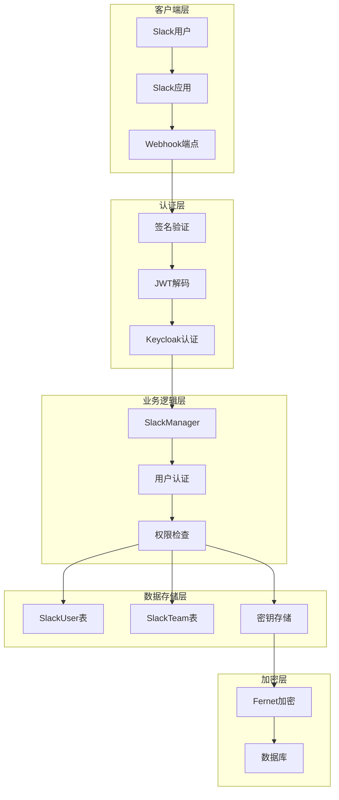
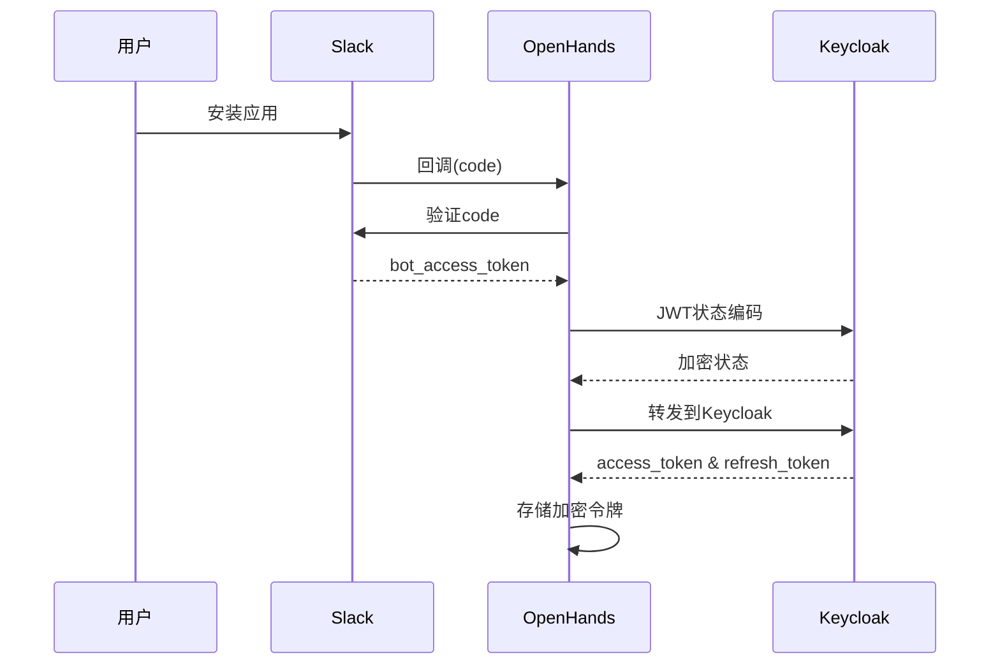
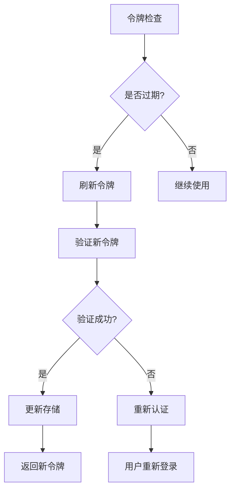
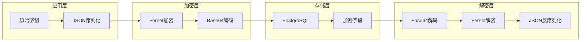
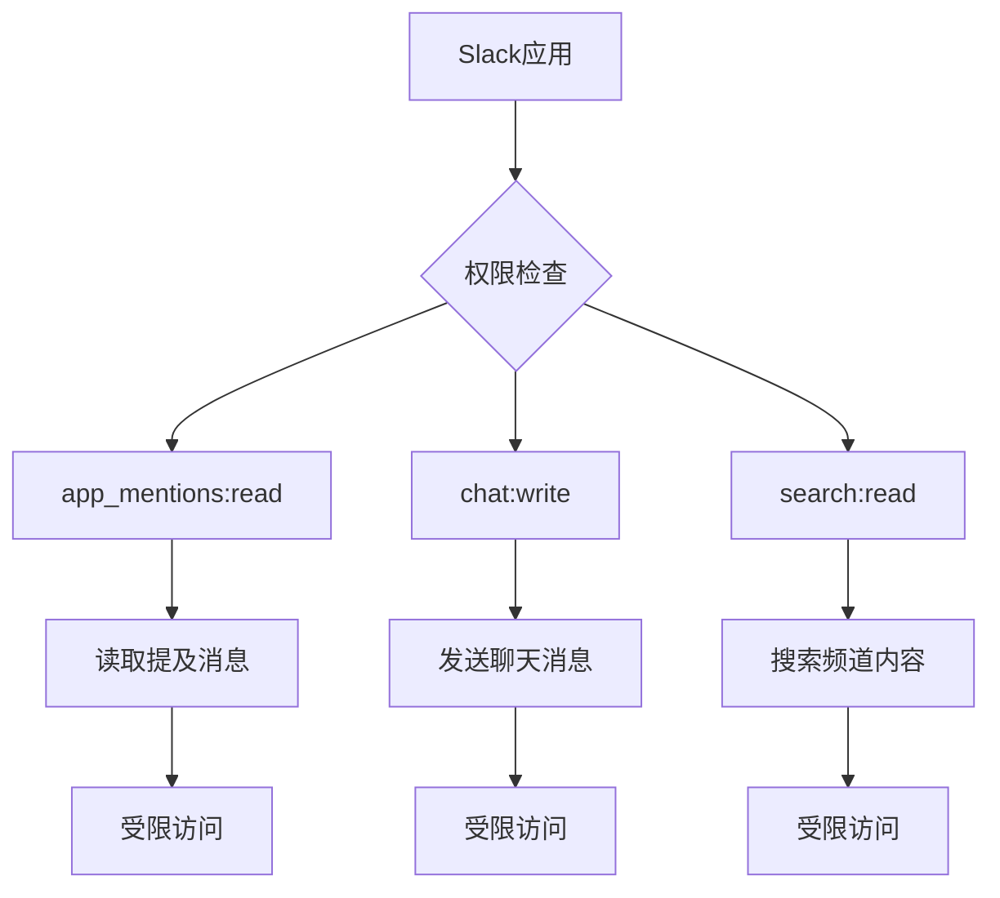
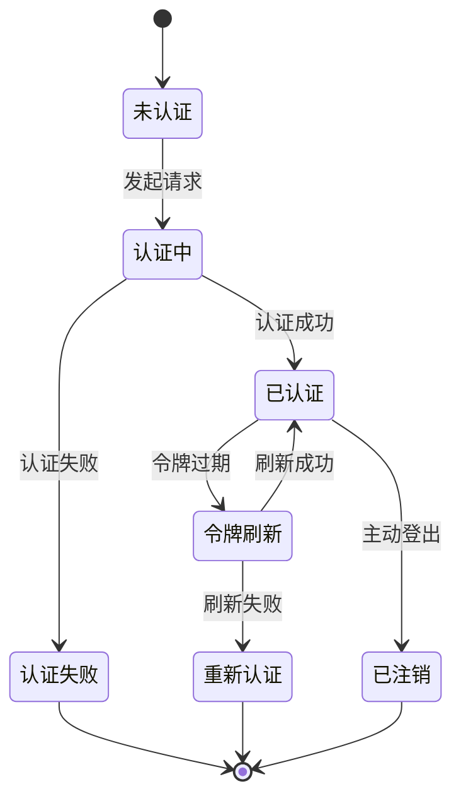
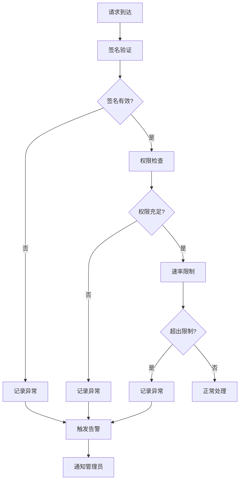
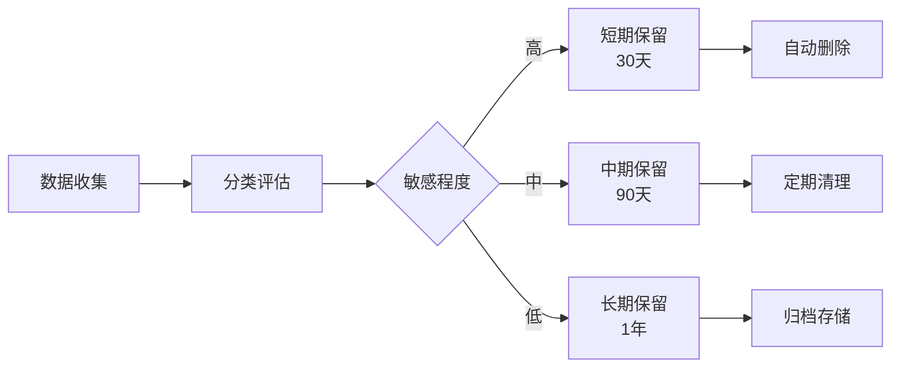
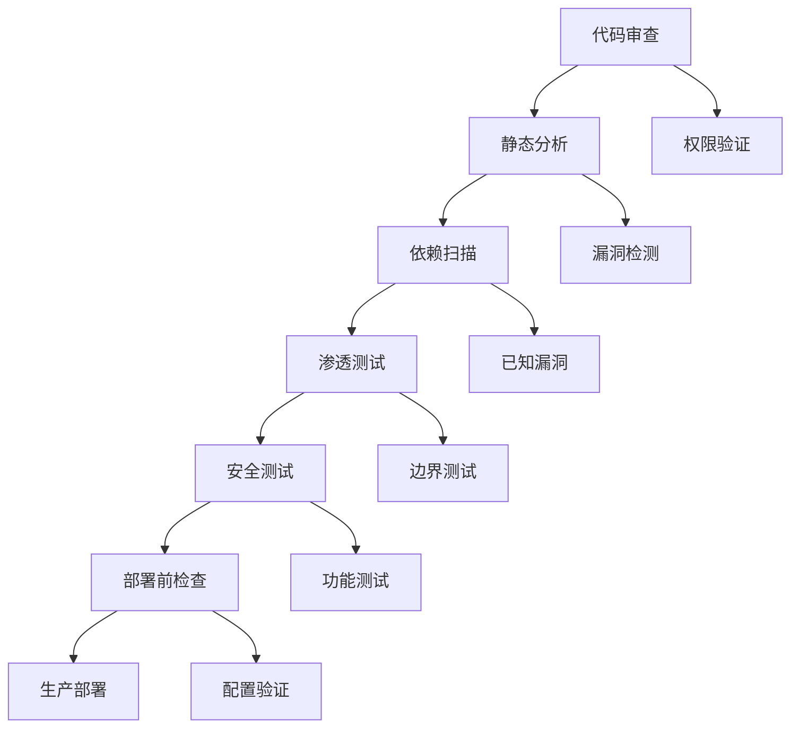
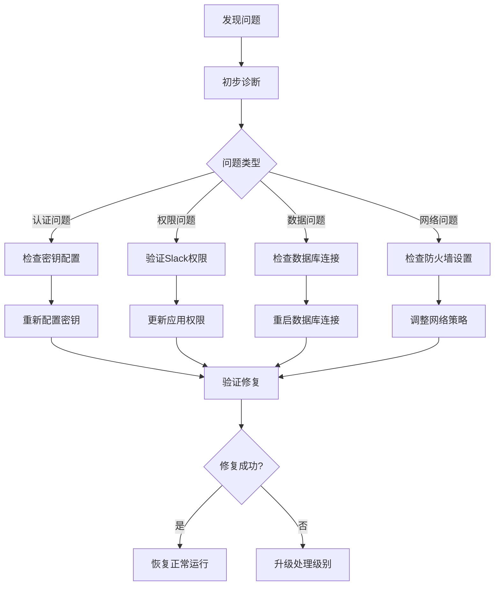

# Slack集成安全配置

<cite>
**本文档引用的文件**
- [slack_manager.py](file://enterprise/integrations/slack/slack_manager.py)
- [slack_types.py](file://enterprise/integrations/slack/slack_types.py)
- [slack_view.py](file://enterprise/integrations/slack/slack_view.py)
- [saas_secrets_store.py](file://enterprise/storage/saas_secrets_store.py)
- [stored_custom_secrets.py](file://enterprise/storage/stored_custom_secrets.py)
- [token_manager.py](file://enterprise/server/auth/token_manager.py)
- [saas_user_auth.py](file://enterprise/server/auth/saas_user_auth.py)
- [slack_user.py](file://enterprise/storage/slack_user.py)
- [slack_team.py](file://enterprise/storage/slack_team.py)
- [slack_team_store.py](file://enterprise/storage/slack_team_store.py)
- [slack.py](file://enterprise/server/routes/integration/slack.py)
- [constants.py](file://enterprise/server/constants.py)
- [database.py](file://enterprise/storage/database.py)
</cite>

## 目录
1. [概述](#概述)
2. [架构概览](#架构概览)
3. [令牌管理系统](#令牌管理系统)
4. [数据加密与存储](#数据加密与存储)
5. [访问控制策略](#访问控制策略)
6. [安全审计与监控](#安全审计与监控)
7. [合规性要求](#合规性要求)
8. [最佳实践](#最佳实践)
9. [故障排除指南](#故障排除指南)
10. [总结](#总结)

## 概述

OpenHands的Slack集成为企业级应用提供了安全可靠的通信渠道。该系统采用多层安全架构，确保API令牌的安全存储、传输和使用，同时实施严格的访问控制和审计机制。

### 核心安全特性

- **令牌生命周期管理**：完整的OAuth流程和刷新令牌机制
- **端到端加密**：所有敏感数据均采用Fernet对称加密
- **最小权限原则**：严格限制Slack应用的访问范围
- **实时审计**：全面的日志记录和异常检测
- **多层认证**：结合JWT和OAuth2.0的双重认证机制

## 架构概览

**图表来源**
- [slack_manager.py](file://enterprise/integrations/slack/slack_manager.py#L42-L364)
- [token_manager.py](file://enterprise/server/auth/token_manager.py#L78-L672)
- [saas_secrets_store.py](file://enterprise/storage/saas_secrets_store.py#L18-L130)

## 令牌管理系统

### OAuth2.0流程

系统实现了完整的OAuth2.0授权码流程，确保令牌的安全获取和存储：

**图表来源**
- [slack.py](file://enterprise/server/routes/integration/slack.py#L62-L119)
- [token_manager.py](file://enterprise/server/auth/token_manager.py#L89-L109)

### 令牌加密机制

系统采用Fernet对称加密算法保护所有敏感令牌：

| 组件 | 加密算法 | 密钥来源 | 应用场景 |
|------|----------|----------|----------|
| 访问令牌 | Fernet | SHA256(JWT密钥) | OAuth访问令牌 |
| 刷新令牌 | Fernet | SHA256(JWT密钥) | OAuth刷新令牌 |
| Bot令牌 | Fernet | SHA256(JWT密钥) | Slack Bot访问令牌 |
| 自定义密钥 | Fernet | SHA256(JWT密钥) | 用户自定义API密钥 |

**节来源**
- [token_manager.py](file://enterprise/server/auth/token_manager.py#L47-L87)
- [saas_secrets_store.py](file://enterprise/storage/saas_secrets_store.py#L113-L118)

### 令牌轮换策略

系统实现了自动化的令牌轮换机制：

**图表来源**
- [token_manager.py](file://enterprise/server/auth/token_manager.py#L289-L329)
- [saas_user_auth.py](file://enterprise/server/auth/saas_user_auth.py#L65-L78)

**节来源**
- [token_manager.py](file://enterprise/server/auth/token_manager.py#L289-L329)
- [saas_user_auth.py](file://enterprise/server/auth/saas_user_auth.py#L65-L78)

## 数据加密与存储

### 加密架构设计

系统采用分层加密架构，确保数据在存储和传输过程中的安全性：

**图表来源**
- [saas_secrets_store.py](file://enterprise/storage/saas_secrets_store.py#L100-L112)
- [stored_custom_secrets.py](file://enterprise/storage/stored_custom_secrets.py#L1-L12)

### 数据库安全配置

数据库连接采用多种安全措施：

| 安全特性 | 实现方式 | 配置参数 |
|----------|----------|----------|
| 连接池 | NullPool禁用 | poolclass=NullPool |
| 连接预检 | pool_pre_ping=True | 自动健康检查 |
| 密码保护 | 环境变量 | DB_PASS |
| 用户隔离 | 独立数据库用户 | DB_USER |
| 端口绑定 | 默认5432 | DB_PORT |

**节来源**
- [database.py](file://enterprise/storage/database.py#L1-L115)

### 敏感数据分类

系统对不同类型的敏感数据采用不同的保护策略：

| 数据类型 | 加密级别 | 存储位置 | 访问控制 |
|----------|----------|----------|----------|
| Slack Bot令牌 | 高度加密 | SlackTeam表 | 角色基础访问 |
| 用户认证令牌 | 中等加密 | SlackUser表 | 用户隔离 |
| 自定义API密钥 | 高度加密 | custom_secrets表 | 用户私有 |
| 会话数据 | 临时存储 | Redis缓存 | 时间限制 |

**节来源**
- [slack_team.py](file://enterprise/storage/slack_team.py#L1-L15)
- [slack_user.py](file://enterprise/storage/slack_user.py#L1-L16)
- [stored_custom_secrets.py](file://enterprise/storage/stored_custom_secrets.py#L1-L12)

## 访问控制策略

### 权限最小化原则

系统严格遵循最小权限原则，确保Slack应用只能访问必要的资源：

**图表来源**
- [slack_manager.py](file://enterprise/integrations/slack/slack_manager.py#L35-L39)

### 用户身份验证

系统实现了多层身份验证机制：

| 层级 | 验证方式 | 适用场景 | 安全级别 |
|------|----------|----------|----------|
| 第一层 | JWT签名验证 | Webhook请求 | 中等 |
| 第二层 | Keycloak认证 | 用户操作 | 高 |
| 第三层 | OAuth令牌验证 | API调用 | 最高 |
| 第四层 | 会话令牌验证 | 前端交互 | 中等 |

**节来源**
- [slack.py](file://enterprise/server/routes/integration/slack.py#L247-L253)
- [saas_user_auth.py](file://enterprise/server/auth/saas_user_auth.py#L207-L225)

### 会话管理

系统实现了严格的会话管理机制：

**图表来源**
- [saas_user_auth.py](file://enterprise/server/auth/saas_user_auth.py#L65-L78)
- [token_manager.py](file://enterprise/server/auth/token_manager.py#L316-L329)

**节来源**
- [saas_user_auth.py](file://enterprise/server/auth/saas_user_auth.py#L65-L78)
- [token_manager.py](file://enterprise/server/auth/token_manager.py#L316-L329)

## 安全审计与监控

### 日志记录策略

系统实现了全面的日志记录机制，涵盖所有关键操作：

| 日志类别 | 记录内容 | 保留期限 | 访问权限 |
|----------|----------|----------|----------|
| 认证日志 | 登录尝试、令牌生成 | 90天 | 系统管理员 |
| 操作日志 | API调用、权限变更 | 1年 | 审计团队 |
| 错误日志 | 异常、失败请求 | 30天 | 技术支持 |
| 安全日志 | 权限违规、可疑活动 | 永久 | 法务部门 |

### 异常检测机制

系统实现了多层次的异常检测：

**图表来源**
- [slack.py](file://enterprise/server/routes/integration/slack.py#L247-L253)
- [saas_user_auth.py](file://enterprise/server/auth/saas_user_auth.py#L218-L225)

### 入侵防范措施

系统部署了多重入侵防范机制：

| 防护层级 | 实施技术 | 检测指标 | 响应措施 |
|----------|----------|----------|----------|
| 网络层 | IP白名单 | 异常IP访问 | 自动封禁 |
| 应用层 | 请求频率限制 | 超出阈值 | 临时封禁 |
| 数据层 | 查询审计 | 异常查询模式 | 审计跟踪 |
| 传输层 | TLS加密 | 降级攻击 | 连接拒绝 |

**节来源**
- [slack.py](file://enterprise/server/routes/integration/slack.py#L247-L253)
- [saas_user_auth.py](file://enterprise/server/auth/saas_user_auth.py#L218-L225)

## 合规性要求

### 数据隐私保护

系统符合多项国际数据保护标准：

| 标准 | 符合程度 | 实施措施 | 验证方式 |
|------|----------|----------|----------|
| GDPR | 完全符合 | 数据最小化、删除权 | 定期内审 |
| CCPA | 完全符合 | 用户同意、访问权 | 合规测试 |
| ISO 27001 | 符合 | 信息安全管理体系 | 外部认证 |
| SOC 2 | 符合 | 可信服务委托 | 年度审计 |

### 数据保留政策

系统制定了明确的数据保留政策：

**图表来源**
- [saas_secrets_store.py](file://enterprise/storage/saas_secrets_store.py#L50-L85)

### 合规审计

系统支持自动化合规审计：

| 审计项目 | 检查内容 | 频率 | 报告对象 |
|----------|----------|------|----------|
| 访问控制 | 权限分配、变更记录 | 实时 | 安全团队 |
| 数据保护 | 加密状态、备份完整性 | 每日 | 技术团队 |
| 合规性 | 政策执行情况 | 每月 | 管理层 |
| 性能监控 | 系统可用性、响应时间 | 实时 | 运维团队 |

**节来源**
- [saas_secrets_store.py](file://enterprise/storage/saas_secrets_store.py#L50-L85)

## 最佳实践

### 部署安全配置

推荐的生产环境安全配置：

| 配置项 | 推荐值 | 说明 |
|--------|--------|------|
| JWT密钥长度 | ≥32字节 | 使用强随机数生成 |
| 数据库密码 | 复杂密码 | 包含大小写字母、数字、符号 |
| SSL证书 | 有效证书 | 由受信任CA签发 |
| 防火墙规则 | 最小开放端口 | 仅允许必需的端口 |
| 备份加密 | 启用 | 所有备份数据加密 |

### 开发安全指南

开发过程中的安全注意事项：

### 运维安全策略

运维阶段的安全最佳实践：

| 策略类别 | 具体措施 | 实施难度 | 效果评估 |
|----------|----------|----------|----------|
| 监控告警 | 实时异常检测 | 中等 | 高效 |
| 自动化修复 | 故障自动恢复 | 高 | 显著 |
| 定期演练 | 安全事件模拟 | 中等 | 重要 |
| 文档维护 | 操作手册更新 | 低 | 基础 |

## 故障排除指南

### 常见问题诊断

| 问题类型 | 症状 | 可能原因 | 解决方案 |
|----------|------|----------|----------|
| 认证失败 | 403错误 | 签名验证失败 | 检查SLACK_SIGNING_SECRET |
| 令牌过期 | 401错误 | OAuth令牌失效 | 执行令牌刷新 |
| 权限不足 | 访问被拒绝 | Slack权限配置错误 | 检查应用权限 |
| 数据库连接 | 连接超时 | 数据库配置错误 | 验证连接参数 |

### 故障恢复流程

### 性能优化建议

针对Slack集成的性能优化：

| 优化项目 | 当前状态 | 优化目标 | 实施计划 |
|----------|----------|----------|----------|
| 连接池配置 | 默认设置 | 提升并发能力 | 调整参数 |
| 缓存策略 | 基础缓存 | 减少数据库查询 | 引入Redis |
| 异步处理 | 同步调用 | 提升响应速度 | 异步重构 |
| 压缩传输 | 无压缩 | 减少带宽使用 | 启用gzip |

**节来源**
- [slack.py](file://enterprise/server/routes/integration/slack.py#L247-L253)
- [token_manager.py](file://enterprise/server/auth/token_manager.py#L289-L329)

## 总结

OpenHands的Slack集成安全配置体现了现代企业级应用的安全设计理念。通过多层加密、严格的访问控制、全面的审计机制和完善的合规体系，系统确保了用户数据的安全性和隐私保护。

### 关键安全优势

1. **端到端加密**：从传输到存储的全方位数据保护
2. **最小权限原则**：严格限制应用访问范围
3. **自动化安全机制**：智能的异常检测和响应
4. **合规性保障**：符合国际数据保护标准
5. **可扩展架构**：支持大规模部署和高并发访问

### 持续改进建议

- 定期更新加密算法和密钥轮换策略
- 增强机器学习驱动的异常检测能力
- 完善零信任网络架构
- 加强用户教育和安全意识培训

通过持续的安全投入和改进，OpenHands的Slack集成将继续为用户提供安全、可靠、高效的协作体验。