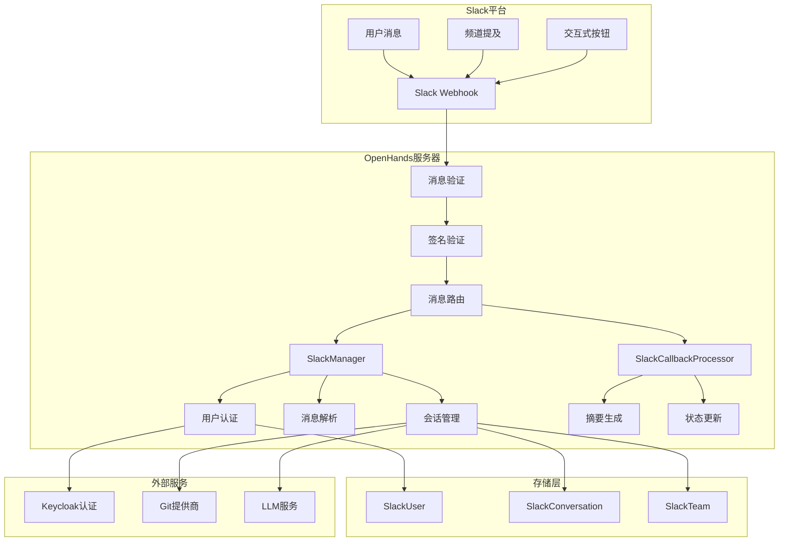
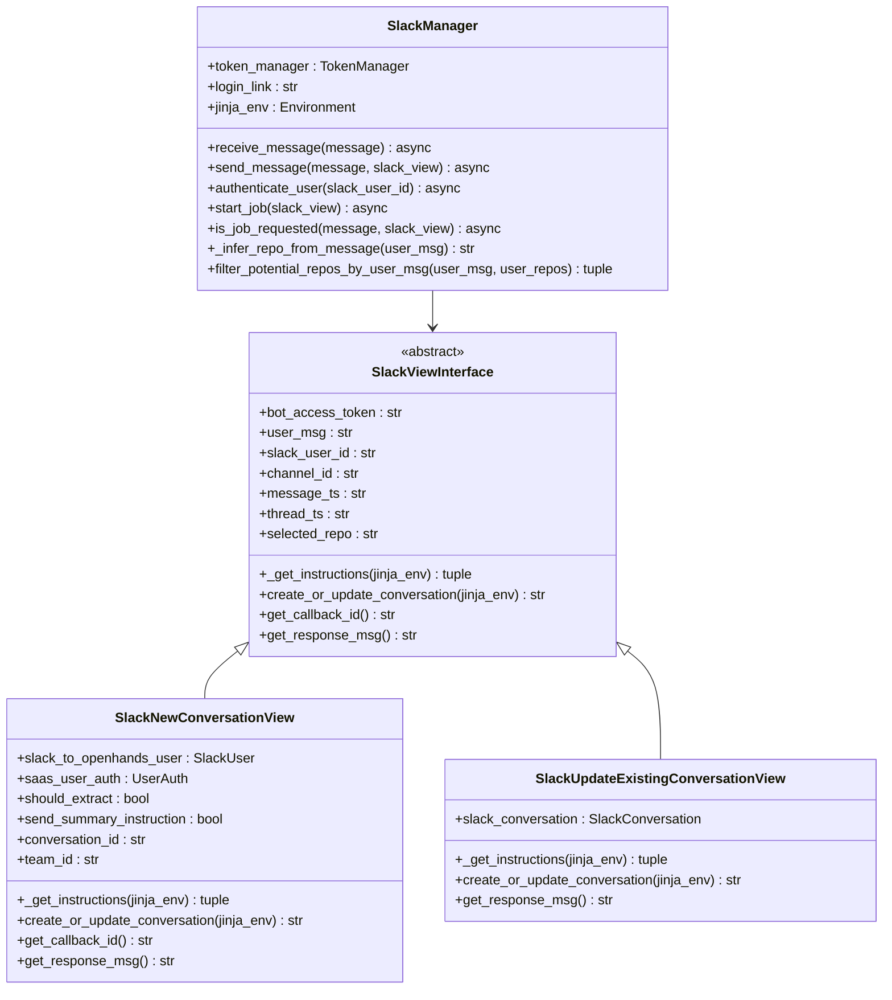
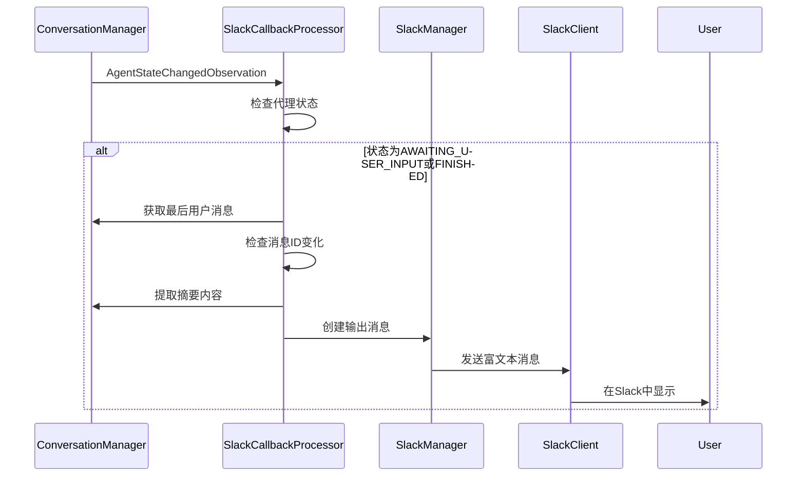
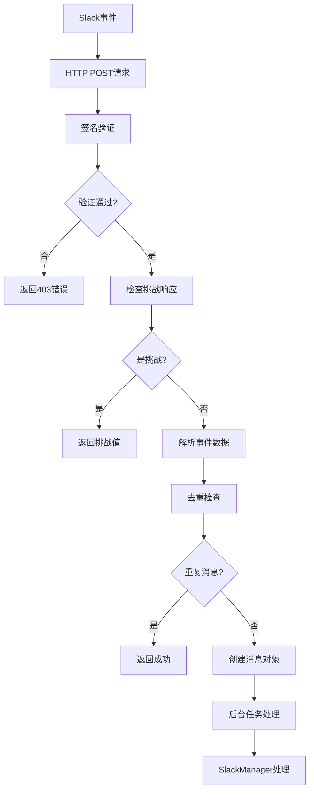
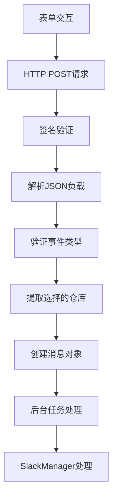
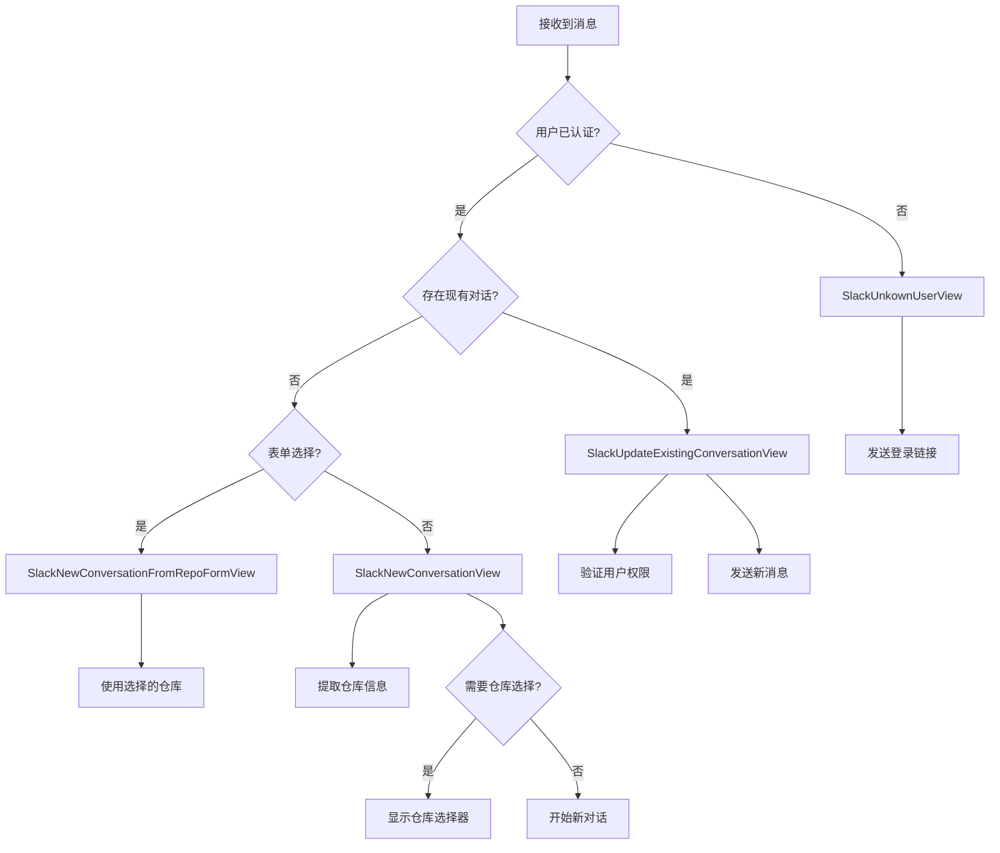
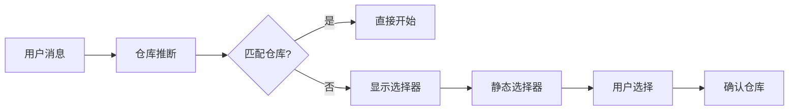
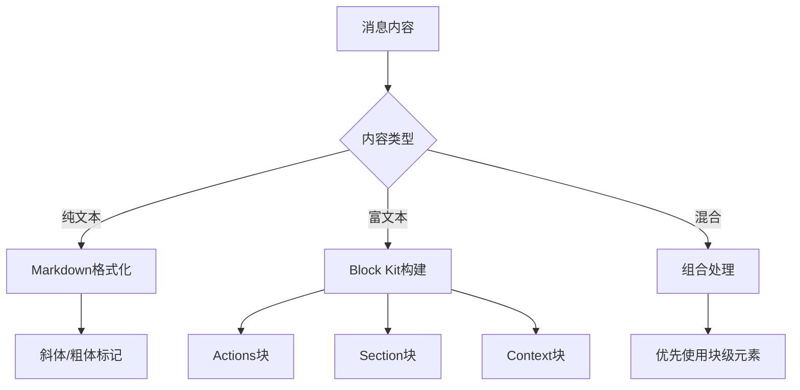
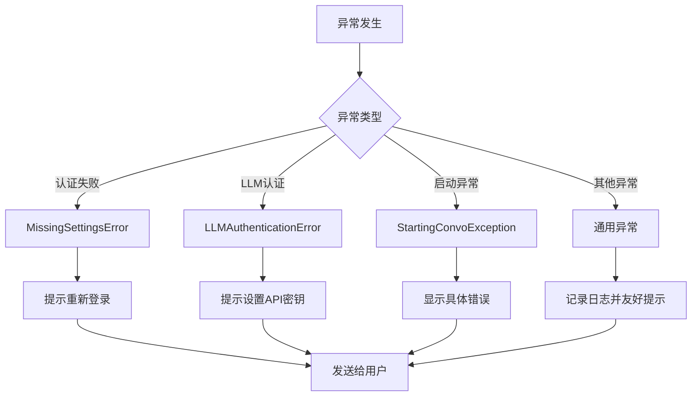
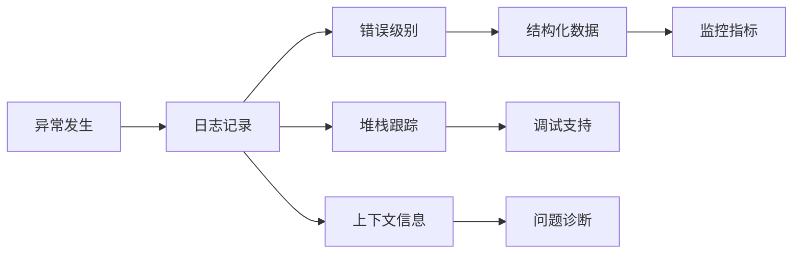

# 消息集成

<cite>
**本文档中引用的文件**
- [slack_manager.py](file://enterprise/integrations/slack/slack_manager.py)
- [slack_types.py](file://enterprise/integrations/slack/slack_types.py)
- [slack_view.py](file://enterprise/integrations/slack/slack_view.py)
- [slack_callback_processor.py](file://enterprise/server/conversation_callback_processor/slack_callback_processor.py)
- [slack.py](file://enterprise/server/routes/integration/slack.py)
- [slack_integration.py](file://enterprise/tests/unit/test_slack_integration.py)
- [slack_callback_processor_test.py](file://enterprise/tests/unit/test_slack_callback_processor.py)
</cite>

## 目录
1. [简介](#简介)
2. [系统架构](#系统架构)
3. [核心组件](#核心组件)
4. [消息监听机制](#消息监听机制)
5. [消息处理流程](#消息处理流程)
6. [消息格式化与响应](#消息格式化与响应)
7. [错误处理与用户反馈](#错误处理与用户反馈)
8. [最佳实践](#最佳实践)
9. [故障排除指南](#故障排除指南)
10. [总结](#总结)

## 简介

OpenHands的Slack消息集成功能提供了完整的双向通信能力，支持直接消息、频道提及和交互式消息按钮的处理。该系统能够智能解析用户输入，提取命令和上下文信息，并以富文本格式在Slack中呈现代码块、链接和状态更新。

### 主要功能特性

- **多类型消息支持**：直接消息、频道提及、线程回复
- **智能消息解析**：自动提取仓库信息、命令识别
- **富文本响应**：支持代码块、链接、状态指示器
- **交互式界面**：表单选择、按钮操作
- **上下文管理**：保持对话历史和状态
- **错误处理**：完善的异常捕获和用户反馈

## 系统架构

**图表来源**
- [slack_manager.py](file://enterprise/integrations/slack/slack_manager.py#L42-L364)
- [slack_callback_processor.py](file://enterprise/server/conversation_callback_processor/slack_callback_processor.py#L28-L183)
- [slack.py](file://enterprise/server/routes/integration/slack.py#L238-L352)

## 核心组件

### SlackManager - 消息处理核心

SlackManager是整个Slack集成的核心控制器，负责消息接收、用户认证、会话管理和消息发送。

**图表来源**
- [slack_manager.py](file://enterprise/integrations/slack/slack_manager.py#L42-L364)
- [slack_types.py](file://enterprise/integrations/slack/slack_types.py#L10-L49)
- [slack_view.py](file://enterprise/integrations/slack/slack_view.py#L37-L447)

### SlackCallbackProcessor - 回调处理器

负责处理来自OpenHands系统的回调事件，自动生成对话摘要并发送到Slack。

**图表来源**
- [slack_callback_processor.py](file://enterprise/server/conversation_callback_processor/slack_callback_processor.py#L81-L183)

**章节来源**
- [slack_manager.py](file://enterprise/integrations/slack/slack_manager.py#L42-L364)
- [slack_types.py](file://enterprise/integrations/slack/slack_types.py#L10-L49)
- [slack_view.py](file://enterprise/integrations/slack/slack_view.py#L37-L447)
- [slack_callback_processor.py](file://enterprise/server/conversation_callback_processor/slack_callback_processor.py#L28-L183)

## 消息监听机制

### Webhook端点配置

系统通过两个主要的Webhook端点处理不同类型的Slack事件：

#### 1. 事件回调端点 (`/slack/on-event`)

处理来自Slack的实时事件，如应用提及、消息发送等。

**图表来源**
- [slack.py](file://enterprise/server/routes/integration/slack.py#L238-L297)

#### 2. 表单交互端点 (`/slack/on-form-interaction`)

处理用户点击交互式按钮和表单提交。

**图表来源**
- [slack.py](file://enterprise/server/routes/integration/slack.py#L300-L352)

### 消息去重机制

系统实现了基于Redis的消息去重机制，防止Slack重复发送相同消息：

| 组件 | 功能 | 实现方式 |
|------|------|----------|
| Redis键 | 存储消息标识符 | `slack_msg:{client_msg_id}` |
| 过期时间 | 防止键无限增长 | 60秒过期 |
| 原子操作 | 确保唯一性 | NX（仅当不存在时设置） |

**章节来源**
- [slack.py](file://enterprise/server/routes/integration/slack.py#L238-L352)

## 消息处理流程

### 消息解析与分类

系统根据消息类型和上下文将其分类为不同的视图类型：

**图表来源**
- [slack_view.py](file://enterprise/integrations/slack/slack_view.py#L321-L447)

### 上下文提取算法

系统从Slack消息历史中智能提取上下文信息：

| 上下文类型 | 提取方法 | 限制条件 |
|------------|----------|----------|
| 线程消息 | `conversations_replies` API | 包含父消息，限制21条 |
| 频道历史 | `conversations_history` API | 反向排序，限制21条 |
| 用户消息 | 文本清理和机器人ID移除 | 保留原始意图 |
| 对话指令 | Jinja模板渲染 | 基于历史消息生成 |

**章节来源**
- [slack_view.py](file://enterprise/integrations/slack/slack_view.py#L82-L281)

## 消息格式化与响应

### 富文本消息构建

系统支持多种消息格式，包括富文本块和Markdown格式：

#### 1. 仓库选择表单

**图表来源**
- [slack_manager.py](file://enterprise/integrations/slack/slack_manager.py#L116-L156)

#### 2. 摘要消息格式

系统自动生成结构化的摘要消息：

| 元素类型 | 内容 | 格式 |
|----------|------|------|
| 用户头像 | 显示用户信息 | Slack用户图标 |
| 操作状态 | 当前执行的操作 | 图标+文本 |
| 代码块 | 代码输出 | 语法高亮 |
| 链接 | 项目文件 | 可点击链接 |
| 错误信息 | 异常详情 | 警告样式 |

### Markdown与块级元素

系统支持混合使用Markdown和Slack块级元素：

**图表来源**
- [slack_manager.py](file://enterprise/integrations/slack/slack_manager.py#L220-L242)

**章节来源**
- [slack_manager.py](file://enterprise/integrations/slack/slack_manager.py#L116-L242)
- [slack_view.py](file://enterprise/integrations/slack/slack_view.py#L82-L281)

## 错误处理与用户反馈

### 分层错误处理机制

系统实现了多层次的错误处理策略：

**图表来源**
- [slack_manager.py](file://enterprise/integrations/slack/slack_manager.py#L304-L363)

### 用户反馈最佳实践

| 错误场景 | 反馈策略 | 示例消息 |
|----------|----------|----------|
| 认证失败 | 引导重新登录 | "请重新登录OpenHands Cloud后再开始工作" |
| API密钥缺失 | 指导设置密钥 | "@用户名，请在OpenHands Cloud中设置有效的LLM API密钥" |
| 权限不足 | 明确说明原因 | "您无权访问此对话" |
| 系统错误 | 保持友好语气 | "很抱歉！处理作业时出现意外错误 :(" |

### 日志记录与监控

系统实现了全面的日志记录机制：

**图表来源**
- [slack_manager.py](file://enterprise/integrations/slack/slack_manager.py#L360-L363)
- [slack_callback_processor.py](file://enterprise/server/conversation_callback_processor/slack_callback_processor.py#L177-L183)

**章节来源**
- [slack_manager.py](file://enterprise/integrations/slack/slack_manager.py#L304-L363)
- [slack_callback_processor.py](file://enterprise/server/conversation_callback_processor/slack_callback_processor.py#L177-L183)

## 最佳实践

### 消息设计原则

1. **清晰的结构**：使用标题、分隔符和列表组织内容
2. **及时反馈**：用户操作后立即提供视觉反馈
3. **上下文相关**：根据当前状态调整消息内容
4. **可操作性**：提供明确的下一步行动指引

### 性能优化建议

| 优化项 | 实现方式 | 效果 |
|--------|----------|------|
| 消息去重 | Redis缓存 | 减少重复处理 |
| 异步处理 | 后台任务 | 不阻塞主线程 |
| 缓存用户信息 | 内存缓存 | 减少API调用 |
| 批量操作 | 连接池管理 | 提高并发性能 |

### 安全考虑

1. **签名验证**：所有Slack请求都必须经过签名验证
2. **权限控制**：严格验证用户权限和对话所有权
3. **输入过滤**：对用户输入进行适当的清理和验证
4. **令牌管理**：安全存储和轮换访问令牌

## 故障排除指南

### 常见问题及解决方案

#### 1. 消息未被处理

**症状**：发送消息后没有响应
**可能原因**：
- Slack Webhook URL配置错误
- 签名验证失败
- 消息去重机制阻止了消息

**解决步骤**：
1. 检查Slack应用的Webhook配置
2. 验证签名密钥设置
3. 查看Redis中是否存在重复键

#### 2. 用户认证失败

**症状**：收到"用户尚未认证"的提示
**可能原因**：
- 用户未完成OAuth流程
- Keycloak令牌过期
- 数据库中缺少用户关联

**解决步骤**：
1. 引导用户重新安装Slack应用
2. 检查Keycloak连接状态
3. 验证数据库中的用户映射关系

#### 3. 对话摘要不显示

**症状**：对话开始但没有后续摘要更新
**可能原因**：
- 回调处理器注册失败
- 代理状态变化检测异常
- 摘要提取逻辑错误

**解决步骤**：
1. 检查回调处理器的注册状态
2. 验证代理状态变化事件
3. 查看摘要提取的日志输出

### 调试工具和技巧

| 工具 | 用途 | 使用方法 |
|------|------|----------|
| Slack开发者工具 | 查看Webhook请求 | 在Slack应用设置中启用 |
| Redis客户端 | 检查去重键 | 使用redis-cli查看键值 |
| 应用日志 | 跟踪处理流程 | 查看服务器日志文件 |
| 浏览器开发者工具 | 检查网络请求 | 查看API响应和错误 |

**章节来源**
- [slack_manager.py](file://enterprise/integrations/slack/slack_manager.py#L304-L363)
- [slack_callback_processor.py](file://enterprise/server/conversation_callback_processor/slack_callback_processor.py#L177-L183)

## 总结

OpenHands的Slack消息集成功能提供了一个完整、可靠的平台，支持复杂的双向通信需求。通过精心设计的架构和完善的错误处理机制，系统能够：

- **可靠地处理各种消息类型**：从简单的文本消息到复杂的交互式表单
- **智能地提取和管理上下文**：确保对话的连贯性和准确性
- **提供丰富的用户体验**：通过富文本格式和及时反馈提升用户满意度
- **具备强大的错误处理能力**：确保系统的稳定性和用户信任

该集成不仅满足了当前的功能需求，还为未来的扩展和改进奠定了坚实的基础。随着OpenHands功能的不断完善，这个Slack集成将继续发挥重要作用，为用户提供无缝的协作体验。