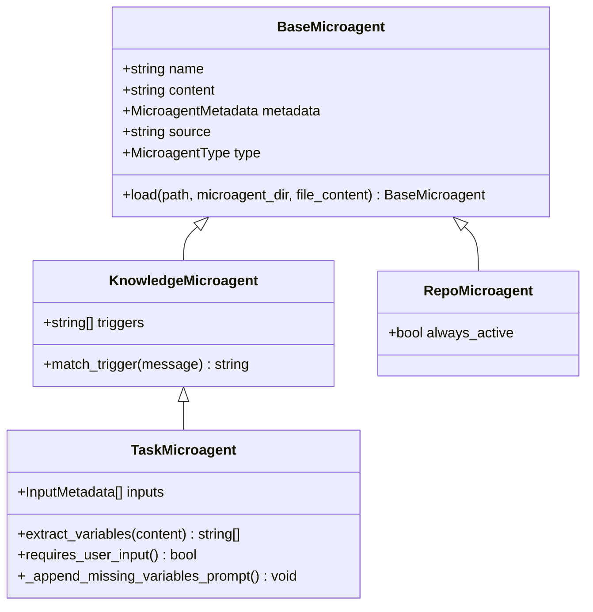
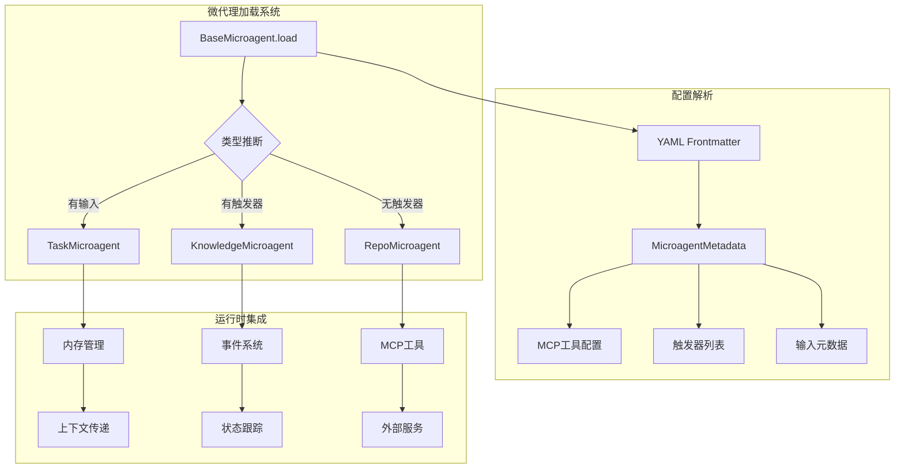
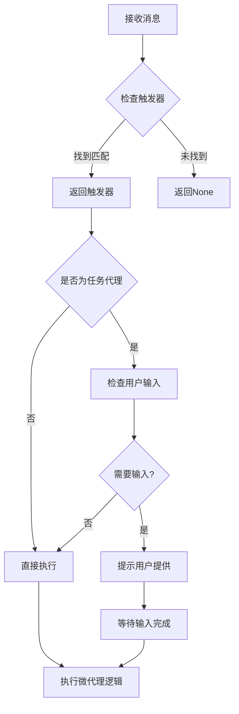
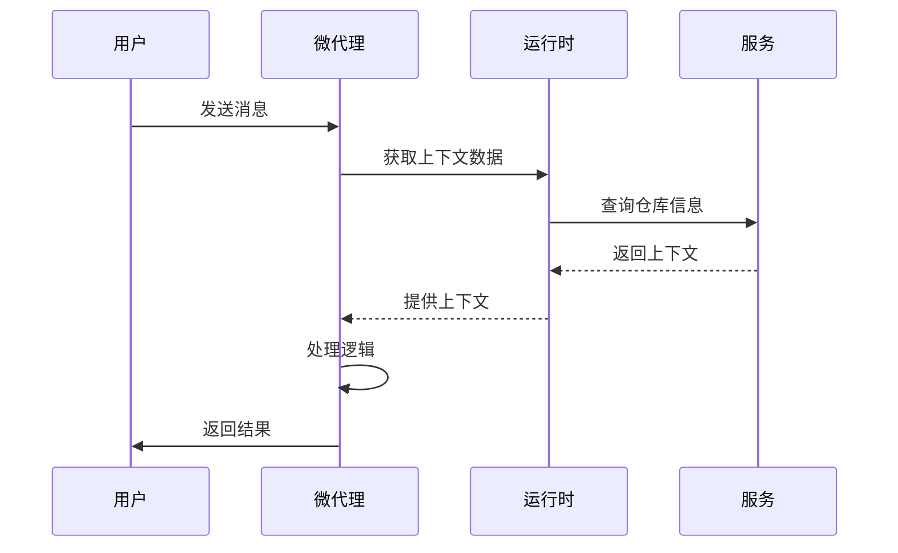
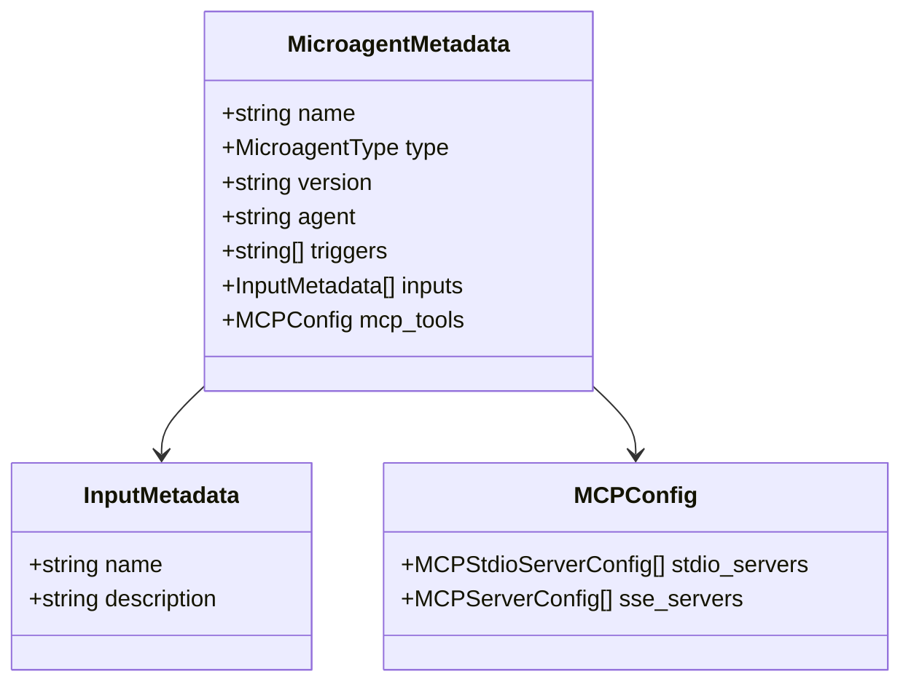
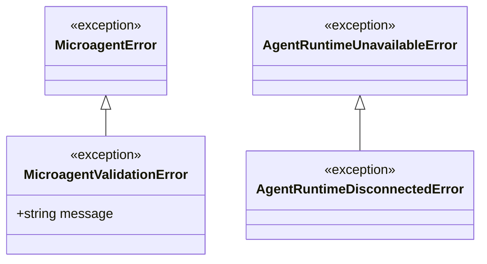
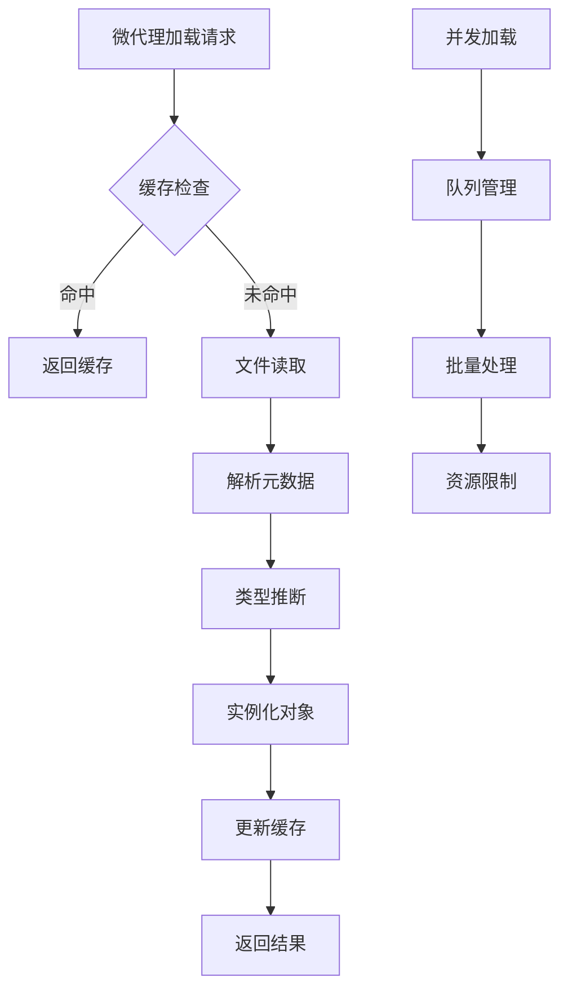
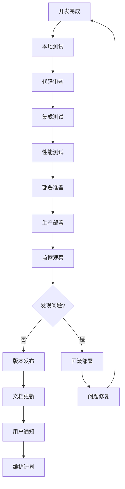

# 微代理开发指南

<cite>
**本文档中引用的文件**
- [microagents/README.md](file://microagents/README.md)
- [openhands/microagent/microagent.py](file://openhands/microagent/microagent.py)
- [openhands/microagent/types.py](file://openhands/microagent/types.py)
- [microagents/github.md](file://microagents/github.md)
- [microagents/docker.md](file://microagents/docker.md)
- [microagents/code-review.md](file://microagents/code-review.md)
- [microagents/update_pr_description.md](file://microagents/update_pr_description.md)
- [microagents/default-tools.md](file://microagents/default-tools.md)
- [tests/runtime/test_microagent.py](file://tests/runtime/test_microagent.py)
- [openhands/core/exceptions.py](file://openhands/core/exceptions.py)
- [openhands/core/logger.py](file://openhands/core/logger.py)
- [openhands/mcp/utils.py](file://openhands/mcp/utils.py)
- [openhands/integrations/service_types.py](file://openhands/integrations/service_types.py)
</cite>

## 目录
1. [简介](#简介)
2. [微代理类型与架构](#微代理类型与架构)
3. [微代理创建基础](#微代理创建基础)
4. [触发条件与匹配机制](#触发条件与匹配机制)
5. [执行逻辑与上下文处理](#执行逻辑与上下文处理)
6. [配置规范与元数据](#配置规范与元数据)
7. [代码示例与实现模式](#代码示例与实现模式)
8. [错误处理与日志记录](#错误处理与日志记录)
9. [性能优化最佳实践](#性能优化最佳实践)
10. [测试与验证方法](#测试与验证方法)
11. [部署与维护指南](#部署与维护指南)
12. [故障排除指南](#故障排除指南)

## 简介

微代理（Microagents）是OpenHands平台中专门化的提示模板，能够增强AI助手在特定领域知识和任务工作流方面的表现。它们通过提供专家级指导、自动化常见任务和确保项目间的一致性实践来帮助开发者。

微代理系统支持两种主要来源：
- **可共享微代理（公共）**：位于`OpenHands/microagents/`目录，对所有OpenHands用户可用
- **仓库指令（私有）**：存储在`.openhands/microagents/repo.md`中，仅对该仓库可见

## 微代理类型与架构

### 微代理类型分类



**图表来源**
- [openhands/microagent/microagent.py](file://openhands/microagent/microagent.py#L17-L342)
- [openhands/microagent/types.py](file://openhands/microagent/types.py#L11-L60)

### 核心组件关系



**图表来源**
- [openhands/microagent/microagent.py](file://openhands/microagent/microagent.py#L52-L171)
- [openhands/mcp/utils.py](file://openhands/mcp/utils.py#L295-L339)

**章节来源**
- [openhands/microagent/microagent.py](file://openhands/microagent/microagent.py#L17-L342)
- [openhands/microagent/types.py](file://openhands/microagent/types.py#L11-L60)

## 微代理创建基础

### 基本结构要求

每个微代理必须遵循Markdown格式，包含YAML前言部分和内容主体：

```yaml
---
name: 微代理名称
type: knowledge|repo|task
version: 1.0.0
agent: CodeActAgent
triggers: [触发关键词列表]
inputs:
  - name: 变量名
    description: 变量描述
    type: string
    validation:
      pattern: 正则表达式
---
内容主体
```

### 文件命名约定

- **知识代理**：使用描述性名称，如`git.md`、`testing.md`
- **仓库代理**：统一命名为`repo.md`
- **任务代理**：使用动词开头，如`create-pr.md`

### 加载优先级

当OpenHands处理仓库时，按以下顺序加载微代理：
1. 仓库特定指令（`.openhands/microagents/repo.md`）
2. 关键词触发的知识代理
3. 默认工具配置

**章节来源**
- [microagents/README.md](file://microagents/README.md#L51-L138)
- [openhands/microagent/microagent.py](file://openhands/microagent/microagent.py#L52-L171)

## 触发条件与匹配机制

### 触发器类型

#### 关键词触发器
知识代理通过关键词触发，支持精确匹配和模糊匹配：

```yaml
triggers:
  - git
  - github
  - /codereview
  - /create-pr
```

#### 任务触发器
任务代理自动添加触发器，格式为`/{agent_name}`：

```python
# 自动添加的触发器
trigger = f'/{metadata.name}'
if not metadata.triggers or trigger not in metadata.triggers:
    if not metadata.triggers:
        metadata.triggers = [trigger]
    else:
        metadata.triggers.append(trigger)
```

### 匹配算法



**图表来源**
- [openhands/microagent/microagent.py](file://openhands/microagent/microagent.py#L189-L200)

**章节来源**
- [openhands/microagent/microagent.py](file://openhands/microagent/microagent.py#L189-L200)
- [microagents/github.md](file://microagents/github.md#L6-L8)

## 执行逻辑与上下文处理

### 上下文数据处理

微代理可以访问多种上下文信息：



**图表来源**
- [openhands/integrations/service_types.py](file://openhands/integrations/service_types.py#L269-L301)

### 输入变量处理

任务代理支持动态输入变量，使用`${variable_name}`语法：

```python
def extract_variables(self, content: str) -> list[str]:
    """从内容中提取变量"""
    pattern = r'\$\{([a-zA-Z_][a-zA-Z0-9_]*)\}'
    matches = re.findall(pattern, content)
    return matches

def requires_user_input(self) -> bool:
    """检查是否需要用户输入"""
    variables = self.extract_variables(self.content)
    return len(variables) > 0
```

### 状态管理

微代理支持多种状态：
- `WAITING`: 等待触发
- `CREATING`: 创建中
- `COMPLETED`: 完成
- `ERROR`: 错误

**章节来源**
- [openhands/microagent/microagent.py](file://openhands/microagent/microagent.py#L252-L270)
- [frontend/src/types/microagent-status.ts](file://frontend/src/types/microagent-status.ts#L1-L13)

## 配置规范与元数据

### 元数据字段详解



**图表来源**
- [openhands/microagent/types.py](file://openhands/microagent/types.py#L26-L37)

### 版本控制策略

- **语义化版本**：使用`major.minor.patch`格式
- **向后兼容**：新版本应保持向后兼容性
- **迁移指南**：重大变更时提供迁移说明

### MCP工具集成

微代理支持通过MCP（Model Context Protocol）集成外部工具：

```yaml
mcp_tools:
  stdio_servers:
    - name: "fetch"
      command: "uvx"
      args: ["mcp-server-fetch"]
```

**章节来源**
- [openhands/microagent/types.py](file://openhands/microagent/types.py#L26-L37)
- [microagents/default-tools.md](file://microagents/default-tools.md#L8-L13)

## 代码示例与实现模式

### 简单知识代理示例

```yaml
---
name: docker
type: knowledge
version: 1.0.0
agent: CodeActAgent
triggers:
- docker
- container
---
# Docker使用指南

## 容器环境启动
```bash
# 后台启动Docker守护进程
sudo dockerd > /tmp/docker.log 2>&1 &

# 等待Docker初始化
sleep 5
```

## 验证安装
```bash
sudo docker run hello-world
```
```

### 任务代理示例

```yaml
---
name: update_pr_description
version: 1.0.0
author: openhands
agent: CodeActAgent
triggers:
- /update_pr_description
inputs:
  - name: PR_URL
    description: "Pull Request URL"
    type: string
    validation:
      pattern: "^https://github.com/.+/.+/pull/[0-9]+$"
  - name: BRANCH_NAME
    description: "对应Pull Request的分支名称"
    type: string
---
请检查分支 "{{ BRANCH_NAME }}" 并查看与主分支的差异。这个分支属于PR "{{ PR_URL }}"。

理解差异目的后，请使用GitHub API读取现有PR描述，并根据需要更新以更准确地反映所做的更改。
```

### 复杂代码审查代理

```yaml
---
triggers:
- /codereview
---
PERSONA:
你是一位经验丰富的软件工程师和代码审查专家，精通现代编程最佳实践、安全编码和整洁代码原则。

TASK:
审查此Pull Request或Merge Request中的代码变更，提供有助于作者提高代码质量、可维护性和安全性的具体反馈。不要修改代码；只提供具体的反馈。

CONTEXT:
你拥有Pull Request或Merge Request中提交代码的完整上下文，包括diff、相关文件和项目结构。代码采用现代语言编写，遵循该语言的典型习惯和模式。

ROLE:
作为自动化审查员，你的职责是分析代码变更并产生结构化评论，包括行号等信息。
```

**章节来源**
- [microagents/docker.md](file://microagents/docker.md#L1-L32)
- [microagents/update_pr_description.md](file://microagents/update_pr_description.md#L1-L22)
- [microagents/code-review.md](file://microagents/code-review.md#L1-L55)

## 错误处理与日志记录

### 异常处理体系



**图表来源**
- [openhands/core/exceptions.py](file://openhands/core/exceptions.py#L225-L235)

### 日志记录最佳实践

```python
# 配置日志级别
LOG_LEVEL = os.getenv('LOG_LEVEL', 'INFO').upper()
DEBUG = os.getenv('DEBUG', 'False').lower() in ['true', '1', 'yes']

# 结构化日志
class RollingLogger:
    def __init__(self, max_lines: int = 10, char_limit: int = 80) -> None:
        self.max_lines = max_lines
        self.char_limit = char_limit
        self.log_lines = [''] * self.max_lines
        self.all_lines = ''

    def add_line(self, line: str) -> None:
        self.log_lines.pop(0)
        self.log_lines.append(line[: self.char_limit])
        self.print_lines()
```

### 错误恢复机制

1. **验证失败**：提供详细的错误信息和修复建议
2. **运行时错误**：优雅降级和重试机制
3. **网络错误**：连接超时和重试策略
4. **资源不足**：内存管理和资源清理

**章节来源**
- [openhands/core/exceptions.py](file://openhands/core/exceptions.py#L225-L235)
- [openhands/core/logger.py](file://openhands/core/logger.py#L1-L200)
- [openhands/microagent/microagent.py](file://openhands/microagent/microagent.py#L119-L127)

## 性能优化最佳实践

### 加载优化



### 内存管理

- **延迟加载**：按需加载微代理内容
- **缓存策略**：LRU缓存最近使用的微代理
- **资源清理**：及时释放不再使用的资源
- **内存监控**：监控内存使用情况

### 并发处理

```python
# 并发加载多个微代理
async def load_microagents_concurrently(paths: List[Path]) -> Dict[str, BaseMicroagent]:
    tasks = [load_single_microagent(path) for path in paths]
    results = await asyncio.gather(*tasks, return_exceptions=True)
    
    agents = {}
    for path, result in zip(paths, results):
        if isinstance(result, BaseMicroagent):
            agents[result.name] = result
        else:
            logger.error(f"Failed to load {path}: {result}")
    
    return agents
```

### 性能监控指标

- **加载时间**：微代理加载耗时
- **内存使用**：微代理占用内存
- **命中率**：缓存命中率
- **错误率**：加载失败率

**章节来源**
- [openhands/microagent/microagent.py](file://openhands/microagent/microagent.py#L277-L342)

## 测试与验证方法

### 单元测试框架

```python
def test_task_microagent_creation():
    """测试TaskMicroagent正确创建"""
    content = """---
    name: test_task
    version: 1.0.0
    author: openhands
    agent: CodeActAgent
    triggers:
    - /test_task
    inputs:
      - name: TEST_VAR
        description: "Test variable"
    ---
    This is a test task microagent with a variable: ${test_var}.
    """
    
    with tempfile.NamedTemporaryFile(suffix='.md') as f:
        f.write(content.encode())
        f.flush()
        
        agent = BaseMicroagent.load(f.name)
        
        assert isinstance(agent, TaskMicroagent)
        assert agent.type == MicroagentType.TASK
        assert agent.name == 'test_task'
        assert '/test_task' in agent.triggers
        assert "If the user didn't provide any of these variables" in agent.content
```

### 集成测试

```python
def test_load_microagents_with_selected_repo(temp_dir, runtime_cls, run_as_openhands):
    """测试从选定仓库加载微代理"""
    # 创建测试文件
    repo_dir = Path(temp_dir) / 'OpenHands'
    repo_dir.mkdir(parents=True)
    _create_test_microagents(str(repo_dir))
    
    runtime, config = _load_runtime(temp_dir, runtime_cls, run_as_openhands)
    try:
        # 加载微代理
        loaded_agents = runtime.get_microagents_from_selected_repo('OpenHands/OpenHands')
        
        # 验证所有代理已加载
        knowledge_agents = [a for a in loaded_agents if isinstance(a, KnowledgeMicroagent)]
        repo_agents = [a for a in loaded_agents if isinstance(a, RepoMicroagent)]
        
        assert len(knowledge_agents) == 1
        agent = knowledge_agents[0]
        assert agent.name == 'knowledge/knowledge'
        assert 'test' in agent.triggers
        
    finally:
        _close_test_runtime(runtime)
```

### 验证规则

1. **语法验证**：YAML格式正确性
2. **语义验证**：字段值有效性
3. **功能验证**：触发匹配逻辑
4. **性能验证**：加载时间和内存使用

**章节来源**
- [tests/runtime/test_microagent.py](file://tests/runtime/test_microagent.py#L183-L438)

## 部署与维护指南

### 部署流程



### 维护策略

1. **定期更新**：根据技术发展更新微代理
2. **性能监控**：持续监控性能指标
3. **用户反馈**：收集和处理用户反馈
4. **安全审计**：定期进行安全审查

### 版本管理

- **分支策略**：使用Git Flow进行版本管理
- **标签管理**：为每个版本创建标签
- **变更日志**：维护详细的变更记录
- **向后兼容**：确保版本间的兼容性

**章节来源**
- [microagents/README.md](file://microagents/README.md#L127-L138)

## 故障排除指南

### 常见问题诊断

#### 微代理无法加载

```python
# 检查文件权限
if not os.access(file_path, os.R_OK):
    raise MicroagentValidationError(f"Cannot read microagent file: {file_path}")

# 验证YAML格式
try:
    metadata = MicroagentMetadata(**metadata_dict)
except ValidationError as e:
    raise MicroagentValidationError(f"Invalid metadata: {e}")
```

#### 触发器不匹配

```python
def diagnose_trigger_issues(agent: BaseMicroagent, message: str) -> List[str]:
    """诊断触发器问题"""
    issues = []
    
    if hasattr(agent, 'match_trigger'):
        matched = agent.match_trigger(message)
        if matched:
            issues.append(f"Trigger '{matched}' matched successfully")
        else:
            issues.append(f"No trigger matched for message: {message}")
            issues.append(f"Available triggers: {agent.triggers}")
    
    return issues
```

#### 性能问题

1. **加载缓慢**：检查文件大小和复杂度
2. **内存泄漏**：监控内存使用趋势
3. **并发问题**：检查线程安全

### 调试工具

```python
# 启用调试模式
DEBUG = os.getenv('DEBUG', 'False').lower() in ['true', '1', 'yes']

# 详细日志记录
logger.debug(f"Loading microagent: {agent.name}")
logger.debug(f"Type inference: {inferred_type}")
logger.debug(f"Metadata: {agent.metadata.dict()}")
```

### 监控指标

- **加载成功率**：微代理加载成功比例
- **响应时间**：平均加载时间
- **错误分布**：各类错误发生频率
- **用户使用统计**：微代理使用情况

**章节来源**
- [openhands/microagent/microagent.py](file://openhands/microagent/microagent.py#L119-L127)
- [openhands/core/logger.py](file://openhands/core/logger.py#L16-L50)

## 结论

微代理系统为OpenHands提供了强大的扩展能力，通过精心设计的架构和完善的开发指南，开发者可以创建出功能强大、易于维护的微代理。遵循本指南中的最佳实践，结合适当的测试和监控，可以确保微代理系统的稳定性和可扩展性。

随着OpenHands平台的发展，微代理系统将继续演进，为开发者提供更多创新的可能性。建议开发者持续关注平台更新，及时采用新的特性和改进。