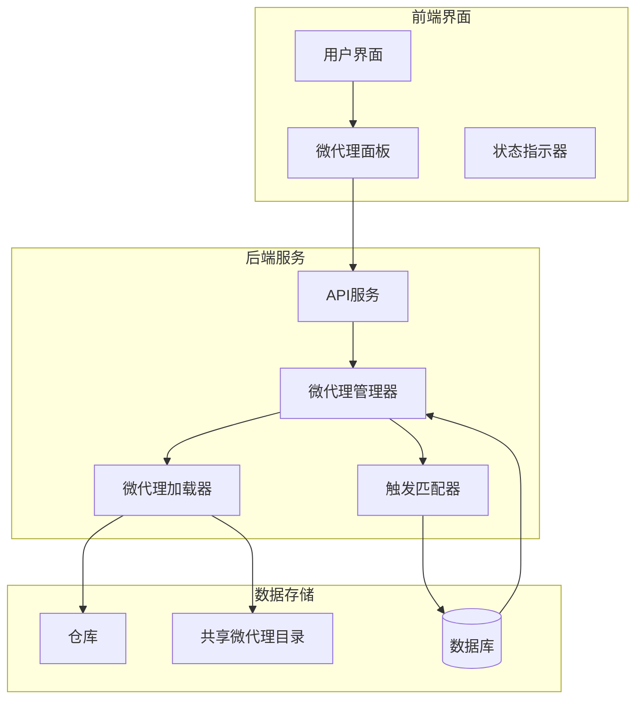
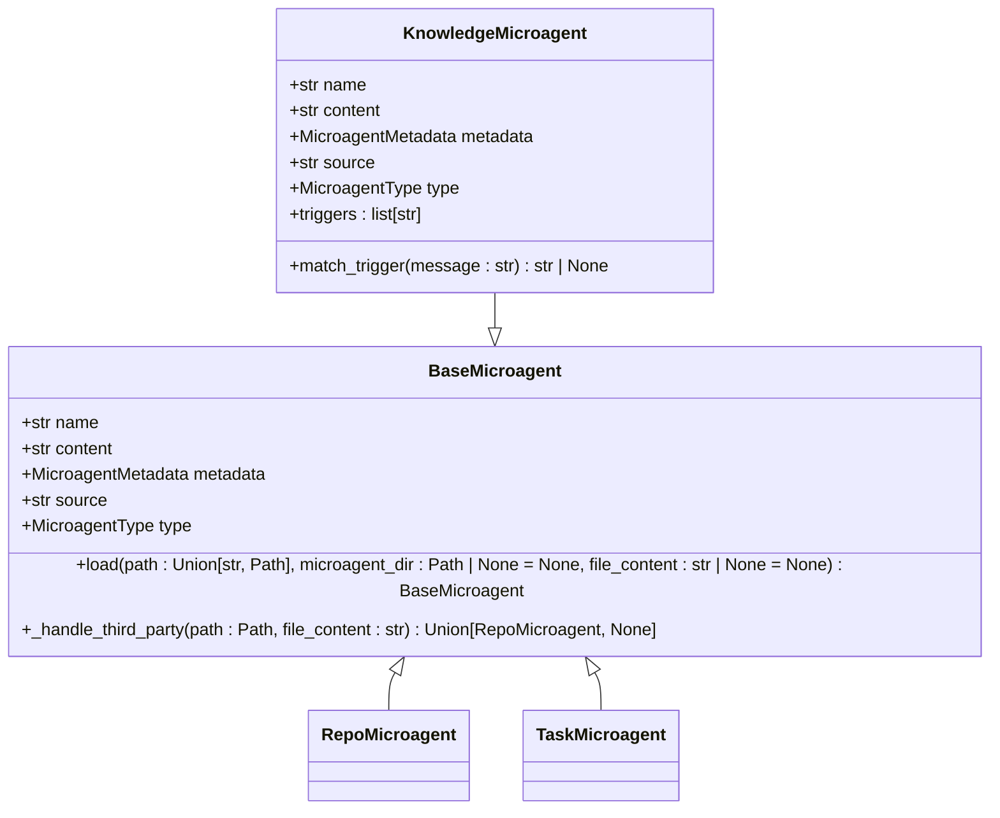
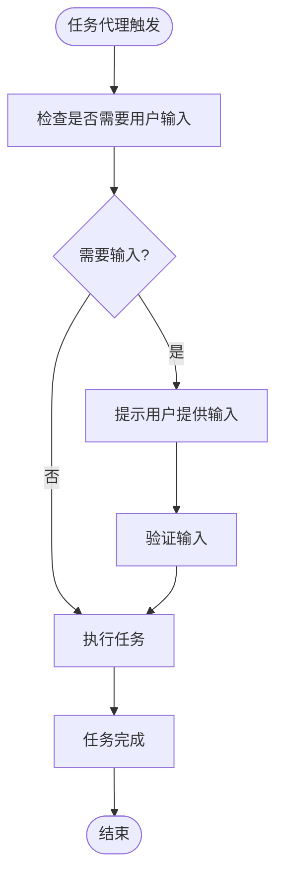
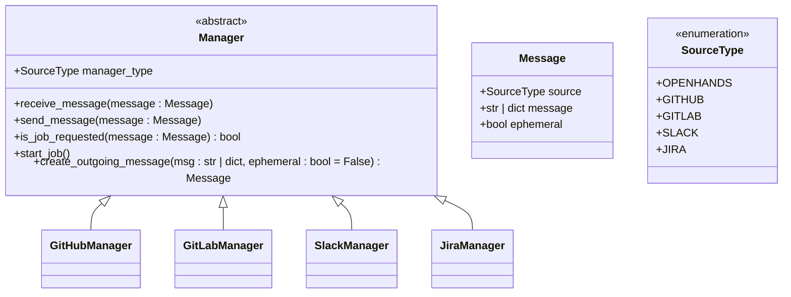
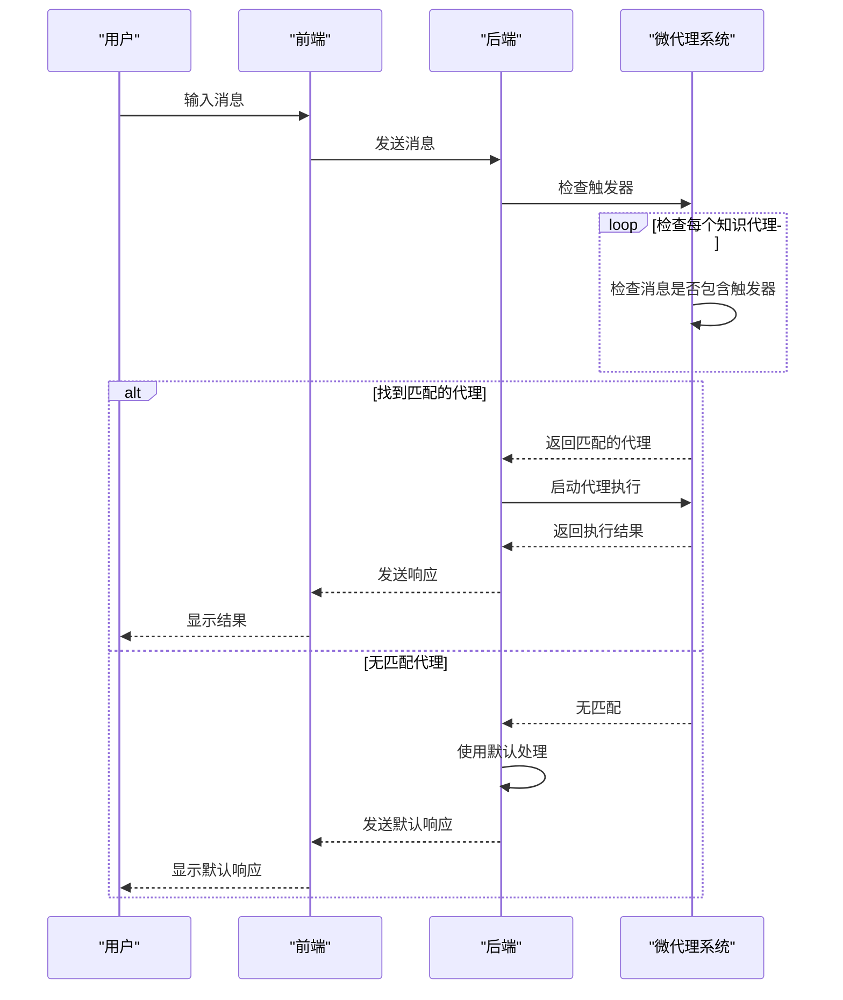
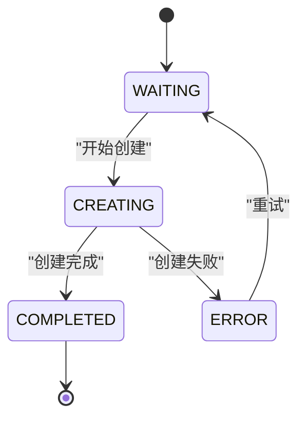
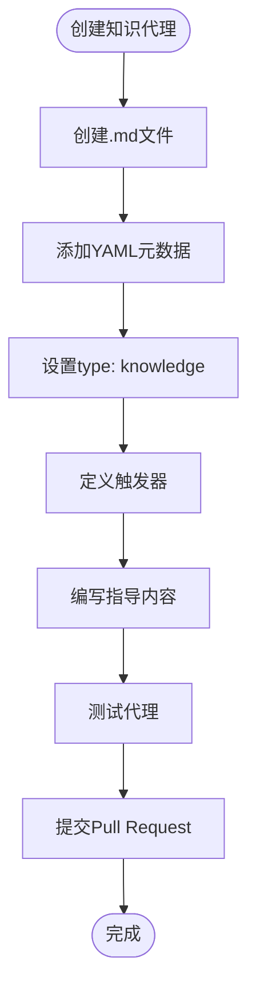

# 微代理系统

<cite>
**本文档引用的文件**
- [microagents/README.md](file://microagents/README.md)
- [enterprise/integrations/manager.py](file://enterprise/integrations/manager.py)
- [openhands/microagent/microagent.py](file://openhands/microagent/microagent.py)
- [openhands/microagent/types.py](file://openhands/microagent/types.py)
- [microagents/github.md](file://microagents/github.md)
- [microagents/code-review.md](file://microagents/code-review.md)
- [microagents/docker.md](file://microagents/docker.md)
- [frontend/src/components/features/microagent-management/microagent-management-main.tsx](file://frontend/src/components/features/microagent-management/microagent-management-main.tsx)
- [frontend/src/types/microagent-status.ts](file://frontend/src/types/microagent-status.ts)
- [openhands/integrations/service_types.py](file://openhands/integrations/service_types.py)
</cite>

## 目录
1. [简介](#简介)
2. [微代理架构设计](#微代理架构设计)
3. [微代理类型与实现模式](#微代理类型与实现模式)
4. [微代理管理逻辑分析](#微代理管理逻辑分析)
5. [自定义微代理开发指南](#自定义微代理开发指南)
6. [最佳实践](#最佳实践)
7. [结论](#结论)

## 简介

微代理系统是OpenHands平台的核心扩展机制，通过专门化的提示词（prompts）为开发者提供领域特定知识和任务特定工作流程。微代理系统旨在通过提供专家指导、自动化常见任务和确保项目间的一致性实践来增强开发体验。该系统支持两种主要类型的微代理：知识代理和仓库代理，每种都有其特定的触发条件和使用场景。

微代理系统的设计目标是创建一个灵活且可扩展的框架，使开发者能够轻松地为各种工具、框架和工作流程创建专门的代理。这些代理可以是公开共享的，也可以是私有的仓库特定指南，从而在团队协作和项目一致性方面提供强大的支持。

**Section sources**
- [microagents/README.md](file://microagents/README.md)

## 微代理架构设计

微代理系统的架构设计基于模块化和可扩展性原则，主要由以下几个核心组件构成：



**Diagram sources**
- [frontend/src/components/features/microagent-management/microagent-management-main.tsx](file://frontend/src/components/features/microagent-management/microagent-management-main.tsx)
- [enterprise/integrations/manager.py](file://enterprise/integrations/manager.py)

微代理系统的整体架构分为三个主要层次：前端界面、后端服务和数据存储。前端界面负责向用户展示可用的微代理及其状态；后端服务处理微代理的加载、管理和执行逻辑；数据存储层则保存微代理的定义和相关元数据。

系统的核心是微代理管理器（Manager），它负责协调微代理的整个生命周期，包括加载、触发和执行。微代理加载器负责从不同的源（共享目录和仓库特定目录）加载微代理定义，而触发匹配器则负责根据用户输入确定哪些微代理应该被激活。

**Section sources**
- [enterprise/integrations/manager.py](file://enterprise/integrations/manager.py)
- [openhands/microagent/microagent.py](file://openhands/microagent/microagent.py)

## 微代理类型与实现模式

微代理系统支持多种类型的代理，每种类型都有其特定的使用场景和实现模式。主要分为知识代理、仓库代理和任务代理三种类型。

### 知识代理

知识代理提供特定领域的专业知识，通过关键词触发。这些代理通常用于语言最佳实践、框架指南、常见模式和工具使用等方面。



**Diagram sources**
- [openhands/microagent/microagent.py](file://openhands/microagent/microagent.py)
- [openhands/microagent/types.py](file://openhands/microagent/types.py)

知识代理的关键特性包括：
- **触发式激活**：通过对话中的特定关键词激活
- **上下文感知**：根据文件类型和内容提供相关建议
- **可重用性**：知识可以在多个项目中应用
- **版本控制**：支持工具/框架的多个版本

例如，github.md微代理定义了与GitHub API交互的最佳实践，包括使用GITHUB_TOKEN环境变量、避免直接推送到主分支等重要指导原则。

**Section sources**
- [microagents/github.md](file://microagents/github.md)
- [microagents/docker.md](file://microagents/docker.md)

### 仓库代理

仓库代理提供特定仓库的知识和指南，从`.openhands/microagents/repo.md`文件中加载。这些代理是仓库特定的，自动为相应仓库激活，非常适合团队实践和项目约定。

仓库代理的关键特征包括：
- **项目特定性**：包含仓库独有的指南
- **团队导向性**：强制执行团队约定和实践
- **始终激活**：自动为仓库加载
- **本地维护**：随项目更新

仓库代理的实现基于RepoMicroagent类，该类继承自BaseMicroagent基类。它们通常没有触发器，因此在与特定仓库交互时始终处于激活状态。

**Section sources**
- [microagents/README.md](file://microagents/README.md)
- [openhands/microagent/microagent.py](file://openhands/microagent/microagent.py)

### 任务代理

任务代理是一种特殊的知识代理，需要用户输入。这些代理通过特殊格式`/{agent_name}`触发，并在继续之前提示用户提供任何必需的输入。



**Diagram sources**
- [openhands/microagent/microagent.py](file://openhands/microagent/microagent.py)

任务代理的实现通过TaskMicroagent类完成，该类继承自KnowledgeMicroagent。它们的主要特点是包含inputs字段，定义了执行任务所需的各种输入参数。当检测到变量占位符（如${variable_name}）时，系统会自动提示用户提供缺失的变量。

**Section sources**
- [openhands/microagent/microagent.py](file://openhands/microagent/microagent.py)
- [openhands/microagent/types.py](file://openhands/microagent/types.py)

## 微代理管理逻辑分析

微代理的管理逻辑主要在enterprise/integrations/manager.py文件中定义，通过Manager抽象基类实现。该类定义了微代理系统的核心接口和行为规范。

### 核心管理接口

Manager类定义了微代理管理的核心接口，包括消息接收、发送、作业请求确认和作业启动等方法：



**Diagram sources**
- [enterprise/integrations/manager.py](file://enterprise/integrations/manager.py)
- [integrations/models.py](file://integrations/models.py)

Manager类的关键方法包括：
- `receive_message`：从集成接收消息
- `send_message`：向集成发送消息
- `is_job_requested`：确认是否请求了作业
- `start_job`：启动OpenHands代理作业
- `create_outgoing_message`：创建出站消息

这些方法构成了微代理管理的基础，确保了不同集成之间的统一接口和行为。

**Section sources**
- [enterprise/integrations/manager.py](file://enterprise/integrations/manager.py)

### 触发条件与执行流程

微代理的触发条件和执行流程遵循严格的规则。系统首先检查用户输入是否包含任何微代理的触发器，然后根据匹配结果决定激活哪些代理。

触发匹配的实现逻辑在KnowledgeMicroagent类的match_trigger方法中：



**Diagram sources**
- [openhands/microagent/microagent.py](file://openhands/microagent/microagent.py)
- [frontend/src/components/features/microagent-management/microagent-management-main.tsx](file://frontend/src/components/features/microagent-management/microagent-management-main.tsx)

执行流程的关键步骤包括：
1. 接收用户输入消息
2. 解析消息内容并转换为小写
3. 遍历所有知识代理的触发器列表
4. 检查每个触发器是否存在于消息中
5. 返回第一个匹配的触发器
6. 激活相应的微代理

这种设计确保了微代理系统的响应性和准确性，同时保持了良好的性能特征。

**Section sources**
- [openhands/microagent/microagent.py](file://openhands/microagent/microagent.py)
- [frontend/src/types/microagent-status.ts](file://frontend/src/types/microagent-status.ts)

### 状态跟踪机制

微代理系统的状态跟踪机制通过前端和后端的协同工作实现。前端定义了微代理状态的枚举类型，而后端负责更新和维护这些状态。



**Diagram sources**
- [frontend/src/types/microagent-status.ts](file://frontend/src/types/microagent-status.ts)

微代理状态包括：
- WAITING（等待）：微代理等待激活
- CREATING（创建中）：微代理正在执行任务
- COMPLETED（已完成）：微代理任务成功完成
- ERROR（错误）：微代理执行过程中发生错误

状态跟踪通过EventMicroagentStatus接口实现，该接口包含事件ID、对话ID、状态和可选的PR URL等信息。这种设计使得系统能够实时监控微代理的执行状态，并向用户提供及时的反馈。

**Section sources**
- [frontend/src/types/microagent-status.ts](file://frontend/src/types/microagent-status.ts)

## 自定义微代理开发指南

创建自定义微代理需要遵循特定的文件结构和元数据规范。本指南将详细介绍如何创建和配置不同类型的微代理。

### 基本文件结构

所有微代理都使用Markdown文件格式，并可选择性地包含YAML前端元数据。基本文件结构如下：

```markdown
---
name: microagent-name
type: knowledge | repo | task
version: 1.0.0
agent: CodeActAgent
triggers:
- trigger1
- trigger2
inputs:
- name: input_name
  description: input_description
---
# 微代理内容

这里是微代理的具体内容，包含指导原则、最佳实践或任务说明。
```

### 创建知识代理

要创建知识代理，请遵循以下步骤：

1. 在microagents/目录下创建新的.md文件
2. 添加YAML前端元数据，指定type为"knowledge"
3. 定义一个或多个触发器
4. 编写详细的指导内容



**Diagram sources**
- [microagents/README.md](file://microagents/README.md)

### 创建任务代理

任务代理的创建过程与知识代理类似，但需要额外的输入定义：

1. 在microagents/目录下创建新的.md文件
2. 添加YAML前端元数据，指定type为"task"
3. 定义触发器为"/agent_name"格式
4. 在inputs部分定义所需输入
5. 在内容中使用${input_name}占位符

**Section sources**
- [openhands/microagent/types.py](file://openhands/microagent/types.py)
- [openhands/microagent/microagent.py](file://openhands/microagent/microagent.py)

## 最佳实践

### 知识代理最佳实践

1. **选择独特的触发器**：确保触发器不会与其他代理冲突
2. **专注于单一领域**：每个代理应专注于一个特定的知识领域
3. **包含实用示例**：提供可直接使用的代码示例
4. **使用文件模式**：在相关时指定文件类型或路径模式
5. **保持知识通用性**：确保知识可以在多个项目中重用

### 仓库代理最佳实践

1. **记录清晰的设置说明**：包括环境配置和依赖安装
2. **包含仓库结构细节**：描述项目目录结构和关键文件
3. **指定测试和构建流程**：详细说明如何运行测试和构建项目
4. **列出环境要求**：明确说明运行项目所需的环境
5. **记录CI工作流程**：描述持续集成流程和检查
6. **包含代码质量标准**：说明代码风格和质量要求
7. **维护最新的团队实践**：定期更新以反映团队的最新实践

### 开发和测试

1. **在适当的目录中创建代理文件**：
   - 专业知识：microagents/目录
   - 仓库特定代理：保留于各自仓库的.openhands/microagents/目录
2. **彻底测试**：在提交前充分测试代理的功能
3. **提交Pull Request**：向OpenHands仓库提交Pull Request以共享知识代理

**Section sources**
- [microagents/README.md](file://microagents/README.md)

## 结论

微代理系统为OpenHands平台提供了一个强大而灵活的扩展机制，通过专门化的提示词增强了开发者的生产力。该系统通过知识代理、仓库代理和任务代理三种类型，满足了不同场景下的需求。

架构设计上，微代理系统采用了模块化的方法，将前端界面、后端服务和数据存储清晰分离，确保了系统的可维护性和可扩展性。管理逻辑通过抽象基类实现，为不同集成提供了统一的接口。

自定义微代理的开发相对简单，遵循标准的文件结构和元数据规范即可创建功能强大的代理。通过遵循最佳实践，开发者可以创建高质量的微代理，不仅提升个人效率，还能为整个社区做出贡献。

未来，微代理系统有望通过更多的集成、更智能的触发机制和更丰富的状态跟踪功能，进一步增强其作为开发辅助工具的能力。