# 微代理系统架构

<cite>
**本文档中引用的文件**
- [manager.py](file://enterprise/integrations/manager.py)
- [models.py](file://enterprise/integrations/models.py)
- [types.py](file://enterprise/integrations/types.py)
- [utils.py](file://enterprise/integrations/utils.py)
- [github_manager.py](file://enterprise/integrations/github/github_manager.py)
- [github_service.py](file://enterprise/integrations/github/github_service.py)
- [slack_manager.py](file://enterprise/integrations/slack/slack_manager.py)
- [jira_manager.py](file://enterprise/integrations/jira/jira_manager.py)
- [microagent.py](file://openhands/microagent/microagent.py)
- [types.py](file://openhands/microagent/types.py)
</cite>

## 目录
1. [简介](#简介)
2. [系统架构概览](#系统架构概览)
3. [核心组件分析](#核心组件分析)
4. [微代理注册机制](#微代理注册机制)
5. [触发和执行机制](#触发和执行机制)
6. [状态管理与生命周期](#状态管理与生命周期)
7. [与核心系统的集成](#与核心系统的集成)
8. [数据流和调用关系](#数据流和调用关系)
9. [性能考虑](#性能考虑)
10. [故障排除指南](#故障排除指南)
11. [结论](#结论)

## 简介

微代理系统是OpenHands平台的核心组件之一，负责在各种集成平台上（如GitHub、Slack、Jira等）自动触发和执行智能代理任务。该系统通过统一的管理器接口，实现了跨平台的微代理生命周期管理，包括注册、触发、执行和状态监控等功能。

微代理系统的设计遵循模块化原则，每个集成平台都有专门的管理器实现，同时共享统一的抽象接口。这种设计使得系统具有良好的可扩展性和维护性，能够轻松支持新的集成平台。

## 系统架构概览

微代理系统采用分层架构设计，主要包含以下层次：

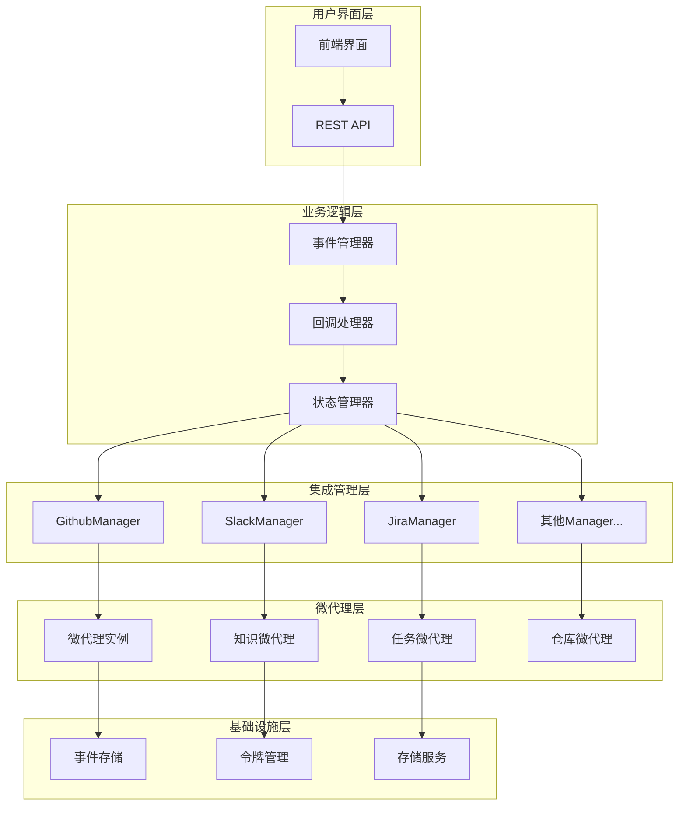

**图表来源**
- [manager.py](file://enterprise/integrations/manager.py#L6-L31)
- [github_manager.py](file://enterprise/integrations/github/github_manager.py#L38-L51)
- [slack_manager.py](file://enterprise/integrations/slack/slack_manager.py#L42-L52)
- [jira_manager.py](file://enterprise/integrations/jira/jira_manager.py#L40-L47)

## 核心组件分析

### 管理器抽象基类

所有集成平台的管理器都继承自抽象基类`Manager`，该类定义了微代理系统的核心接口：

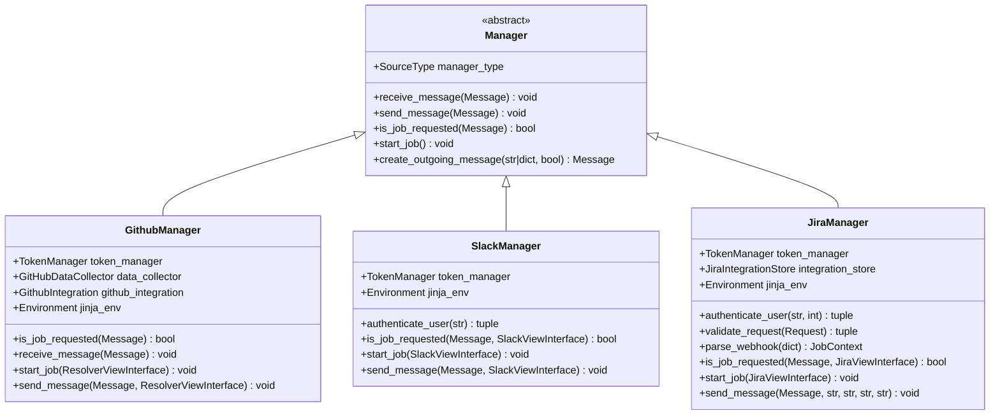

**图表来源**
- [manager.py](file://enterprise/integrations/manager.py#L6-L31)
- [github_manager.py](file://enterprise/integrations/github/github_manager.py#L38-L51)
- [slack_manager.py](file://enterprise/integrations/slack/slack_manager.py#L42-L52)
- [jira_manager.py](file://enterprise/integrations/jira/jira_manager.py#L40-L47)

### 微代理类型系统

微代理系统支持三种主要类型的微代理：

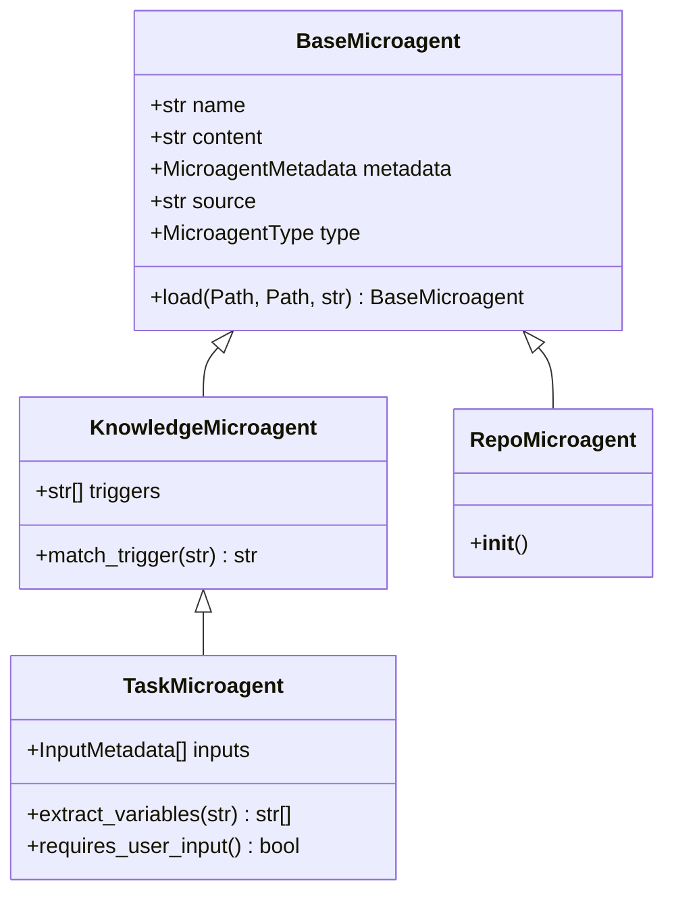

**图表来源**
- [microagent.py](file://openhands/microagent/microagent.py#L17-L22)
- [microagent.py](file://openhands/microagent/microagent.py#L174-L204)
- [microagent.py](file://openhands/microagent/microagent.py#L226-L275)
- [microagent.py](file://openhands/microagent/microagent.py#L206-L225)

**章节来源**
- [manager.py](file://enterprise/integrations/manager.py#L1-L31)
- [microagent.py](file://openhands/microagent/microagent.py#L1-L342)

## 微代理注册机制

微代理的注册过程涉及多个步骤，确保微代理能够正确加载和初始化：

### 注册流程

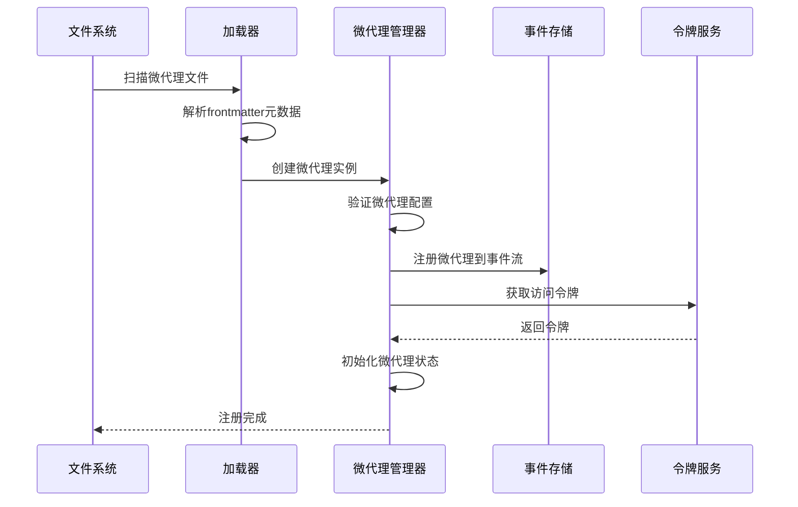

**图表来源**
- [microagent.py](file://openhands/microagent/microagent.py#L52-L171)
- [utils.py](file://enterprise/integrations/utils.py#L323-L366)

### 触发条件判断

微代理的触发条件通过多种方式进行判断：

1. **关键词匹配**：知识微代理通过预定义的触发关键词进行匹配
2. **模式识别**：任务微代理通过特定的命令格式触发
3. **上下文感知**：根据当前对话上下文决定是否激活

**章节来源**
- [microagent.py](file://openhands/microagent/microagent.py#L174-L275)
- [types.py](file://openhands/microagent/types.py#L1-L60)

## 触发和执行机制

### 触发机制

微代理系统支持多种触发机制：

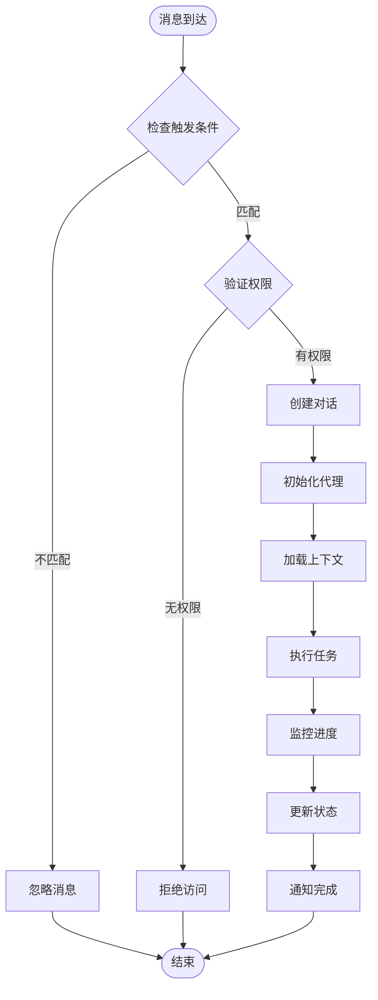

**图表来源**
- [github_manager.py](file://enterprise/integrations/github/github_manager.py#L121-L155)
- [slack_manager.py](file://enterprise/integrations/slack/slack_manager.py#L244-L296)
- [jira_manager.py](file://enterprise/integrations/jira/jira_manager.py#L300-L334)

### 任务调度

任务调度系统负责管理微代理的执行顺序和资源分配：

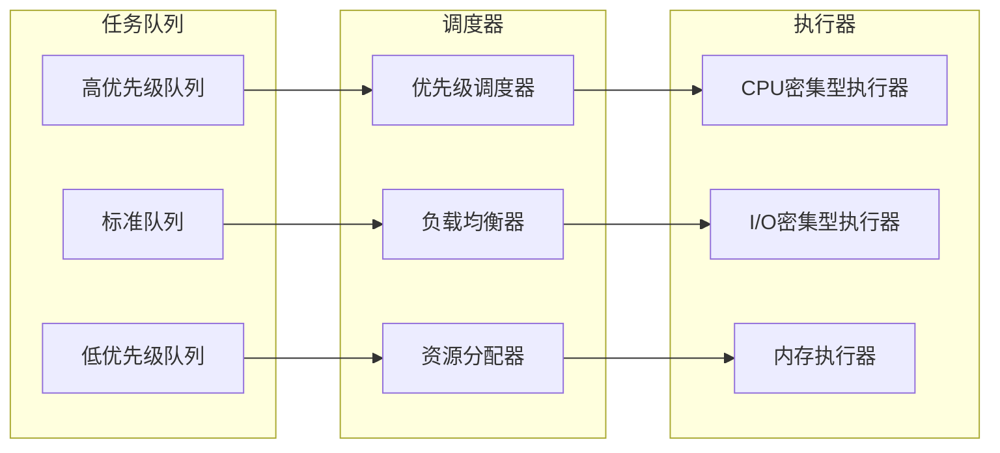

**章节来源**
- [github_manager.py](file://enterprise/integrations/github/github_manager.py#L217-L344)
- [slack_manager.py](file://enterprise/integrations/slack/slack_manager.py#L298-L363)
- [jira_manager.py](file://enterprise/integrations/jira/jira_manager.py#L335-L403)

## 状态管理与生命周期

### 微代理生命周期

微代理在其生命周期中经历多个状态转换：

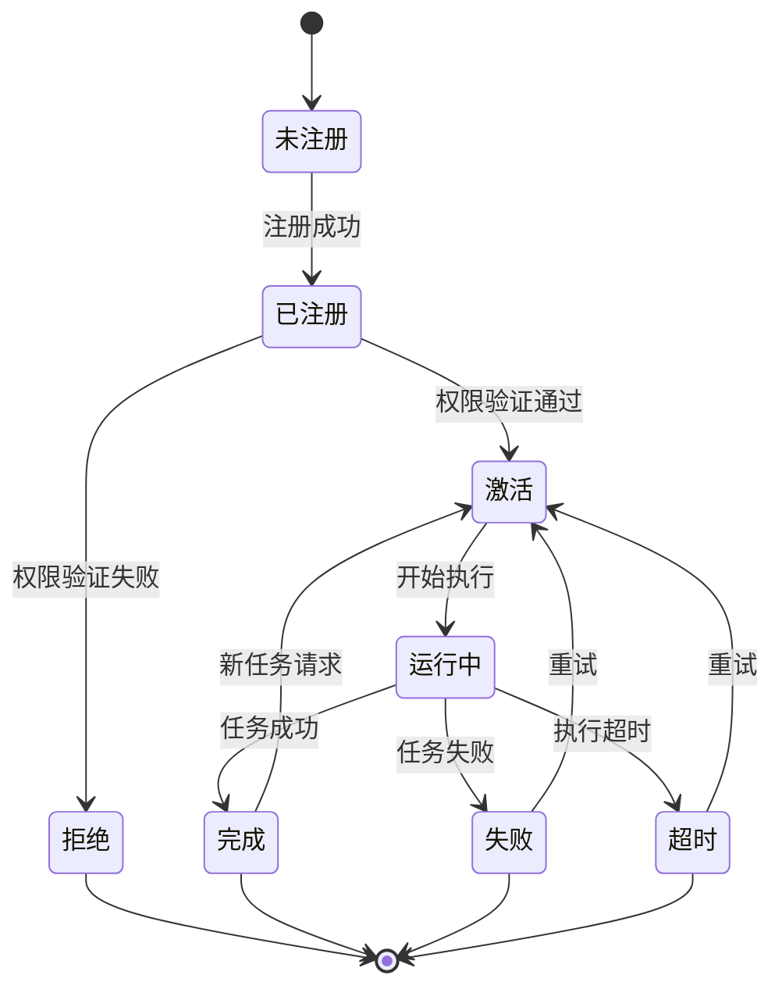

### 状态持久化

系统通过事件存储机制实现状态的持久化：

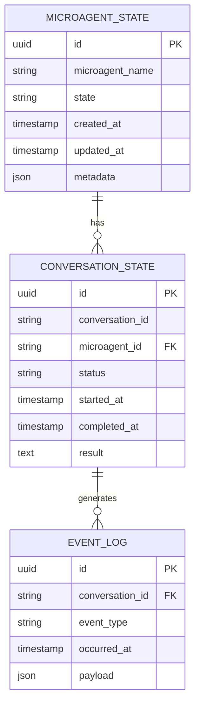

**章节来源**
- [models.py](file://enterprise/integrations/models.py#L37-L53)
- [utils.py](file://enterprise/integrations/utils.py#L270-L305)

## 与核心系统的集成

### 事件系统集成

微代理系统深度集成到OpenHands的事件系统中：

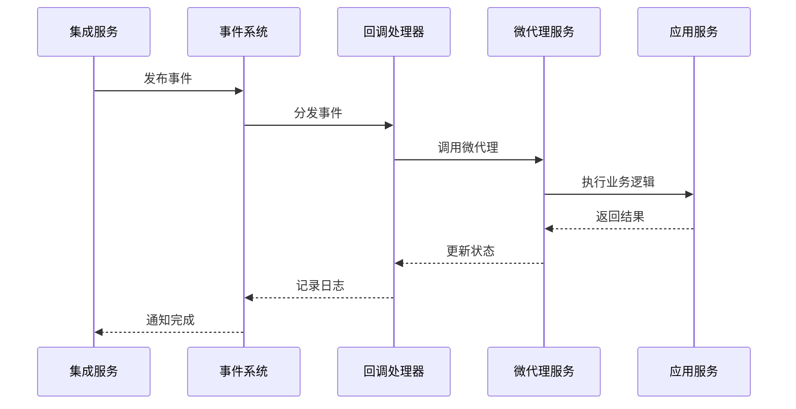

**图表来源**
- [utils.py](file://enterprise/integrations/utils.py#L270-L305)
- [github_manager.py](file://enterprise/integrations/github/github_manager.py#L295-L302)

### 用户设置集成

系统通过用户设置模块管理微代理的配置：

| 设置项 | 类型 | 默认值 | 描述 |
|--------|------|--------|------|
| enable_proactive_conversation_starters | Boolean | True | 启用主动对话启动器 |
| user_version | Integer | 0 | 用户设置版本号 |
| accepted_tos | DateTime | NULL | 接受服务条款时间 |
| email | String | NULL | 用户邮箱地址 |
| email_verified | Boolean | NULL | 邮箱验证状态 |

**章节来源**
- [utils.py](file://enterprise/integrations/utils.py#L38-L47)
- [models.py](file://enterprise/integrations/models.py#L24-L35)

## 数据流和调用关系

### 主要数据流

微代理系统的数据流涉及多个组件之间的复杂交互：

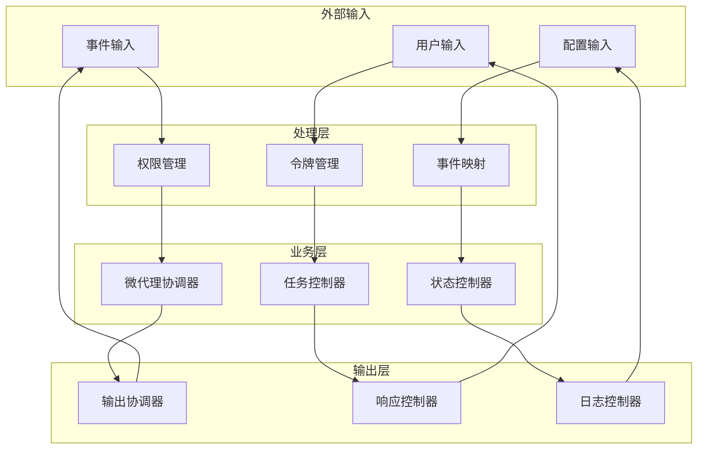

**图表来源**
- [github_manager.py](file://enterprise/integrations/github/github_manager.py#L157-L184)
- [slack_manager.py](file://enterprise/integrations/slack/slack_manager.py#L180-L218)
- [jira_manager.py](file://enterprise/integrations/jira/jira_manager.py#L208-L298)

### 结果反馈流程

系统通过多层次的反馈机制确保结果的准确传递：

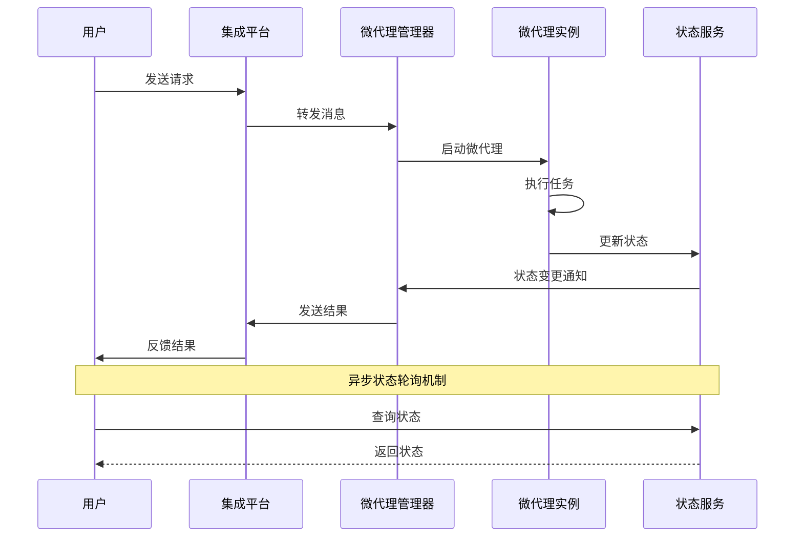

**图表来源**
- [github_manager.py](file://enterprise/integrations/github/github_manager.py#L334-L344)
- [slack_manager.py](file://enterprise/integrations/slack/slack_manager.py#L358-L363)
- [jira_manager.py](file://enterprise/integrations/jira/jira_manager.py#L389-L403)

**章节来源**
- [github_manager.py](file://enterprise/integrations/github/github_manager.py#L1-L345)
- [slack_manager.py](file://enterprise/integrations/slack/slack_manager.py#L1-L364)
- [jira_manager.py](file://enterprise/integrations/jira/jira_manager.py#L1-L505)

## 性能考虑

微代理系统在设计时充分考虑了性能优化：

### 并发处理

系统采用异步并发模型处理多个微代理实例：

- **线程池管理**：为每个微代理分配独立的线程池
- **资源限制**：控制并发数量防止资源耗尽
- **优先级调度**：根据任务重要性分配资源

### 缓存策略

- **元数据缓存**：缓存微代理元数据减少磁盘访问
- **状态缓存**：缓存微代理状态避免重复计算
- **令牌缓存**：缓存认证令牌减少API调用

### 监控指标

系统监控以下关键性能指标：
- 微代理响应时间
- 任务执行成功率
- 资源使用率
- 错误率统计

## 故障排除指南

### 常见问题及解决方案

| 问题类型 | 症状 | 可能原因 | 解决方案 |
|----------|------|----------|----------|
| 微代理无法启动 | 任务创建失败 | 权限不足或配置错误 | 检查用户权限和微代理配置 |
| 触发条件不生效 | 微代理未被激活 | 触发关键词不匹配 | 验证触发条件设置 |
| 状态同步延迟 | 状态更新不及时 | 事件流阻塞 | 检查事件处理队列 |
| 性能下降 | 响应时间增加 | 资源竞争或配置不当 | 优化资源配置和参数 |

### 调试工具

系统提供了多种调试工具帮助诊断问题：

- **事件追踪器**：跟踪事件在整个系统中的流转
- **状态监控器**：实时监控微代理状态变化
- **性能分析器**：分析系统性能瓶颈
- **日志分析器**：分析系统日志找出问题根源

**章节来源**
- [utils.py](file://enterprise/integrations/utils.py#L119-L174)
- [github_manager.py](file://enterprise/integrations/github/github_manager.py#L334-L344)

## 结论

微代理系统作为OpenHands平台的核心组件，通过精心设计的架构实现了高效的跨平台微代理管理。系统的主要优势包括：

1. **模块化设计**：清晰的分层架构便于维护和扩展
2. **统一接口**：抽象的管理器接口支持多种集成平台
3. **灵活触发**：多种触发机制适应不同场景需求
4. **状态管理**：完善的生命周期管理确保系统稳定性
5. **性能优化**：并发处理和缓存策略保证高效运行

未来的发展方向包括：
- 支持更多集成平台
- 增强AI驱动的智能触发
- 优化资源利用率
- 提升系统可观测性

微代理系统为OpenHands平台提供了强大的自动化能力，是构建智能化开发工作流的重要基础设施。