# 集成服务

<cite>
**本文档中引用的文件**
- [enterprise/integrations/github/github_service.py](file://enterprise/integrations/github/github_service.py)
- [enterprise/integrations/gitlab/gitlab_service.py](file://enterprise/integrations/gitlab/gitlab_service.py)
- [enterprise/integrations/jira/jira_manager.py](file://enterprise/integrations/jira/jira_manager.py)
- [enterprise/integrations/slack/slack_manager.py](file://enterprise/integrations/slack/slack_manager.py)
- [enterprise/integrations/stripe_service.py](file://enterprise/integrations/stripe_service.py)
- [enterprise/integrations/manager.py](file://enterprise/integrations/manager.py)
- [enterprise/integrations/types.py](file://enterprise/integrations/types.py)
- [enterprise/integrations/utils.py](file://enterprise/integrations/utils.py)
- [enterprise/microagent/microagent.py](file://openhands/microagent/microagent.py)
- [enterprise/server/auth/token_manager.py](file://enterprise/server/auth/token_manager.py)
- [enterprise/server/conversation_callback_processor/github_callback_processor.py](file://enterprise/server/conversation_callback_processor/github_callback_processor.py)
- [enterprise/server/conversation_callback_processor/slack_callback_processor.py](file://enterprise/server/conversation_callback_processor/slack_callback_processor.py)
- [enterprise/server/routes/integration/github.py](file://enterprise/server/routes/integration/github.py)
</cite>

## 目录
1. [简介](#简介)
2. [架构概述](#架构概述)
3. [核心组件](#核心组件)
4. [主要集成平台](#主要集成平台)
5. [OAuth认证机制](#oauth认证机制)
6. [Webhook处理系统](#webhook处理系统)
7. [微代理系统](#微代理系统)
8. [错误处理与重试策略](#错误处理与重试策略)
9. [数据同步机制](#数据同步机制)
10. [配置指南](#配置指南)
11. [自定义集成开发](#自定义集成开发)
12. [故障排除](#故障排除)

## 简介

OpenHands集成服务是一个强大的多平台集成框架，支持与GitHub、GitLab、Jira、Slack和Stripe等主流开发工具和服务的无缝集成。该系统采用模块化设计，提供了完整的OAuth认证、Webhook处理、API调用和数据同步功能。

集成服务的核心目标是：
- 提供统一的API接口访问多个第三方平台
- 实现自动化的工作流触发和事件响应
- 支持实时的数据同步和状态更新
- 提供可扩展的微代理系统用于定制化功能

## 架构概述

集成服务采用分层架构设计，确保了系统的可维护性和扩展性：

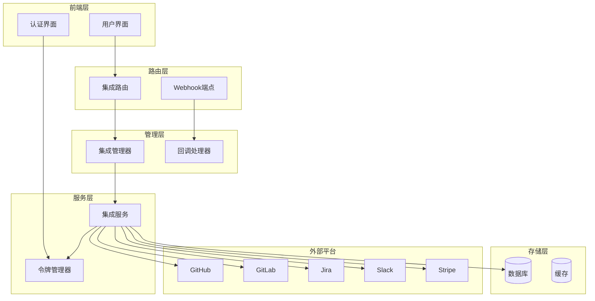

**图表来源**
- [enterprise/integrations/manager.py](file://enterprise/integrations/manager.py#L1-L31)
- [enterprise/server/auth/token_manager.py](file://enterprise/server/auth/token_manager.py#L78-L200)

## 核心组件

### 集成管理器基类

所有集成平台都继承自抽象基类`Manager`，提供了统一的接口规范：

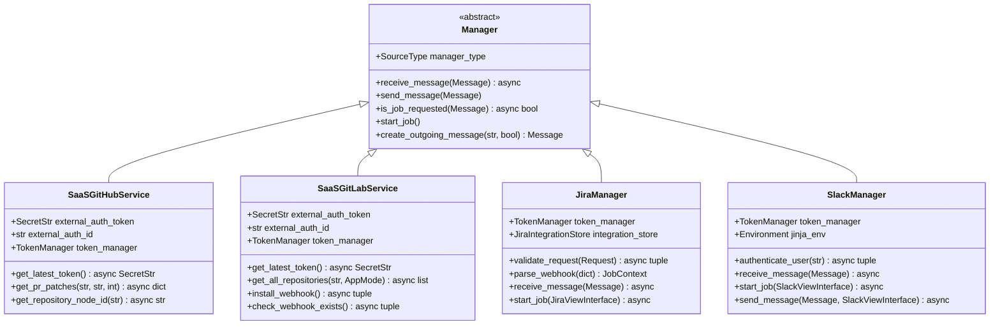

**图表来源**
- [enterprise/integrations/manager.py](file://enterprise/integrations/manager.py#L6-L31)
- [enterprise/integrations/github/github_service.py](file://enterprise/integrations/github/github_service.py#L13-L144)
- [enterprise/integrations/gitlab/gitlab_service.py](file://enterprise/integrations/gitlab/gitlab_service.py#L21-L530)

**章节来源**
- [enterprise/integrations/manager.py](file://enterprise/integrations/manager.py#L1-L31)
- [enterprise/integrations/types.py](file://enterprise/integrations/types.py#L1-L52)

## 主要集成平台

### GitHub集成

GitHub集成为OpenHands提供了完整的仓库管理和问题跟踪功能：

#### 核心功能
- **仓库访问**：获取用户拥有的仓库列表
- **Pull Request处理**：获取PR变更和补丁信息
- **GraphQL支持**：使用新的节点ID进行查询
- **Webhook管理**：自动安装和管理Webhook

#### API调用模式
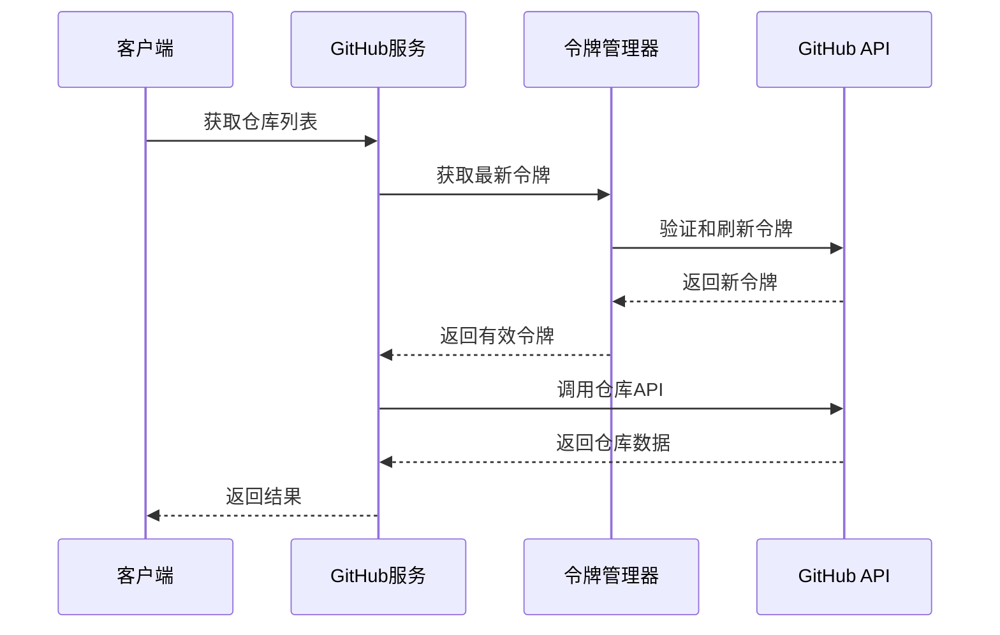

**图表来源**
- [enterprise/integrations/github/github_service.py](file://enterprise/integrations/github/github_service.py#L39-L73)

**章节来源**
- [enterprise/integrations/github/github_service.py](file://enterprise/integrations/github/github_service.py#L1-L144)

### GitLab集成

GitLab集成提供了企业级的DevOps功能支持：

#### 核心功能
- **项目和组管理**：获取用户拥有的项目和组
- **Webhook安装**：自动为项目和组安装Webhook
- **权限检查**：验证用户对资源的访问权限
- **讨论回复**：支持在Issue和Merge Request中回复

#### Webhook配置流程
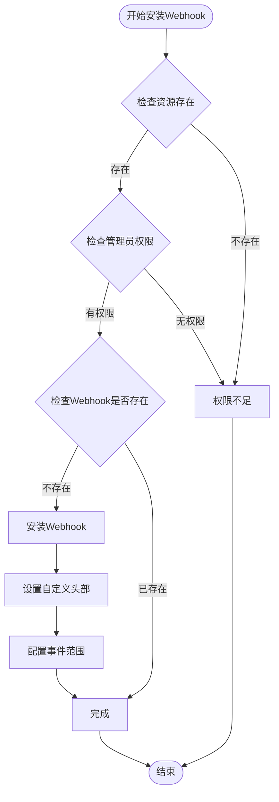

**图表来源**
- [enterprise/integrations/gitlab/gitlab_service.py](file://enterprise/integrations/gitlab/gitlab_service.py#L405-L474)

**章节来源**
- [enterprise/integrations/gitlab/gitlab_service.py](file://enterprise/integrations/gitlab/gitlab_service.py#L1-L530)

### Jira集成

Jira集成实现了与Atlassian生态系统的一体化：

#### 核心功能
- **Webhook验证**：使用HMAC签名验证请求
- **工作区管理**：支持多工作区配置
- **用户认证**：基于Keycloak的用户身份验证
- **问题上下文**：获取Issue详细信息

#### Webhook处理流程
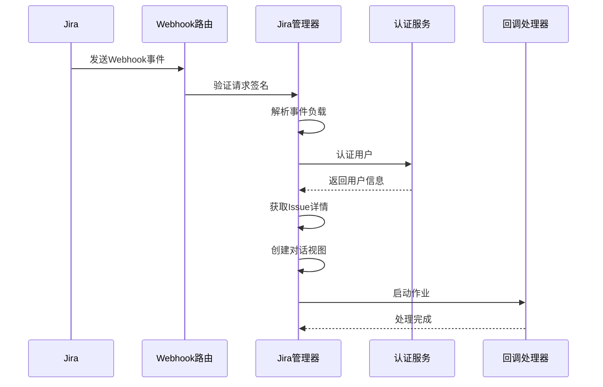

**图表来源**
- [enterprise/integrations/jira/jira_manager.py](file://enterprise/integrations/jira/jira_manager.py#L86-L217)

**章节来源**
- [enterprise/integrations/jira/jira_manager.py](file://enterprise/integrations/jira/jira_manager.py#L1-L505)

### Slack集成

Slack集成提供了即时通讯平台的深度集成：

#### 核心功能
- **OAuth认证**：使用Slack OAuth流程
- **消息解析**：智能识别仓库引用
- **交互式组件**：支持选择表单和按钮
- **线程支持**：完整的Thread TS支持

#### 消息处理流程
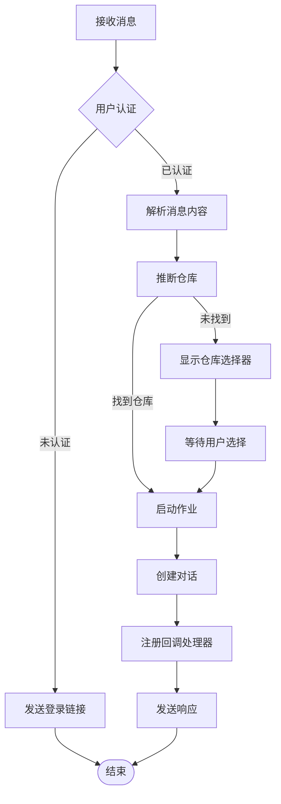

**图表来源**
- [enterprise/integrations/slack/slack_manager.py](file://enterprise/integrations/slack/slack_manager.py#L180-L296)

**章节来源**
- [enterprise/integrations/slack/slack_manager.py](file://enterprise/integrations/slack/slack_manager.py#L1-L364)

### Stripe集成

Stripe集成提供了支付和订阅管理功能：

#### 核心功能
- **客户管理**：查找或创建Stripe客户
- **支付方法验证**：检查用户的支付方式
- **双层查找机制**：本地数据库优先，回退到Stripe API

**章节来源**
- [enterprise/integrations/stripe_service.py](file://enterprise/integrations/stripe_service.py#L1-L74)

## OAuth认证机制

### 令牌管理架构

OpenHands采用统一的令牌管理系统处理所有第三方平台的认证：

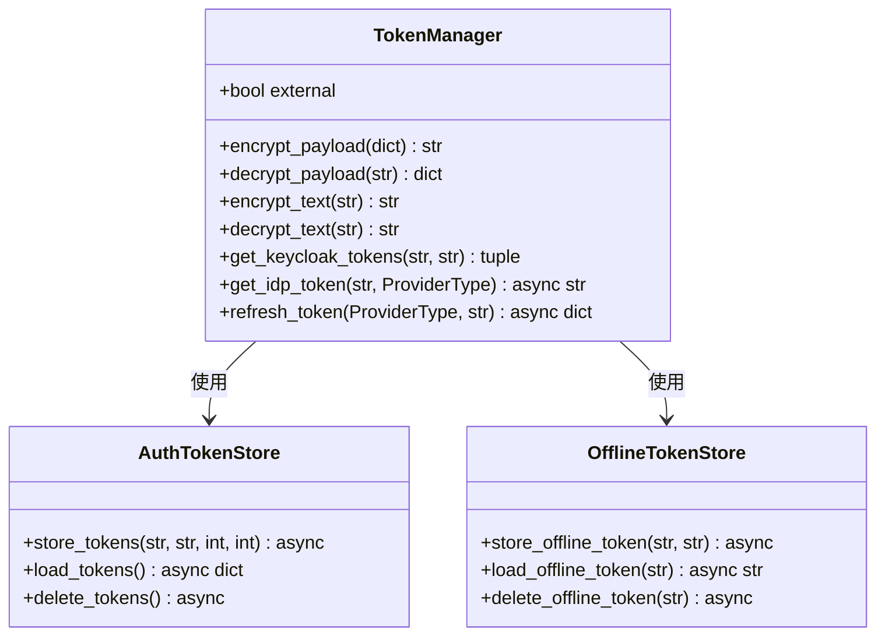

**图表来源**
- [enterprise/server/auth/token_manager.py](file://enterprise/server/auth/token_manager.py#L78-L200)

### 认证流程

#### GitHub OAuth流程
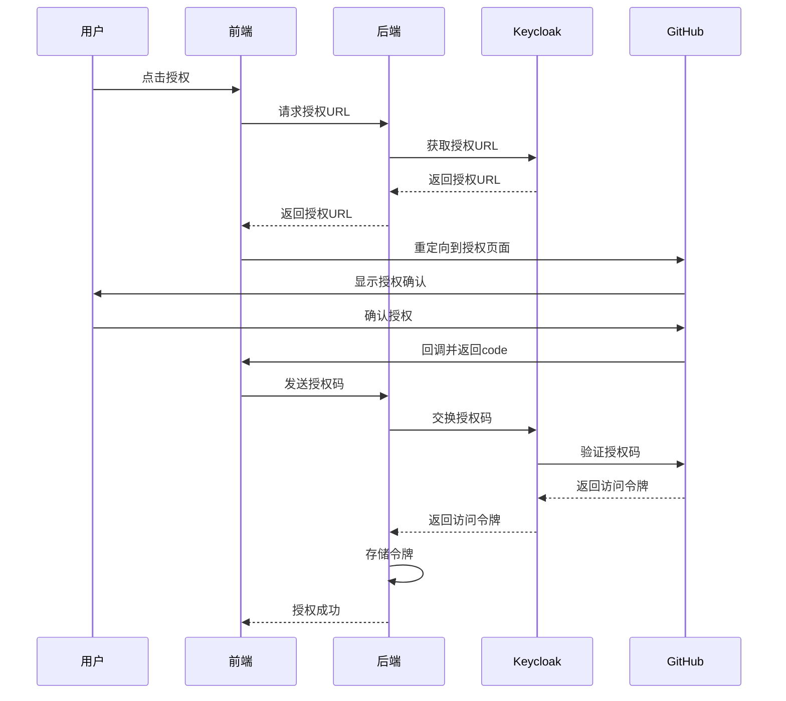

**图表来源**
- [enterprise/server/auth/token_manager.py](file://enterprise/server/auth/token_manager.py#L89-L111)

**章节来源**
- [enterprise/server/auth/token_manager.py](file://enterprise/server/auth/token_manager.py#L1-L200)

## Webhook处理系统

### 回调处理器架构

每个集成平台都有专门的回调处理器来处理事件：

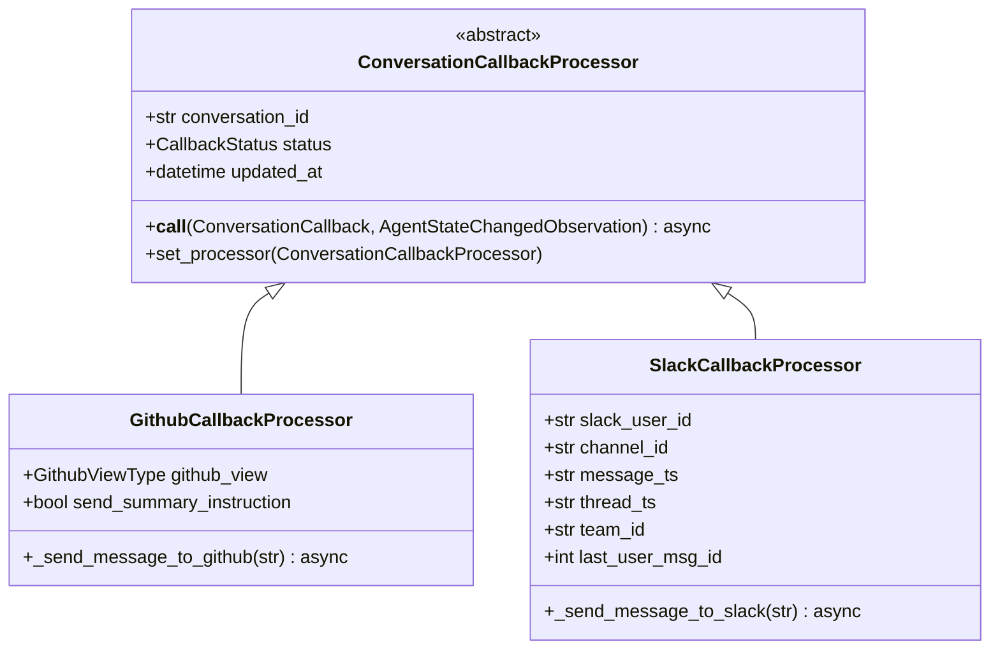

**图表来源**
- [enterprise/server/conversation_callback_processor/github_callback_processor.py](file://enterprise/server/conversation_callback_processor/github_callback_processor.py#L27-L144)
- [enterprise/server/conversation_callback_processor/slack_callback_processor.py](file://enterprise/server/conversation_callback_processor/slack_callback_processor.py#L28-L183)

### Webhook安全验证

所有Webhook都经过严格的安全验证：

#### GitHub Webhook验证
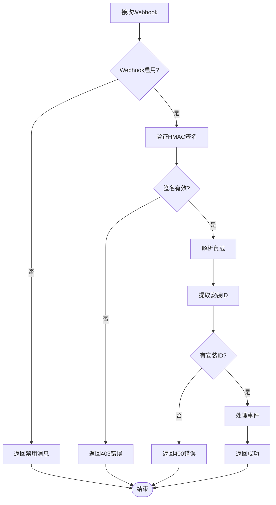

**图表来源**
- [enterprise/server/routes/integration/github.py](file://enterprise/server/routes/integration/github.py#L45-L83)

**章节来源**
- [enterprise/server/conversation_callback_processor/github_callback_processor.py](file://enterprise/server/conversation_callback_processor/github_callback_processor.py#L1-L144)
- [enterprise/server/conversation_callback_processor/slack_callback_processor.py](file://enterprise/server/conversation_callback_processor/slack_callback_processor.py#L1-L183)

## 微代理系统

### 微代理架构

微代理系统是OpenHands集成服务的重要扩展机制：

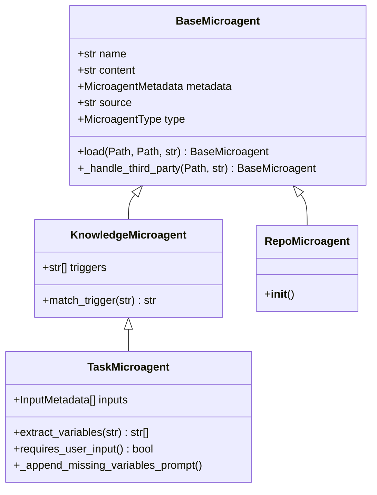

**图表来源**
- [openhands/microagent/microagent.py](file://openhands/microagent/microagent.py#L17-L342)

### 微代理类型

#### 知识型微代理
- **触发器匹配**：基于关键词触发
- **专业知识**：提供特定领域的指导
- **最佳实践**：分享开发经验和技巧

#### 任务型微代理
- **用户输入**：需要用户提供参数
- **变量提取**：从内容中提取配置变量
- **交互式执行**：引导用户完成复杂任务

#### 仓库专用微代理
- **私有知识**：针对特定仓库的指导
- **团队约定**：符合团队开发规范
- **项目特定**：适应项目的特殊需求

**章节来源**
- [openhands/microagent/microagent.py](file://openhands/microagent/microagent.py#L1-L342)

## 错误处理与重试策略

### 统一错误处理机制

集成服务采用分层的错误处理策略：

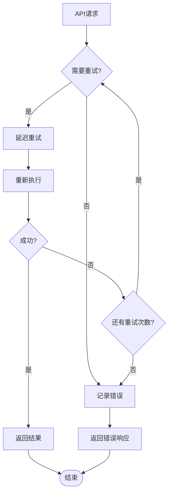

### 重试策略配置

| 平台 | 最大重试次数 | 重试间隔 | 重试条件 |
|------|-------------|----------|----------|
| GitHub | 3次 | 指数退避 | 连接错误、速率限制 |
| GitLab | 2次 | 固定间隔 | 连接超时、认证失败 |
| Jira | 3次 | 线性递增 | 网络异常、API限制 |
| Slack | 2次 | 指数退避 | 限流、权限不足 |

### 错误恢复机制

#### 令牌刷新
当API调用失败时，系统会自动尝试刷新令牌：

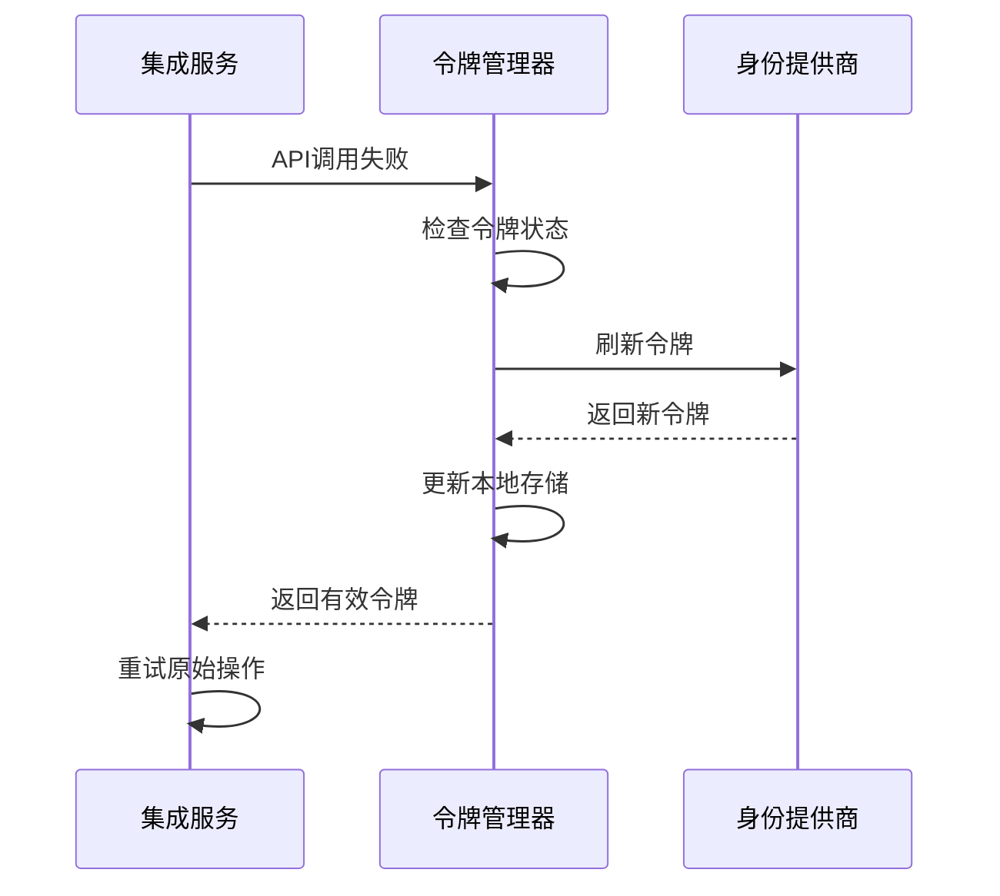

**章节来源**
- [enterprise/server/auth/token_manager.py](file://enterprise/server/auth/token_manager.py#L147-L151)

## 数据同步机制

### 实时数据同步

集成服务通过多种机制确保数据的实时同步：

#### 轮询同步
- **定时任务**：定期检查仓库状态变化
- **增量更新**：只同步发生变化的数据
- **冲突解决**：处理并发修改冲突

#### 事件驱动同步
- **Webhook监听**：实时响应外部事件
- **回调队列**：异步处理同步任务
- **幂等性保证**：确保重复处理的安全性

### 数据一致性保证

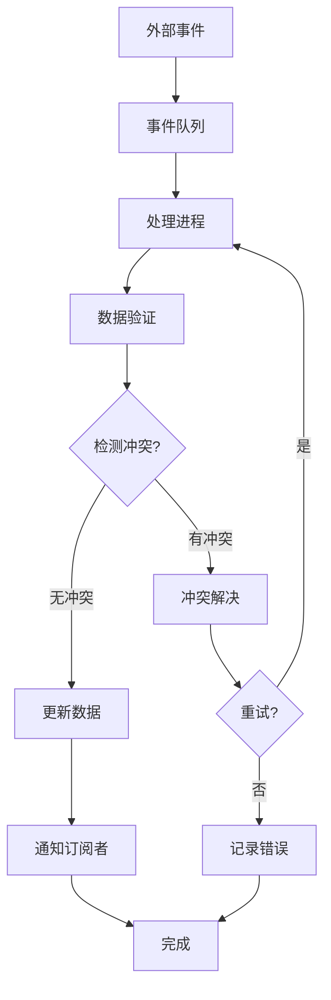

**章节来源**
- [enterprise/integrations/utils.py](file://enterprise/integrations/utils.py#L323-L366)

## 配置指南

### 基础配置

#### 环境变量配置
```bash
# OAuth客户端配置
GITHUB_APP_CLIENT_ID=your_github_client_id
GITHUB_APP_CLIENT_SECRET=your_github_client_secret
GITLAB_APP_CLIENT_ID=your_gitlab_client_id
GITLAB_APP_CLIENT_SECRET=your_gitlab_client_secret
BITBUCKET_APP_CLIENT_ID=your_bitbucket_client_id
BITBUCKET_APP_CLIENT_SECRET=your_bitbucket_client_secret

# Keycloak配置
KEYCLOAK_SERVER_URL=https://your-keycloak-server/auth/realms/your-realm
KEYCLOAK_REALM_NAME=your-realm
JWT_SECRET=your_jwt_secret

# Stripe配置
STRIPE_API_KEY=your_stripe_api_key

# Webhook配置
GITHUB_WEBHOOKS_ENABLED=true
GITLAB_WEBHOOKS_ENABLED=true
JIRA_WEBHOOKS_ENABLED=true
SLACK_WEBHOOKS_ENABLED=true
```

#### 数据库配置
```sql
-- 创建必要的数据库表
CREATE TABLE github_app_installations (
    id SERIAL PRIMARY KEY,
    installation_id BIGINT UNIQUE NOT NULL,
    user_id VARCHAR(255) NOT NULL,
    created_at TIMESTAMP WITH TIME ZONE DEFAULT CURRENT_TIMESTAMP
);

CREATE TABLE gitlab_webhooks (
    id SERIAL PRIMARY KEY,
    group_id VARCHAR(255),
    project_id VARCHAR(255),
    user_id VARCHAR(255) NOT NULL,
    webhook_exists BOOLEAN DEFAULT FALSE,
    status VARCHAR(50),
    created_at TIMESTAMP WITH TIME ZONE DEFAULT CURRENT_TIMESTAMP
);
```

### 权限管理

#### 角色权限矩阵

| 平台 | 读取权限 | 写入权限 | 管理权限 | 配置权限 |
|------|---------|---------|---------|---------|
| GitHub | 仓库列表 | PR评论 | Webhook管理 | 应用配置 |
| GitLab | 项目列表 | Issue评论 | 群组管理 | 项目配置 |
| Jira | 问题列表 | 评论回复 | 工作空间 | 集成配置 |
| Slack | 频道列表 | 消息发送 | 频道管理 | 应用配置 |

**章节来源**
- [enterprise/integrations/utils.py](file://enterprise/integrations/utils.py#L37-L56)

## 自定义集成开发

### 开发步骤

#### 1. 创建集成管理器
```python
class CustomIntegrationManager(Manager):
    manager_type = SourceType.CUSTOM
    
    async def receive_message(self, message: Message):
        # 实现消息接收逻辑
        pass
    
    def send_message(self, message: Message):
        # 实现消息发送逻辑
        pass
    
    async def is_job_requested(self, message: Message) -> bool:
        # 实现作业请求判断逻辑
        pass
    
    def start_job(self):
        # 实现作业启动逻辑
        pass
```

#### 2. 实现集成服务
```python
class CustomIntegrationService:
    def __init__(self, token_manager: TokenManager):
        self.token_manager = token_manager
    
    async def get_latest_token(self) -> SecretStr | None:
        # 实现令牌获取逻辑
        pass
    
    async def make_request(self, url: str, params: dict = None):
        # 实现API请求逻辑
        pass
```

#### 3. 注册路由
```python
custom_integration_router = APIRouter()

@custom_integration_router.post('/events')
async def custom_events(request: Request):
    # 实现Webhook处理逻辑
    pass
```

### 扩展微代理

#### 创建自定义微代理
```python
class CustomMicroagent(KnowledgeMicroagent):
    def __init__(self, **data):
        super().__init__(**data)
        self.metadata.triggers = ['/custom']
    
    def match_trigger(self, message: str) -> str | None:
        # 实现自定义触发逻辑
        return '/custom' if '/custom' in message.lower() else None
```

**章节来源**
- [enterprise/integrations/manager.py](file://enterprise/integrations/manager.py#L1-L31)
- [openhands/microagent/microagent.py](file://openhands/microagent/microagent.py#L174-L200)

## 故障排除

### 常见问题及解决方案

#### 1. OAuth认证失败
**症状**：用户无法完成第三方平台的授权
**原因**：客户端ID或密钥配置错误
**解决方案**：
- 检查环境变量配置
- 验证回调URL设置
- 确认应用权限范围

#### 2. Webhook验证失败
**症状**：Webhook事件被拒绝
**原因**：签名验证不通过
**解决方案**：
- 检查Webhook密钥配置
- 验证请求时间戳
- 确认负载格式正确

#### 3. API调用超时
**症状**：集成服务响应缓慢或超时
**原因**：网络连接问题或API限制
**解决方案**：
- 检查网络连接
- 实施重试机制
- 监控API使用配额

#### 4. 数据同步不一致
**症状**：本地数据与远程平台不一致
**原因**：事件丢失或处理错误
**解决方案**：
- 检查事件队列状态
- 验证回调处理器配置
- 执行数据一致性检查

### 监控和日志

#### 关键指标监控
- **认证成功率**：OAuth认证的成功率
- **API响应时间**：各平台API的平均响应时间
- **Webhook处理率**：Webhook事件的处理效率
- **错误率统计**：各类错误的发生频率

#### 日志级别配置
```python
# 生产环境日志配置
logger.setLevel(logging.INFO)

# 开发环境日志配置  
logger.setLevel(logging.DEBUG)

# 特定模块日志配置
integration_logger = logging.getLogger('openhands.integrations')
integration_logger.setLevel(logging.WARNING)
```

**章节来源**
- [enterprise/integrations/utils.py](file://enterprise/integrations/utils.py#L119-L130)

## 总结

OpenHands集成服务提供了一个完整、可扩展的多平台集成解决方案。通过统一的架构设计、完善的认证机制、灵活的微代理系统和健壮的错误处理，该系统能够满足各种复杂的集成需求。

主要优势包括：
- **模块化设计**：易于扩展和维护
- **统一接口**：简化了多平台集成的复杂性
- **安全可靠**：完善的认证和授权机制
- **实时同步**：确保数据的一致性和及时性
- **高度可配置**：支持各种部署场景和需求

通过遵循本文档的指导原则和最佳实践，开发者可以轻松地扩展和定制集成服务，以满足特定的业务需求。