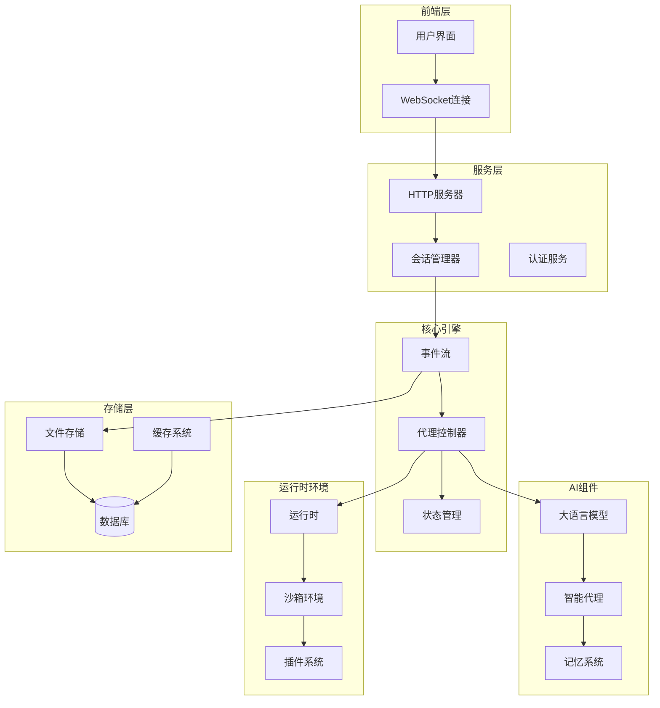
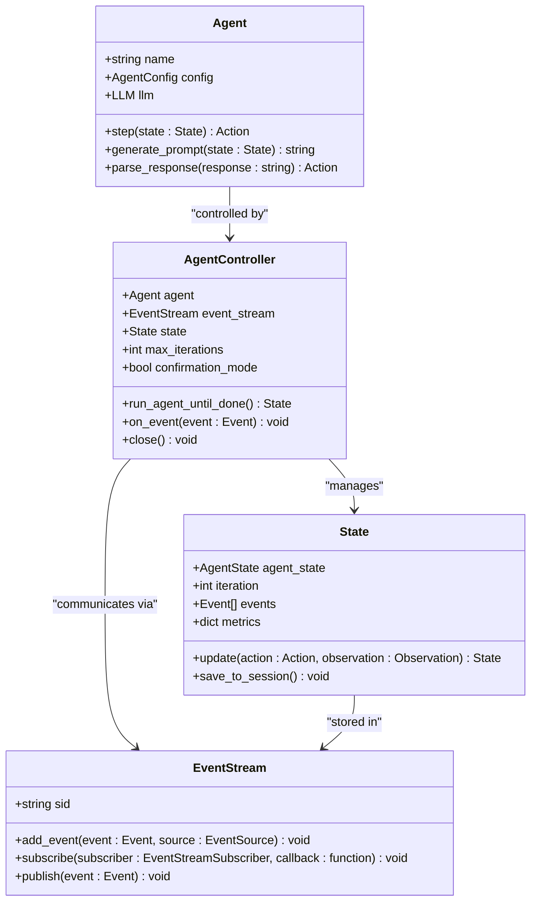
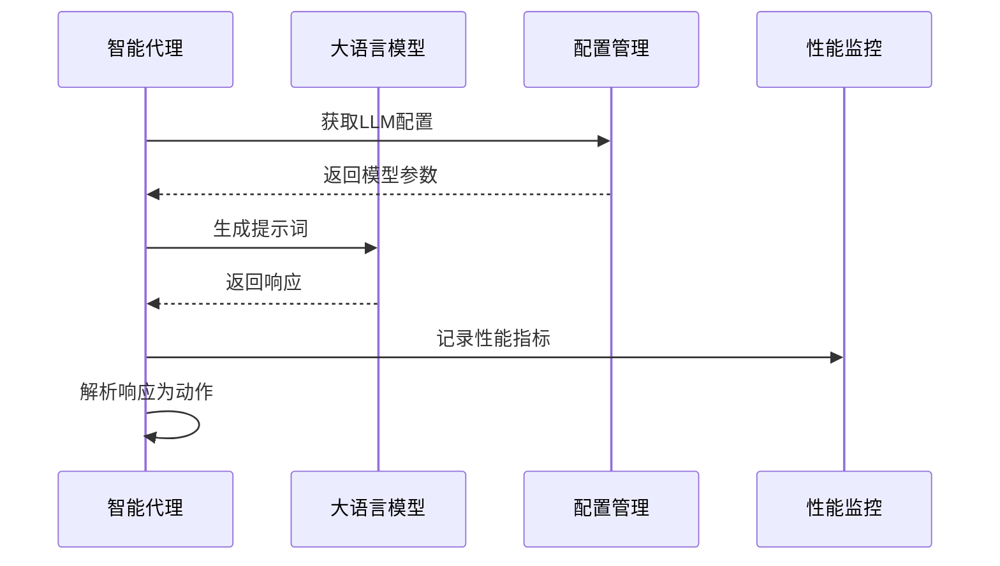
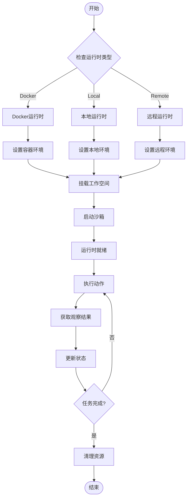
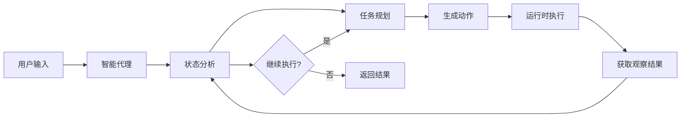
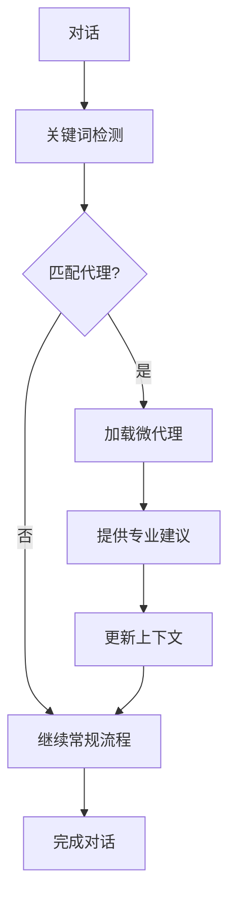
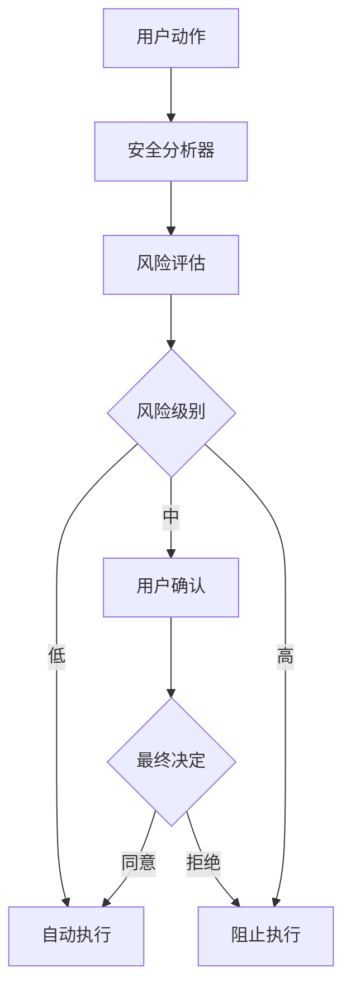

# 项目概述

<cite>
**本文档中引用的文件**
- [README.md](file://README.md)
- [openhands/README.md](file://openhands/README.md)
- [pyproject.toml](file://pyproject.toml)
- [openhands/__init__.py](file://openhands/__init__.py)
- [openhands/core/main.py](file://openhands/core/main.py)
- [openhands/core/config/__init__.py](file://openhands/core/config/__init__.py)
- [openhands/controller/agent_controller.py](file://openhands/controller/agent_controller.py)
- [openhands/runtime/base.py](file://openhands/runtime/base.py)
- [openhands/agenthub/README.md](file://openhands/agenthub/README.md)
- [openhands/llm/llm.py](file://openhands/llm/llm.py)
- [frontend/README.md](file://frontend/README.md)
- [microagents/README.md](file://microagents/README.md)
- [evaluation/README.md](file://evaluation/README.md)
</cite>

## 目录
1. [项目简介](#项目简介)
2. [核心愿景与价值主张](#核心愿景与价值主张)
3. [系统架构概览](#系统架构概览)
4. [主要组件详解](#主要组件详解)
5. [技术栈概览](#技术栈概览)
6. [AI驱动的智能代理](#ai驱动的智能代理)
7. [运行时环境](#运行时环境)
8. [前端界面](#前端界面)
9. [微代理生态系统](#微代理生态系统)
10. [安全机制](#安全机制)
11. [评估与基准测试](#评估与基准测试)
12. [实际应用场景](#实际应用场景)
13. [与其他开发工具的对比](#与其他开发工具的对比)
14. [总结](#总结)

## 项目简介

OpenHands（原名OpenDevin）是一个由人工智能驱动的软件开发代理平台，旨在通过AI技术显著提升软件开发效率。该项目代表了下一代AI辅助开发工具的发展方向，能够执行人类开发者能够完成的所有任务：修改代码、运行命令、浏览网页、调用API，甚至从StackOverflow复制代码片段。

OpenHands不仅仅是一个简单的代码编辑器或IDE增强工具，而是一个完整的AI驱动软件开发环境，它能够理解复杂的开发需求，自主执行开发任务，并在必要时与开发者进行智能交互。

**章节来源**
- [README.md](file://README.md#L34-L38)
- [openhands/README.md](file://openhands/README.md#L1-L56)

## 核心愿景与价值主张

### 项目愿景

OpenHands的愿景是实现"Code Less, Make More"的目标，即通过AI技术减少开发者重复性劳动，让开发者能够专注于更有创造性和战略性的工作。该平台致力于成为AI软件开发者的通用代理平台，支持各种编程语言、框架和技术栈。

### 价值主张

1. **全功能AI开发助手**：支持代码编写、调试、测试、部署等完整开发生命周期
2. **多模态交互能力**：结合文本、视觉、浏览器操作等多种交互方式
3. **智能任务分解**：能够将复杂任务分解为可执行的子任务
4. **上下文感知**：保持长期对话历史和项目上下文
5. **安全可控**：提供多层次的安全控制和风险评估机制

### 目标用户群体

- **软件开发团队**：需要提高开发效率和质量的团队
- **独立开发者**：希望获得AI辅助的个人开发者
- **企业研发部门**：寻求技术创新和效率提升的企业
- **教育机构**：用于教学和研究的开发环境

**章节来源**
- [README.md](file://README.md#L34-L38)

## 系统架构概览

OpenHands采用模块化架构设计，核心围绕事件流（EventStream）构建，实现了高度解耦和可扩展的系统结构。

**图表来源**
- [openhands/core/main.py](file://openhands/core/main.py#L1-L50)
- [openhands/controller/agent_controller.py](file://openhands/controller/agent_controller.py#L101-L200)
- [openhands/runtime/base.py](file://openhands/runtime/base.py#L91-L200)

### 架构特点

1. **事件驱动架构**：所有组件通过事件流进行通信，确保松耦合
2. **模块化设计**：各组件可以独立替换和扩展
3. **可扩展性**：支持多种运行时环境和插件系统
4. **安全性**：内置多层安全检查和风险评估机制

**章节来源**
- [openhands/README.md](file://openhands/README.md#L6-L25)

## 主要组件详解

### 1. 智能代理系统

OpenHands的核心是智能代理系统，负责理解用户意图并执行相应的开发任务。

**图表来源**
- [openhands/controller/agent_controller.py](file://openhands/controller/agent_controller.py#L101-L200)
- [openhands/core/main.py](file://openhands/core/main.py#L52-L100)

### 2. 大语言模型集成

OpenHands通过统一的LLM接口支持多种大语言模型提供商。

**图表来源**
- [openhands/llm/llm.py](file://openhands/llm/llm.py#L54-L200)

### 3. 运行时环境

运行时环境提供了安全的代码执行和文件操作环境。

**图表来源**
- [openhands/runtime/base.py](file://openhands/runtime/base.py#L91-L200)

**章节来源**
- [openhands/agenthub/README.md](file://openhands/agenthub/README.md#L1-L143)
- [openhands/llm/llm.py](file://openhands/llm/llm.py#L1-L200)

## 技术栈概览

### 前端技术栈

OpenHands前端采用现代化的React技术栈，提供流畅的用户体验。

| 组件 | 版本 | 描述 |
|------|------|------|
| React | ^18.0.0 | 用户界面框架 |
| TypeScript | ^5.0.0 | 类型安全的JavaScript |
| Vite | ^4.0.0 | 快速构建工具 |
| Tailwind CSS | ^3.0.0 | 实用优先的CSS框架 |
| Redux | ^5.0.0 | 状态管理 |
| TanStack Query | ^5.0.0 | 数据获取和缓存 |
| WebSocket | - | 实时通信 |

### 后端技术栈

后端采用Python生态系统的最佳实践，确保高性能和可维护性。

| 组件 | 版本 | 描述 |
|------|------|------|
| Python | ^3.12 | 主要编程语言 |
| FastAPI | * | 高性能Web框架 |
| LiteLLM | >=1.74.3 | 统一LLM接口 |
| SQLAlchemy | ^2.0.40 | ORM数据库访问 |
| Redis | >=5.2,<7.0 | 缓存和消息队列 |
| Docker | * | 容器化部署 |

### AI组件

OpenHands集成了先进的AI技术和算法。

| 组件 | 描述 |
|------|------|
| 大语言模型 | 支持GPT、Claude、Gemini等多种模型 |
| 视觉理解 | 支持网页截图和图像分析 |
| 代码理解 | 代码解析和语义分析 |
| 上下文压缩 | 对话历史管理和压缩 |
| 安全分析 | 行为风险评估和安全检查 |

**章节来源**
- [pyproject.toml](file://pyproject.toml#L27-L120)
- [frontend/README.md](file://frontend/README.md#L8-L17)

## AI驱动的智能代理

### 代理类型

OpenHands支持多种专门化的智能代理，每种代理针对特定的开发任务进行了优化。

#### 1. CodeAct代理
最常用的代理类型，专注于代码编写和修改任务。

#### 2. 浏览代理
专门处理网页浏览和交互任务。

#### 3. 可视化浏览代理
结合视觉理解和网页交互的高级代理。

#### 4. LOC代理
专注于代码行数统计和分析的代理。

#### 5. 只读代理
用于代码审查和分析的只读模式代理。

### 代理工作机制

**图表来源**
- [openhands/agenthub/README.md](file://openhands/agenthub/README.md#L8-L20)

**章节来源**
- [openhands/agenthub/README.md](file://openhands/agenthub/README.md#L1-L143)

## 运行时环境

OpenHands提供了多种运行时环境以适应不同的部署需求。

### 运行时类型

1. **Docker运行时**：容器化环境，提供隔离和可移植性
2. **本地运行时**：直接在主机上执行，适合开发和测试
3. **远程运行时**：分布式执行环境，支持大规模任务
4. **Kubernetes运行时**：云原生部署选项

### 安全沙箱

运行时环境内置了多层安全保护机制：

- **资源限制**：CPU、内存、磁盘空间限制
- **网络隔离**：防止未经授权的网络访问
- **文件系统隔离**：限制对主机文件系统的访问
- **进程监控**：实时监控和终止恶意进程

**章节来源**
- [openhands/runtime/base.py](file://openhands/runtime/base.py#L91-L200)

## 前端界面

OpenHands前端采用现代化的单页应用架构，提供直观的开发体验。

### 核心功能

1. **实时协作**：多用户实时编辑和评论
2. **文件管理**：可视化文件树和编辑器
3. **任务跟踪**：进度显示和状态更新
4. **日志查看**：详细的执行日志和错误信息
5. **设置管理**：灵活的配置选项

### 用户体验设计

- **响应式布局**：适配各种屏幕尺寸
- **暗色主题**：减少眼睛疲劳
- **键盘快捷键**：提高操作效率
- **国际化支持**：多语言界面

**章节来源**
- [frontend/README.md](file://frontend/README.md#L1-L255)

## 微代理生态系统

OpenHands引入了微代理（Microagents）的概念，这是一种轻量级的知识增强机制。

### 微代理类型

1. **知识代理**：基于关键词触发的专业知识提供
2. **仓库代理**：针对特定仓库的定制化指导

### 工作原理

### 应用场景

- **Git操作指导**：Git工作流程和最佳实践
- **测试编写**：单元测试和集成测试策略
- **Docker使用**：容器化部署指南
- **代码审查**：代码质量标准和审查清单

**章节来源**
- [microagents/README.md](file://microagents/README.md#L1-L138)

## 安全机制

OpenHands内置了多层次的安全防护体系，确保AI代理的安全可控。

### 安全分析器

1. **LLM风险分析器**：基于大语言模型的风险评估
2. **Invariant分析器**：基于行为模式的安全监控
3. **GraySwan分析器**：高级威胁检测

### 安全控制措施

### 风险等级

- **低风险**：文件读写、简单命令执行
- **中风险**：网络请求、文件修改
- **高风险**：系统命令、外部API调用

**章节来源**
- [openhands/security/README.md](file://openhands/security/README.md#L33-L74)

## 评估与基准测试

OpenHands提供了完整的评估框架，支持多种基准测试。

### 支持的基准测试

#### 软件工程
- SWE-Bench：软件修复基准
- HumanEvalFix：代码补全测试
- ML-Bench：机器学习任务
- AiderBench：协作开发测试

#### 网页浏览
- WebArena：复杂网页交互
- MiniWob++：基础网页操作
- Browsing Delegation：浏览任务委托

#### 其他领域
- GAIA：多模态推理
- GPQA：科学问题解决
- AgentBench：通用代理评估

### 评估指标

- **成功率**：任务完成百分比
- **效率**：平均完成时间
- **质量**：输出代码质量评分
- **安全性**：安全风险评估

**章节来源**
- [evaluation/README.md](file://evaluation/README.md#L1-L148)

## 实际应用场景

### 1. 代码修改和重构

OpenHands能够理解复杂的代码修改需求，自动执行重构操作：

- **代码补全**：根据上下文自动补全代码
- **错误修复**：识别并修复代码中的错误
- **性能优化**：分析代码性能瓶颈并提出优化方案
- **架构改进**：重构代码结构以提高可维护性

### 2. 任务自动化

支持各种开发任务的自动化执行：

- **CI/CD流水线**：自动化构建、测试和部署
- **文档生成**：自动生成API文档和开发文档
- **代码审查**：自动化代码质量检查
- **依赖管理**：自动更新和管理项目依赖

### 3. 多平台集成

OpenHands支持与多种开发工具和服务的集成：

- **版本控制系统**：GitHub、GitLab、Bitbucket
- **项目管理**：Jira、Linear、Trello
- **监控系统**：Prometheus、Grafana
- **云服务平台**：AWS、Azure、Google Cloud

### 4. 教育和培训

- **编程教学**：为学生提供交互式编程指导
- **技能训练**：模拟真实开发场景进行技能训练
- **最佳实践**：展示行业最佳实践和编码规范

## 与其他开发工具的对比

### 与传统IDE的对比

| 特性 | OpenHands | 传统IDE |
|------|-----------|---------|
| AI辅助 | ✅ 强大的AI驱动 | ❌ 有限的智能功能 |
| 自动化程度 | ✅ 高度自动化 | ✅ 手动操作为主 |
| 学习能力 | ✅ 可以学习新技能 | ❌ 固定功能集合 |
| 多语言支持 | ✅ 统一的多语言支持 | ✅ 不同语言不同工具 |
| 协作能力 | ✅ 内置协作功能 | ❌ 需要额外插件 |

### 与代码补全工具的对比

| 功能 | OpenHands | 代码补全工具 |
|------|-----------|--------------|
| 上下文理解 | ✅ 深度理解项目上下文 | ❌ 局限于当前文件 |
| 任务分解 | ✅ 能够分解复杂任务 | ❌ 仅提供代码片段 |
| 多模态交互 | ✅ 文本、视觉、语音 | ❌ 仅限文本 |
| 自动执行 | ✅ 自动执行修改 | ❌ 需要手动确认 |
| 安全控制 | ✅ 内置安全机制 | ❌ 安全性较低 |

### 与AI代码助手的对比

| 优势 | OpenHands | AI代码助手 |
|------|-----------|------------|
| 独立性 | ✅ 可独立运行 | ❌ 依赖云端服务 |
| 控制权 | ✅ 用户完全控制 | ❌ AI主导决策 |
| 离线能力 | ✅ 支持离线使用 | ❌ 需要网络连接 |
| 定制化 | ✅ 高度可定制 | ❌ 功能相对固定 |
| 成本效益 | ✅ 开源免费 | ❌ 需要订阅费用 |

## 总结

OpenHands代表了AI驱动软件开发的新范式，通过创新的架构设计和强大的AI能力，为软件开发带来了革命性的变化。其核心优势包括：

1. **全面的功能覆盖**：从代码编写到项目管理的全流程支持
2. **强大的AI能力**：多模态理解、智能决策和自主执行
3. **灵活的架构设计**：模块化、可扩展、易于定制
4. **完善的安全机制**：多层次安全防护和风险控制
5. **活跃的社区生态**：开源协作和持续创新

OpenHands不仅是一个工具，更是一个平台，它为未来的软件开发方式奠定了基础。随着AI技术的不断发展，OpenHands将继续演进，为开发者提供更加强大和智能的开发体验。

对于初学者而言，OpenHands提供了友好的入门路径和丰富的学习资源；对于经验丰富的开发者，它提供了强大的工具和无限的定制可能性。无论技术水平如何，OpenHands都能帮助用户提高开发效率，释放创造力，共同推动软件开发领域的进步。