# OpenHands: Code Less, Make More

## 项目愿景

OpenHands（前身为 OpenDevin）是一个由 AI 驱动的软件开发代理平台，旨在让 AI 代理能够执行人类开发者可以做的任何工作：修改代码、运行命令、浏览网页、调用 API，甚至从 StackOverflow 复制代码片段。该项目提供了一个开放、可扩展的 AI 软件开发生态系统，配备**实时评估监控基础设施**、**企业级预测分析**和**高级 DevOps 自动化**，支持从个人开发者到企业级团队的各种使用场景。

## 架构总览

OpenHands 采用模块化、可扩展的架构，主要包含以下核心组件：

### 核心系统架构
- **Agent Hub**: 包含多种专业化 AI 代理实现（CodeActAgent、BrowsingAgent、LOCAgent 等），支持不同的软件开发任务
- **Controller**: 负责任务执行、状态管理和代理控制，包含智能循环检测和自动恢复机制
- **Runtime**: 提供多种运行时环境（Docker、本地、Kubernetes、远程），支持插件系统和资源管理
- **Events**: 事件驱动系统，处理 Action 和 Observation 的序列化和传输
- **LLM**: 大语言模型接口层，支持多模态路由和 89+ 模型的智能选择
- **Security**: 多层次安全分析和风险评估系统（Grayswan、Invariant、LLM分析）
- **Memory**: 对话内存管理和压缩系统，支持多种压缩策略
- **Resolver**: 问题解决模块，集成 GitHub/GitLab/Bitbucket 等 Git 平台
- **Microagent**: 轻量级、基于 Markdown 配置的微代理系统
- **App Server**: FastAPI 后端服务，提供会话管理、事件处理和实时通信

### 前端架构
- **Frontend**: React + TypeScript + Vite 构建的现代化 Web 界面，采用 Zustand 状态管理和 80+ 专门化 Hooks
- **OpenHands UI**: 独立的 UI 组件库，提供可复用的界面元素和设计系统

### 实时评估监控基础设施
- **Evaluation Framework**: 全面的 AI 代理评估框架，支持 SWE-Bench、WebArena、GAIA 等 15+ 基准测试
- **实时监控系统**: Prometheus + Grafana 监控栈、分布式评估编排、实时性能分析
- **可视化分析工具**: 交互式图表、WebSocket 实时更新、Streamlit 仪表板界面
- **科学评估原则**: Bootstrap 置信区间、错误分类、统计验证和可重现性保证

### 企业级预测分析
- **Enterprise SaaS**: 完整的 SaaS 平台，提供多租户管理、ML 驱动分析、计费系统、认证授权等企业级特性
- **预测分析**: SHAP 特征重要性分析、RandomForest 可解决性分类、用户行为预测
- **实验管理**: PostHog A/B 测试框架、功能标志管理、实时变量分配
- **智能监控**: Prometheus 指标收集、Sentry 错误追踪、结构化日志分析

### 测试和质量保证
- **Testing Infrastructure**: 三层测试架构（E2E Playwright、集成测试、单元测试）
- **CI/CD 流程**: GitHub Actions 自动化、多平台容器发布、安全扫描和合规验证

### 基础设施和运维
- **Containers**: 容器化配置和编排系统，支持多平台构建、BuildKit 优化和生产部署
- **Scripts**: 开发自动化和运维脚本，包含配置管理、API 文档生成、健康监控等工具
- **API 自动化**: FastAPI OpenAPI 生成、TypeScript 客户端代码生成、配置模式验证

## 模块结构图

```mermaid
graph TD
    A["(根) OpenHands: AI-驱动软件开发平台"] --> B["openhands 核心系统"];
    A --> C["frontend 前端界面"];
    A --> D["evaluation 评估框架"];
    A --> E["tests 测试基础设施"];
    A --> F["enterprise 企业级SaaS"];
    A --> G["containers 容器配置"];
    A --> H["scripts 实用脚本"];
    A --> I["openhands-ui 组件库"];
    A --> J["openhands-cli 命令行工具"];
    A --> K["microagents 微代理配置"];

    B --> B1["agenthub 代理中心"];
    B --> B2["controller 控制器"];
    B --> B3["runtime 运行时环境"];
    B --> B4["events 事件系统"];
    B --> B5["llm 大语言模型"];
    B --> B6["security 安全分析"];
    B --> B7["memory 内存管理"];
    B --> B8["resolver 问题解析"];
    B --> B9["microagent 微代理系统"];
    B --> B10["app_server 应用服务"];

    B1 --> B11["codeact_agent 代码行动代理"];
    B1 --> B12["browsing_agent 浏览代理"];
    B1 --> B13["loc_agent 定位代理"];
    B1 --> B14["readonly_agent 只读代理"];
    B1 --> B15["visualbrowsing_agent 视觉浏览代理"];

    B2 --> B21["state 状态管理"];
    B2 --> B22["stuck 循环检测"];
    B2 --> B23["agent 代理控制"];
    B21 --> B211["state_tracker 状态跟踪"];
    B21 --> B212["control_flags 控制标志"];

    B3 --> B31["docker 容器运行时"];
    B3 --> B32["local 本地运行时"];
    B3 --> B33["kubernetes K8s运行时"];
    B3 --> B34["remote 远程运行时"];
    B3 --> B35["browser 浏览器环境"];
    B3 --> B36["plugins 插件系统"];

    B5 --> B51["router 多模态路由"];
    B5 --> B52["llm_registry 模型注册"];
    B5 --> B53["metrics 性能监控"];
    B5 --> B54["model_features 模型特性"];

    B7 --> B71["condenser 内存压缩"];
    B7 --> B72["conversation_memory 对话内存"];
    B71 --> B711["amortized_forgetting 渐进遗忘"];
    B71 --> B712["llm_summarizing LLM摘要"];
    B71 --> B713["conversation_window 对话窗口"];

    B6 --> B61["grayswan 灰天鹅分析"];
    B6 --> B62["invariant 不变量分析"];
    B6 --> B63["llm LLM安全分析"];

    C --> C1["src/components 组件系统"];
    C --> C2["src/stores 状态管理"];
    C --> C3["src/api API服务"];
    C --> C4["src/hooks 自定义钩子"];
    C --> C5["metrics 指标监控"];

    D --> D1["benchmarks 基准测试"];
    D --> D2["swe_bench 软件工程评估"];
    D --> D3["webarena 网页交互评估"];
    D --> D4["gaia 综合能力评估"];
    D --> D5["monitoring 实时监控"];
    D --> D6["visualization 可视化工具"];

    D2 --> D21["run_infer 推理执行"];
    D2 --> D22["eval_infer 评估验证"];
    D2 --> D23["iterative_protocol 迭代协议"];

    D3 --> D31["browsing_tasks 浏览任务"];
    D3 --> D32["web_interaction 网页交互"];

    F --> F1["server SaaS服务"];
    F --> F2["integrations 集成平台"];
    F --> F3["experiments 实验管理"];
    F --> F4["analytics 分析系统"];
    F --> F5["migrations 数据迁移"];
    F --> F6["monitoring 监控系统"];

    F1 --> F11["auth 认证授权"];
    F1 --> F12["billing 计费系统"];
    F1 --> F13["routes API路由"];

    F2 --> F21["github GitHub集成"];
    F2 --> F22["stripe 支付集成"];
    F2 --> F23["solvability 可解决性分析"];
    F2 --> F24["jira 项目管理"];
    F2 --> F25["slack 团队协作"];

    F3 --> F31["feature_flags 功能标志"];
    F3 --> F32["ab_testing A/B测试"];
    F3 --> F33["experiment_versions 实验版本"];

    F4 --> F41["classifier 分类器"];
    F4 --> F42["featurizer 特征提取"];
    F4 --> F43["report 分析报告"];

    F6 --> F61["prometheus 普罗米修斯"];
    F6 --> F62["telemetry 遥测数据"];
    F6 --> F63["saas_monitoring SaaS监控"];

    G --> G1["app 应用容器"];
    G --> G2["dev 开发容器"];
    G --> G3["runtime 运行时容器"];
    G --> G4["build.sh 构建脚本"];

    H --> H1["config_schema 配置模式"];
    H --> H2["openapi_docs API文档"];
    H --> H3["automation 自动化工具"];

    click B "./openhands/CLAUDE.md" "查看 OpenHands 核心系统文档"
    click C "./frontend/CLAUDE.md" "查看前端界面文档"
    click D "./evaluation/CLAUDE.md" "查看评估框架文档"
    click E "./tests/CLAUDE.md" "查看测试基础设施文档"
    click F "./enterprise/CLAUDE.md" "查看企业级SaaS文档"
    click G "./containers/CLAUDE.md" "查看容器配置文档"
    click H "./scripts/CLAUDE.md" "查看实用脚本文档"
    click I "./openhands-ui/CLAUDE.md" "查看组件库文档"
    click J "./openhands-cli/CLAUDE.md" "查看命令行工具文档"
    click K "./microagents/CLAUDE.md" "查看微代理配置文档"

    click B1 "./openhands/agenthub/CLAUDE.md" "查看代理中心文档"
    click B2 "./openhands/controller/CLAUDE.md" "查看控制器文档"
    click B3 "./openhands/runtime/CLAUDE.md" "查看运行时环境文档"
    click B5 "./openhands/llm/CLAUDE.md" "查看大语言模型文档"
    click B6 "./openhands/security/CLAUDE.md" "查看安全分析文档"
    click B7 "./openhands/memory/CLAUDE.md" "查看内存管理文档"
    click B8 "./openhands/resolver/CLAUDE.md" "查看问题解析文档"
    click B9 "./openhands/microagent/CLAUDE.md" "查看微代理系统文档"
    click B10 "./openhands/app_server/CLAUDE.md" "查看应用服务文档"
```



## 模块索引

| 模块路径 | 模块名称 | 主要语言 | 类型 | 覆盖率 | 状态 |
|---------|---------|----------|------|--------|------|
| openhands | OpenHands 核心系统 | Python | 核心 | 30.0% | ✅ 已文档化 |
| openhands/agenthub | 代理中心 | Python | 代理 | 93.3% | ✅ 已文档化 |
| openhands/controller | 控制器 | Python | 核心 | 98.0% | ✅ 已文档化 |
| openhands/runtime | 运行时环境 | Python | 运行时 | 85.0% | ✅ 已文档化 |
| openhands/llm | 大语言模型 | Python | 核心 | 90.0% | ✅ 已文档化 |
| openhands/security | 安全分析 | Python | 安全 | 100.0% | ✅ 已文档化 |
| openhands/memory | 内存管理 | Python | 核心 | 100.0% | ✅ 已文档化 |
| openhands/resolver | 问题解析 | Python | 工具 | 57.1% | ✅ 已文档化 |
| openhands/microagent | 微代理系统 | Python | 核心 | 90.0% | ✅ 已文档化 |
| openhands/app_server | 应用服务 | Python | 后端 | 72.0% | ✅ 已文档化 |
| frontend | 前端界面 | TypeScript/React | UI | 52.8% | ✅ 已文档化 |
| evaluation | 评估框架 | Python | 工具 | 62.5% | ✅ 已文档化 |
| tests | 测试基础设施 | Python | 测试 | 81.3% | ✅ 已文档化 |
| enterprise | 企业级SaaS | Python | 商业 | 85.7% | ✅ 已文档化 |
| containers | 容器配置 | Dockerfile | 基础设施 | 80.0% | ✅ 已文档化 |
| scripts | 实用脚本 | Python | 工具 | 66.7% | ✅ 已文档化 |
| openhands-ui | 组件库 | TypeScript | UI组件 | 32.0% | ✅ 已文档化 |
| openhands-cli | 命令行工具 | Python | 工具 | 66.7% | ✅ 已文档化 |
| microagents | 微代理配置 | Markdown | 配置 | 71.4% | ✅ 已文档化 |

## 运行与开发

### 快速开始
```bash
# 克隆仓库
git clone https://github.com/OpenHands/OpenHands.git
cd OpenHands

# 设置 Python 环境
python -m venv venv
source venv/bin/activate  # Windows: venv\Scripts\activate

# 安装依赖
pip install -e .

# 启动 OpenHands
python -m openhands.core.listen --config configs/default.toml
```

### 开发环境设置
```bash
# 前端开发
cd frontend
npm install
npm run dev

# 后端开发服务器
cd openhands
python -m openhands.server.listen_socket

# 企业级 SaaS 开发
cd enterprise
python saas_server.py

# 容器化开发
./containers/build.sh -i dev --load
docker-compose -f containers/dev/compose.yml up
```

### 评估和测试
```bash
# 运行 SWE-Bench 评估（启用实时监控）
export ITERATIVE_EVAL_MODE=true
./evaluation/benchmarks/swe_bench/scripts/run_infer.sh llm.eval_gpt4o HEAD CodeActAgent 10 100 1

# 分布式云端评估
ALLHANDS_API_KEY="YOUR-API-KEY" RUNTIME=remote SANDBOX_REMOTE_RUNTIME_API_URL="https://runtime.eval.all-hands.dev" \
./evaluation/benchmarks/swe_bench/scripts/run_infer.sh llm.eval HEAD CodeActAgent 300 100 16 "princeton-nlp/SWE-bench_Lite" test

# 运行测试套件
pytest tests/ -v --cov=openhands

# 运行 E2E 测试
pytest tests/e2e/ -v --browser chromium

# 运行性能基准
python scripts/api_benchmark.py --url http://localhost:3000 --concurrent 10
```

### 实时监控和分析
```bash
# 启动 SaaS 监控服务
cd enterprise
python saas_server.py --enable-metrics --monitoring-port=9090

# 访问 Prometheus 指标
curl http://localhost:9090/metrics

# 查看实时评估仪表板（如果启用）
streamlit run evaluation/dashboard/streamlit_dashboard.py
```

## 测试策略

### 三层测试架构
1. **端到端测试 (E2E)**: 使用 Playwright 进行完整的用户流程测试
2. **集成测试**: 测试模块间的交互和数据流
3. **单元测试**: 测试单个函数和类的功能

### 实时评估监控
- **SWE-Bench 迭代协议**: 最多 3 次重试，实时成功率监控
- **分布式评估编排**: RemoteRuntime 云端并行计算和资源管理
- **可视化分析工具**: Streamlit 仪表板、WebSocket 实时更新
- **科学验证方法**: Bootstrap 置信区间、统计显著性验证

### 质量保证
- **代码覆盖率**: 要求 >80% 的测试覆盖率
- **性能测试**: 负载测试和性能基准
- **安全扫描**: 定期的安全漏洞扫描
- **CI/CD 集成**: 自动化测试和部署流水线

## 编码规范

### Python 代码规范
- 遵循 PEP 8 代码风格
- 使用 Black 进行代码格式化
- 使用 Ruff 进行代码检查
- 使用 MyPy 进行类型检查
- 要求全面的类型注解和文档字符串

### TypeScript/React 代码规范
- 使用 ESLint + Prettier 进行代码格式化
- 遵循 React Hooks 最佳实践
- 使用 TypeScript 严格模式
- 要求组件文档和单元测试

### 提交规范
- 使用 Conventional Commits 格式
- 要求清晰的提交信息和变更描述
- 所有 PR 需要通过 CI 检查和代码审查
- 遵循语义化版本控制

## AI 使用指引

### 代理使用建议
- **CodeActAgent**: 推荐用于通用软件开发任务
- **BrowsingAgent**: 适用于网页交互和数据检索任务
- **LOCAgent**: 专用于代码定位和理解任务
- **VisualBrowsingAgent**: 适用于需要视觉理解的网页任务

### 最佳实践
- 提供清晰、具体的任务描述
- 使用适当的工具和插件
- 定期保存进度和检查点
- 监控资源使用和成本
- 启用安全分析和风险评估

### 安全考虑
- 启用所有可用的安全分析器
- 定期检查代理的代码变更
- 使用沙箱环境执行代理任务
- 监控异常行为和潜在风险

## AI 代理技术核心特性

### 智能函数调用系统
- **CodeActAgent v2.2**: 先进的响应转动作转换架构，支持智能思考内容提取
- **安全风险评估**: 动态 RISK_LEVELS 管理，基于动作内容的风险等级自动分配
- **工具验证机制**: 完整的 JSON 解析错误处理和参数验证系统
- **多工具协作**: StrReplaceEditor、Bash、Think、Browser 等工具的智能编排

### LLM 路由优化智能
- **MultimodalRouter**: 内容感知的模型选择，支持多模态内容自动识别
- **Token 优化管理**: 智能的上下文窗口管理和溢出检测机制
- **状态记忆路由**: 基于历史路由决策的状态记忆，避免频繁切换
- **成本效率优化**: 实时性能和成本平衡的最优路由策略

### 内存管理智能系统
- **LLMAttentionCondenser**: 基于 response_schema 的高级事件重要性选择
- **AmortizedForgettingCondenser**: 渐进式智能遗忘策略，基于重要性的事件保留
- **压缩流水线**: 多策略组合的压缩管道，支持批处理和并行优化
- **动态策略调整**: 基于对话模式的压缩策略自适应选择

### 安全分析集成框架
- **GraySwan 企业监控**: 集成 Cygnal API 的企业级安全威胁检测
- **Invariant 策略引擎**: 自动化合规检查和不变式安全策略执行
- **LLM 语义分析**: 实时威胁检测和语义安全评估能力
- **风险等级管理**: 从 LOW 到 CRITICAL 的完整风险分级体系

## 实时系统特性

### 评估监控基础设施
- **实时监控系统**: Prometheus + Grafana 监控栈，企业级指标收集
- **分布式评估编排**: RemoteRuntime 云端并行计算和智能资源管理
- **可视化分析工具**: Streamlit 仪表板、WebSocket 实时更新、交互式图表
- **科学评估原则**: Bootstrap 置信区间、错误分类、统计验证和可重现性保证
- **SWE-Bench 迭代协议**: 智能重试机制、容错处理、成功率优化

### 企业预测分析功能
- **预测分析系统**: SHAP 特征重要性分析、RandomForest 可解决性分类、用户行为预测
- **实验管理平台**: PostHog A/B 测试框架、功能标志管理、实时变量分配
- **智能监控系统**: Sentry 错误追踪、结构化日志分析、Prometheus 指标收集
- **自动化报告**: 合规报告生成、异常检测、成本分析和预算控制

### DevOps 自动化增强
- **容器编排系统**: 多平台 Docker 构建、BuildKit 优化、安全强化配置
- **CI/CD 流水线**: GitHub Actions 自动化、多平台容器发布、安全扫描和合规验证
- **API 自动化**: FastAPI OpenAPI 生成、TypeScript 客户端代码生成、配置模式验证
- **配置管理**: 模式验证、自动化部署工具、健康监控和性能基准测试

### 监控和可观测性
- **应用性能监控**: 实时指标收集、响应延迟分析、成本跟踪
- **错误追踪系统**: Sentry 集成、错误分类、自动告警和恢复机制
- **日志聚合分析**: 结构化日志、集中管理、模式识别和异常检测
- **资源监控**: CPU、内存、网络使用监控，容器资源管理和优化建议

## 变更记录 (Changelog)

### 2025-11-18 19:48:35 - AI 代理技术深度发现突破
- **🧠 AI 代理智能核心突破**：
  - 深度分析 CodeActAgent v2.2 函数调用架构，发现智能响应转动作转换系统
  - 完整解析 function_calling.py 的思考内容提取和安全风险评估机制
  - 发现 RISK_LEVELS 动态管理和工具验证系统的完整实现
  - 识别多工具协作的智能编排模式和错误恢复策略

- **🚀 LLM 路由优化系统**：
  - 深入分析 MultimodalRouter 的内容感知模型选择算法
  - 发现智能的 Token 限制管理和状态记忆路由机制
  - 解析基于性能和成本平衡的最优路由策略
  - 识别多模态内容的自动检测和模型切换逻辑

- **📊 高级 Metrics 系统架构**：
  - 发现全面的成本跟踪和 Token 使用优化算法
  - 解析缓存命中率分析和响应延迟监控系统
  - 识别智能预算控制和性能优化机制
  - 分析实时性能监控和自动化建议系统

- **🛡️ 安全分析集成框架**：
  - 深度分析 GraySwan 企业级 Cygnal API 集成和威胁检测
  - 发现 Invariant 策略引擎的自动化合规检查能力
  - 解析 LLM 语义安全评估和实时威胁检测系统
  - 识别完整的安全风险分级和响应机制

- **💾 内存管理智能系统**：
  - 分析 LLMAttentionCondenser 的 response_schema 高级选择机制
  - 发现 AmortizedForgettingCondenser 的渐进式智能遗忘策略
  - 解析多策略压缩流水线和并行优化架构
  - 识别基于对话模式的动态策略调整机制

- **🔄 状态管理系统深度解析**：
  - 深入分析 StateTracker 的智能持久化和跨会话状态管理
  - 发现控制标志的预算和迭代管理动态调整机制
  - 解析 5 种循环检测模式的完整实现和自动恢复算法
  - 识别代理生命周期管理的智能状态同步机制

### 2025-11-18 19:40:07 - 实时评估监控基础设施深度发现
- **实时监控系统突破**：
  - 发现企业级 Prometheus + Grafana 监控栈完整实现
  - 深度分析 SaaS 监听器和实时指标收集系统
  - 识别 WebSocket 基础的实时评估仪表板架构
  - 解析遥测数据模型和上传重试机制

- **前端实时可视化增强**：
  - 发现 React + Zustand 实时指标状态管理系统
  - 深度分析成本、使用量、上下文窗口的实时监控界面
  - 识别交互式图表和性能分析组件的实现模式
  - 解析 80+ 自定义 Hooks 中的实时数据流处理

- **评估框架监控扩展**：
  - 深度分析 SWE-Bench 分布式评估编排系统
  - 发现 RemoteRuntime 云端并行计算和资源管理
  - 解析迭代评估协议和智能重试机制
  - 识别科学评估原则的工程实现和统计分析工具

- **企业监控基础架构**：
  - 发现完整的 Prometheus 指标收集系统
  - 深度分析 SaaSMonitoringListener 和企业级指标监控
  - 解析结构化日志系统和 Sentry 错误追踪集成
  - 识别实时告警和自动化恢复机制

### 2025-11-18 19:19:22 - 实时评估基础设施 + 企业预测分析深度突破
- **实时评估基础设施**：
  - 深度分析 SWE-Bench 迭代评估协议和分布式编排系统
  - 发现并文档化实时监控和可视化分析能力
  - 识别交互式图表和性能分析工具的实现路径
  - 分析科学评估原则和统计验证方法论

- **企业预测分析增强**：
  - 深入分析 SHAP 基础的特征重要性分析系统
  - 发现 RandomForest 可解决性分类器的完整实现
  - 解析 LLM 集成的特征提取管道和处理流程
  - 分析 PostHog A/B 测试框架和实时变量分配系统

- **高级 DevOps 自动化**：
  - 深度分析 BuildKit 优化的多平台容器构建系统
  - 发现智能层缓存和安全强化配置策略
  - 分析生产级 CI/CD 流水线和自动化安全扫描
  - 解析 API 文档自动化和 TypeScript 客户端生成

### 2025-11-18 19:11:18 - 评估工具 + 企业分析平台 + 基础设施自动化
- **先进评估工具**：
  - SWE-Bench 深度分析：迭代协议、多数据集支持、分布式评估
  - 统计评估框架：Bootstrap 置信区间、错误分类、性能分析
  - 科学验证原则：可重现性、基准对比、统计显著性验证

- **企业分析平台**：
  - ML 驱动分析：SHAP 特征重要性、RandomForest 分类
  - 实验管理系统：PostHog A/B 测试、功能标志、版本控制
  - 高级计费分析：Stripe 集成、使用量跟踪、成本优化

- **基础设施自动化**：
  - 容器编排：多平台 Docker 构建、BuildKit 优化、安全配置
  - CI/CD 流水线：GitHub Actions、自动化评估、安全扫描
  - DevOps 工具：配置模式生成、API 健康监控、性能基准测试

### 2025-11-18 18:34:32 - 评估框架 + 测试基础设施 + 企业 SaaS 平台
- **评估框架扩展**：
  - SWE-Bench 系列评估：SWE-Bench、SWE-Gym、SWE-Bench-Live、SWE-rebench、Multimodal
  - 网页交互评估：WebArena、VisualWebArena、MiniWoB
  - 综合能力评估：GAIA、ScienceAgentBench、Biocoder、Logic Reasoning
  - 专业基准测试：Commit0、EDA、Agent Bench、Algotune

- **测试基础设施建立**：
  - 三层测试架构：E2E Playwright 测试、集成测试、单元测试
  - 测试工具链：pytest、playwright、pytest-asyncio、pytest-cov
  - 质量保证：代码覆盖率、性能测试、安全扫描、CI/CD 集成

- **企业 SaaS 平台**：
  - 多租户架构：组织管理、用户管理、配额管理、审计日志
  - 认证授权：OAuth 2.0、JWT 令牌、多因子认证、RBAC
  - 计费系统：Stripe 集成、使用量统计、成本分析、发票管理
  - 集成平台：GitHub、GitLab、Bitbucket、Jira、Linear、Slack

### 2025-11-18 18:11:07 - 前端架构 + LLM 优化 + 代理智能
- **前端架构深化**：
  - Zustand 状态管理：13 个专门化存储、智能事件处理
  - 80+ 自定义钩子：模块化设计、性能优化策略
  - WebSocket 实时通信：错误分类、自动恢复机制
  - 组件设计模式：可复用组件、主题系统、响应式设计

- **LLM 系统优化**：
  - MultimodalRouter：内容感知模型选择、token 优化、状态记忆
  - Metrics 系统：成本跟踪、延迟分析、token 使用优化
  - ModelFeatures：89+ 模型智能检测、多提供商支持
  - 路由算法：规则路由、性能优化、故障转移

- **代理智能分析**：
  - CodeActAgent：函数调用架构、安全验证、错误恢复
  - 工具系统：StrReplaceEditor 精确匹配、Bash 持久会话、Think 透明推理
  - AgentHub：5 个专业化代理、Jinja2 提示管理、安全框架

### 2025-11-18 18:02:20 - 核心控制 + 内存管理 + 安全分析
- **控制器系统**：
  - 智能循环检测：5 种循环检测模式、自动恢复策略
  - 状态管理：状态跟踪、控制标志、持久化机制
  - 代理控制：生命周期管理、资源分配、性能监控

- **内存管理**：
  - 8 种对话压缩策略：渐进遗忘、LLM 摘要、注意力机制
  - 内存优化：压缩算法、性能调优、使用分析
  - 管道系统：压缩器组合、批处理、并行处理

- **安全分析**：
  - 3 大安全引擎：Grayswan 分析、Invariant 检查、LLM 安全扫描
  - 风险分类：安全等级、威胁类型、缓解策略
  - 策略管理：安全策略、合规检查、审计跟踪

### 2025-11-18 17:58:04 - 系统架构初始化
- **核心模块识别**：
  - Agent Hub：多代理架构、专业化任务处理
  - Runtime：多环境支持、插件系统、资源管理
  - Events：事件驱动架构、序列化、传输优化

- **架构文档建立**：
  - 模块化设计：松耦合、高内聚、可扩展性
  - 接口定义：标准化接口、协议规范、版本控制
  - 依赖管理：依赖关系、版本兼容、冲突解决

- **基础设施搭建**：
  - 开发环境：容器化开发、热重载、调试支持
  - 构建系统：自动化构建、多平台支持、发布流程
  - 监控告警：日志记录、性能监控、错误追踪

---

*此文档由 AI 自动生成和维护，最后更新时间：2025-11-18 19:48:35*