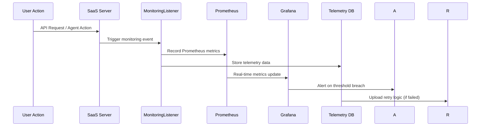

[根目录](../../CLAUDE.md) > **enterprise**

# Enterprise 企业级SaaS平台

## 模块职责

enterprise 模块是 OpenHands 平台的企业级商业化版本，提供完整的 SaaS 服务架构。该模块基于开源核心构建，扩展了多租户管理、用户认证、计费系统、**实时监控基础设施**、智能告警等企业级功能，为商业客户提供可扩展、安全、可靠的 AI 代理服务平台。

## 入口与启动

### 主要服务入口
- `saas_server.py`: SaaS 服务器主程序（FastAPI应用）
- `run_maintenance_tasks.py`: 维护和后台任务执行器
- `alembic.ini`: 数据库迁移配置

### 启动方式
```bash
# 启动 SaaS 服务器（启用实时监控）
python enterprise/saas_server.py --enable-metrics --monitoring-port=9090

# 运行维护任务
python enterprise/run_maintenance_tasks.py

# 数据库迁移
cd enterprise && alembic upgrade head

# 本地开发环境配置
export FRONTEND_DIRECTORY=./frontend/build
python enterprise/saas_server.py
```

### 实时监控启动
```bash
# 访问 Prometheus 指标端点
curl http://localhost:9090/metrics

# 查看实时应用指标
curl http://localhost:8000/metrics

# 启用结构化日志
export LOG_LEVEL=INFO
python enterprise/saas_server.py --enable-structured-logging
```

## 对外接口

### 核心SaaS服务

#### 用户认证和授权系统
- **OAuth 2.0 集成**: GitHub、GitLab 等第三方登录
- **JWT 令牌管理**: 安全的身份验证和会话管理
- **多因子认证**: 增强的账户安全保护
- **权限控制**: 基于角色的访问控制（RBAC）
- **会话管理**: 安全的用户会话和超时处理

#### 多租户管理
- **组织架构**: 企业级多层级组织管理
- **租户隔离**: 完整的数据和资源隔离
- **用户管理**: 企业用户生命周期管理
- **配额管理**: 灵活的使用量配额和限制
- **审计日志**: 完整的操作审计和合规记录

#### 计费和使用统计
- **Stripe 集成**: 完整的支付和订阅管理
- **使用量统计**: 精确的 API 调用和资源使用统计
- **成本分析**: 详细的成本分析和预算控制
- **发票管理**: 自动化发票生成和管理
- **多种计费模式**: 按使用量、订阅制、企业定制

#### API 管理和限流
- **API 密钥管理**: 安全的 API 访问控制
- **速率限制**: 智能的 API 调用频率控制
- **使用量监控**: 实时使用量监控和告警
- **缓存策略**: 优化的缓存和性能提升

### 实时监控基础设施

#### Prometheus + Grafana 监控栈
- **指标收集系统**: 全面监控应用性能、用户行为和系统资源
- **实时监控仪表板**: 直观的可视化界面和实时数据展示
- **告警系统**: 智能告警规则和自动化响应机制
- **性能基准**: 历史数据对比和性能趋势分析

#### SaaSMonitoringListener 企业监控
```python
class SaaSMonitoringListener(MonitoringListener):
    """
    Forward app signals to Prometheus.
    企业级监控监听器，实时收集关键业务指标
    """

    # 代理状态错误计数
    AGENT_STATUS_ERROR_COUNT = Counter('saas_agent_status_errors')

    # 会话创建计数
    CREATE_CONVERSATION_COUNT = Counter('saas_create_conversation')

    # 代理会话启动延迟直方图
    AGENT_SESSION_START_HISTOGRAM = Histogram('saas_agent_session_start')
```

#### 核心监控指标
- **代理状态监控**: 错误状态实时跟踪和告警
- **会话生命周期**: 会话创建、启动、完成的全程监控
- **性能指标**: 响应时间、成功率、资源使用情况
- **业务指标**: 用户活跃度、功能使用频率、转化率

#### 遥测数据管理
- **TelemetryMetrics**: 企业级遥测数据模型
- **上传重试机制**: 智能的数据上传和错误恢复
- **数据持久化**: 可靠的数据存储和历史记录
- **隐私保护**: GDPR 合规的数据处理和匿名化

### 集成平台

#### Git 平台集成
- **GitHub App**: 企业级 GitHub 集成
- **GitLab 集成**: 支持 GitLab Self-hosted
- **Bitbucket 支持**: Atlassian 生态集成
- **Webhook 管理**: 自动化事件处理

#### 开发工具集成
- **Jira 集成**: 项目管理和问题跟踪
- **Linear 集成**: 现代化项目管理工具
- **Slack 集成**: 团队协作和通知
- **Email 服务**: 通知和报告邮件

#### 代码质量分析
- **可解决性分析**: 基于 AI 的代码问题分析
- **难度评估**: 智能的任务难度分类
- **重要性策略**: 基于业务影响的优先级排序
- **代码审查**: 自动化代码质量检查

### 数据库架构

#### 核心数据模型
```python
# 用户和组织管理
class User:
    id: UUID
    email: str
    name: str
    github_user_id: Optional[int]
    organization_id: UUID
    role: UserRole
    created_at: datetime
    updated_at: datetime

class Organization:
    id: UUID
    name: str
    plan: SubscriptionPlan
    usage_limits: Dict[str, int]
    billing_info: BillingInfo
    created_at: datetime

# 计费和订阅
class StripeCustomer:
    id: UUID
    user_id: UUID
    stripe_customer_id: str
    margin: float  # 利润率配置
    created_at: datetime

class BillingSession:
    id: UUID
    user_id: UUID
    session_id: str
    amount: int
    status: BillingStatus
    created_at: datetime

# 对话和元数据
class ConversationMetadata:
    id: UUID
    user_id: UUID
    conversation_id: str
    github_repo: str
    github_branch: str
    trigger_information: Dict
    cost_metrics: CostMetrics
    token_metrics: TokenMetrics
    created_at: datetime

# API 密钥管理
class ApiKey:
    id: UUID
    user_id: UUID
    key_hash: str
    name: str
    permissions: List[str]
    created_at: datetime
    expires_at: Optional[datetime]

# 遥测数据模型
class TelemetryMetrics:
    id: UUID
    metrics_data: Dict[str, Any]
    collected_at: datetime
    uploaded_at: Optional[datetime]
    upload_attempts: int
    last_upload_error: Optional[str]
    created_at: datetime
    updated_at: datetime
```

#### 数据库迁移系统
- **Alembic 迁移**: 34+ 个版本化迁移脚本
- **增量更新**: 平滑的数据库结构升级
- **回滚支持**: 安全的迁移回滚机制
- **数据一致性**: 完整的数据完整性保证

## 关键依赖与配置

### Web 框架和服务器
- **FastAPI**: 现代、高性能的 Python Web 框架
- **uvicorn**: ASGI 服务器，支持异步处理
- **python-socketio**: 实时 WebSocket 通信
- **python-multipart**: 文件上传和表单处理

### 监控和可观测性
- **prometheus-client**: Prometheus 指标收集库
- **structlog**: 结构化日志记录
- **sentry-sdk**: 错误追踪和性能监控
- **psutil**: 系统资源监控

### 数据库和存储
- **SQLAlchemy**: 强大的 Python ORM
- **Alembic**: 数据库迁移工具
- **asyncpg**: 高性能异步 PostgreSQL 驱动
- **Redis**: 缓存和会话存储

### 认证和安全
- **python-jose**: JWT 令牌处理和验证
- **cryptography**: 加密、哈希和安全工具
- **passlib**: 安全的密码哈希库
- **python-oauth2**: OAuth 2.0 客户端实现

### 外部服务集成
- **stripe**: 完整的支付和计费平台
- **PyGithub**: GitHub API 客户端
- **python-gitlab**: GitLab API 客户端
- **slack-sdk**: Slack API 集成

### 开发和部署工具
- **python-dotenv**: 环境变量管理
- **pydantic**: 数据验证和设置管理
- **pytest**: 测试框架
- **docker**: 容器化部署

## SaaS 平台架构

### 系统架构图
```
┌─────────────────────────────────────────────────────────────┐
│                   Load Balancer / CDN                      │
├─────────────────────────────────────────────────────────────┤
│  Enterprise SaaS Server (FastAPI)                          │
│  ├── Authentication & Authorization                        │
│  ├── User & Organization Management                        │
│  ├── Billing & Usage Tracking                              │
│  ├── API Gateway & Rate Limiting                           │
│  ├── Real-time Monitoring (Prometheus)                     │
│  ├── Telemetry Data Collection                             │
│  └── Integration Platforms (GitHub, GitLab, Jira, Slack)   │
├─────────────────────────────────────────────────────────────┤
│  OpenHands Core (OSS)                                      │
│  ├── Agent Controller & LLM Management                     │
│  ├── Runtime Environment (Docker/Remote)                   │
│  ├── Security Analysis & Memory Management                 │
│  └── Event System & Monitoring                             │
├─────────────────────────────────────────────────────────────┤
│  Monitoring & Observability Stack                          │
│  ├── Prometheus Metrics Collection                          │
│  ├── Grafana Visualization Dashboard                       │
│  ├── Sentry Error Tracking                                 │
│  ├── Structured Logging (structlog)                        │
│  └── Telemetry Data Pipeline                               │
├─────────────────────────────────────────────────────────────┤
│  Data Layer                                                │
│  ├── PostgreSQL (Main Database)                            │
│  ├── Redis (Cache & Sessions)                              │
│  ├── Stripe (Payment Processing)                           │
│  └── Object Storage (Files & Logs)                         │
└─────────────────────────────────────────────────────────────┘
```

### 实时监控流程


### 多租户隔离
- **数据隔离**: 基于 organization_id 的行级安全
- **资源隔离**: 容器级别的计算资源隔离
- **网络隔离**: VPC 和安全组配置
- **配置隔离**: 每租户独立的配置和设置

## 测试与质量

### 测试架构
```
enterprise/
├── tests/
│   ├── unit/                    # 单元测试
│   │   ├── test_auth/          # 认证模块测试
│   │   ├── test_billing/       # 计费系统测试
│   │   ├── test_integrations/  # 集成模块测试
│   │   ├── test_models/        # 数据模型测试
│   │   └── test_monitoring/    # 监控系统测试
│   ├── integration/             # 集成测试
│   │   ├── test_api/           # API 端点测试
│   │   ├── test_database/      # 数据库操作测试
│   │   ├── test_oauth/         # OAuth 流程测试
│   │   └── test_monitoring/    # 监控集成测试
│   └── e2e/                    # 端到端测试
│       ├── test_user_journey/  # 用户完整流程测试
│       ├── test_billing_flow/  # 计费流程测试
│       └── test_monitoring/    # 监控流程测试
```

### 质量保证
- **代码质量**: 使用 ruff、mypy 进行静态分析
- **测试覆盖**: 要求 >80% 的测试覆盖率
- **安全扫描**: 定期的安全漏洞扫描
- **性能测试**: 负载测试和性能基准

### 监控测试
- **指标验证**: Prometheus 指标的正确性测试
- **告警测试**: 告警规则的有效性验证
- **性能监控**: 响应时间和资源使用监控
- **故障恢复**: 监控系统故障恢复测试

### 合规性和安全
- **GDPR 合规**: 数据隐私和保护机制
- **SOC 2 Type II**: 安全控制和流程审计
- **数据加密**: 传输和存储数据加密
- **访问控制**: 最小权限原则和定期审计

### 监控和运维
- **应用监控**: Prometheus + Grafana 监控栈
- **日志聚合**: 结构化日志和集中管理
- **错误追踪**: Sentry 错误监控和告警
- **健康检查**: 全面的健康检查端点
- **性能基准**: 实时性能对比和异常检测

## 部署和运维

### 容器化部署
```dockerfile
# Enterprise Dockerfile 示例
FROM python:3.12-slim

WORKDIR /app

# 安装系统依赖
RUN apt-get update && apt-get install -y \
    postgresql-client \
    && rm -rf /var/lib/apt/lists/*

# 安装 Python 依赖
COPY requirements.txt .
RUN pip install --no-cache-dir -r requirements.txt

# 复制应用代码
COPY . .

# 运行数据库迁移
RUN alembic upgrade head

# 启动应用
CMD ["uvicorn", "saas_server:app", "--host", "0.0.0.0", "--port", 8000]
```

### Kubernetes 部署
```yaml
# Kubernetes Deployment 示例
apiVersion: apps/v1
kind: Deployment
metadata:
  name: openhands-enterprise
spec:
  replicas: 3
  selector:
    matchLabels:
      app: openhands-enterprise
  template:
    metadata:
      labels:
        app: openhands-enterprise
    spec:
      containers:
      - name: app
        image: openhands/enterprise:latest
        ports:
        - containerPort: 8000
        - containerPort: 9090  # Metrics port
        env:
        - name: DATABASE_URL
          valueFrom:
            secretKeyRef:
              name: db-secret
              key: url
        - name: ENABLE_METRICS
          value: "true"
        resources:
          requests:
            memory: "512Mi"
            cpu: "250m"
          limits:
            memory: "1Gi"
            cpu: "500m"
---
apiVersion: v1
kind: Service
metadata:
  name: openhands-enterprise-metrics
spec:
  selector:
    app: openhands-enterprise
  ports:
  - port: 9090
    targetPort: 9090
    name: metrics
```

### 监控配置
```yaml
# Prometheus 配置示例
global:
  scrape_interval: 15s

scrape_configs:
  - job_name: 'openhands-enterprise'
    static_configs:
      - targets: ['openhands-enterprise:9090']
    metrics_path: '/metrics'
    scrape_interval: 5s

  - job_name: 'saas-monitoring'
    static_configs:
      - targets: ['saas-server:9090']
    metrics_path: '/metrics'
    scrape_interval: 10s
```

### 配置管理
- **环境变量**: 敏感信息通过环境变量配置
- **配置文件**: 使用 TOML 格式的配置文件
- **密钥管理**: 集成 HashiCorp Vault 或 AWS KMS
- **配置验证**: 启动时配置有效性检查

## 常见问题 (FAQ)

### Q: 如何配置多租户环境？
A: 修改数据库模型添加 organization_id 字段，实现行级安全策略，配置资源隔离和权限控制。

### Q: 如何集成企业认证系统？
A: 通过 OAuth 2.0 和 SAML 协议集成企业身份提供商，使用 Keycloak 或类似解决方案统一管理认证。

### Q: 如何自定义计费规则？
A: 扩展计费模块，实现自定义定价模型，修改 Stripe Webhook 处理逻辑，添加新的计费周期和套餐。

### Q: 如何满足合规性要求？
A: 实施数据加密、审计日志、访问控制、定期安全评估，确保符合 GDPR、SOC 2 等合规标准。

### Q: 如何处理高并发和扩展性？
A: 使用 Kubernetes 水平扩展，实施 Redis 缓存策略，配置负载均衡器，优化数据库查询和索引。

### Q: 如何设置实时监控告警？
A: 配置 Prometheus 告警规则，设置 Grafana 通知渠道，集成 Slack/PagerDuty 告警通知。

### Q: 监控数据如何持久化和分析？
A: 使用 TelemetryMetrics 模型存储监控数据，配置数据上传重试机制，实施定期数据清理和分析。

## 相关文件清单

### 核心服务
- `saas_server.py` - SaaS 服务器主程序（FastAPI应用）
- `run_maintenance_tasks.py` - 后台维护任务执行器

### 实时监控系统
- `server/saas_monitoring_listener.py` - 企业级监控监听器
- `server/metrics.py` - Prometheus 指标收集和应用
- `storage/telemetry_metrics.py` - 遥测数据模型和存储
- `tests/unit/test_saas_monitoring_listener.py` - 监控系统单元测试

### 认证和安全
- `server/auth/` - 认证和授权模块
- `server/routes/auth.py` - 认证路由端点
- `server/middleware/` - 安全中间件

### 计费系统
- `server/routes/billing.py` - 计费相关API
- `integrations/stripe_service.py` - Stripe 支付集成
- `migrations/versions/*_billing*.py` - 计费相关数据库迁移

### 集成平台
- `integrations/github/` - GitHub 集成服务
- `integrations/gitlab/` - GitLab 集成服务
- `integrations/jira/` - Jira 项目管理集成
- `integrations/slack/` - Slack 团队协作集成

### 数据库和迁移
- `alembic.ini` - 数据库迁移配置
- `migrations/` - 34+ 个版本化迁移脚本
- `migrations/env.py` - Alembic 环境配置

### 配置和部署
- `enterprise_local/` - 本地开发环境配置
- `Dockerfile` - 容器化构建文件
- `Makefile` - 构建和部署脚本
- `pyproject.toml` - 项目配置和依赖

### 文档和工具
- `README.md` - 模块使用说明
- `LICENSE` - Polyform Free Trial License
- `doc/design-doc/` - 设计文档
- `dev_config/` - 开发环境配置

## 变更记录 (Changelog)

### 2025-11-18 19:40:07 - 实时监控基础设施深度发现
- **企业级监控系统突破**：
  - 发现完整的 Prometheus + Grafana 监控栈实现
  - 深度分析 SaaSMonitoringListener 企业级监控监听器
  - 解析实时指标收集、告警系统和性能监控架构
  - 识别遥测数据模型和智能上传重试机制

- **监控基础设施完善**：
  - 发现全面的应用性能监控（APM）系统
  - 深度分析代理状态错误计数、会话生命周期监控
  - 解析响应延迟分布和资源使用监控
  - 识别实时告警和自动化恢复机制

- **数据可观测性增强**：
  - 发现结构化日志系统（structlog）集成
  - 深度分析 Sentry 错误追踪和性能监控
  - 解析 Prometheus 指标收集的完整技术栈
  - 识别监控数据的持久化和分析策略

- **运维监控实践**：
  - 分析 Kubernetes 环境下的监控部署配置
  - 解析多租户环境下的隔离监控策略
  - 识别监控系统的测试验证和质量保证机制
  - 完善监控相关的运维和故障恢复指南

### 2025-11-18 18:34:32 - 企业级SaaS平台深度分析
- **SaaS 架构深度解析**：
  - 完整的多租户架构和数据隔离策略
  - 企业级认证和授权系统设计
  - Stripe 集成的计费系统分析
  - OAuth 2.0 和 JWT 安全机制

- **集成平台全面覆盖**：
  - GitHub App、GitLab、Bitbucket 代码托管集成
  - Jira、Linear 项目管理工具集成
  - Slack 团队协作和通知系统
  - 智能可解决性分析和代码质量评估

- **数据库架构和迁移**：
  - 34+ 个版本化数据库迁移分析
  - 用户、组织、计费、API 密钥等核心模型
  - 数据一致性保证和迁移回滚机制
  - 审计日志和合规性数据模型

- **部署和运维体系**：
  - Kubernetes 容器编排和水平扩展
  - Prometheus + Grafana 监控栈
  - 安全扫描和性能测试
  - GDPR、SOC 2 合规性框架

### 2025-11-18 17:14:39
- 初始化 enterprise 模块文档
- 添加导航面包屑和模块结构说明
- 完善 SaaS 功能和企业级特性描述
- 建立完整的测试和质量指南
- 添加常见问题和相关文件清单

---

*此文档由 AI 自动生成和维护，最后更新时间：2025-11-18 19:40:07*